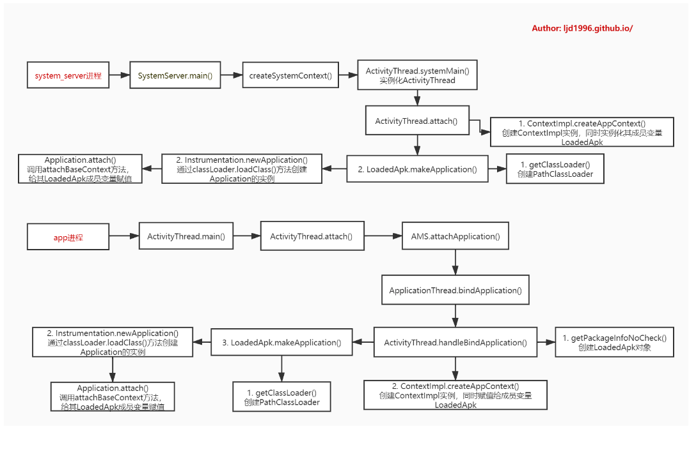

### 环境
Android 9.0
*** 

android系统会为每个程序进程的运行时创建一个Application类的对象且仅创建一个，且application对象的生命周期是整个程序中最长的，它的生命周期就等于这个程序的生命周期。因为它是全局的单例的，所以在不同的Activity，Service中获得的对象都是同一个对象。所以通过Application来进行一些，数据传递，数据共享等，数据缓存等操作。

不同的进程会有自己的Application实例，如果应用中采用多进程方式，onCreate方法会执行多次，可以根据不同的进程名字进行不同的初始化。

system进程和app进程都运行着一个或多个app，每个app都会有一个对应的Application对象。本文将解析以下两种进程创建Application的过程：

*   system_server进程
*   app进程

### system_server进程
####    SystemServer.main
```
// SystemServer.java
public final class SystemServer {
    ...
    public static void main(String[] args) {
        //先初始化SystemServer对象，再调用对象的run()方法
        new SystemServer().run();
    }
}

private void run() {
    Looper.prepareMainLooper();// 准备主线程looper

    //加载android_servers.so库，该库包含的源码在frameworks/base/services/目录下
    System.loadLibrary("android_servers");

    createSystemContext(); //初始化系统上下文

    //创建系统服务管理
    mSystemServiceManager = new SystemServiceManager(mSystemContext);
    LocalServices.addService(SystemServiceManager.class, mSystemServiceManager);

    //启动各种系统服务
    try {
        startBootstrapServices(); // 启动引导服务
        startCoreServices();      // 启动核心服务
        startOtherServices();     // 启动其他服务
    } catch (Throwable ex) {
        throw ex;
    }

    //一直循环执行
    Looper.loop();
    throw new RuntimeException("Main thread loop unexpectedly exited");
}
```

####    createSystemContext
```
private void createSystemContext() {
    ActivityThread activityThread = ActivityThread.systemMain();
    mSystemContext = activityThread.getSystemContext();
    mSystemContext.setTheme(DEFAULT_SYSTEM_THEME);

    final Context systemUiContext = activityThread.getSystemUiContext();
    systemUiContext.setTheme(DEFAULT_SYSTEM_THEME);
}
```

####    ActivityThread
#####   构造函数
```
public final class ActivityThread extends ClientTransactionHandler {
    // 创建ApplicationThread对象
    final ApplicationThread mAppThread = new ApplicationThread();
    final Looper mLooper = Looper.myLooper();
    // class H extends Handler
    final H mH = new H();
    // 当前进程中首次初始化的app对象
    Application mInitialApplication;
    final ArrayList<Application> mAllApplications = new ArrayList<Application>();
    // 标记当前进程是否为system进程
    boolean mSystemThread = false;
    // 记录system进程的ContextImpl对象
    private ContextImpl mSystemContext;
    private ContextImpl mSystemUiContext;

    final ArrayMap<String, WeakReference<LoadedApk>> mPackages = new ArrayMap<>();
    final ArrayMap<String, WeakReference<LoadedApk>> mResourcePackages = new ArrayMap<>();
    final ArrayMap<IBinder, ActivityClientRecord> mActivities = new ArrayMap<>();
    final ArrayMap<IBinder, Service> mServices = new ArrayMap<>();
    static volatile Handler sMainThreadHandler;  // set once in main()
    private static volatile ActivityThread sCurrentActivityThread;

    ActivityThread() {
        mResourcesManager = ResourcesManager.getInstance();
    }
}
```

#####   systemMain
```
public static ActivityThread systemMain() {
    // The system process on low-memory devices do not get to use hardware
    // accelerated drawing, since this can add too much overhead to the
    // process.
    if (!ActivityManager.isHighEndGfx()) {
        ThreadedRenderer.disable(true);
    } else {
        ThreadedRenderer.enableForegroundTrimming();
    }
    ActivityThread thread = new ActivityThread();
    thread.attach(true, 0);
    return thread;
}
```
创建完ActivityThread对象，接下来执行attach()操作：

#####   attach
```
private void attach(boolean system, long startSeq) {
    sCurrentActivityThread = this;
    mSystemThread = system;
    if (!system) {
        // ...
    } else {
        // Don't set application object here -- if the system crashes,
        // we can't display an alert, we just want to die die die.
        android.ddm.DdmHandleAppName.setAppName("system_process", UserHandle.myUserId());
        try {
            mInstrumentation = new Instrumentation();
            mInstrumentation.basicInit(this);
            // mPackageInfo是LoadedApk对象
            ContextImpl context = ContextImpl.createAppContext(this, getSystemContext().mPackageInfo);
            mInitialApplication = context.mPackageInfo.makeApplication(true, null);
            mInitialApplication.onCreate();
        } catch (Exception e) {
            throw new RuntimeException(
                    "Unable to instantiate Application():" + e.toString(), e);
        }
    }
    // ...
}

public ContextImpl getSystemContext() {
    synchronized (this) {
        if (mSystemContext == null) {
            mSystemContext = ContextImpl.createSystemContext(this);
        }
        return mSystemContext;
    }
}
```
####    ContextImpl
#####   构造函数
部分成员变量：
```
final  ActivityThread mMainThread;
final  LoadedApk mPackageInfo;
private  ClassLoader mClassLoader;

private final  IBinder mActivityToken;

private final String mBasePackageName;
private final String mOpPackageName;

private final  ResourcesManager mResourcesManager;
private  Resources mResources;
private  Display mDisplay; // may be null if default display

private PackageManager mPackageManager;
```

构造函数：
```
private ContextImpl( ContextImpl container,  ActivityThread mainThread,
         LoadedApk packageInfo,  String splitName,
         IBinder activityToken,  UserHandle user, int flags,
         ClassLoader classLoader) {
    // ...
    mMainThread = mainThread;
    mActivityToken = activityToken;
    mFlags = flags;

    // 将传入的LoadedApk赋值给了mPackageInfo
    mPackageInfo = packageInfo;
    mSplitName = splitName;
    mClassLoader = classLoader;
    mResourcesManager = ResourcesManager.getInstance();
    // ...
}
```

#####   createSystemContext
```
static ContextImpl createSystemContext(ActivityThread mainThread) {
    LoadedApk packageInfo = new LoadedApk(mainThread);
    ContextImpl context = new ContextImpl(null, mainThread, packageInfo, null, null, null, 0, null);
    context.setResources(packageInfo.getResources());
    context.mResources.updateConfiguration(context.mResourcesManager.getConfiguration(),
            context.mResourcesManager.getDisplayMetrics());
    return context;
}
```
#####   createAppContext
```
static ContextImpl createAppContext(ActivityThread mainThread, LoadedApk packageInfo) {
    if (packageInfo == null) throw new IllegalArgumentException("packageInfo");
    ContextImpl context = new ContextImpl(null, mainThread, packageInfo, null, 
        null, null, 0, null);
    context.setResources(packageInfo.getResources());
    return context;
}
```
####    LoadedApk
#####   构造函数
```
private final ActivityThread mActivityThread;
final String mPackageName;
private ApplicationInfo mApplicationInfo;
private String mAppDir;
private String mResDir;
private String[] mOverlayDirs;
private String mDataDir;
private String mLibDir;
private File mDataDirFile;
private File mDeviceProtectedDataDirFile;
private File mCredentialProtectedDataDirFile;
private final ClassLoader mBaseClassLoader;
private final boolean mSecurityViolation;
private final boolean mIncludeCode;
private final boolean mRegisterPackage;
private final DisplayAdjustments mDisplayAdjustments = new DisplayAdjustments();
/** WARNING: This may change. Don't hold external references to it. */
Resources mResources;
private ClassLoader mClassLoader;
private Application mApplication;

private String[] mSplitNames;
private String[] mSplitAppDirs;
private String[] mSplitResDirs;
private String[] mSplitClassLoaderNames;

private final ArrayMap<Context, ArrayMap<BroadcastReceiver, ReceiverDispatcher>> mReceivers = new ArrayMap<>();
private final ArrayMap<Context, ArrayMap<BroadcastReceiver, LoadedApk.ReceiverDispatcher>> mUnregisteredReceivers = new ArrayMap<>();
private final ArrayMap<Context, ArrayMap<ServiceConnection, LoadedApk.ServiceDispatcher>> mServices = new ArrayMap<>();
private final ArrayMap<Context, ArrayMap<ServiceConnection, LoadedApk.ServiceDispatcher>> mUnboundServices = new ArrayMap<>();

LoadedApk(ActivityThread activityThread) {
    mActivityThread = activityThread;
    mApplicationInfo = new ApplicationInfo();
    mApplicationInfo.packageName = "android";
    mPackageName = "android";
    mAppDir = null;
    mResDir = null;
    mSplitAppDirs = null;
    mSplitResDirs = null;
    mSplitClassLoaderNames = null;
    mOverlayDirs = null;
    mDataDir = null;
    mDataDirFile = null;
    mDeviceProtectedDataDirFile = null;
    mCredentialProtectedDataDirFile = null;
    mLibDir = null;
    mBaseClassLoader = null;
    mSecurityViolation = false;
    mIncludeCode = true;
    mRegisterPackage = false;
    mClassLoader = ClassLoader.getSystemClassLoader();
    mResources = Resources.getSystem();
    mAppComponentFactory = createAppFactory(mApplicationInfo, mClassLoader);
}
```

#####   makeApplication
```
public Application makeApplication(boolean forceDefaultAppClass,
        Instrumentation instrumentation) {
    if (mApplication != null) {
        return mApplication;
    }

    Application app = null;

    String appClass = mApplicationInfo.className;
    if (forceDefaultAppClass || (appClass == null)) {
        appClass = "android.app.Application";
    }

    try {
        java.lang.ClassLoader cl = getClassLoader();
        if (!mPackageName.equals("android")) {
            initializeJavaContextClassLoader();
        }
        ContextImpl appContext = ContextImpl.createAppContext(mActivityThread, this);
        app = mActivityThread.mInstrumentation.newApplication(
                cl, appClass, appContext);
        appContext.setOuterContext(app);
    } catch (Exception e) {
    }
    mActivityThread.mAllApplications.add(app);
    mApplication = app;

    if (instrumentation != null) {
        try {
            instrumentation.callApplicationOnCreate(app);
        } catch (Exception e) {
        }
    }

    // Rewrite the R 'constants' for all library apks.
    // ...
    return app;
}
```
#####   getClassLoader
```
public ClassLoader getClassLoader() {
    synchronized (this) {
        if (mClassLoader == null) {
            createOrUpdateClassLoaderLocked(null /*addedPaths*/);
        }
        return mClassLoader;
    }
}

private void createOrUpdateClassLoaderLocked(List<String> addedPaths) {
    if (mPackageName.equals("android")) {
        // Note: This branch is taken for system server and we don't need to setup
        // jit profiling support.
        if (mClassLoader != null) {
            // nothing to update
            return;
        }

        if (mBaseClassLoader != null) {
            mClassLoader = mBaseClassLoader;
        } else {
            mClassLoader = ClassLoader.getSystemClassLoader();
        }
        mAppComponentFactory = createAppFactory(mApplicationInfo, mClassLoader);

        return;
    }
    // ...
}

// ClassLoader.java
public static ClassLoader getSystemClassLoader() {
    return SystemClassLoader.loader;
}

static private class SystemClassLoader {
    public static ClassLoader loader = ClassLoader.createSystemClassLoader();
}

private static ClassLoader createSystemClassLoader() {
    String classPath = System.getProperty("java.class.path", ".");
    String librarySearchPath = System.getProperty("java.library.path", "");
    return new PathClassLoader(classPath, librarySearchPath, BootClassLoader.getInstance());
}
```
#####   Instrumentation.newApplication
```
// Instrumentation.java
public Application newApplication(ClassLoader cl, String className, Context context)
        throws InstantiationException, IllegalAccessException, 
        ClassNotFoundException {
    // private AppComponentFactory getFactory(String pkg) {}
    Application app = getFactory(context.getPackageName())
            .instantiateApplication(cl, className);
    app.attach(context);
    return app;
}

// frameworks/base/core/java/android/app/AppComponentFactory.java
public  Application instantiateApplication( ClassLoader cl,
         String className)
        throws InstantiationException, IllegalAccessException, ClassNotFoundException {
    return (Application) cl.loadClass(className).newInstance();
}
```
接着是Application.attach()方法：
```
// Application.java
final void attach(Context context) {
    attachBaseContext(context); // Application的mBase
    // ContextImpl.getImpl(context)返回的就是context自身
    mLoadedApk = ContextImpl.getImpl(context).mPackageInfo;
}

// class ContextImpl extends Context {}
// ContextImpl.java
static ContextImpl getImpl(Context context) {
    Context nextContext;
    while ((context instanceof ContextWrapper) &&
            (nextContext=((ContextWrapper)context).getBaseContext()) != null) {
        context = nextContext;
    }
    return (ContextImpl)context;
}
```
attch方法的主要功能:

*   将新创建的ContextImpl对象保存到Application的父类成员变量mBase;
*   将新创建的LoadedApk对象保存到Application的成员变量mLoadedApk;

**如果想通过反射获取应用的ClassLoader，需要从LoadedApk对象中获取，LoadedApk对象也同样可以通过反射方式获取，它的实例在许多对象中都有引用，比如说：ContextImpl和Application中都有引用：**

*   ContextImpl：如上代码中可以看到，在Application#attachBaseContext(Context base)回调中可以拿到ContextImpl实例，进一步可以获得LoadedApk对象；

*   Application：应注意到，在调用了attachBaseContext之后，Application中的mLoadedApk字段才被赋值，因此在attachBaseContext中反射获取到的LoadedApk会是null，可以在onCreate回调时再尝试反射调用。

### App进程
####    ActivityThread
#####   main
```
public static void main(String[] args) {
    // ...
    Looper.prepareMainLooper();

    // Find the value for {@link #PROC_START_SEQ_IDENT} if provided on the command line.
    // It will be in the format "seq=114"
    // ...
    ActivityThread thread = new ActivityThread();
    thread.attach(false, startSeq);

    if (sMainThreadHandler == null) {
        // static volatile Handler sMainThreadHandler;
        sMainThreadHandler = thread.getHandler();
    }

    Looper.loop();

    throw new RuntimeException("Main thread loop unexpectedly exited");
}
```
这是运行在app进程，当进程由zygote fork后执行ActivityThread的main方法。

#####   attach
```
private void attach(boolean system, long startSeq) {
    sCurrentActivityThread = this;
    mSystemThread = system;
    if (!system) {
        ViewRootImpl.addFirstDrawHandler(new Runnable() {
            
            public void run() {
                ensureJitEnabled();
            }
        });
        android.ddm.DdmHandleAppName.setAppName("<pre-initialized>",
                                                UserHandle.myUserId());
        RuntimeInit.setApplicationObject(mAppThread.asBinder());
        final IActivityManager mgr = ActivityManager.getService();
        try {
            mgr.attachApplication(mAppThread, startSeq);
        } catch (RemoteException ex) {
            throw ex.rethrowFromSystemServer();
        }
        // ...
    } else {
        // ...
    }
}
```
mgr.attachApplication是通过Binder方式调用AMS中的方法。

#####   H
在H内部类中定义了许多种message类型：
```
class H extends Handler {
    public static final int BIND_APPLICATION        = 110;
    public static final int EXIT_APPLICATION        = 111;
    public static final int RECEIVER                = 113;
    public static final int CREATE_SERVICE          = 114;
    public static final int SERVICE_ARGS            = 115;
    public static final int STOP_SERVICE            = 116;

    public static final int CONFIGURATION_CHANGED   = 118;
    public static final int CLEAN_UP_CONTEXT        = 119;
    public static final int GC_WHEN_IDLE            = 120;
    public static final int BIND_SERVICE            = 121;
    public static final int UNBIND_SERVICE          = 122;
    public static final int DUMP_SERVICE            = 123;
    public static final int LOW_MEMORY              = 124;
    public static final int PROFILER_CONTROL        = 127;
    public static final int CREATE_BACKUP_AGENT     = 128;
    public static final int DESTROY_BACKUP_AGENT    = 129;
    public static final int SUICIDE                 = 130;
    public static final int REMOVE_PROVIDER         = 131;
    public static final int ENABLE_JIT              = 132;
    public static final int DISPATCH_PACKAGE_BROADCAST = 133;
    public static final int SCHEDULE_CRASH          = 134;
    public static final int DUMP_HEAP               = 135;
    public static final int DUMP_ACTIVITY           = 136;
    public static final int SLEEPING                = 137;
    public static final int SET_CORE_SETTINGS       = 138;
    public static final int UPDATE_PACKAGE_COMPATIBILITY_INFO = 139;
    public static final int DUMP_PROVIDER           = 141;
    public static final int UNSTABLE_PROVIDER_DIED  = 142;
    public static final int REQUEST_ASSIST_CONTEXT_EXTRAS = 143;
    public static final int TRANSLUCENT_CONVERSION_COMPLETE = 144;
    public static final int INSTALL_PROVIDER        = 145;
    public static final int ON_NEW_ACTIVITY_OPTIONS = 146;
    public static final int ENTER_ANIMATION_COMPLETE = 149;
    public static final int START_BINDER_TRACKING = 150;
    public static final int STOP_BINDER_TRACKING_AND_DUMP = 151;
    public static final int LOCAL_VOICE_INTERACTION_STARTED = 154;
    public static final int ATTACH_AGENT = 155;
    public static final int APPLICATION_INFO_CHANGED = 156;
    public static final int RUN_ISOLATED_ENTRY_POINT = 158;
    public static final int EXECUTE_TRANSACTION = 159;
    public static final int RELAUNCH_ACTIVITY = 160;
}
```
####   AMS.attachApplication
```
public final void attachApplication(IApplicationThread thread, long startSeq) {
    synchronized (this) {
        int callingPid = Binder.getCallingPid();
        final int callingUid = Binder.getCallingUid();
        final long origId = Binder.clearCallingIdentity();
        attachApplicationLocked(thread, callingPid, callingUid, startSeq);
        Binder.restoreCallingIdentity(origId);
    }
}

private final boolean attachApplicationLocked(IApplicationThread thread,
        int pid, int callingUid, long startSeq) {
    ProcessRecord app;
    long startTime = SystemClock.uptimeMillis();
    if (pid != MY_PID && pid >= 0) {
        synchronized (mPidsSelfLocked) {
            app = mPidsSelfLocked.get(pid); // 根据pid获取ProcessRecord
        }
    } else {
        app = null;
    }

    thread.bindApplication(processName, appInfo, providers,
            app.instr.mClass,
            profilerInfo, app.instr.mArguments,
            app.instr.mWatcher,
            app.instr.mUiAutomationConnection, testMode,
            mBinderTransactionTrackingEnabled, enableTrackAllocation,
            isRestrictedBackupMode || !normalMode, app.persistent,
            new Configuration(getGlobalConfiguration()), app.compat,
            getCommonServicesLocked(app.isolated),
            mCoreSettingsObserver.getCoreSettingsLocked(),
            buildSerial, isAutofillCompatEnabled);
    return true;
}
```

####   ApplicationThread.bindApplication
```
public final void bindApplication(String processName, ApplicationInfo appInfo,
        List<ProviderInfo> providers, ComponentName instrumentationName,
        ProfilerInfo profilerInfo, Bundle instrumentationArgs,
        IInstrumentationWatcher instrumentationWatcher,
        IUiAutomationConnection instrumentationUiConnection, int debugMode,
        boolean enableBinderTracking, boolean trackAllocation,
        boolean isRestrictedBackupMode, boolean persistent, Configuration config,
        CompatibilityInfo compatInfo, Map services, Bundle coreSettings,
        String buildSerial, boolean autofillCompatibilityEnabled) {
    AppBindData data = new AppBindData();
    data.processName = processName;
    data.appInfo = appInfo;
    data.providers = providers;
    data.instrumentationName = instrumentationName;
    data.instrumentationArgs = instrumentationArgs;
    data.instrumentationWatcher = instrumentationWatcher;
    data.instrumentationUiAutomationConnection = instrumentationUiConnection;
    data.debugMode = debugMode;
    data.enableBinderTracking = enableBinderTracking;
    data.trackAllocation = trackAllocation;
    data.restrictedBackupMode = isRestrictedBackupMode;
    data.persistent = persistent;
    data.config = config;
    data.compatInfo = compatInfo;
    data.initProfilerInfo = profilerInfo;
    data.buildSerial = buildSerial;
    data.autofillCompatibilityEnabled = autofillCompatibilityEnabled;
    sendMessage(H.BIND_APPLICATION, data);
}
```
sendMessage方法最终走的是mH.sendMessage(msg)，mH是H类型：

####   ActivityThread.handleBindApplication
当主线程收到H.BIND_APPLICATION，则调用handleBindApplication：
```
// ActivityThread.java
private void handleBindApplication(AppBindData data) {
    mBoundApplication = data;
    Process.setArgV0(data.processName); // 设置进程名
    // ...
    // 创建LoadedApk对象，并将其加入到mPackages，也就是说每个app都会创建唯一的LoadedApk对象。
    data.info = getPackageInfoNoCheck(data.appInfo, data.compatInfo);
    // ...

    // 创建ContextImpl上下文
    final ContextImpl appContext = ContextImpl.createAppContext(this, data.info);
    // ...
    Application app;
    try {
        // 此处data.info是指LoadedApk, 通过反射创建目标应用Application对象
        app = data.info.makeApplication(data.restrictedBackupMode, null);
        mInitialApplication = app;
        // ...
        mInstrumentation.onCreate(data.instrumentationArgs);
        //回调onCreate
        mInstrumentation.callApplicationOnCreate(app);

    } finally {
    }
}

public final LoadedApk getPackageInfoNoCheck(ApplicationInfo ai,
        CompatibilityInfo compatInfo) {
    return getPackageInfo(ai, compatInfo, null, false, true, false);
}

private LoadedApk getPackageInfo(ApplicationInfo aInfo, CompatibilityInfo compatInfo,
        ClassLoader baseLoader, boolean securityViolation, boolean includeCode,
        boolean registerPackage) {
    final boolean differentUser = (UserHandle.myUserId() != UserHandle.getUserId(aInfo.uid));
    synchronized (mResourcesManager) {
        WeakReference<LoadedApk> ref;
        if (differentUser) {
            // Caching not supported across users
            ref = null;
        } else if (includeCode) {
            ref = mPackages.get(aInfo.packageName);
        } else {
            ref = mResourcePackages.get(aInfo.packageName);
        }

        LoadedApk packageInfo = ref != null ? ref.get() : null;
        if (packageInfo == null || (packageInfo.mResources != null
                && !packageInfo.mResources.getAssets().isUpToDate())) {
            // 创建LoadedApk对象
            packageInfo = new LoadedApk(this, aInfo, compatInfo, baseLoader,
                        securityViolation, includeCode &&
                        (aInfo.flags&ApplicationInfo.FLAG_HAS_CODE) != 0, registerPackage);

            if (mSystemThread && "android".equals(aInfo.packageName)) {
                packageInfo.installSystemApplicationInfo(aInfo,
                        getSystemContext().mPackageInfo.getClassLoader());
            }

            if (differentUser) {
                // Caching not supported across users
            } else if (includeCode) {
                mPackages.put(aInfo.packageName,
                        new WeakReference<LoadedApk>(packageInfo));
            } else {
                mResourcePackages.put(aInfo.packageName,
                        new WeakReference<LoadedApk>(packageInfo));
            }
        }
        return packageInfo;
    }
}
```
创建LoadedApk对象，并将将新创建的LoadedApk加入到mPackages，也就是说每个app都会创建唯一的LoadedApk对象。此处aInfo来源于ProcessRecord.info变量，也就是进程中的第一个app。

####    LoadedApk.makeApplication
#####   getClassLoader
该方法跟system_server一样，其内调用的getClassLoader也调用了createOrUpdateClassLoaderLocked方法：
```
private void createOrUpdateClassLoaderLocked(List<String> addedPaths) {
    if (mPackageName.equals("android")) {
        // ...
    }

    if (mRegisterPackage) {
        try {
            ActivityManager.getService().addPackageDependency(mPackageName);
        } catch (RemoteException e) {
            throw e.rethrowFromSystemServer();
        }
    }

    final List<String> zipPaths = new ArrayList<>(10);
    final List<String> libPaths = new ArrayList<>(10);

    final String defaultSearchPaths = System.getProperty("java.library.path");
    final boolean treatVendorApkAsUnbundled = !defaultSearchPaths.contains("/vendor/lib");

    makePaths(mActivityThread, isBundledApp, mApplicationInfo, zipPaths, libPaths);

    String libraryPermittedPath = mDataDir;

    final String librarySearchPath = TextUtils.join(File.pathSeparator, libPaths);

    boolean needToSetupJitProfiles = false;
    if (mClassLoader == null) {
        mClassLoader = ApplicationLoaders.getDefault().getClassLoader(zip,
                mApplicationInfo.targetSdkVersion, isBundledApp, librarySearchPath,
                libraryPermittedPath, mBaseClassLoader,
                mApplicationInfo.classLoaderName);
        mAppComponentFactory = createAppFactory(mApplicationInfo, mClassLoader);
        needToSetupJitProfiles = true;
    }

    List<String> extraLibPaths = new ArrayList<>(3);
    String abiSuffix = VMRuntime.getRuntime().is64Bit() ? "64" : "";
    if (!defaultSearchPaths.contains("/vendor/lib")) {
        extraLibPaths.add("/vendor/lib" + abiSuffix);
    }
    if (!defaultSearchPaths.contains("/odm/lib")) {
        extraLibPaths.add("/odm/lib" + abiSuffix);
    }
    if (!defaultSearchPaths.contains("/product/lib")) {
        extraLibPaths.add("/product/lib" + abiSuffix);
    }
    if (!extraLibPaths.isEmpty()) {
        StrictMode.ThreadPolicy oldPolicy = StrictMode.allowThreadDiskReads();
        try {
            ApplicationLoaders.getDefault().addNative(mClassLoader, extraLibPaths);
        } finally {
            StrictMode.setThreadPolicy(oldPolicy);
        }
    }

    if (addedPaths != null && addedPaths.size() > 0) {
        final String add = TextUtils.join(File.pathSeparator, addedPaths);
        ApplicationLoaders.getDefault().addPath(mClassLoader, add);
        // Setup the new code paths for profiling.
        needToSetupJitProfiles = true;
    }

    if (needToSetupJitProfiles && !ActivityThread.isSystem()) {
        setupJitProfileSupport();
    }
}

// ApplicationLoaders.java
ClassLoader getClassLoader(String zip, int targetSdkVersion, boolean isBundled,
                    String librarySearchPath, String libraryPermittedPath,
                    ClassLoader parent, String classLoaderName) {
    return getClassLoader(zip, targetSdkVersion, isBundled, librarySearchPath,
                            libraryPermittedPath, parent, zip, classLoaderName);
}

private ClassLoader getClassLoader(String zip, int targetSdkVersion, boolean isBundled,
    String librarySearchPath, String libraryPermittedPath,
    ClassLoader parent, String cacheKey, String classLoaderName) {
    ClassLoader baseParent = ClassLoader.getSystemClassLoader().getParent();

    synchronized (mLoaders) {
        if (parent == null) {
            parent = baseParent;
        }

        if (parent == baseParent) {
            ClassLoader loader = mLoaders.get(cacheKey);
            if (loader != null) {
                return loader;
            }

            ClassLoader classloader = ClassLoaderFactory.createClassLoader(
                    zip,  librarySearchPath, libraryPermittedPath, parent,
                    targetSdkVersion, isBundled, classLoaderName);
            GraphicsEnvironment.getInstance().setLayerPaths(
                    classloader, librarySearchPath, libraryPermittedPath);

            mLoaders.put(cacheKey, classloader);
            return classloader;
        }

        ClassLoader loader = ClassLoaderFactory.createClassLoader(
                zip, null, parent, classLoaderName);
        return loader;
    }
}

// ClassLoaderFactory.java
public static ClassLoader createClassLoader(String dexPath,
        String librarySearchPath, String libraryPermittedPath, ClassLoader parent,
        int targetSdkVersion, boolean isNamespaceShared, String classloaderName) {

    final ClassLoader classLoader = createClassLoader(dexPath, librarySearchPath, parent, classloaderName);
    // ...
    return classLoader;
}

public static ClassLoader createClassLoader(String dexPath,
        String librarySearchPath, ClassLoader parent, String classloaderName) {
    if (isPathClassLoaderName(classloaderName)) {
        return new PathClassLoader(dexPath, librarySearchPath, parent);
    } else if (isDelegateLastClassLoaderName(classloaderName)) {
        return new DelegateLastClassLoader(dexPath, librarySearchPath, parent);
    }

    throw new AssertionError("Invalid classLoaderName: " + classloaderName);
}
```
#####   Instrumentation.newApplication
逻辑与system_server类似。

### 总结
App进程的Application创建过程，跟system进程的核心逻辑都差不多。只是app进程多了两次binder调用。其中newApplication方法中通过类加载器加载了Application Class对象，并通过其newInstance方法创建了Application实例。




***
https://ljd1996.github.io/2019/12/16/Android-Application/
***