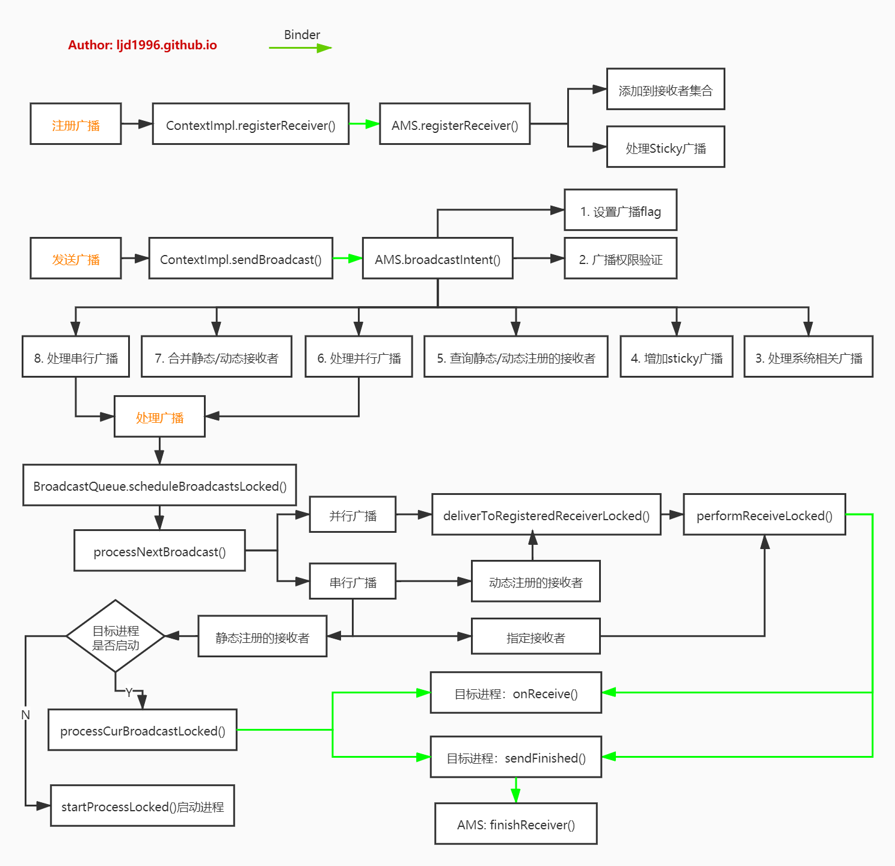

***
android 10
***

### 概述
广播(Broadcast)机制用于进程/线程间通信，广播分为广播发送和广播接收两个过程，其中广播接收者BroadcastReceiver便是Android四大组件之一。广播分类：

*   普通广播：通过Context.sendBroadcast()发送；
*   有序广播：通过Context.sendOrderedBroadcast()发送；
*   Sticky广播：通过Context.sendStickyBroadcast()发送，对于粘性广播，registerReceiver()会有一个Intent类型返回值，里面带有相关参数。
注：本文基于Android 10源码，为了文章的简洁性，引用源码的地方可能有所删减。


### 注册广播
####    ContextImpl.registerReceiver
```
public Intent registerReceiver(BroadcastReceiver receiver, IntentFilter filter) {
    return registerReceiver(receiver, filter, null, null);
}

// broadcastPermission拥有广播的权限控制
// scheduler用于指定接收到广播时onRecive执行线程，当scheduler=null则默认在主线程中执行

public Intent registerReceiver(BroadcastReceiver receiver, IntentFilter filter,
        String broadcastPermission, Handler scheduler) {
    return registerReceiverInternal(receiver, getUserId(),
            filter, broadcastPermission, scheduler, getOuterContext(), 0);
}

private Intent registerReceiverInternal(BroadcastReceiver receiver, int userId,
        IntentFilter filter, String broadcastPermission,
        Handler scheduler, Context context, int flags) {
    IIntentReceiver rd = null;
    if (receiver != null) {
        if (mPackageInfo != null && context != null) {
            if (scheduler == null) {
                // 将主线程Handler赋给scheuler
                scheduler = mMainThread.getHandler();
            }
            // 获取IIntentReceiver对象
            rd = mPackageInfo.getReceiverDispatcher(receiver, context, scheduler,
                mMainThread.getInstrumentation(), true);
        } // ...
    }
    try {
        // Binder调用AMS.registerReceiver方法
        final Intent intent = ActivityManager.getService().registerReceiver(
                mMainThread.getApplicationThread(), mBasePackageName, rd, filter,
                broadcastPermission, userId, flags);
        if (intent != null) {
            intent.setExtrasClassLoader(getClassLoader());
            intent.prepareToEnterProcess();
        }
        return intent;
    } catch (RemoteException e) {
        throw e.rethrowFromSystemServer();
    }
}
```
### LoadedApk.getReceiverDispatcher
```
private final ArrayMap<Context, ArrayMap<BroadcastReceiver, ReceiverDispatcher>> mReceivers = new ArrayMap<>();

public IIntentReceiver getReceiverDispatcher(BroadcastReceiver r, Context context,
        Handler handler, Instrumentation instrumentation, boolean registered) {
    synchronized (mReceivers) {
        LoadedApk.ReceiverDispatcher rd = null;
        ArrayMap<BroadcastReceiver, LoadedApk.ReceiverDispatcher> map = null;
        if (registered) {
            map = mReceivers.get(context);
            if (map != null) {
                rd = map.get(r);
            }
        }
        if (rd == null) {
            // 不存在则创建
            rd = new ReceiverDispatcher(r, context, handler,
                    instrumentation, registered);
            if (registered) {
                if (map == null) {
                    map = new ArrayMap<BroadcastReceiver, LoadedApk.ReceiverDispatcher>();
                    mReceivers.put(context, map);
                }
                map.put(r, rd);
            }
        } else {
            rd.validate(context, handler);
        }
        rd.mForgotten = false;
        return rd.getIIntentReceiver();
    }
}

ReceiverDispatcher(BroadcastReceiver receiver, Context context,
        Handler activityThread, Instrumentation instrumentation,
        boolean registered) {
    if (activityThread == null) {
        throw new NullPointerException("Handler must not be null");
    }
    mIIntentReceiver = new InnerReceiver(this, !registered);
    mReceiver = receiver;
    mContext = context;
    mActivityThread = activityThread;
    mInstrumentation = instrumentation;
    mRegistered = registered;
    mLocation = new IntentReceiverLeaked(null);
    mLocation.fillInStackTrace();
}

final static class InnerReceiver extends IIntentReceiver.Stub {
    final WeakReference<LoadedApk.ReceiverDispatcher> mDispatcher;
    final LoadedApk.ReceiverDispatcher mStrongRef;

    InnerReceiver(LoadedApk.ReceiverDispatcher rd, boolean strong) {
        mDispatcher = new WeakReference<LoadedApk.ReceiverDispatcher>(rd);
        mStrongRef = strong ? rd : null;
    }
}
```

InnerReceiver继承于IIntentReceiver.Stub，显然它是一个Binder服务端，广播分发者通过rd.getIIntentReceiver()可获取该Binder服务端对象用于Binder IPC通信。

####    AMS.registerReceiver
```
final SparseArray<ArrayMap<String, ArrayList<Intent>>> mStickyBroadcasts = 
    new SparseArray<ArrayMap<String, ArrayList<Intent>>>();
final HashMap<IBinder, ReceiverList> mRegisteredReceivers = new HashMap<>();

public Intent registerReceiver(IApplicationThread caller, String callerPackage, IIntentReceiver receiver,
        IntentFilter filter, String permission, int userId, int flags) {
    ArrayList<Intent> stickyIntents = null;
    ProcessRecord callerApp = null;
    final boolean visibleToInstantApps = (flags & Context.RECEIVER_VISIBLE_TO_INSTANT_APPS) != 0;
    int callingUid;
    int callingPid;
    boolean instantApp;
    synchronized(this) {
        // ... 给callerApp，callingUid，callingPid，instantApp赋值
        // 获取IntentFilter中的actions
        Iterator<String> actions = filter.actionsIterator();
        if (actions == null) {
            ArrayList<String> noAction = new ArrayList<String>(1);
            noAction.add(null);
            actions = noAction.iterator();
        }

        // Collect stickies of users
        int[] userIds = { UserHandle.USER_ALL, UserHandle.getUserId(callingUid) };
        while (actions.hasNext()) {
            String action = actions.next();
            for (int id : userIds) {
                // 从mStickyBroadcasts中获取用户的sticky Intent
                ArrayMap<String, ArrayList<Intent>> stickies = mStickyBroadcasts.get(id);
                if (stickies != null) {
                    ArrayList<Intent> intents = stickies.get(action);
                    if (intents != null) {
                        if (stickyIntents == null) {
                            stickyIntents = new ArrayList<Intent>();
                        }
                        stickyIntents.addAll(intents);
                    }
                }
            }
        }
    }

    ArrayList<Intent> allSticky = null;
    if (stickyIntents != null) {
        final ContentResolver resolver = mContext.getContentResolver();
        // Look for any matching sticky broadcasts...
        for (int i = 0, N = stickyIntents.size(); i < N; i++) {
            Intent intent = stickyIntents.get(i);
            // Don't provided intents that aren't available to instant apps.
            if (instantApp && (intent.getFlags() & Intent.FLAG_RECEIVER_VISIBLE_TO_INSTANT_APPS) == 0) {
                continue;
            }
            // 查询匹配的sticky广播
            if (filter.match(resolver, intent, true, TAG) >= 0) {
                if (allSticky == null) {
                    allSticky = new ArrayList<Intent>();
                }
                allSticky.add(intent);
            }
        }
    }

    // The first sticky in the list is returned directly back to the client.
    Intent sticky = allSticky != null ? allSticky.get(0) : null;
    if (receiver == null) {
        // IIntentReceiver为空则直接返回第一个sticky Intent
        return sticky;
    }

    synchronized (this) {
        if (callerApp != null && (callerApp.thread == null
                || callerApp.thread.asBinder() != caller.asBinder())) {
            // Original caller already died
            return null;
        }
        ReceiverList rl = mRegisteredReceivers.get(receiver.asBinder());
        if (rl == null) {
            // 对于没有注册的广播，则创建ReceiverList
            rl = new ReceiverList(this, callerApp, callingPid, callingUid, userId, receiver);
            if (rl.app != null) {
                rl.app.receivers.add(rl);
            } else {
                try {
                    receiver.asBinder().linkToDeath(rl, 0);
                } catch (RemoteException e) {
                    return sticky;
                }
                rl.linkedToDeath = true;
            }
            mRegisteredReceivers.put(receiver.asBinder(), rl);
        } // else ...
        BroadcastFilter bf = new BroadcastFilter(filter, rl, callerPackage,
                permission, callingUid, userId, instantApp, visibleToInstantApps);
        if (rl.containsFilter(filter)) {
            Slog.w(TAG, "Receiver with filter " + filter + " already registered for pid "
                    + rl.pid + ", callerPackage is " + callerPackage);
        } else {
            rl.add(bf);
            mReceiverResolver.addFilter(bf);
        }

        // 所有匹配该filter的sticky广播执行入队操作，如果没有使用sendStickyBroadcast，则allSticky=null。
        if (allSticky != null) {
            ArrayList receivers = new ArrayList();
            receivers.add(bf);

            final int stickyCount = allSticky.size();
            for (int i = 0; i < stickyCount; i++) {
                Intent intent = allSticky.get(i);
                // 根据intent返回前台或后台广播队列
                BroadcastQueue queue = broadcastQueueForIntent(intent);
                BroadcastRecord r = new BroadcastRecord(queue, intent, null,
                        null, -1, -1, false, null, null, OP_NONE, null, receivers,
                        null, 0, null, null, false, true, true, -1);
                // 该广播加入到并行广播队列
                queue.enqueueParallelBroadcastLocked(r);
                // 调度广播，触发处理下一个广播
                queue.scheduleBroadcastsLocked();
            }
        }
        return sticky;
    }
}
```
在BroadcastQueue中有两个广播队列mParallelBroadcasts，mOrderedBroadcasts，数据类型都为ArrayList：

*   mParallelBroadcasts：并行广播队列，可以立刻执行，而无需等待另一个广播运行完成，该队列只允许动态已注册的广播，从而避免发生同时拉起大量进程来执行广播，前台和后台的广播分别位于独立的队列。
*   mOrderedBroadcasts：有序广播队列，同一时间只允许执行一个广播，该队列顶部的广播便是活动广播，其他广播必须等待该广播结束才能运行，也是独立区别前台和后台的广播。

####    小结
注册广播过程简要如下：

*   调用registerReceiver方法，传递的参数为BroadcastReceiver和IntentFilter；
*   创建对象LoadedApk.ReceiverDispatcher.InnerReceiver，该对象继承于IIntentReceiver.Stub；
*   通过AMS把当前进程的ApplicationThread和InnerReceiver对象的代理类，注册登记到system_server进程；
*   当广播receiver没有注册过，则创建广播接收者队列ReceiverList，该对象继承于ArrayList，并添加到AMS.mRegisteredReceivers(已注册广播队列)；
*   创建BroadcastFilter，并添加到AMS.mReceiverResolver，同时将其添加到该广播接收者的ReceiverList中；
*   当注册的是Sticky广播时会创建BroadcastRecord，并添加到BroadcastQueue的mParallelBroadcasts(并行广播队列)，注册后调用AMS来尽快处理该广播。

###    发送广播
#### ContextImpl.sendBroadcast
```
public void sendBroadcast(Intent intent) {
    warnIfCallingFromSystemProcess();
    String resolvedType = intent.resolveTypeIfNeeded(getContentResolver());
    try {
        intent.prepareToLeaveProcess(this);
        ActivityManager.getService().broadcastIntent(mMainThread.getApplicationThread(), intent, resolvedType, null,
                Activity.RESULT_OK, null, null, null, AppOpsManager.OP_NONE, null, false, false, getUserId());
    } catch (RemoteException e) {
        throw e.rethrowFromSystemServer();
    }
}

void sendOrderedBroadcast(Intent intent, String receiverPermission, int appOp,
        BroadcastReceiver resultReceiver, Handler scheduler, int initialCode,
        String initialData, Bundle initialExtras, Bundle options) {
    warnIfCallingFromSystemProcess();
    IIntentReceiver rd = null;
    if (resultReceiver != null) {
        if (mPackageInfo != null) {
            if (scheduler == null) {
                scheduler = mMainThread.getHandler();
            }
            rd = mPackageInfo.getReceiverDispatcher(resultReceiver, getOuterContext(), scheduler,
                mMainThread.getInstrumentation(), false);
        } else {
            if (scheduler == null) {
                scheduler = mMainThread.getHandler();
            }
            rd = new LoadedApk.ReceiverDispatcher(resultReceiver, getOuterContext(), scheduler, null, false).getIIntentReceiver();
        }
    }
    String resolvedType = intent.resolveTypeIfNeeded(getContentResolver());
    String[] receiverPermissions = receiverPermission == null ? null : new String[] {receiverPermission};
    try {
        intent.prepareToLeaveProcess(this);
        ActivityManager.getService().broadcastIntent(mMainThread.getApplicationThread(),
            intent, resolvedType, rd, initialCode, initialData, initialExtras, receiverPermissions,
            appOp, options, true, false, getUserId());
    } catch (RemoteException e) {
        throw e.rethrowFromSystemServer();
    }
}

public void sendStickyOrderedBroadcastAsUser(Intent intent,
        UserHandle user, BroadcastReceiver resultReceiver,
        Handler scheduler, int initialCode, String initialData,
        Bundle initialExtras) {
    IIntentReceiver rd = null;
    if (resultReceiver != null) {
        if (mPackageInfo != null) {
            if (scheduler == null) {
                scheduler = mMainThread.getHandler();
            }
            rd = mPackageInfo.getReceiverDispatcher(resultReceiver, getOuterContext(), scheduler,
                mMainThread.getInstrumentation(), false);
        } else {
            if (scheduler == null) {
                scheduler = mMainThread.getHandler();
            }
            rd = new LoadedApk.ReceiverDispatcher(
                    resultReceiver, getOuterContext(), scheduler, null, false).getIIntentReceiver();
        }
    }
    String resolvedType = intent.resolveTypeIfNeeded(getContentResolver());
    try {
        intent.prepareToLeaveProcess(this);
        ActivityManager.getService().broadcastIntent(mMainThread.getApplicationThread(), intent,
            resolvedType, rd, initialCode, initialData, initialExtras, null,
            AppOpsManager.OP_NONE, null, true, true, user.getIdentifier());
    } catch (RemoteException e) {
        throw e.rethrowFromSystemServer();
    }
}
```
####    AMS.broadcastIntent
```
// resultTo参数不为null时，表示向指定的接收者发送广播
public final int broadcastIntent(IApplicationThread caller,
        Intent intent, String resolvedType, IIntentReceiver resultTo,
        int resultCode, String resultData, Bundle resultExtras,
        String[] requiredPermissions, int appOp, Bundle bOptions,
        boolean serialized, boolean sticky, int userId) {
    enforceNotIsolatedCaller("broadcastIntent");
    synchronized(this) {
        intent = verifyBroadcastLocked(intent);

        final ProcessRecord callerApp = getRecordForAppLocked(caller);
        final int callingPid = Binder.getCallingPid();
        final int callingUid = Binder.getCallingUid();
        final long origId = Binder.clearCallingIdentity();
        int res = broadcastIntentLocked(callerApp,
                callerApp != null ? callerApp.info.packageName : null,
                intent, resolvedType, resultTo, resultCode, resultData, resultExtras,
                requiredPermissions, appOp, bOptions, serialized, sticky,
                callingPid, callingUid, userId);
        Binder.restoreCallingIdentity(origId);
        return res;
    }
}

// broadcastIntentLocked方法太长了，分步讲解
final int broadcastIntentLocked(ProcessRecord callerApp,
            String callerPackage, Intent intent, String resolvedType,
            IIntentReceiver resultTo, int resultCode, String resultData,
            Bundle resultExtras, String[] requiredPermissions, int appOp, Bundle bOptions,
            boolean ordered, boolean sticky, int callingPid, int callingUid, int userId) {
    // step1: 设置flag
    // step2: 广播权限验证
    // step3: 处理系统相关广播
    // step4: 增加sticky广播
    // step5: 查询receivers和registeredReceivers
    // step6: 处理并行广播
    // step7: 合并registeredReceivers到receivers
    // step8: 处理串行广播
}
broadcastIntent()方法有两个布尔参数serialized和sticky来共同决定是普通广播，有序广播，还是Sticky广播，参数如下：

类型	serialized	sticky
sendBroadcast	false	false
sendOrderedBroadcast	true	false
sendStickyBroadcast	false	true
设置广播flag
intent = new Intent(intent);

final boolean callerInstantApp = isInstantApp(callerApp, callerPackage, callingUid);
// Instant Apps cannot use FLAG_RECEIVER_VISIBLE_TO_INSTANT_APPS
if (callerInstantApp) {
    intent.setFlags(intent.getFlags() & ~Intent.FLAG_RECEIVER_VISIBLE_TO_INSTANT_APPS);
}

// 增加该flag，则广播不会发送给已停止的应用
intent.addFlags(Intent.FLAG_EXCLUDE_STOPPED_PACKAGES);

// 当没有启动完成时，不允许启动新进程
if (!mProcessesReady && (intent.getFlags()&Intent.FLAG_RECEIVER_BOOT_UPGRADE) == 0) {
    intent.addFlags(Intent.FLAG_RECEIVER_REGISTERED_ONLY);
}

userId = mUserController.handleIncomingUser(callingPid, callingUid, userId, true,
        ALLOW_NON_FULL, "broadcast", callerPackage);

// 确保正在接收此广播的用户正在运行，否则会跳过
if (userId != UserHandle.USER_ALL && !mUserController.isUserOrItsParentRunning(userId)) {
    if ((callingUid != SYSTEM_UID
            || (intent.getFlags() & Intent.FLAG_RECEIVER_BOOT_UPGRADE) == 0)
            && !Intent.ACTION_SHUTDOWN.equals(intent.getAction())) {
        return ActivityManager.BROADCAST_FAILED_USER_STOPPED;
    }
}
```
这个过程最重要的工作是：

*   添加flag=FLAG_EXCLUDE_STOPPED_PACKAGES，保证已停止app不会收到该广播；
*   当系统还没有启动完成，则不允许启动新进程；
*   当非USER_ALL广播且当前用户并没有处于Running的情况下，除非是系统升级广播或者关机广播，否则直接返回。

BroadcastReceiver还有其他flag，位于Intent.java:

```
FLAG_RECEIVER_REGISTERED_ONLY   // 只允许已注册receiver接收广播
FLAG_RECEIVER_REPLACE_PENDING   // 新广播会替代相同广播
FLAG_RECEIVER_FOREGROUND        // 只允许前台receiver接收广播
FLAG_RECEIVER_NO_ABORT          // 对于有序广播，先接收到的receiver无权抛弃广播
FLAG_RECEIVER_REGISTERED_ONLY_BEFORE_BOOT // Boot完成之前，只允许已注册receiver接收广播
FLAG_RECEIVER_BOOT_UPGRADE  // 升级模式下，允许系统准备就绪前可以发送广播
```
####    广播权限验证
```
final String action = intent.getAction();
final boolean isProtectedBroadcast;
try {
    isProtectedBroadcast = AppGlobals.getPackageManager().isProtectedBroadcast(action);
} catch (RemoteException e) {
    return ActivityManager.BROADCAST_SUCCESS;
}
final boolean isCallerSystem;
switch (UserHandle.getAppId(callingUid)) {
    case ROOT_UID:
    case SYSTEM_UID:
    case PHONE_UID:
    case BLUETOOTH_UID:
    case NFC_UID:
    case SE_UID:
        isCallerSystem = true;
        break;
    default:
        isCallerSystem = (callerApp != null) && callerApp.persistent;
        break;
}

if (!isCallerSystem) {
    if (isProtectedBroadcast) {
        throw new SecurityException(msg);
    } else if (AppWidgetManager.ACTION_APPWIDGET_CONFIGURE.equals(action)
            || AppWidgetManager.ACTION_APPWIDGET_UPDATE.equals(action)) {
        if (callerPackage == null) {
            String msg = "Permission Denial: not allowed to send broadcast " + action + " from unknown caller.";
            Slog.w(TAG, msg);
            throw new SecurityException(msg);
        } else if (intent.getComponent() != null) {
            // They are good enough to send to an explicit component...  verify
            // it is being sent to the calling app.
            if (!intent.getComponent().getPackageName().equals(callerPackage)) {
                String msg = "Permission Denial: not allowed to send broadcast "
                        + action + " to "
                        + intent.getComponent().getPackageName() + " from "
                        + callerPackage;
                Slog.w(TAG, msg);
                throw new SecurityException(msg);
            }
        } else {
            // Limit broadcast to their own package.
            intent.setPackage(callerPackage);
        }
    }
}
```
对于appId为ROOT_UID，SYSTEM_UID，PHONE_UID，BLUETOOTH_UID，NFC_UID，SE_UID时都畅通无阻，当调用者进程为空或者非persistent进程的情况下：

*   当发送的是受保护广播isProtectedBroadcast(只允许系统使用)时则抛出异常；
*   当action为ACTION_APPWIDGET_CONFIGURE或ACTION_APPWIDGET_UPDATE时，虽然系统不希望该应用发送这种广播，但是出于兼容性考虑，限制该广播只能发送给自己，否则抛出异常。

####   处理系统相关广播
这里主要处理系统相关的广播。
```
if (action != null) {
    switch (action) {
        case Intent.ACTION_UID_REMOVED:
        case Intent.ACTION_PACKAGE_REMOVED:
        case Intent.ACTION_PACKAGE_CHANGED:
        case Intent.ACTION_EXTERNAL_APPLICATIONS_UNAVAILABLE:
        case Intent.ACTION_EXTERNAL_APPLICATIONS_AVAILABLE:
        case Intent.ACTION_PACKAGES_SUSPENDED:
        case Intent.ACTION_PACKAGES_UNSUSPENDED:
        case Intent.ACTION_PACKAGE_REPLACED:
        case Intent.ACTION_PACKAGE_ADDED:
        case Intent.ACTION_PACKAGE_DATA_CLEARED:
        case Intent.ACTION_TIMEZONE_CHANGED:
        case Intent.ACTION_TIME_CHANGED:
        case Intent.ACTION_CLEAR_DNS_CACHE:
        case Proxy.PROXY_CHANGE_ACTION:
        case android.hardware.Camera.ACTION_NEW_PICTURE:
        case android.hardware.Camera.ACTION_NEW_VIDEO:
        case android.security.KeyChain.ACTION_TRUST_STORE_CHANGED:
        case "com.android.launcher.action.INSTALL_SHORTCUT":
    }
}
```

####    增加sticky广播
这个过程主要是将sticky广播增加到list，并放入mStickyBroadcasts里面。
```
// Add to the sticky list if requested.
if (sticky) {
    if (checkPermission(android.Manifest.permission.BROADCAST_STICKY,
            callingPid, callingUid) != PackageManager.PERMISSION_GRANTED) {
        throw new SecurityException(msg);
    }
    if (requiredPermissions != null && requiredPermissions.length > 0) {
        return ActivityManager.BROADCAST_STICKY_CANT_HAVE_PERMISSION;
    }
    if (intent.getComponent() != null) {
        throw new SecurityException("Sticky broadcasts can't target a specific component");
    }
    if (userId != UserHandle.USER_ALL) {
        // But first, if this is not a broadcast to all users, then
        // make sure it doesn't conflict with an existing broadcast to
        // all users.
    }
    ArrayMap<String, ArrayList<Intent>> stickies = mStickyBroadcasts.get(userId);
    if (stickies == null) {
        stickies = new ArrayMap<>();
        mStickyBroadcasts.put(userId, stickies);
    }
    ArrayList<Intent> list = stickies.get(intent.getAction());
    if (list == null) {
        list = new ArrayList<>();
        stickies.put(intent.getAction(), list);
    }
    final int stickiesCount = list.size();
    int i;
    for (i = 0; i < stickiesCount; i++) {
        if (intent.filterEquals(list.get(i))) {
            // This sticky already exists, replace it.
            list.set(i, new Intent(intent));
            break;
        }
    }
    if (i >= stickiesCount) {
        list.add(new Intent(intent));
    }
}
```
#####   查询receivers和registeredReceivers
```
int[] users;
if (userId == UserHandle.USER_ALL) {
    users = mUserController.getStartedUserArray(); // Caller wants broadcast to go to all started users.
} else {
    users = new int[] {userId}; // Caller wants broadcast to go to one specific user.
}

// Figure out who all will receive this broadcast.
List receivers = null;
List<BroadcastFilter> registeredReceivers = null;
// Need to resolve the intent to interested receivers...
if ((intent.getFlags()&Intent.FLAG_RECEIVER_REGISTERED_ONLY) == 0) {
    receivers = collectReceiverComponents(intent, resolvedType, callingUid, users);
}
if (intent.getComponent() == null) {
    if (userId == UserHandle.USER_ALL && callingUid == SHELL_UID) {
        // Query one target user at a time, excluding shell-restricted users
        for (int i = 0; i < users.length; i++) {
            if (mUserController.hasUserRestriction(
                    UserManager.DISALLOW_DEBUGGING_FEATURES, users[i])) {
                continue;
            }
            List<BroadcastFilter> registeredReceiversForUser =
                    mReceiverResolver.queryIntent(intent, resolvedType, false /*defaultOnly*/, users[i]);
            if (registeredReceivers == null) {
                registeredReceivers = registeredReceiversForUser;
            } else if (registeredReceiversForUser != null) {
                registeredReceivers.addAll(registeredReceiversForUser);
            }
        }
    } else {
        registeredReceivers = mReceiverResolver.queryIntent(intent,
                resolvedType, false /*defaultOnly*/, userId);
    }
}
```
这里根据userId来决定广播是发送给全部的接收者，还是指定的userId。其中mReceiverResolver是AMS的成员变量，记录着已注册的广播接收者的resolver。

*   receivers：记录着匹配当前intent的所有静态注册广播接收者；
*   registeredReceivers：记录着匹配当前的所有动态注册的广播接收者。

####    处理并行广播
```
// 用于标识是否需要用新intent替换旧的intent
final boolean replacePending = (intent.getFlags()&Intent.FLAG_RECEIVER_REPLACE_PENDING) != 0;

int NR = registeredReceivers != null ? registeredReceivers.size() : 0;
if (!ordered && NR > 0) {
    // 根据intent的flag来判断前台队列或者后台队列
    final BroadcastQueue queue = broadcastQueueForIntent(intent);
    BroadcastRecord r = new BroadcastRecord(queue, intent, callerApp,
            callerPackage, callingPid, callingUid, callerInstantApp, resolvedType,
            requiredPermissions, appOp, brOptions, registeredReceivers, resultTo,
            resultCode, resultData, resultExtras, ordered, sticky, false, userId);
    final boolean replaced = replacePending && (queue.replaceParallelBroadcastLocked(r) != null);
    if (!replaced) {
        // 将BroadcastRecord加入到并行广播队列
        queue.enqueueParallelBroadcastLocked(r);
        // 处理广播
        queue.scheduleBroadcastsLocked();
    }
    registeredReceivers = null;
    NR = 0;
}
```
####    合并receivers
动态注册的registeredReceivers，全部合并都receivers，再统一按串行方式处理。
```
// Merge into one list.
int ir = 0;
if (receivers != null) {
    // 防止应用监听应用自己被安装/覆盖/清除数据等的广播，在安装时直接运行
    String skipPackages[] = null;
    if (Intent.ACTION_PACKAGE_ADDED.equals(intent.getAction())
            || Intent.ACTION_PACKAGE_RESTARTED.equals(intent.getAction())
            || Intent.ACTION_PACKAGE_DATA_CLEARED.equals(intent.getAction())) {
        Uri data = intent.getData();
        if (data != null) {
            String pkgName = data.getSchemeSpecificPart();
            if (pkgName != null) {
                skipPackages = new String[] { pkgName };
            }
        }
    } else if (Intent.ACTION_EXTERNAL_APPLICATIONS_AVAILABLE.equals(intent.getAction())) {
        skipPackages = intent.getStringArrayExtra(Intent.EXTRA_CHANGED_PACKAGE_LIST);
    }
    // 将skipPackages相关的广播接收者从receivers列表中移除
    if (skipPackages != null && (skipPackages.length > 0)) {
        for (String skipPackage : skipPackages) {
            if (skipPackage != null) {
                int NT = receivers.size();
                for (int it=0; it<NT; it++) {
                    ResolveInfo curt = (ResolveInfo)receivers.get(it);
                    if (curt.activityInfo.packageName.equals(skipPackage)) {
                        receivers.remove(it);
                        it--;
                        NT--;
                    }
                }
            }
        }
    }

    int NT = receivers != null ? receivers.size() : 0;
    int it = 0;
    ResolveInfo curt = null;
    BroadcastFilter curr = null;
    while (it < NT && ir < NR) {
        if (curt == null) {
            curt = (ResolveInfo)receivers.get(it);
        }
        if (curr == null) {
            curr = registeredReceivers.get(ir);
        }
        if (curr.getPriority() >= curt.priority) {
            // Insert this broadcast record into the final list.
            receivers.add(it, curr);
            ir++;
            curr = null;
            it++;
            NT++;
        } else {
            // Skip to the next ResolveInfo in the final list.
            it++;
            curt = null;
        }
    }
}
while (ir < NR) {
    if (receivers == null) {
        receivers = new ArrayList();
    }
    receivers.add(registeredReceivers.get(ir));
    ir++;
}
处理串行广播
if ((receivers != null && receivers.size() > 0) || resultTo != null) {
    BroadcastQueue queue = broadcastQueueForIntent(intent);
    BroadcastRecord r = new BroadcastRecord(queue, intent, callerApp,
            callerPackage, callingPid, callingUid, callerInstantApp, resolvedType,
            requiredPermissions, appOp, brOptions, receivers, resultTo, resultCode,
            resultData, resultExtras, ordered, sticky, false, userId);
    final BroadcastRecord oldRecord = replacePending ? queue.replaceOrderedBroadcastLocked(r) : null;
    if (oldRecord != null) {
        // Replaced, fire the result-to receiver.
        if (oldRecord.resultTo != null) {
            final BroadcastQueue oldQueue = broadcastQueueForIntent(oldRecord.intent);
            try {
                oldQueue.performReceiveLocked(oldRecord.callerApp, oldRecord.resultTo, oldRecord.intent,
                Activity.RESULT_CANCELED, null, null, false, false, oldRecord.userId);
            } catch (RemoteException e) {
            }
        }
    } else {
        // 将BroadcastRecord加入到有序广播队列
        queue.enqueueOrderedBroadcastLocked(r);
        queue.scheduleBroadcastsLocked();
    }
} else {
    // There was nobody interested in the broadcast, but we still want to record that it happened.
    if (intent.getComponent() == null && intent.getPackage() == null
            && (intent.getFlags()&Intent.FLAG_RECEIVER_REGISTERED_ONLY) == 0) {
        // This was an implicit broadcast... let's record it for posterity.
        addBroadcastStatLocked(intent.getAction(), callerPackage, 0, 0, 0);
    }
}

return ActivityManager.BROADCAST_SUCCESS;
```

####    小结
发送广播过程:

*   默认不发送给已停止（Intent.FLAG_EXCLUDE_STOPPED_PACKAGES）的应用包；
*   处理各种系统广播；
*   当为粘性广播，则将sticky广播增加到list，并放入mStickyBroadcasts里面；
*   当广播的Intent没有设置FLAG_RECEIVER_REGISTERED_ONLY，则允许静态广播接收者来处理该广播；
*   创建BroadcastRecord对象，并将该对象加入到相应的广播队列，然后调用BroadcastQueue的scheduleBroadcastsLocked()方法来完成的不同广播处理。

广播处理方式：

1.  Sticky广播：在广播注册过程AMS.registerReceiver中处理粘性广播。创建BroadcastRecord对象，并添加到mParallelBroadcasts队列，然后执行queue.scheduleBroadcastsLocked；
2.  并行广播：在广播发送过程中处理。只有动态注册的mRegisteredReceivers才会并行处理，会创建BroadcastRecord对象并添加到mParallelBroadcasts队列，然后执行queue.scheduleBroadcastsLocked；
3.  串行广播：在广播发送过程中处理。所有静态注册的receivers以及动态注册的registeredReceivers都会合并到一张表处理，创建BroadcastRecord对象并添加到mOrderedBroadcasts队列，然后执行queue.scheduleBroadcastsLocked。

可见不管哪种广播方式，都是通过broadcastQueueForIntent()方法根据intent的flag来判断前台队列或者后台队列，然后再调用对应广播队列的scheduleBroadcastsLocked方法来处理广播。

### 处理广播
####    broadcastQueueForIntent
在AMS中有两个BroadcastQueue，分别对应前台和后台广播队列：
```
public class ServiceThread extends HandlerThread {
    public ServiceThread(String name, int priority, boolean allowIo) {
        // ...
    }
}

final ServiceThread mHandlerThread = new ServiceThread(TAG, THREAD_PRIORITY_FOREGROUND, false);
mHandlerThread.start();

final MainHandler mHandler = new MainHandler(mHandlerThread.getLooper());

static final int BROADCAST_FG_TIMEOUT = 10*1000;
static final int BROADCAST_BG_TIMEOUT = 60*1000;

// this表示AMS
BroadcastQueue mFgBroadcastQueue = new BroadcastQueue(this, mHandler, "foreground", BROADCAST_FG_TIMEOUT, false);
BroadcastQueue mBgBroadcastQueue = new BroadcastQueue(this, mHandler, "background", BROADCAST_BG_TIMEOUT, true);

BroadcastQueue broadcastQueueForIntent(Intent intent) {
    final boolean isFg = (intent.getFlags() & Intent.FLAG_RECEIVER_FOREGROUND) != 0;
    return (isFg) ? mFgBroadcastQueue : mBgBroadcastQueue;
}
```

看一下Intent.FLAG_RECEIVER_FOREGROUND的注释：If set, when sending a broadcast the recipient is allowed to run at foreground priority, with a shorter timeout interval. During normal broadcasts the receivers are not automatically hoisted out of the background priority class.。翻译一下大概意思是：如果设置了这个flag，则在发送广播时，允许接收者以更短的超时间隔在前台优先级运行。在正常广播期间，不会自动将接收者挂起在后台优先级之外。

BroadcastQueue的构造方法如下：
```
BroadcastQueue(ActivityManagerService service, Handler handler,
        String name, long timeoutPeriod, boolean allowDelayBehindServices) {
    mService = service;
    mHandler = new BroadcastHandler(handler.getLooper());
    mQueueName = name;
    mTimeoutPeriod = timeoutPeriod;
    mDelayBehindServices = allowDelayBehindServices;
}
```
####    scheduleBroadcastsLocked
在BroadcastQueue中有一个mParallelBroadcasts和一个mOrderedBroadcasts队列：
```
public final class BroadcastQueue {
    final ArrayList<BroadcastRecord> mParallelBroadcasts = new ArrayList<>();
    final ArrayList<BroadcastRecord> mOrderedBroadcasts = new ArrayList<>();

    public void enqueueParallelBroadcastLocked(BroadcastRecord r) {
        mParallelBroadcasts.add(r);
        enqueueBroadcastHelper(r);
    }

    public void enqueueOrderedBroadcastLocked(BroadcastRecord r) {
        mOrderedBroadcasts.add(r);
        enqueueBroadcastHelper(r);
    }

    private void enqueueBroadcastHelper(BroadcastRecord r) {
        r.enqueueClockTime = System.currentTimeMillis();
    }
}
```
无论是哪种广播，都会通过BroadcastQueue.scheduleBroadcastsLocked方法来处理。
```
final BroadcastHandler mHandler;

private final class BroadcastHandler extends Handler {
    public BroadcastHandler(Looper looper) {
        super(looper, null, true);
    }

    
    public void handleMessage(Message msg) {
        switch (msg.what) {
            case BROADCAST_INTENT_MSG: {
                processNextBroadcast(true);
            } break;
            case BROADCAST_TIMEOUT_MSG: {
                synchronized (mService) {
                    broadcastTimeoutLocked(true);
                }
            } break;
        }
    }
}

public void scheduleBroadcastsLocked() {
    if (mBroadcastsScheduled) {
        return;
    }
    mHandler.sendMessage(mHandler.obtainMessage(BROADCAST_INTENT_MSG, this));
    mBroadcastsScheduled = true;
}
```
由BroadcastQueue的构造函数可知BroadcastHandler采用的是AMS中启动的线程的Looper。scheduleBroadcastsLocked调用后，会发送BROADCAST_INTENT_MSG消息，接着在AMS中启动的这个线程中调用processNextBroadcast方法。

####    processNextBroadcast
```
final void processNextBroadcast(boolean fromMsg) {
    synchronized (mService) {
        processNextBroadcastLocked(fromMsg, false);
    }
}

final void processNextBroadcastLocked(boolean fromMsg, boolean skipOomAdj) {
    BroadcastRecord r;
    mService.updateCpuStats();
    if (fromMsg) {
        mBroadcastsScheduled = false;
    }

    // 1. 处理并行广播
    while (mParallelBroadcasts.size() > 0) {
        r = mParallelBroadcasts.remove(0);
        r.dispatchTime = SystemClock.uptimeMillis();
        r.dispatchClockTime = System.currentTimeMillis();

        final int N = r.receivers.size();
        for (int i=0; i<N; i++) {
            Object target = r.receivers.get(i);
            // 分发广播给已注册的receiver
            deliverToRegisteredReceiverLocked(r, (BroadcastFilter)target, false, i);
        }
        // 将广播添加历史记录
        addBroadcastToHistoryLocked(r);
    }

    // 2. 处理有序广播
    // 如果有等待处理的广播，则会检查进程是不是还存活
    if (mPendingBroadcast != null) {
        boolean isDead;
        if (mPendingBroadcast.curApp.pid > 0) {
            synchronized (mService.mPidsSelfLocked) {
                ProcessRecord proc = mService.mPidsSelfLocked.get(mPendingBroadcast.curApp.pid);
                isDead = proc == null || proc.crashing;
            }
        } else {
            final ProcessRecord proc = mService.mProcessNames.get(mPendingBroadcast.curApp.processName, mPendingBroadcast.curApp.uid);
            isDead = proc == null || !proc.pendingStart;
        }
        if (!isDead) {
            // It's still alive, so keep waiting
            return;
        } else {
            mPendingBroadcast.state = BroadcastRecord.IDLE;
            mPendingBroadcast.nextReceiver = mPendingBroadcastRecvIndex;
            mPendingBroadcast = null;
        }
    }
    boolean looped = false;
    do {
        if (mOrderedBroadcasts.size() == 0) {
            // 没有更多的广播等待处理
            mService.scheduleAppGcsLocked();
            if (looped) {
                // 更新OOM状态
                mService.updateOomAdjLocked();
            }
            return;
        }
        // 获取第一个串行广播
        r = mOrderedBroadcasts.get(0);
        boolean forceReceive = false;

        int numReceivers = (r.receivers != null) ? r.receivers.size() : 0;
        if (mService.mProcessesReady && r.dispatchTime > 0) {
            long now = SystemClock.uptimeMillis();
            // mTimeoutPeriod对于前台广播为10s，对于后台广播则为60s
            // 广播超时为2*mTimeoutPeriod*numReceivers，接收者个数numReceivers越多则广播超时总时长越大
            if ((numReceivers > 0) && (now > r.dispatchTime + (2*mTimeoutPeriod*numReceivers))) {
                // 当广播处理时间超时，则强制结束这条广播
                broadcastTimeoutLocked(false);
                forceReceive = true;
                r.state = BroadcastRecord.IDLE;
            }
        }

        if (r.state != BroadcastRecord.IDLE) {
            return;
        }

        if (r.receivers == null || r.nextReceiver >= numReceivers || r.resultAbort || forceReceive) {
            // 满足条件则在进行相关逻辑后接着执行循环体，否则跳出循环
            if (r.resultTo != null) {
                try {
                    // 对指定的接收者处理广播消息消息
                    performReceiveLocked(r.callerApp, r.resultTo, new Intent(r.intent), r.resultCode,
                        r.resultData, r.resultExtras, false, false, r.userId);
                    // 将其设置为null，以便本地和远程的引用不保留在mBroadcastHistory中
                    r.resultTo = null;
                } catch (RemoteException e) {
                    r.resultTo = null;
                }
            }
            // 取消BROADCAST_TIMEOUT_MSG消息
            cancelBroadcastTimeoutLocked();
            addBroadcastToHistoryLocked(r);
            mOrderedBroadcasts.remove(0);
            r = null;
            looped = true;
            continue;
        }
    } while (r == null);

    // 获取下一个receiver的index
    int recIdx = r.nextReceiver++;

    // Keep track of when this receiver started, and make sure there
    // is a timeout message pending to kill it if need be.
    r.receiverTime = SystemClock.uptimeMillis();
    if (recIdx == 0) {
        r.dispatchTime = r.receiverTime;
        r.dispatchClockTime = System.currentTimeMillis();
    }
    if (!mPendingBroadcastTimeoutMessage) {
        long timeoutTime = r.receiverTime + mTimeoutPeriod;
        // 设置广播超时时间，发送BROADCAST_TIMEOUT_MSG
        setBroadcastTimeoutLocked(timeoutTime);
    }

    final BroadcastOptions brOptions = r.options;
    // 获取下一个广播接收者
    final Object nextReceiver = r.receivers.get(recIdx);

    if (nextReceiver instanceof BroadcastFilter) {
        // 对于动态注册的广播接收者，deliverToRegisteredReceiverLocked处理广播
        BroadcastFilter filter = (BroadcastFilter)nextReceiver;
        deliverToRegisteredReceiverLocked(r, filter, r.ordered, recIdx);
        if (r.receiver == null || !r.ordered) {
            // 接收者已经处理完成，则处理下一个
            r.state = BroadcastRecord.IDLE;
            scheduleBroadcastsLocked();
        } else {
            // ...
        }
        return;
    }

    // 对于静态注册的广播接收者
    ResolveInfo info = (ResolveInfo)nextReceiver;
    ComponentName component = new ComponentName(info.activityInfo.applicationInfo.packageName, info.activityInfo.name);

    boolean skip = false;
    // 执行一系列检测，当权限不满足时skip=true
    // ...
    if (skip) {
        r.delivery[recIdx] = BroadcastRecord.DELIVERY_SKIPPED;
        r.receiver = null;
        r.curFilter = null;
        r.state = BroadcastRecord.IDLE;
        r.manifestSkipCount++;
        scheduleBroadcastsLocked();
        return;
    }
    r.manifestCount++;

    r.delivery[recIdx] = BroadcastRecord.DELIVERY_DELIVERED;
    r.state = BroadcastRecord.APP_RECEIVE;
    r.curComponent = component;
    r.curReceiver = info.activityInfo;

    // Broadcast is being executed, its package can't be stopped.
    AppGlobals.getPackageManager().setPackageStoppedState(r.curComponent.getPackageName(), false, UserHandle.getUserId(r.callingUid));

    // 该receiver所对应的进程已经运行，则直接处理
    if (app != null && app.thread != null && !app.killed) {
        app.addPackage(info.activityInfo.packageName, info.activityInfo.applicationInfo.versionCode, mService.mProcessStats);
        processCurBroadcastLocked(r, app, skipOomAdj);
        return;
    }

    // 该receiver所对应的进程尚未启动，则创建该进程
    if ((r.curApp=mService.startProcessLocked(targetProcess, info.activityInfo.applicationInfo, true,
            r.intent.getFlags() | Intent.FLAG_FROM_BACKGROUND, "broadcast", r.curComponent,
            (r.intent.getFlags()&Intent.FLAG_RECEIVER_BOOT_UPGRADE) != 0, false, false)) == null) {
        // 创建失败，则结束该receiver
        finishReceiverLocked(r, r.resultCode, r.resultData, r.resultExtras, r.resultAbort, false);
        scheduleBroadcastsLocked();
        r.state = BroadcastRecord.IDLE;
        return;
    }

    mPendingBroadcast = r;
    mPendingBroadcastRecvIndex = recIdx;
}
```
该方法可分为几个步骤：

1.  处理并行广播：对于并行广播，遍历处理队列中的每一个并行广播，使用deliverToRegisteredReceiverLocked方法分发广播给所有已注册的receiver，然后调用addBroadcastToHistoryLocked方法将广播添加历史记录；
2.  处理有序广播：
    *   如果有等待处理（等待进程启动等情况）的广播（mPendingBroadcast），则会检查进程是不是还存活，如果存活则继续等待；
    *   遍历有序广播队列中的元素，若满足条件r.receivers == null || r.nextReceiver >= numReceivers || r.resultAbort || forceReceive：如果该广播是发送给指定接收者的，则通过performReceiveLocked方法发送给指定的接收者处理。接着调用cancelBroadcastTimeoutLocked取消BROADCAST_TIMEOUT_MSG消息，并调用addBroadcastToHistoryLocked方法将当前元素加入广播历史记录表；
    *   如果当前元素不满足上面的条件，则获取下一个广播接收者，然后通过setBroadcastTimeoutLocked方法发送超时的延时消息。对于动态注册的广播接收者，通过deliverToRegisteredReceiverLocked方法处理广播，然后调用scheduleBroadcastsLocked方法接着处理剩下的广播或者发送给剩下的接收者；对于静态注册的广播接收者，如果该receiver所对应的进程已经运行，则调用processCurBroadcastLocked方法直接处理广播，否则通过startProcessLocked方法启动进程，并将当前广播赋值给mPendingBroadcast。

接下来一一看下涉及到的这几个方法的源码。

####    deliverToRegisteredReceiverLocked

system_server: deliverToRegisteredReceiverLocked
```
private void deliverToRegisteredReceiverLocked(BroadcastRecord r,
        BroadcastFilter filter, boolean ordered, int index) {
    boolean skip = false;
    // 检查发送者是否有BroadcastFilter所需权限以及接收者是否有发送者所需的权限等等，当权限不满足时设置skip=true
    // ...

    if (skip) {
        r.delivery[index] = BroadcastRecord.DELIVERY_SKIPPED;
        return;
    }
    r.delivery[index] = BroadcastRecord.DELIVERY_DELIVERED;

    if (ordered) {
        r.receiver = filter.receiverList.receiver.asBinder();
        r.curFilter = filter;
        filter.receiverList.curBroadcast = r;
        r.state = BroadcastRecord.CALL_IN_RECEIVE;
        if (filter.receiverList.app != null) {
            r.curApp = filter.receiverList.app;
            filter.receiverList.app.curReceivers.add(r);
            // OOM相关，只有有序广播会有
            mService.updateOomAdjLocked(r.curApp, true);
        }
    }
    if (filter.receiverList.app != null && filter.receiverList.app.inFullBackup) {
        // Skip delivery if full backup in progress
        // If it's an ordered broadcast, we need to continue to the next receiver.
        if (ordered) {
            skipReceiverLocked(r);
        }
    } else {
        // 处理广播
        performReceiveLocked(filter.receiverList.app, filter.receiverList.receiver,
                new Intent(r.intent), r.resultCode, r.resultData,
                r.resultExtras, r.ordered, r.initialSticky, r.userId);
    }
    if (ordered) {
        r.state = BroadcastRecord.CALL_DONE_RECEIVE;
    }
}

void performReceiveLocked(ProcessRecord app, IIntentReceiver receiver,
        Intent intent, int resultCode, String data, Bundle extras,
        boolean ordered, boolean sticky, int sendingUser) throws RemoteException {
    // Send the intent to the receiver asynchronously using one-way binder calls.
    if (app != null) {
        if (app.thread != null) {
                app.thread.scheduleRegisteredReceiver(receiver, intent, resultCode,
                        data, extras, ordered, sticky, sendingUser, app.repProcState);
        } else {
            // Application has died. Receiver doesn't exist.
            throw new RemoteException("app.thread must not be null");
        }
    } else {
        receiver.performReceive(intent, resultCode, data, extras, ordered, sticky, sendingUser);
    }
}
```

app.thread.scheduleRegisteredReceiver会进入到目标进程IApplicationThread的方法。

####    目标进程: scheduleRegisteredReceiver
```
private class ApplicationThread extends IApplicationThread.Stub {

    public void scheduleRegisteredReceiver(IIntentReceiver receiver, Intent intent,
            int resultCode, String dataStr, Bundle extras, boolean ordered,
            boolean sticky, int sendingUser, int processState) throws RemoteException {
        updateProcessState(processState, false);
        // 此处receiver是注册广播时创建的：receiver=LoadedApk.ReceiverDispatcher.InnerReceiver
        receiver.performReceive(intent, resultCode, dataStr, extras, ordered, sticky, sendingUser);
    }
}

static final class ReceiverDispatcher {

    final static class InnerReceiver extends IIntentReceiver.Stub {
        final WeakReference<LoadedApk.ReceiverDispatcher> mDispatcher;
        final LoadedApk.ReceiverDispatcher mStrongRef;

        
        public void performReceive(Intent intent, int resultCode, String data,
                Bundle extras, boolean ordered, boolean sticky, int sendingUser) {
            final LoadedApk.ReceiverDispatcher rd;
            rd = mDispatcher.get();
            if (rd != null) {
                rd.performReceive(intent, resultCode, data, extras, ordered, sticky, sendingUser);
            } else {
                // ...
            }
        }
    }

    public void performReceive(Intent intent, int resultCode, String data,
            Bundle extras, boolean ordered, boolean sticky, int sendingUser) {
        final Args args = new Args(intent, resultCode, data, extras, ordered, sticky, sendingUser);
        // mActivityThread是当前进程的主线程
        if (intent == null || !mActivityThread.post(args.getRunnable())) {
            if (mRegistered && ordered) {
                IActivityManager mgr = ActivityManager.getService();
                args.sendFinished(mgr);
            }
        }
    }

    final class Args extends BroadcastReceiver.PendingResult {
        public final Runnable getRunnable() {
            return () -> {
                final BroadcastReceiver receiver = mReceiver;
                final boolean ordered = mOrdered;
                final IActivityManager mgr = ActivityManager.getService();
                final Intent intent = mCurIntent;
                mCurIntent = null;
                mDispatched = true;
                mPreviousRunStacktrace = new Throwable("Previous stacktrace");
                if (receiver == null || intent == null || mForgotten) {
                    if (mRegistered && ordered) {
                        sendFinished(mgr);
                    }
                    return;
                }

                try {
                    // 获取mReceiver的类加载器
                    ClassLoader cl = mReceiver.getClass().getClassLoader();
                    intent.setExtrasClassLoader(cl);
                    intent.prepareToEnterProcess();
                    setExtrasClassLoader(cl);
                    receiver.setPendingResult(this);
                    // 回调广播onReceive方法
                    receiver.onReceive(mContext, intent);
                } catch (Exception e) {
                }
                if (receiver.getPendingResult() != null) {
                    finish();
                }
            };
        }

        public final void finish() {
            if (mType == TYPE_COMPONENT) {
                // 代表静态注册的广播
                final IActivityManager mgr = ActivityManager.getService();
                if (QueuedWork.hasPendingWork()) {
                    QueuedWork.queue(new Runnable() {
                         public void run() {
                            sendFinished(mgr);
                        }
                    }, false);
                } else {
                    sendFinished(mgr);
                }
            } else if (mOrderedHint && mType != TYPE_UNREGISTERED) {
                // 动态注册的串行广播
                final IActivityManager mgr = ActivityManager.getService();
                sendFinished(mgr);
            }
        }

        public void sendFinished(IActivityManager am) {
            synchronized (this) {
                if (mFinished) {
                    throw new IllegalStateException("Broadcast already finished");
                }
                mFinished = true;
                try {
                    if (mResultExtras != null) {
                        mResultExtras.setAllowFds(false);
                    }
                    if (mOrderedHint) {
                        am.finishReceiver(mToken, mResultCode, mResultData, mResultExtras, mAbortBroadcast, mFlags);
                    } else {
                        am.finishReceiver(mToken, 0, null, null, false, mFlags);
                    }
                } catch (RemoteException ex) {
                }
            }
        }
    }
}
```
相关常量参数说明:

*   TYPE_COMPONENT: 静态注册
*   TYPE_REGISTERED: 动态注册
*   TYPE_UNREGISTERED: 取消注册
am.finishReceiver经过Binder调用会进入AMS.finishReceiver方法。

####    system_server: finishReceiver
```
public void finishReceiver(IBinder who, int resultCode, String resultData,
        Bundle resultExtras, boolean resultAbort, int flags) {
    final long origId = Binder.clearCallingIdentity();
    try {
        boolean doNext = false;
        BroadcastRecord r;

        synchronized(this) {
            BroadcastQueue queue = (flags & Intent.FLAG_RECEIVER_FOREGROUND) != 0 ? mFgBroadcastQueue : mBgBroadcastQueue;
            r = queue.getMatchingOrderedReceiver(who);
            if (r != null) {
                doNext = r.queue.finishReceiverLocked(r, resultCode, resultData, resultExtras, resultAbort, true);
            }
            if (doNext) {
                // 处理下一条广播
                r.queue.processNextBroadcastLocked(/*fromMsg=*/ false, /*skipOomAdj=*/ true);
            }
            // updateOomAdjLocked() will be done here
            trimApplicationsLocked();
        }
    } finally {
        Binder.restoreCallingIdentity(origId);
    }
}

public boolean finishReceiverLocked(BroadcastRecord r, int resultCode,
        String resultData, Bundle resultExtras, boolean resultAbort, boolean waitForServices) {
    final int state = r.state;
    final ActivityInfo receiver = r.curReceiver;
    r.state = BroadcastRecord.IDLE;
    r.receiver = null;
    r.intent.setComponent(null);
    if (r.curApp != null && r.curApp.curReceivers.contains(r)) {
        r.curApp.curReceivers.remove(r);
    }
    if (r.curFilter != null) {
        r.curFilter.receiverList.curBroadcast = null;
    }
    r.curFilter = null;
    r.curReceiver = null;
    r.curApp = null;
    mPendingBroadcast = null;

    r.resultCode = resultCode;
    r.resultData = resultData;
    r.resultExtras = resultExtras;
    if (resultAbort && (r.intent.getFlags()&Intent.FLAG_RECEIVER_NO_ABORT) == 0) {
        r.resultAbort = resultAbort;
    } else {
        r.resultAbort = false;
    }

    // 后台广播mDelayBehindServices参数为true
    if (waitForServices && r.curComponent != null && r.queue.mDelayBehindServices
            && r.queue.mOrderedBroadcasts.size() > 0 && r.queue.mOrderedBroadcasts.get(0) == r) {
        ActivityInfo nextReceiver;
        if (r.nextReceiver < r.receivers.size()) {
            Object obj = r.receivers.get(r.nextReceiver);
            nextReceiver = (obj instanceof ActivityInfo) ? (ActivityInfo)obj : null;
        } else {
            nextReceiver = null;
        }
        // Don't do this if the next receive is in the same process as the current one.
        if (receiver == null || nextReceiver == null || receiver.applicationInfo.uid !=
            nextReceiver.applicationInfo.uid || !receiver.processName.equals(nextReceiver.processName)) {
            // In this case, we are ready to process the next receiver for the current broadcast,
            // but are on a queue that would like to wait for services to finish before moving
            // on. If there are background services currently starting, then we will go into a
            // special state where we hold off on continuing this broadcast until they are done.
            if (mService.mServices.hasBackgroundServicesLocked(r.userId)) {
                r.state = BroadcastRecord.WAITING_SERVICES;
                return false;
            }
        }
    }

    r.curComponent = null;

    // We will process the next receiver right now if this is finishing
    // an app receiver (which is always asynchronous) or after we have
    // come back from calling a receiver.
    return state == BroadcastRecord.APP_RECEIVE || state == BroadcastRecord.CALL_DONE_RECEIVE;
}

// Maximum number of services that we allow to start in the background at the same time.
final int mMaxStartingBackground;

boolean hasBackgroundServicesLocked(int callingUser) {
    ServiceMap smap = mServiceMap.get(callingUser);
    return smap != null ? smap.mStartingBackground.size() >= mMaxStartingBackground : false;
}
```
####    processCurBroadcastLocked

system_server: processCurBroadcastLocked

```
private final void processCurBroadcastLocked(BroadcastRecord r,
        ProcessRecord app, boolean skipOomAdj) throws RemoteException {
    if (app.thread == null) {
        throw new RemoteException();
    }
    if (app.inFullBackup) {
        skipReceiverLocked(r);
        return;
    }

    r.receiver = app.thread.asBinder();
    r.curApp = app;
    app.curReceivers.add(r);
    app.forceProcessStateUpTo(ActivityManager.PROCESS_STATE_RECEIVER);
    mService.updateLruProcessLocked(app, false, null);
    if (!skipOomAdj) {
        mService.updateOomAdjLocked();
    }

    // Tell the application to launch this receiver.
    r.intent.setComponent(r.curComponent);

    boolean started = false;
    try {
        mService.notifyPackageUse(r.intent.getComponent().getPackageName(),
                                    PackageManager.NOTIFY_PACKAGE_USE_BROADCAST_RECEIVER);
        app.thread.scheduleReceiver(new Intent(r.intent), r.curReceiver,
                mService.compatibilityInfoForPackageLocked(r.curReceiver.applicationInfo),
                r.resultCode, r.resultData, r.resultExtras, r.ordered, r.userId,
                app.repProcState);
        started = true;
    } finally {
        if (!started) {
            r.receiver = null;
            r.curApp = null;
            app.curReceivers.remove(r);
        }
    }
}
```

####    目标进程: scheduleReceiver
```
private class ApplicationThread extends IApplicationThread.Stub {
    public final void scheduleReceiver(Intent intent, ActivityInfo info,
            CompatibilityInfo compatInfo, int resultCode, String data, Bundle extras,
            boolean sync, int sendingUser, int processState) {
        updateProcessState(processState, false);
        ReceiverData r = new ReceiverData(intent, resultCode, data, extras,
                sync, false, mAppThread.asBinder(), sendingUser);
        r.info = info;
        r.compatInfo = compatInfo;
        sendMessage(H.RECEIVER, r);
    }
}

public final class ActivityThread extends ClientTransactionHandler {
    class H extends Handler {
        public void handleMessage(Message msg) {
            switch (msg.what) {
                case RECEIVER:
                    handleReceiver((ReceiverData)msg.obj);
                    break;
            }
        }
    }

    private void handleReceiver(ReceiverData data) {
        String component = data.intent.getComponent().getClassName();
        LoadedApk packageInfo = getPackageInfoNoCheck(data.info.applicationInfo, data.compatInfo);
        IActivityManager mgr = ActivityManager.getService();
        Application app;
        BroadcastReceiver receiver;
        ContextImpl context;
        try {
            app = packageInfo.makeApplication(false, mInstrumentation);
            context = (ContextImpl) app.getBaseContext();
            if (data.info.splitName != null) {
                context = (ContextImpl) context.createContextForSplit(data.info.splitName);
            }
            java.lang.ClassLoader cl = context.getClassLoader();
            data.intent.setExtrasClassLoader(cl);
            data.intent.prepareToEnterProcess();
            data.setExtrasClassLoader(cl);
            // 通过反射创建BroadcastReceiver实例
            receiver = packageInfo.getAppFactory().instantiateReceiver(cl, data.info.name, data.intent);
        } catch (Exception e) {
            data.sendFinished(mgr);
            throw new RuntimeException();
        }
        try {
            sCurrentBroadcastIntent.set(data.intent);
            receiver.setPendingResult(data);
            // 回调onReceive方法
            receiver.onReceive(context.getReceiverRestrictedContext(), data.intent);
        } catch (Exception e) {
            data.sendFinished(mgr);
            throw new RuntimeException();
        } finally {
            sCurrentBroadcastIntent.set(null);
        }
        if (receiver.getPendingResult() != null) {
            data.finish();
        }
    }
}
```

####    system_server: finishReceiver
同上。

####    setBroadcastTimeoutLocked/cancelBroadcastTimeoutLocked
```
final void setBroadcastTimeoutLocked(long timeoutTime) {
    if (!mPendingBroadcastTimeoutMessage) {
        Message msg = mHandler.obtainMessage(BROADCAST_TIMEOUT_MSG, this);
        mHandler.sendMessageAtTime(msg, timeoutTime);
        mPendingBroadcastTimeoutMessage = true;
    }
}

final void cancelBroadcastTimeoutLocked() {
    if (mPendingBroadcastTimeoutMessage) {
        mHandler.removeMessages(BROADCAST_TIMEOUT_MSG, this);
        mPendingBroadcastTimeoutMessage = false;
    }
}
```
####    addBroadcastToHistoryLocked
```
private final void addBroadcastToHistoryLocked(BroadcastRecord original) {
    original.finishTime = SystemClock.uptimeMillis();

    final BroadcastRecord historyRecord = original.maybeStripForHistory();
    mBroadcastHistory[mHistoryNext] = historyRecord;
    mHistoryNext = ringAdvance(mHistoryNext, 1, MAX_BROADCAST_HISTORY);
    mBroadcastSummaryHistory[mSummaryHistoryNext] = historyRecord.intent;
    mSummaryHistoryEnqueueTime[mSummaryHistoryNext] = historyRecord.enqueueClockTime;
    mSummaryHistoryDispatchTime[mSummaryHistoryNext] = historyRecord.dispatchClockTime;
    mSummaryHistoryFinishTime[mSummaryHistoryNext] = System.currentTimeMillis();
    mSummaryHistoryNext = ringAdvance(mSummaryHistoryNext, 1, MAX_BROADCAST_SUMMARY_HISTORY);
}
```
###    LocalBroadcastManager
####    概述
仅考虑广播通信的情况，如果不需要实现跨进程的通信时，可以使用LocalBroadcastManager替代Broadcast，这是一种更加高效且安全的方式。二者的通信方式：

*   BroadcastReceiver采用的是Binder来实现跨进程间的通信；
*   LocalBroadcastManager使用的是Handler通信机制。

使用示例：
```
// 1. 自定义BroadcastReceiver
public class MyReceiver extends BroadcastReceiver {
    public void onReceive(Context context, Intent intent) {
        // ...
    }
}
MyReceiver receiver = new MyReceiver();
// 2. 注册广播
LocalBroadcastManager.getInstance(context).registerReceiver(receiver, new IntentFilter("com.hearing.receiver"));
// 3. 发送广播
LocalBroadcastManager.getInstance(context).sendBroadcast(new Intent("com.hearing.receiver"));
// 4. 取消注册广播
LocalBroadcastManager.getInstance(context).unregisterReceiver(receiver);
```

LocalBroadcastManager只能使用代码注册，不能在xml中注册静态广播，LocalBroadcastManager不能跨进程通信，不用与system_server交互，即可完成广播全过程。

####    构造方法
```
public final class LocalBroadcastManager {
    private final Context mAppContext;
    private final HashMap<BroadcastReceiver, ArrayList<ReceiverRecord>> mReceivers = new HashMap<>();
    private final HashMap<String, ArrayList<ReceiverRecord>> mActions = new HashMap<>();
    private final ArrayList<BroadcastRecord> mPendingBroadcasts = new ArrayList<>();
    private final Handler mHandler;
    private static final Object mLock = new Object();
    private static LocalBroadcastManager mInstance;

    
    public static LocalBroadcastManager getInstance( Context context) {
        synchronized (mLock) {
            if (mInstance == null) {
                mInstance = new LocalBroadcastManager(context.getApplicationContext());
            }
            return mInstance;
        }
    }

    private LocalBroadcastManager(Context context) {
        mAppContext = context;
        // 运行在主线程的Handler
        mHandler = new Handler(context.getMainLooper()) {
            
            public void handleMessage(Message msg) {
                switch (msg.what) {
                    case MSG_EXEC_PENDING_BROADCASTS:
                        executePendingBroadcasts();
                        break;
                    default:
                        super.handleMessage(msg);
                }
            }
        };
    }
}
这里涉及到两个内部类：

private static final class ReceiverRecord {
    final IntentFilter filter;
    final BroadcastReceiver receiver;
    boolean broadcasting;
    boolean dead;

    ReceiverRecord(IntentFilter _filter, BroadcastReceiver _receiver) {
        filter = _filter;
        receiver = _receiver;
    }
}

private static final class BroadcastRecord {
    final Intent intent;
    final ArrayList<ReceiverRecord> receivers;

    BroadcastRecord(Intent _intent, ArrayList<ReceiverRecord> _receivers) {
        intent = _intent;
        receivers = _receivers;
    }
}
registerReceiver
public void registerReceiver( BroadcastReceiver receiver,  IntentFilter filter) {
    synchronized (mReceivers) {
        ReceiverRecord entry = new ReceiverRecord(filter, receiver);
        ArrayList<ReceiverRecord> filters = mReceivers.get(receiver);
        if (filters == null) {
            filters = new ArrayList<>(1);
            mReceivers.put(receiver, filters);
        }
        filters.add(entry);
        for (int i=0; i<filter.countActions(); i++) {
            String action = filter.getAction(i);
            ArrayList<ReceiverRecord> entries = mActions.get(action);
            if (entries == null) {
                entries = new ArrayList<ReceiverRecord>(1);
                mActions.put(action, entries);
            }
            entries.add(entry);
        }
    }
}
```
注册过程就是向mReceivers和mActions集合添加相应数据：

*   mReceivers：数据类型为HashMap<BroadcastReceiver, ArrayList<ReceiverRecord>>，记录广播接收者与IntentFilter列表的对应关系；
*   mActions：数据类型为HashMap<String, ArrayList<ReceiverRecord>>，记录action与广播接收者的对应关系。

####    unregisterReceiver
```
public void unregisterReceiver( BroadcastReceiver receiver) {
    synchronized (mReceivers) {
        // 从mReceivers移除该广播接收者
        final ArrayList<ReceiverRecord> filters = mReceivers.remove(receiver);
        if (filters == null) {
            return;
        }
        // 从mActions移除接收者为空的action
        for (int i=filters.size()-1; i>=0; i--) {
            final ReceiverRecord filter = filters.get(i);
            filter.dead = true;
            for (int j=0; j<filter.filter.countActions(); j++) {
                final String action = filter.filter.getAction(j);
                final ArrayList<ReceiverRecord> receivers = mActions.get(action);
                if (receivers != null) {
                    for (int k=receivers.size()-1; k>=0; k--) {
                        final ReceiverRecord rec = receivers.get(k);
                        if (rec.receiver == receiver) {
                            rec.dead = true;
                            receivers.remove(k);
                        }
                    }
                    if (receivers.size() <= 0) {
                        mActions.remove(action);
                    }
                }
            }
        }
    }
}
```
####    sendBroadcast
```
public boolean sendBroadcast( Intent intent) {
    synchronized (mReceivers) {
        final String action = intent.getAction();
        final String type = intent.resolveTypeIfNeeded(mAppContext.getContentResolver());
        final Uri data = intent.getData();
        final String scheme = intent.getScheme();
        final Set<String> categories = intent.getCategories();
        // 根据action查询相应的广播接收者列表
        ArrayList<ReceiverRecord> entries = mActions.get(intent.getAction());
        if (entries != null) {
            ArrayList<ReceiverRecord> receivers = null;
            for (int i=0; i<entries.size(); i++) {
                ReceiverRecord receiver = entries.get(i);
                if (receiver.broadcasting) {
                    // 跳过正在处理广播的receiver
                    continue;
                }

                int match = receiver.filter.match(action, type, scheme, data, categories, "LocalBroadcastManager");
                if (match >= 0) {
                    if (receivers == null) {
                        receivers = new ArrayList<ReceiverRecord>();
                    }
                    receivers.add(receiver);
                    receiver.broadcasting = true;
                }
            }

            if (receivers != null) {
                for (int i=0; i<receivers.size(); i++) {
                    receivers.get(i).broadcasting = false;
                }
                // 创建相应广播记录，添加到mPendingBroadcasts队列
                mPendingBroadcasts.add(new BroadcastRecord(intent, receivers));
                if (!mHandler.hasMessages(MSG_EXEC_PENDING_BROADCASTS)) {
                    mHandler.sendEmptyMessage(MSG_EXEC_PENDING_BROADCASTS);
                }
                return true;
            }
        }
    }
    return false;
}
```
接下来看看executePendingBroadcasts方法：
```
private void executePendingBroadcasts() {
    while (true) {
        final BroadcastRecord[] brs;
        synchronized (mReceivers) {
            final int N = mPendingBroadcasts.size();
            if (N <= 0) {
                return;
            }
            brs = new BroadcastRecord[N];
            mPendingBroadcasts.toArray(brs);
            mPendingBroadcasts.clear();
        }
        // 回调相应广播接收者的onReceive方法
        for (int i=0; i<brs.length; i++) {
            final BroadcastRecord br = brs[i];
            final int nbr = br.receivers.size();
            for (int j=0; j<nbr; j++) {
                final ReceiverRecord rec = br.receivers.get(j);
                if (!rec.dead) {
                    rec.receiver.onReceive(mAppContext, br.intent);
                }
            }
        }
    }
}
```
由Handler可知该过程运行在app进程的主线程，所以onReceive()方法不能有耗时操作。

####    sendBroadcastSync

接下来看看sendBroadcastSync方法：
```
public void sendBroadcastSync( Intent intent) {
    if (sendBroadcast(intent)) {
        executePendingBroadcasts();
    }
}
```
从sendBroadcast的代码可知，当有与Intent匹配的BroadcastReceiver时，sendBroadcast方法返回true，同时BroadcastReceiver对应的BroadcastRecord被加入到mPendingBroadcasts中待处理，而executePendingBroadcasts方法就是用来处理mPendingBroadcasts。因此如果调用了sendBroadcastSync接口发送广播，那么只有该广播被处理后，及对应的onReceive方法执行完成后（仅当有匹配的BroadcastReceiver时），sendBroadcastSync接口才会返回。

这里考虑两种情况：

1.  主线程正在调用executePendingBroadcasts时，其它线程调用了sendBroadcastSync方法，当匹配filter成功后，新的BroadcastRecord将被加入到mPendingBroadcasts中。由于executePendingBroadcasts中的while循环，那么mPendingBroadcasts变为非空后，子线程添加的广播可能会被主线程处理，主线程添加的广播也可能被子线程处理，即BroadcastReceiver的onReceive函数所调用的线程会不受控制。
2.  主线程没有调用executePendingBroadcasts时，其它线程调用sendBroadcastSync接口，当匹配filter成功后，executePendingBroadcasts将在该线程中运行，即BroadcastReceiver的onReceive函数将被该线程调用。

####    小结
LocalBroadcastManager中广播注册/发送/取消注册过程都使用同步锁mReceivers来保护，从而保证进程内的多线程访问安全，它将AMS中关于广播的处理流程移植到了本地，由进程独立完成广播相关组件信息的存储、匹配及接口回调。

使用LocalBroadcastManager的优势和缺点：

*   当前进程发送的广播不会离开所在的进程，因此不用担心隐私数据泄漏，其他进程也无法发送这类广播到当前进程，因此确保了安全性；
*   不涉及到多进程直接的通信，比系统全局的广播更加高效，且对系统整体性能影响更小；
*   LocalBroadcastManager只能用于同一个进程不同线程间通信，不能跨进程。

### 总结
*   静态注册的receivers始终采用串行方式来处理，静态注册的广播往往其所在进程还没有创建，而进程创建是比较耗费系统资源的操作，所以让静态注册的广播串行化，能防止出现瞬间启动大量进程的问题；
*   动态注册的registeredReceivers处理方式是串行还是并行方式取决于广播的发送方式；
*   只有串行广播才需要考虑超时，因为接收者是串行处理的，前一个receiver处理慢，会影响后一个receiver；并行广播通过一个循环一次性向所有的receiver分发广播事件，所以不存在彼此影响的问题，则没有广播超时；
*   串行广播超时情况之一：某个广播总处理时间大于2 * receiver总个数 * mTimeoutPeriod，其中mTimeoutPeriod，前台队列默认为10s，后台队列默认为60s；
*   串行广播超时情况之二：某个receiver的执行时间超过mTimeoutPeriod。

总结一下几个时间点，其中SystemClock.uptimeMillis() = Returns milliseconds since boot, not counting time spent in deep sleep.：

*   enqueueClockTime: System.currentTimeMillis()，广播入队列时的时钟时间
*   dispatchTime: SystemClock.uptimeMillis()，开始分发广播时的非时钟时间
*   dispatchClockTime: System.currentTimeMillis()，开始分发广播时的时钟时间
*   receiverTime: SystemClock.uptimeMillis()，当前接收者开始计算超时的非时钟时间
*   finishTime: SystemClock.uptimeMillis()，结束广播时的非时钟时间

前后台广播的区别：

*   前台队列相对比较空闲。
*   前台队列的超时时间是10s，而后台是60s。后台广播的设计思想就是当前应用优先，尽可能让收到广播的应用有充足的时间把事件做完。而前台广播的目的是紧急通知，设计上倾向于当前应用赶快处理完，尽快传给下一个。
*   前台服务的mDelayBehindServices参数为false，后台服务为true，该参数注释：If true, we can delay broadcasts while waiting services to finish in the previous receiver's process.，如果同一时间启动的后台服务超过了一定数目，则下一个后台广播需要等待后台服务启动后才能处理（如果下一个广播与当前广播位于同一个进程则不需要考虑这个）。

相关流程图如下：



***
https://ljd1996.github.io/2020/08/18/Android-Broadcast%E6%9C%BA%E5%88%B6%E5%8E%9F%E7%90%86/
***