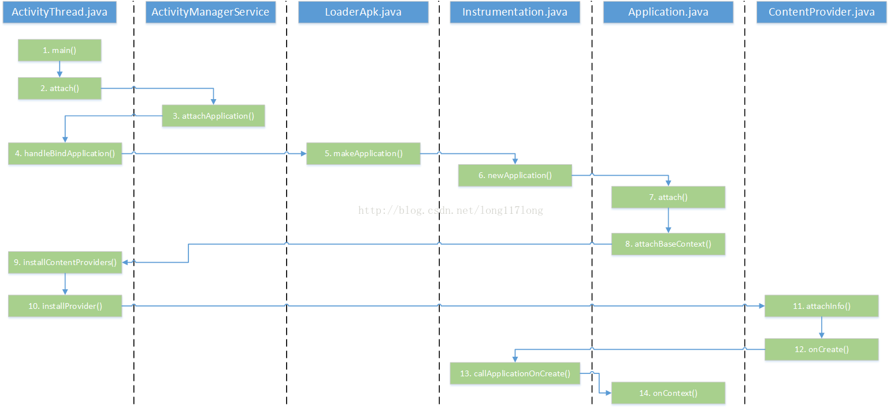

### Android ContentProvider 启动分析

### 环境
android 10 的源码， API 级别 29。 
***

### ContentProvider 启动流程
ContentProvider (CP) 启动流程图如下：可以对着这个来阅读下面的内容。




#### 1、 ActivityThread.handleBindApplication
对于了解 Activity 启动流程的，可以知道 Application 实例是在 ActivityThread 的 handleBindApplication 方法中创建。在讲解这个方法时疏漏了一点，那就是 ContentProvider 会在这个方法中创建。 

```
// ActivityThread
private void handleBindApplication(AppBindData data) {
    // ......
        Application app;try {
            // If the app is being launched for full backup or restore, bring it up in
            // a restricted environment with the base application class.
            app = data.info.makeApplication(data.restrictedBackupMode, null);

            // Propagate autofill compat state
            app.setAutofillOptions(data.autofillOptions);

            // Propagate Content Capture options
            app.setContentCaptureOptions(data.contentCaptureOptions);

            mInitialApplication = app;

            // don't bring up providers in restricted mode; they may depend on the
            // app's custom Application class
            if (!data.restrictedBackupMode) {
                if (!ArrayUtils.isEmpty(data.providers)) {
                    installContentProviders(app, data.providers);
                }
            }

            // Do this after providers, since instrumentation tests generally start their
            // test thread at this point, and we don't want that racing.
            try {
　　　　　　　　  // Instrumentation onCreate 方法
                mInstrumentation.onCreate(data.instrumentationArgs);
            }
            catch (Exception e) {
                throw new RuntimeException(
                    "Exception thrown in onCreate() of "
                    + data.instrumentationName + ": " + e.toString(), e);
            }
            try {
　　　　　　　　　// application 的 onCreate 方法
                mInstrumentation.callApplicationOnCreate(app);
            } catch (Exception e) {
                if (!mInstrumentation.onException(app, e)) {
                    throw new RuntimeException(
                      "Unable to create application " + app.getClass().getName()
                      + ": " + e.toString(), e);
                }
            }
        } finally {
            // If the app targets < O-MR1, or doesn't change the thread policy
            // during startup, clobber the policy to maintain behavior of b/36951662
            if (data.appInfo.targetSdkVersion < Build.VERSION_CODES.O_MR1
                    || StrictMode.getThreadPolicy().equals(writesAllowedPolicy)) {
                StrictMode.setThreadPolicy(savedPolicy);
            }
        }
   // ......  
}
```

上面简化了大量代码，但重要部分还在。AppBindData 对象 data 的成员变量 providers 保存了要在当前应用程序进程中启动的 CP 组件，接下会调用 installContentProviders 方法。

可以看到 installContentProviders 在 Application 的 onCreate 之前调用，所以可以得出结论：

ContentProvider 的 onCreate 在 Application 的 onCreate 之前调用。

因为 onCreate 是在启动过程中关掉用的，因此尽量避免在里面执行耗时的操作，例如与IO相关的操作；否则，就可能造成 Content Provider 组件启动超时。

#### ActivityThread.installContentProviders
```
    private void installContentProviders(
            Context context, List<ProviderInfo> providers) {
        final ArrayList<ContentProviderHolder> results = new ArrayList<>();

        for (ProviderInfo cpi : providers) {
            ContentProviderHolder cph = installProvider(context, null, cpi,
                    false /*noisy*/, true /*noReleaseNeeded*/, true /*stable*/);
            if (cph != null) {
                cph.noReleaseNeeded = true;
                results.add(cph);
            }
        }

        try {
　　　　　　　// 发布到 AMS 中
            ActivityManager.getService().publishContentProviders(
                getApplicationThread(), results);
        } catch (RemoteException ex) {
            throw ex.rethrowFromSystemServer();
        }
    }
```
这个方法主要做了两件事。

*   第一.通过循环变量 providerinfo 信息，调用 installProvider 方法将 provider 信息安装完成并封装成了一个 ContentProviderHolder 类型的对象，里面包含 IContentProvider 接口。

*   第二．调用AMS服务的publishContentProviders方法，将这些安装完成的 Provider 信息发布到AMS 服务，以便其他进程访问。

**ContentProviderHolder**
它是什么呢？它其实是一个可以在进程间传递的数据对象 (aidl)，看一下它的定义:
```
public class ContentProviderHolder implements Parcelable {
    public final ProviderInfo info;
    public IContentProvider provider;
    public IBinder connection;
    ...
```
里面包含了 CP 的很多信息，所以 AMS 拿到 ContentProviderHolder (CPH)，就等于拿到了所有 CP 的信息，后面发不到 AMS 就是依赖该对象。

#### ActivityThread.installProvider
接下来会调用  ActivityThread 的 installProvider 方法，如果传入的 holder 为 null，所以就会在 installProvider 中创建 ContentProvider 实例并加入 HashMap 中进行缓存。

那就先来看 installProvider 的处理过程，在来看 AMS 发布 ContentProvider 的过程。

```
    private ContentProviderHolder installProvider(Context context,
            ContentProviderHolder holder, ProviderInfo info,
            boolean noisy, boolean noReleaseNeeded, boolean stable) {
        ContentProvider localProvider = null;
　　　　　// 记住这里的类型
        IContentProvider provider;
　　　　　// 第一次安装肯定为空
        if (holder == null || holder.provider == null) {
            Context c = null;
            ApplicationInfo ai = info.applicationInfo;
　　　　　　　// 获取上下文
            if (context.getPackageName().equals(ai.packageName)) {
                c = context;
            } else if (mInitialApplication != null &&
                    mInitialApplication.getPackageName().equals(ai.packageName)) {
                c = mInitialApplication;
            } else {
                try {
                    c = context.createPackageContext(ai.packageName,
                            Context.CONTEXT_INCLUDE_CODE);
                } catch (PackageManager.NameNotFoundException e) {
                    // Ignore
                }
            }
　　　　　　　// 上下文为空直接返回
            if (c == null) {
                Slog.w(TAG, "Unable to get context for package " +
                      ai.packageName +
                      " while loading content provider " +
                      info.name);
                return null;
            }

            if (info.splitName != null) {
                try {
                    c = c.createContextForSplit(info.splitName);
                } catch (NameNotFoundException e) {
                    throw new RuntimeException(e);
                }
            }

            try {
                final java.lang.ClassLoader cl = c.getClassLoader();
                LoadedApk packageInfo = peekPackageInfo(ai.packageName, true);
                if (packageInfo == null) {
                    // System startup case.
                    packageInfo = getSystemContext().mPackageInfo;
                }
　　　　　　　　　 // 实例化
                localProvider = packageInfo.getAppFactory()
                        .instantiateProvider(cl, info.name);
                // 获取接口
                provider = localProvider.getIContentProvider();
                if (provider == null) {
                    Slog.e(TAG, "Failed to instantiate class " +
                          info.name + " from sourceDir " +
                          info.applicationInfo.sourceDir);
                    return null;
                }
                if (DEBUG_PROVIDER) Slog.v(
                    TAG, "Instantiating local provider " + info.name);
                // XXX Need to create the correct context for this provider.  调用 attachInfo 方法来进行初始化，可以参看流程图
                localProvider.attachInfo(c, info);
            } catch (java.lang.Exception e) {
                if (!mInstrumentation.onException(null, e)) {
                    throw new RuntimeException(
                            "Unable to get provider " + info.name
                            + ": " + e.toString(), e);
                }
                return null;
            }
        } else {
            provider = holder.provider;
            if (DEBUG_PROVIDER) Slog.v(TAG, "Installing external provider " + info.authority + ": "
                    + info.name);
        }

        ContentProviderHolder retHolder;

        synchronized (mProviderMap) {
            if (DEBUG_PROVIDER) Slog.v(TAG, "Checking to add " + provider
                    + " / " + info.name);
            IBinder jBinder = provider.asBinder();
            if (localProvider != null) {
　　　　　　　　　 // 根据包名，组件名字获取组件的类名
                ComponentName cname = new ComponentName(info.packageName, info.name);
                // 看根据名字是否可以找到
                ProviderClientRecord pr = mLocalProvidersByName.get(cname);
　　　　　　　　　 // 第一次创建 pr 为空
                if (pr != null) {
                    if (DEBUG_PROVIDER) {
                        Slog.v(TAG, "installProvider: lost the race, "
                                + "using existing local provider");
                    }
                    provider = pr.mProvider;
                } else {
                    holder = new ContentProviderHolder(info);
                    holder.provider = provider;
                    holder.noReleaseNeeded = true;
                    pr = installProviderAuthoritiesLocked(provider, localProvider, holder);
                    mLocalProviders.put(jBinder, pr);
                    mLocalProvidersByName.put(cname, pr);
                }
                retHolder = pr.mHolder;
            } else {
                ProviderRefCount prc = mProviderRefCountMap.get(jBinder);
                if (prc != null) {
                    if (DEBUG_PROVIDER) {
                        Slog.v(TAG, "installProvider: lost the race, updating ref count");
                    }
                    // We need to transfer our new reference to the existing
                    // ref count, releasing the old one...  but only if
                    // release is needed (that is, it is not running in the
                    // system process).
                    if (!noReleaseNeeded) {
                        incProviderRefLocked(prc, stable);
                        try {
                            ActivityManager.getService().removeContentProvider(
                                    holder.connection, stable);
                        } catch (RemoteException e) {
                            //do nothing content provider object is dead any way
                        }
                    }
                } else {
                    ProviderClientRecord client = installProviderAuthoritiesLocked(
                            provider, localProvider, holder);
                    if (noReleaseNeeded) {
                        prc = new ProviderRefCount(holder, client, 1000, 1000);
                    } else {
                        prc = stable
                                ? new ProviderRefCount(holder, client, 1, 0)
                                : new ProviderRefCount(holder, client, 0, 1);
                    }
                    mProviderRefCountMap.put(jBinder, prc);
                }
                retHolder = prc.holder;
            }
        }
        return retHolder;
    }
```
在 installContentProviders 方法中调用这个方法的时候，holder 参数传递的值为 Null，也是因为这些 ContentProvider 是第一次安装。所以 holder 肯定为 Null。所以此时满足 if 的条件。在 If 语句中，首先根据条件获取相应的 Context 上下文信息。

然后 ClassLoader 加载对应的 ContentProvider 类，并创建该类的对象，然后调用 ContentProvider 的 attachInfo 方法。该方法作用是将新创建的 ContentProvider 和 Context，ProviderInfo 关联起来，最后调用该 Provider 的 onCreate 方法启动 ContentProvider。这个一个 ContentProvider 就创建完成了，下一步就是将它保存到应用进程的中，以方便查找和管理。并发布到 AMS 服务中，方便其他进程调用。

获取 ContetProvider 的 IContentProvider（ICP） 赋值给 provider 变量，IContentProvider 是 ContentProvider 客户端和服务端通信的接口，getIcontentProvider 理解为得到一个 Binder 类型的对象，用于ContentProvider 客户端和服务端之间的通信。

由于是第一次启动 ContentProvider，所以该信息还没有保存，所以变量 pr 为空，此时根据 ProviderInfo 的信息和 Binder 类型 IContentProvider 对象，创建一个 ContentProviderHolder 对象，它里边封装了这个 ContentProvider 的 ProviderInfo 和 IContentProvider 信息。

方法最后返回创建的这个 ContentProviderHolder 的对象。 

#### Transport
Transport 是 ContentProvider 一个内部类，继承自 ContentProviderNative，是一个 binder, 具有远程通信能力。

getIcontentProvider 具体代码可以参看下面的代码。

```
  //  ContentProvider.java
   /**
     * Binder object that deals with remoting.  是一个 binder ,可以远程通信
     */
    class Transport extends ContentProviderNative {
        volatile AppOpsManager mAppOpsManager = null;
        volatile int mReadOp = AppOpsManager.OP_NONE;
        volatile int mWriteOp = AppOpsManager.OP_NONE;
        volatile ContentInterface mInterface = ContentProvider.this;
    }


  private Transport mTransport = new Transport();


    /**
     * Returns the Binder object for this provider.
     *
     * @return the Binder object for this provider
     * @hide
     */
    @UnsupportedAppUsage
    public IContentProvider getIContentProvider() {
        return mTransport;
    }

// ContentProviderNative.java
abstract public class ContentProviderNative extends Binder implements IContentProvider {}
 
```
IContentProvider 其实就是一个 binder 。

#### ContentProviderRecord
上面有个 ContentProviderRecord(CPR)， 它是系统 (ActivityManagerService) 用来记录一个 ContentProvider 相关信息的对象。

```
final class ContentProviderRecord implements ComponentName.WithComponentName {
    final ActivityManagerService service;
    public final ProviderInfo info;
    final int uid;
    final ApplicationInfo appInfo;
    final ComponentName name;
    final boolean singleton;
    public IContentProvider provider;
    public boolean noReleaseNeeded;
    // All attached clients
    final ArrayList<ContentProviderConnection> connections
            = new ArrayList<ContentProviderConnection>();
    //final HashSet<ProcessRecord> clients = new HashSet<ProcessRecord>();
    // Handles for non-framework processes supported by this provider
    HashMap<IBinder, ExternalProcessHandle> externalProcessTokenToHandle;
    // Count for external process for which we have no handles.
    int externalProcessNoHandleCount;
    ProcessRecord proc; // if non-null, hosting process.
    ProcessRecord launchingApp; // if non-null, waiting for this app to be launched.
    String stringName;
    String shortStringName;
```
可以看到 record 里面记录了相当多的信息。

#### ProviderInfo 
用来保存一个 ContentProvider 的信息( manifest 中的 <provider>), 比如 authority、readPermission 等。

```
public final class ProviderInfo extends ComponentInfo
        implements Parcelable {
    
    /** The name provider is published under content:// */
    public String authority = null;
    
    /** Optional permission required for read-only access this content
     * provider. */
    public String readPermission = null;
    
    /** Optional permission required for read/write access this content
     * provider. */
    public String writePermission = null;
    
    /** If true, additional permissions to specific Uris in this content
     * provider can be granted, as per the
     * {@link android.R.styleable#AndroidManifestProvider_grantUriPermissions
     * grantUriPermissions} attribute.
     */
    public boolean grantUriPermissions = false;
    
    /**
     * If non-null, these are the patterns that are allowed for granting URI
     * permissions.  Any URI that does not match one of these patterns will not
     * allowed to be granted.  If null, all URIs are allowed.  The
     * {@link PackageManager#GET_URI_PERMISSION_PATTERNS
     * PackageManager.GET_URI_PERMISSION_PATTERNS} flag must be specified for
     * this field to be filled in.
     */
    public PatternMatcher[] uriPermissionPatterns = null;
    
    /**
     * If non-null, these are path-specific permissions that are allowed for
     * accessing the provider.  Any permissions listed here will allow a
     * holding client to access the provider, and the provider will check
     * the URI it provides when making calls against the patterns here.
     */
    public PathPermission[] pathPermissions = null;
    
    /** If true, this content provider allows multiple instances of itself
     *  to run in different process.  If false, a single instances is always
     *  run in {@link #processName}. */
    public boolean multiprocess = false;
```
###ActivityThread.installProviderAuthoritiesLocked

接着看看一下 installProviderAuthoritiesLocked 的实现

```
    private ProviderClientRecord installProviderAuthoritiesLocked(IContentProvider provider,
            ContentProvider localProvider, ContentProviderHolder holder) {
        final String auths[] = holder.info.authority.split(";");
        final int userId = UserHandle.getUserId(holder.info.applicationInfo.uid);

        if (provider != null) {
            // If this provider is hosted by the core OS and cannot be upgraded,
            // then I guess we're okay doing blocking calls to it.
            for (String auth : auths) {
                switch (auth) {
                    case ContactsContract.AUTHORITY:
                    case CallLog.AUTHORITY:
                    case CallLog.SHADOW_AUTHORITY:
                    case BlockedNumberContract.AUTHORITY:
                    case CalendarContract.AUTHORITY:
                    case Downloads.Impl.AUTHORITY:
                    case "telephony":
                        Binder.allowBlocking(provider.asBinder());
                }
            }
        }

        final ProviderClientRecord pcr = new ProviderClientRecord(
                auths, provider, localProvider, holder);
        for (String auth : auths) {
            final ProviderKey key = new ProviderKey(auth, userId);
            final ProviderClientRecord existing = mProviderMap.get(key);
            if (existing != null) {
                Slog.w(TAG, "Content provider " + pcr.mHolder.info.name
                        + " already published as " + auth);
            } else {
                mProviderMap.put(key, pcr);
            }
        }
        return pcr;
    }
```

根据 Provider 的信息创建了一个 ProviderClientRecord (PCR) 对象，authority 是一个多属性值，变量这个 Provider 对应的所有 authority，每个 authority 属性为 key，保存这个 ProviderClientReocrd 到 mProviderMap 描述的 HashMap 中。

在一个应用进程中 (ActivityThread) 有三个列表来保存本进程中的 ContentProvider 的信息。

*   ArrayMap<ProviderKey, ProviderClientRecord> mProviderMap

    *   主要以 authority 为 key，保存 providerClientRecord 信息
*   ArrayMap<IBinder, ProviderClientRecord> mLocalProviders

    *   以通信的接口 Binder 对象为 key 保存 ProviderClientRecord 对象。主要保存了本进程的 ContentProvider 的信息
*   ArrayMap<ComponentName,ProviderClientRecord> mLocalProvidersByName

    *   以 Provider 的 ComponentName 信息为key 保存 ProviderClientRecord 对象。主要保存了本进程的 ContentProvider 的信息

通过 installProvider 方法将 ContentProvider 的类加载到内存中来，并创建了 ContentProvider 的对象，调用了 ContentProvider的onCreate 来启动它。然后将它按照不同的存储类型分别保存不同的 ContentProvider 集合中。

#### AMS.publishContentProviders 
ContentProvider 本地创建完成并保存后，将它封装成立一个 ContentProviderHolder 对象返回，然后我们调用 AMS 的 publishContentProviders 方法（实际上是通过 AMP (ActivityManagerProxy) 发送一个类型为 PUBLISH_CONTENT_PROVIDERS_TRANSACTION的进程间通信请求），将这些 Holder 对象发送给 AMS 服务将他们发布到 AMS 服务中。

```
    // AMS
     public final void publishContentProviders(IApplicationThread caller,
            List<ContentProviderHolder> providers) {
        if (providers == null) {
            return;
        }

        enforceNotIsolatedCaller("publishContentProviders");
        synchronized (this) {
            final ProcessRecord r = getRecordForAppLocked(caller);
            if (DEBUG_MU) Slog.v(TAG_MU, "ProcessRecord uid = " + r.uid);
            if (r == null) {
                throw new SecurityException(
                        "Unable to find app for caller " + caller
                      + " (pid=" + Binder.getCallingPid()
                      + ") when publishing content providers");
            }

            final long origId = Binder.clearCallingIdentity();

            final int N = providers.size();
            for (int i = 0; i < N; i++) {
                ContentProviderHolder src = providers.get(i);
                if (src == null || src.info == null || src.provider == null) {
                    continue;
                }
　　　　　　　　　　// 获取 cpr
                ContentProviderRecord dst = r.pubProviders.get(src.info.name);
                if (DEBUG_MU) Slog.v(TAG_MU, "ContentProviderRecord uid = " + dst.uid);
                if (dst != null) {
                    ComponentName comp = new ComponentName(dst.info.packageName, dst.info.name);
　　　　　　　　　　　　// 组件名字为 key
                    mProviderMap.putProviderByClass(comp, dst);
                    String names[] = dst.info.authority.split(";");
                    for (int j = 0; j < names.length; j++) {
                        mProviderMap.putProviderByName(names[j], dst);
                    }

                    int launchingCount = mLaunchingProviders.size();
                    int j;
                    boolean wasInLaunchingProviders = false;
                    for (j = 0; j < launchingCount; j++) {
                        if (mLaunchingProviders.get(j) == dst) {
                            mLaunchingProviders.remove(j);
                            wasInLaunchingProviders = true;
                            j--;
                            launchingCount--;
                        }
                    }
                    if (wasInLaunchingProviders) {
　　　　　　　　　　　　　　// 很多地方都是动过发送消息来判断是否耗时
                        mHandler.removeMessages(CONTENT_PROVIDER_PUBLISH_TIMEOUT_MSG, r);
                    }
                    // Make sure the package is associated with the process.
                    // XXX We shouldn't need to do this, since we have added the package
                    // when we generated the providers in generateApplicationProvidersLocked().
                    // But for some reason in some cases we get here with the package no longer
                    // added...  for now just patch it in to make things happy.
                    r.addPackage(dst.info.applicationInfo.packageName,
                            dst.info.applicationInfo.longVersionCode, mProcessStats);
                    synchronized (dst) {
                        dst.provider = src.provider;
                        dst.setProcess(r);
                        dst.notifyAll();
                    }
                    updateOomAdjLocked(r, true, OomAdjuster.OOM_ADJ_REASON_GET_PROVIDER);
                    maybeUpdateProviderUsageStatsLocked(r, src.info.packageName,
                            src.info.authority);
                }
            }

            Binder.restoreCallingIdentity(origId);
        }
    }
```

参数 caller 是一个类型为 ApplicationThread 的 binder 代理对象，它引用了运行在新创建的应用程序进程中的一个 ApplicationThread 对象，第 8 行代码通过它来获得用来描述新创建的应用程序进程的一个 ProcessRecord 对象。

新创建的应用程序进程在启动时，会将需要在它里面运行的 Content Provider 组件启动起来。Content provider 组件在 AMS 中使用一个 ContentProviderRecord 对象来描述，它们保存在用来描述新创建的应用程序进程的一个 ProcessRecord 对象 r 成员变量 pubProviders 中。

参数 providers 包含了要发布到 AMS 中的 Content provider 组件，每一个 content provider 组件都使用 ContentProviderHolder 对象来描述，它里面包含了要发布的 content provider 组件的一个 IContentProvider 接口。

 代码中的第一个大 for 循环，首先去除保存在参数 Providers 中的每一个 ContentProviderHolder 对象 src，然后在 AMS 中找到与对应的一个CPR 对象 dst ，最后将 ContentProviderHolder 对象 src 所描述的一个 CP 组件的一个 IContentProvider 访问接口保存在 CPR 对象 dst 的成员变量 provider 中。

关于 ContentProvider 随着应用的启动而加载、初始化的流程到这里就结束了。

下面就来看使用 ContentProvider 的工作流程。 

### 数据传输过程
前面讲了 content Provider 的启动过程，接下来看看其数据是如何传输的。

通常我们获取 ContentResolver 的代码如下：
```
ContentResolver cr = context.getContentResolver();  //获取ContentResolver
```

Context 的所有实现都是在 ContextImpl 中，所以 context.getContentResolver() 方法的实现也是一样。
```
ContextImpl.getContentResolver().query()
```

我们从 ContextImpl.getContentResolver().query() 开始看：

```

  // ContentResolver.java
public final @Nullable Cursor query(final @RequiresPermission.Read @NonNull Uri uri,
            @Nullable String[] projection, @Nullable Bundle queryArgs,
            @Nullable CancellationSignal cancellationSignal) {
        Preconditions.checkNotNull(uri, "uri");
　　　　　// 获取访问接口
        IContentProvider unstableProvider = acquireUnstableProvider(uri);
        if (unstableProvider == null) {
            return null;
        }
        IContentProvider stableProvider = null;
        Cursor qCursor = null;
        try {
            long startTime = SystemClock.uptimeMillis();

            ICancellationSignal remoteCancellationSignal = null;
            if (cancellationSignal != null) {
                cancellationSignal.throwIfCanceled();
                remoteCancellationSignal = unstableProvider.createCancellationSignal();
                cancellationSignal.setRemote(remoteCancellationSignal);
            }
            try {
　　　　　　　　　 // 调用 query 方法获取数据
                qCursor = unstableProvider.query(mPackageName, uri, projection,
                        queryArgs, remoteCancellationSignal);
            } catch (DeadObjectException e) {
                // The remote process has died...  but we only hold an unstable
                // reference though, so we might recover!!!  Let's try!!!!
                // This is exciting!!1!!1!!!!1
                unstableProviderDied(unstableProvider);
　　　　　　　　　　// 再次获取访问接口
                stableProvider = acquireProvider(uri);
                if (stableProvider == null) {
                    return null;
                }
                qCursor = stableProvider.query(
                        mPackageName, uri, projection, queryArgs, remoteCancellationSignal);
            }
            if (qCursor == null) {
                return null;
            }

            // Force query execution.  Might fail and throw a runtime exception here.
            qCursor.getCount();
            long durationMillis = SystemClock.uptimeMillis() - startTime;
            maybeLogQueryToEventLog(durationMillis, uri, projection, queryArgs);

            // Wrap the cursor object into CursorWrapperInner object.
            final IContentProvider provider = (stableProvider != null) ? stableProvider
                    : acquireProvider(uri);
            final CursorWrapperInner wrapper = new CursorWrapperInner(qCursor, provider);
            stableProvider = null;
            qCursor = null;
            return wrapper;
        } catch (RemoteException e) {
            // Arbitrary and not worth documenting, as Activity
            // Manager will kill this process shortly anyway.
            return null;
        } finally {
            if (qCursor != null) {
                qCursor.close();
            }
            if (cancellationSignal != null) {
                cancellationSignal.setRemote(null);
            }
            if (unstableProvider != null) {
                releaseUnstableProvider(unstableProvider);
            }
            if (stableProvider != null) {
                releaseProvider(stableProvider);
            }
        }
    }
```

该方法主要是获取到 IContentProvider，从而根据 uri 拿到数据。

要想理解上述过程的具体实现细节，需要先分析 ContentResolver 类的 acquireProvider 方法的调用过程，然后分析 IContentProvider 接口方法 query 的实现。

ContentResolver 的 acquireProvider 是一个抽象方法，具体实现可以看 ApplicationContentResolver：

```
    private final ActivityThread mMainThread;

    protected IContentProvider acquireProvider(Context context, String auth) {
            return mMainThread.acquireProvider(context,
                    ContentProvider.getAuthorityWithoutUserId(auth),
                    resolveUserIdFromAuthority(auth), true);
        }
```
ApplicationContentResolver 成员变量 mMainThread 指向了一个 ActivityThread 对象，它是在构造函数里面初始化的。因此，实际上是通过 ActivityThread 来获取 contentProvider 的代理对象。

####    ActivityThread.acquireProvider
来看下具体的实现：

```
    public final IContentProvider acquireProvider(
            Context c, String auth, int userId, boolean stable) {
　　　　 // 如果已经存在了，就直接返回，这里是从前面提到的 mProviderMap 来获取
        final IContentProvider provider = acquireExistingProvider(c, auth, userId, stable);
        if (provider != null) {
            return provider;
        }

        // There is a possible race here.  Another thread may try to acquire
        // the same provider at the same time.  When this happens, we want to ensure
        // that the first one wins.
        // Note that we cannot hold the lock while acquiring and installing the
        // provider since it might take a long time to run and it could also potentially
        // be re-entrant in the case where the provider is in the same process.
        ContentProviderHolder holder = null;
        try {
            synchronized (getGetProviderLock(auth, userId)) {
　　　　　　　　　　// 通过 ams 来获取 holder 
                holder = ActivityManager.getService().getContentProvider(
                        getApplicationThread(), auth, userId, stable);
            }
        } catch (RemoteException ex) {
            throw ex.rethrowFromSystemServer();
        }
　　　　 // 获取失败
        if (holder == null) {
            Slog.e(TAG, "Failed to find provider info for " + auth);
            return null;
        }

        // Install provider will increment the reference count for us, and break
        // any ties in the race.
        holder = installProvider(c, holder, holder.info,
                true /*noisy*/, holder.noReleaseNeeded, stable);
        return holder.provider;
    }
```
即在本地没有获得过 IContentProvider 时，直接向 ActivityManagerService 发起 getContentProvider 的请求,最终调用ActivityManagerService.getContentProviderImpl(), 这个方法就是 ContentProvider 实例化逻辑的核心了:

首先来看一下这个方法的声明:

```
ContentProviderHolder getContentProviderImpl(IApplicationThread caller,String name, IBinder token, boolean stable, int userId)
```

即最终是返回一个 ContentProviderHolder，前面已经解释了。

继续看 getContentProviderImpl(),这个方法比较长，所以接下来我们分段来看这个方法, 顺序是(1)、(2)、(3)... 这种 : 

**（1）ActivityManagerService.getContentProviderImpl() **

```
 //三个关键对象
    ContentProviderRecord cpr;
    ContentProviderConnection conn = null;
    ProviderInfo cpi = null;
    ...
    cpr = mProviderMap.getProviderByName(name, userId); // 看看系统是否已经缓存了这个ContentProvider
```

 这里主要需要解释下 ContentProviderConnection

```
/**
 * Represents a link between a content provider and client.
 */
public final class ContentProviderConnection extends Binder {
    public final ContentProviderRecord provider;
    public final ProcessRecord client;
    public final long createTime;
    public int stableCount;
    public int unstableCount;
    // The client of this connection is currently waiting for the provider to appear.
    // Protected by the provider lock.
    public boolean waiting;
    // The provider of this connection is now dead.
    public boolean dead;
```

它是一个 Binder。连接服务端 (ActivityManagerService) 和客户端 (我们的app)。里面记录着一个 ContentProvider 的状态，比如是否已经死掉了等。其他几个都已经解释过了。

####    （2）ActivityManagerService.getContentProviderImpl()
```
cpr = mProviderMap.getProviderByName(name, userId); // 看看系统是否已经缓存了这个ContentProvider
    boolean providerRunning = cpr != null && cpr.proc != null && !cpr.proc.killed;
    if (providerRunning) { 
        ...
    }

    if (!providerRunning) {
        ...
    }
```

 即根据 ContentProvider 所在的进程是否是活跃、这个 ContentProvider 是否被启动过(缓存下来)两个状态来进行不同的处理 :

ContentProvider 已被加载并且所在的进程正在运行

即:  if(providerRunning){ ... } 中的代码

```
 ProcessRecord r = getRecordForAppLocked(caller); //获取客户端(获得content provider的发起者)的进程信息
    if (r != null && cpr.canRunHere(r)) { //如果请求的ContentProvider和客户端位于同一个进程
        ContentProviderHolder holder = cpr.newHolder(null); //ContentProviderConnection参数传null
        holder.provider = null; //注意，这里置空是让客户端自己去实例化！！
        return holder;
    }

    //客户端进程正在运行，但是和ContentProvider并不在同一个进程
    conn = incProviderCountLocked(r, cpr, token, stable); // 直接根据 ContentProviderRecord和ProcessRecord 构造一个 ContentProviderConnection

    ...
```

即如果请求的是同进程的 ContentProvider 则直接回到进程的主线程去实例化 ContentProvider。否则使用 ContentProviderRecord 和 ProcessRecord 构造一个ContentProviderConnection。

ContentProvider所在的进程没有运行并且服务端(ActivityManagerService)没有加载过它

即: if(!providerRunning){ ... }中的代码

```
//先解析出来一个ProviderInfo
    cpi = AppGlobals.getPackageManager().resolveContentProvider(name, STOCK_PM_FLAGS | PackageManager.GET_URI_PERMISSION_PATTERNS, userId);
    ...
    ComponentName comp = new ComponentName(cpi.packageName, cpi.name);
    cpr = mProviderMap.getProviderByClass(comp, userId); //这个content provider 没有被加载过

    final boolean firstClass = cpr == null;
    if (firstClass) {
        ...
        cpr = new ContentProviderRecord(this, cpi, ai, comp, singleton); // 构造一个 ContentProviderRecord
    }

    ...

    final int N = mLaunchingProviders.size(); //  mLaunchingProviders它是用来缓存正在启动的 ContentProvider的集合的
    int i;
    for (i = 0; i < N; i++) {
        if (mLaunchingProviders.get(i) == cpr) {  // 已经请求过一次了，provider正在启动，不重复走下面的逻辑
            break;
        }
    }

    //这个 ContentProvider 不是在启动状态，也就是还没启动
    if (i >= N) {
        ProcessRecord proc = getProcessRecordLocked(cpi.processName, cpr.appInfo.uid, false);
        ...
        
         if (proc != null && proc.thread != null && !proc.killed) { //content provider所在的进程已经启动
            proc.thread.scheduleInstallProvider(cpi); //安装这个 Provider , 即客户端实例化它
          } else {
            //启动content provider 所在的进程, 并且唤起 content provider
            proc = startProcessLocked(cpi.processName,cpr.appInfo, false, 0, "content provider",new ComponentName(cpi.applicationInfo.packageName,cpi.name)...);
         }

        cpr.launchingApp = proc;
        mLaunchingProviders.add(cpr); //添加到正在启动的队列
    }

    //缓存 ContentProvider信息
    if (firstClass) {
        mProviderMap.putProviderByClass(comp, cpr);
    }
    mProviderMap.putProviderByName(name, cpr);

    //构造一个 ContentProviderConnection
    conn = incProviderCountLocked(r, cpr, token, stable);
    if (conn != null) {
        conn.waiting = true; //设置这个connection
    } 
```

####    （3）ActivityManagerService.getContentProviderImpl()

```
    // Wait for the provider to be published...
    synchronized (cpr) {
        while (cpr.provider == null) {
            ....
            if (conn != null) {
                conn.waiting = true;
            }
            cpr.wait();
        }
    }

    return cpr != null ? cpr.newHolder(conn) : null; //返回给请求这个客户端的进程
```

根据前面的分析，ContentProvider 所在的进程没有运行或者不是和获取者同一个进程，就创建了一个 ContentProviderConnection，那么服务端就会挂起，启动 ContentProvider 所在的进程，并等待它实例化 ContentProvider 。ok，通过前面的分析我们知道 ContentProvider 最终是在它所在的进程实例化的。

接下来就看一下客户端相关代码,前面分析我们知道，如果客户端进程和请求的 ContentProvider 位于同一个进程，则 ActivityManager.getService().getContentProvider(...);会返回一个内容为空的 ContentProviderHolder, 我们再拿刚开始客户端向服务端请求 ContentProvider 的代码看一下:
```
    holder = ActivityManager.getService().getContentProvider( getApplicationThread(), auth, userId, stable);

    //在向服务端获取holder，服务端如果发现ContentProvider的进程和当前客户端进程是同一个进程就会让客户端进程来实例化ContentProvider，具体细节可以在下面分析中看到
    holder = installProvider(c, holder, holder.info, true /*noisy*/, holder.noReleaseNeeded, stable);
```

**不在同一个进程中的 ContentProvider 实例化过程**

如果客户端进程和请求的 ContentProvider 不在同一个进程，根据前面我们分析 ActivityManagerService 的逻辑可以知道，ActivityManagerService 会调用ContentProvider 所在进程的 proc.thread.scheduleInstallProvider(cpi), 其实最终调用到 ActivityThread.installContentProviders

```
 private void installContentProviders(Context context, List<ProviderInfo> providers) {
        final ArrayList<ContentProviderHolder> results = new ArrayList<>();

        //ActivityManagerService 让客户端启动的是一个ContentProvider列表
        for (ProviderInfo cpi : providers) {
            ContentProviderHolder cph = installProvider(context, null, cpi,false, true ,true);
            if (cph != null) {
                cph.noReleaseNeeded = true;
                results.add(cph);
            }
        }

        ActivityManager.getService().publishContentProviders(getApplicationThread(), results); //通知服务端，content provider ok啦
    }
```

到这里，就跟前面的启动逻辑基本一样了。 那么在获取到接口后，又是怎么通过 query 拿到数据的呢？

####    query 过程解析
从前面的分析可知，IContentProvider 是 Transport 的实例，所以具体 query 的逻辑需要看

```
        @Override
        public Cursor query(String callingPkg, Uri uri, @Nullable String[] projection,
                @Nullable Bundle queryArgs, @Nullable ICancellationSignal cancellationSignal) {
            uri = validateIncomingUri(uri);
            uri = maybeGetUriWithoutUserId(uri);
            if (enforceReadPermission(callingPkg, uri, null) != AppOpsManager.MODE_ALLOWED) {
                if (projection != null) {
                    return new MatrixCursor(projection, 0);
                }

                Cursor cursor;
                final String original = setCallingPackage(callingPkg);
                try {
　　　　　　　　　　　　// 调用的是 mInterface
                    cursor = mInterface.query(
                            uri, projection, queryArgs,
                            CancellationSignal.fromTransport(cancellationSignal));
                } catch (RemoteException e) {
                    throw e.rethrowAsRuntimeException();
                } finally {
                    setCallingPackage(original);
                }
                if (cursor == null) {
                    return null;
                }

                // Return an empty cursor for all columns.
                return new MatrixCursor(cursor.getColumnNames(), 0);
            }
            Trace.traceBegin(TRACE_TAG_DATABASE, "query");
            final String original = setCallingPackage(callingPkg);
            try {
                return mInterface.query(
                        uri, projection, queryArgs,
                        CancellationSignal.fromTransport(cancellationSignal));
            } catch (RemoteException e) {
                throw e.rethrowAsRuntimeException();
            } finally {
                setCallingPackage(original);
                Trace.traceEnd(TRACE_TAG_DATABASE);
            }
        }
```
这里是通过  mInterface 来调用 query () 方法

```
        volatile ContentInterface mInterface = ContentProvider.this;
```
而实际上就是调用的自己实现的 provider 方法。具体实现其实是通过 db 来查询的。到这里关于 CP 的数据传输过程也讲完了。

但是对于跨进程，其实应该是通过 ContentProviderNative 的内部类 ContentProviderProxy 来进行跨进程调用，最终会回调到 ContentProviderNative 的 onTransact 方法，然后再调用 mInterface 的 query 方法来实现查询。

```
class ContentProviderProxy implements IContentProvider{}
```
ContentProviderProxy 是实现了 IContentProvider 接口的。那么是什么时候转成 ContentProviderProxy 呢？

```
// ContentProviderHolder.java
private ContentProviderHolder(Parcel source) {
        info = ProviderInfo.CREATOR.createFromParcel(source);
        provider = ContentProviderNative.asInterface(
                source.readStrongBinder());
        connection = source.readStrongBinder();
        noReleaseNeeded = source.readInt() != 0;
    }
```

到这里才知道原来是创建 CPH 的时候，会根据是当前进程还是跨进程来返回对应的实例。

```
  // ContentProviderNative.java
  static public IContentProvider asInterface(IBinder obj)
    {
        if (obj == null) {
            return null;
        }
        IContentProvider in =
            (IContentProvider)obj.queryLocalInterface(descriptor);
        if (in != null) {
            return in;
        }

        return new ContentProviderProxy(obj);
    }
```
到这里相信你应该能理解 CP 的启动以及其跨进程通信能力了。

### 总结

对于 ContentProvider，有两种启动方式：

1.  一种是启动 App 的时候，启动 CP；
2.  另一种是需要访问其他 App 的数据，如果对应的 App 并没有启动，这时候也会启动 CP；

一旦 CP 启动之后，就会将   ContentProviderHolder(内含 ICP 接口) 发布到 AMS 中，这样其他 App 或自身都可以通过 AMS 获取到 ICP 接口，从而获取数据。 此外，ContentProvider 的 onCreate 在 Application 的 onCreate 之前调用。 

***
https://www.cnblogs.com/huansky/p/13837431.html

https://ljd1996.github.io/2020/08/20/Android-ContentProvider%E5%8E%9F%E7%90%86/
***