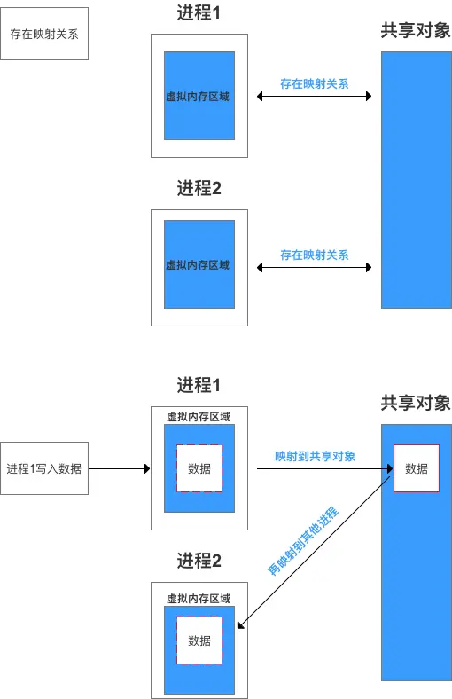
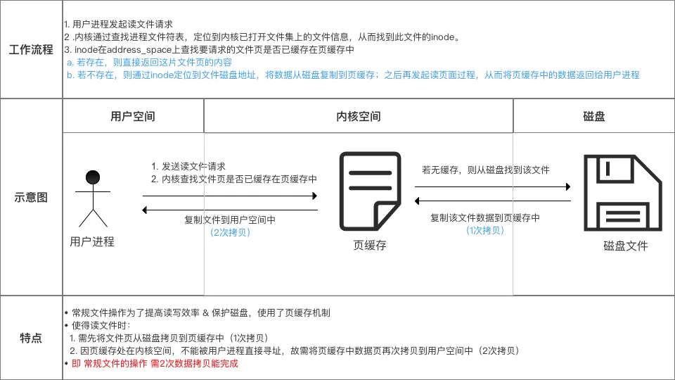
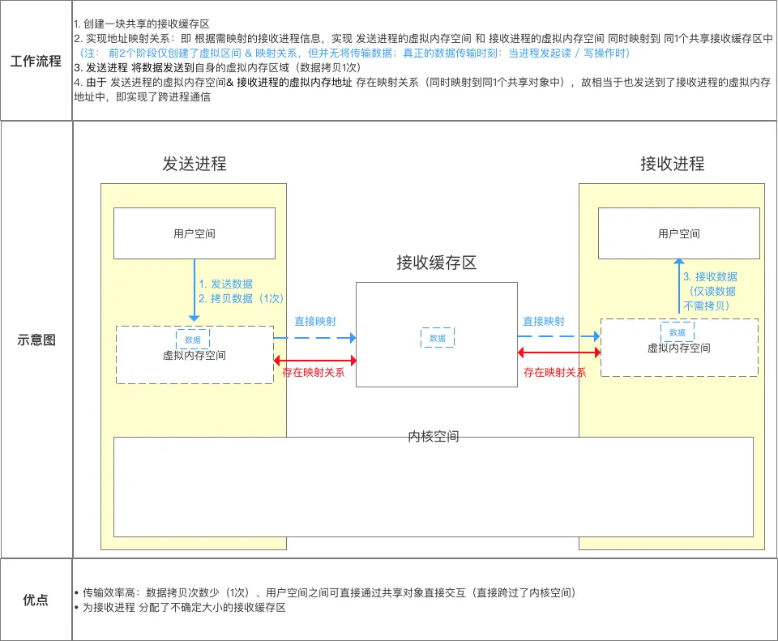

### 定义
关联 进程中的1个虚拟内存区域 & 1个磁盘上的对象，使得二者存在映射关系

1.  上述的映射过程 = 初始化该虚拟内存区域
2.  虚拟内存区域被初始化后，就会在交换空间中换你来还去
3.  被映射的对象称为：共享对象（普通文件 / 匿名文件）

### 作用
若存在上述映射关系，则具备以下特征

*   在多个进程的虚拟内存区域 已和同1个共享对象 建立映射关系的前提下
*   若 其中1个进程对该虚拟区域进行写操作
*   那么，对于 也把该共享对象映射到其自身虚拟内存区域的进程 也是可见的

1.  假设进程1、2的虚拟内存区域同时映射到同1个共享对象；
2.  当进程1对其虚拟内存区域进行写操作时，也会映射到进程2中的虚拟内存区域

### 实现过程

*   内存映射的实现过程主要是通过Linux系统下的系统调用函数：mmap（）
*   该函数的作用 = 创建虚拟内存区域 + 与共享对象建立映射关系
*   其函数原型、具体使用 & 内部流程 如下
```
/**
  * 函数原型
  */
void *mmap(void *start, size_t length, int prot, int flags, int fd, off_t offset);

/**
  * 具体使用（用户进程调用mmap（））
  * 下述代码即常见了一片大小 = MAP_SIZE的接收缓存区 & 关联到共享对象中（即建立映射）
  */
  mmap(NULL, MAP_SIZE, PROT_READ, MAP_PRIVATE, fd, 0);

/**
  * 内部原理
  * 步骤1：创建虚拟内存区域
  * 步骤2：实现地址映射关系，即：进程的虚拟地址空间 ->> 共享对象
  * 注： 
  *    a. 此时，该虚拟地址并没有任何数据关联到文件中，仅仅只是建立映射关系
  *    b. 当其中1个进程对虚拟内存写入数据时，则真正实现了数据的可见
  */
```
###  特点
*   提高数据的读、写 & 传输的时间性能
    1.  减少了数据拷贝次数
    2.  用户空间 & 内核空间的高效交互（通过映射的区域 直接交互）
    3.  用内存读写 代替 I/O读写
*   提高内存利用率：通过虚拟内存 & 共享对象

### 应用场景
在Linux系统下，根据内存映射的本质原理 & 特点，其应用场景在于：

1.  实现内存共享：如 跨进程通信
2.  提高数据读 / 写效率 ：如 文件读 / 写操作
### 实例讲解
下面，我将详细讲解 内存映射应用在跨进程通信 & 文件操作的实例

####    文件读 / 写操作
传统的Linux系统文件操作流程如下



使用了内存映射的 文件读 / 写 操作



从上面可看出：使用了内存映射的文件读/写 操作方式效率更加高、性能最好！

### 跨进程通信
传统的跨进程通信


使用了内存映射的 跨进程通信



***
https://www.jianshu.com/p/719fc4758813
***
