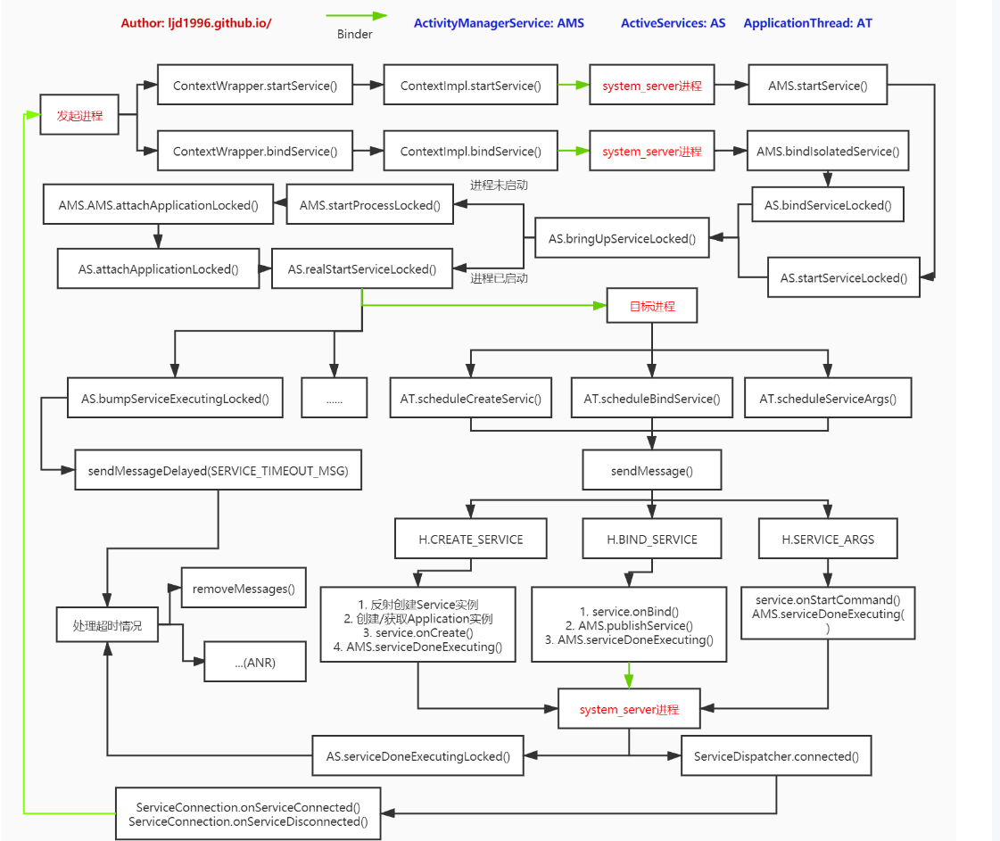

***
android 10
***

Service作为Android四大组件之一，理解其内部的相关原理和源码还是很有必要的，理解了这些后，日常的开发中遇到问题也会多一种解决思路。在Android高版本中，系统不允许应用直接调用ServiceManager.addService添加自定义的服务，除非修改系统Selinux Policy等文件定制ROM，接下来的解析也可以根据Service的原理明白bindService是怎么通过AMS来传递Binder对象的。

### 发起进程：startService
首先先看看ContextWrapper.startService方法：
```
// ContextWrapper

public ComponentName startService(Intent service) {
    // 从之前Activity启动原理中可以知道mBase是ContextImpl实例
    return mBase.startService(service);
}

// ContextImpl

public ComponentName startService(Intent service) {
    // 当system进程调用此方法时输出warn信息
    warnIfCallingFromSystemProcess();
    return startServiceCommon(service, false, mUser);
}

private ComponentName startServiceCommon(Intent service, boolean requireForeground,
        UserHandle user) {
    try {
        // 检验Service的intent，在Android L上如果Component和Package为null则抛出异常
        validateServiceIntent(service);
        service.prepareToLeaveProcess(this);
        // 在Activity启动中解析过，ActivityManager.getService()返回的是AMS在客户端的代理
        ComponentName cn = ActivityManager.getService().startService(
            mMainThread.getApplicationThread(), service, service.resolveTypeIfNeeded(
                        getContentResolver()), requireForeground,
                        getOpPackageName(), user.getIdentifier());
        if (cn != null) {
            if (cn.getPackageName().equals("!")) {
                throw new SecurityException("Not allowed to start service " + service + " without permission " + cn.getClassName());
            } else if (cn.getPackageName().equals("!!")) {
                throw new SecurityException("Unable to start service " + service + ": " + cn.getClassName());
            } else if (cn.getPackageName().equals("?")) {
                throw new IllegalStateException("Not allowed to start service " + service + ": " + cn.getClassName());
            }
        }
        return cn;
    } catch (RemoteException e) {
        throw e.rethrowFromSystemServer();
    }
}
```
接下来就到了system_server进程的AMS线程。

### system_server进程
####    AMS.startService
```
// AMS

public ComponentName startService(IApplicationThread caller, Intent service,
        String resolvedType, boolean requireForeground, String callingPackage, int userId)
        throws TransactionTooLargeException {
    // 如果调用者是isolated进程，则抛出异常
    enforceNotIsolatedCaller("startService");
    // 拒绝可能的文件描述符泄漏
    if (service != null && service.hasFileDescriptors() == true) {
        throw new IllegalArgumentException("File descriptors passed in Intent");
    }

    if (callingPackage == null) {
        throw new IllegalArgumentException("callingPackage cannot be null");
    }

    synchronized(this) {
        final int callingPid = Binder.getCallingPid();
        final int callingUid = Binder.getCallingUid();
        final long origId = Binder.clearCallingIdentity();
        ComponentName res;
        try {
            // mServices为ActiveServices对象
            res = mServices.startServiceLocked(caller, service,
                    resolvedType, callingPid, callingUid,
                    requireForeground, callingPackage, userId);
        } finally {
            Binder.restoreCallingIdentity(origId);
        }
        return res;
    }
}
```
####    前期准备：AS.startServiceLocked
```
ComponentName startServiceLocked(IApplicationThread caller, Intent service, String resolvedType,
        int callingPid, int callingUid, boolean fgRequired, String callingPackage, final int userId)
        throws TransactionTooLargeException {
    return startServiceLocked(caller, service, resolvedType, callingPid, callingUid, fgRequired,
            callingPackage, userId, false);
}

ComponentName startServiceLocked(IApplicationThread caller, Intent service, String resolvedType,
        int callingPid, int callingUid, boolean fgRequired, String callingPackage,
        final int userId, boolean allowBackgroundActivityStarts)
        throws TransactionTooLargeException {
    final boolean callerFg;
    if (caller != null) {
        // ProcessRecord记录了进程信息
        final ProcessRecord callerApp = mAm.getRecordForAppLocked(caller);
        if (callerApp == null) {
            throw new SecurityException("Unable to find app for caller " + caller
                    + " (pid=" + callingPid + ") when starting service " + service);
        }
        callerFg = callerApp.setSchedGroup != ProcessList.SCHED_GROUP_BACKGROUND;
    } else {
        callerFg = true;
    }
    // 检索服务信息
    ServiceLookupResult res = retrieveServiceLocked(service, null, resolvedType, callingPackage,
            callingPid, callingUid, userId, true, callerFg, false, false);
    if (res == null) {
        return null;
    }
    if (res.record == null) {
        return new ComponentName("!", res.permission != null ? res.permission : "private to package");
    }

    ServiceRecord r = res.record;

    if (!mAm.mUserController.exists(r.userId)) {
        Slog.w(TAG, "Trying to start service with non-existent user! " + r.userId);
        return null;
    }
    // ...
    r.lastActivity = SystemClock.uptimeMillis();
    r.startRequested = true;
    r.delayedStop = false;
    r.fgRequired = fgRequired; // 服务在启动后是否需要进入前台
    r.pendingStarts.add(new ServiceRecord.StartItem(r, false, r.makeNextStartId(),
            service, neededGrants, callingUid));

    final ServiceMap smap = getServiceMapLocked(r.userId);
    boolean addToStarting = false;

    if (!callerFg && !fgRequired && r.app == null
            && mAm.mUserController.hasStartedUserState(r.userId)) {
        ProcessRecord proc = mAm.getProcessRecordLocked(r.processName, r.appInfo.uid, false);
        if (proc == null || proc.getCurProcState() > ActivityManager.PROCESS_STATE_RECEIVER) {
            if (r.delayed) {
                // 该服务已安排为延迟启动
                return r.name;
            }
            if (smap.mStartingBackground.size() >= mMaxStartingBackground) {
                // 当超出同一时间允许后台启动的最大服务数，则将该服务加入延迟启动的队列
                smap.mDelayedStartList.add(r);
                r.delayed = true;
                return r.name;
            }
            addToStarting = true;
        } else if (proc.getCurProcState() >= ActivityManager.PROCESS_STATE_SERVICE) {
            addToStarting = true;
        }
    }

    ComponentName cmp = startServiceInnerLocked(smap, service, r, callerFg, addToStarting);
    return cmp;
}

ComponentName startServiceInnerLocked(ServiceMap smap, Intent service, ServiceRecord r,
        boolean callerFg, boolean addToStarting) throws TransactionTooLargeException {
    // ...
    String error = bringUpServiceLocked(r, service.getFlags(), callerFg, false, false);
    if (error != null) {
        return new ComponentName("!!", error);
    }

    if (r.startRequested && addToStarting) {
        boolean first = smap.mStartingBackground.size() == 0;
        smap.mStartingBackground.add(r);
        r.startingBgTimeout = SystemClock.uptimeMillis() + mAm.mConstants.BG_START_TIMEOUT;
        if (first) {
            smap.rescheduleDelayedStartsLocked();
        }
    } else if (callerFg || r.fgRequired) {
        smap.ensureNotStartingBackgroundLocked(r);
    }

    return r.name;
}
```

####    开始启动：AS.bringUpServiceLocked
```
private String bringUpServiceLocked(ServiceRecord r, int intentFlags, boolean execInFg,
        boolean whileRestarting, boolean permissionsReviewRequired)
        throws TransactionTooLargeException {
    if (r.app != null && r.app.thread != null) {
        // 调用service.onStartCommand()
        sendServiceArgsLocked(r, execInFg, false);
        return null;
    }

    if (!whileRestarting && mRestartingServices.contains(r)) {
        // 等待重启的过程，则直接返回
        return null;
    }

    // 启动service前，把service从重启服务队列中移除
    if (mRestartingServices.remove(r)) {
        clearRestartingIfNeededLocked(r);
    }

    // 确保此service不再被视为延迟，则设置delayed为false
    if (r.delayed) {
        getServiceMapLocked(r.userId).mDelayedStartList.remove(r);
        r.delayed = false;
    }

    // 确保拥有该服务的user已经启动，否则停止
    if (!mAm.mUserController.hasStartedUserState(r.userId)) {
        bringDownServiceLocked(r);
        return msg;
    }

    // 服务正在启动，设置package stopped为false
    try {
        AppGlobals.getPackageManager().setPackageStoppedState(r.packageName, false, r.userId);
    } catch (RemoteException e) {
    } catch (IllegalArgumentException e) {
        Slog.w(TAG, "Failed trying to unstop package " + r.packageName + ": " + e);
    }

    final boolean isolated = (r.serviceInfo.flags&ServiceInfo.FLAG_ISOLATED_PROCESS) != 0;
    final String procName = r.processName;
    HostingRecord hostingRecord = new HostingRecord("service", r.instanceName);
    ProcessRecord app;

    if (!isolated) {
        app = mAm.getProcessRecordLocked(procName, r.appInfo.uid, false);
        if (app != null && app.thread != null) {
            try {
                app.addPackage(r.appInfo.packageName, r.appInfo.longVersionCode, mAm.mProcessStats);
                // 启动服务
                realStartServiceLocked(r, app, execInFg);
                return null;
            } catch (TransactionTooLargeException e) {
                throw e;
            } catch (RemoteException e) {
                Slog.w(TAG, "Exception when starting service " + r.shortInstanceName, e);
            }
        }
    } else {
        // ...
    }

    // 进程没有启动
    if (app == null && !permissionsReviewRequired) {
        // 启动service所要运行的进程
        if ((app=mAm.startProcessLocked(procName, r.appInfo, true, intentFlags,
                hostingRecord, false, isolated, false)) == null) {
            String msg = "Unable to launch app " + r.appInfo.packageName + "/"
                    + r.appInfo.uid + " for service " + r.intent.getIntent() + ": process is bad";
            Slog.w(TAG, msg);
            bringDownServiceLocked(r);
            return msg;
        }
        if (isolated) {
            r.isolatedProc = app;
        }
    }

    if (!mPendingServices.contains(r)) {
        mPendingServices.add(r);
    }

    if (r.delayedStop) {
        // Oh and hey we've already been asked to stop!
        r.delayedStop = false;
        if (r.startRequested) {
            stopServiceLocked(r);
        }
    }

    return null;
}
```
*   当目标进程已存在，则直接执行realStartServiceLocked()；
*   当目标进程不存在，则先执行startProcessLocked创建进程， 经过层层调用最后会调用到AMS.attachApplicationLocked, 然后再执行realStartServiceLocked()。

#####   AMS.startProcessLocked
startProcessLocked方法的解析见：

*   Android-Activity原理
*   Android-Application
由上面的解析可以知道层层调用到了AMS.attachApplicationLocked方法(只看与Service相关的代码)：
```
private final boolean attachApplicationLocked(IApplicationThread thread,
            int pid, int callingUid, long startSeq) {
    if (!badApp) {
        try {
            didSomething |= mServices.attachApplicationLocked(app, processName);
            checkTime(startTime, "attachApplicationLocked: after mServices.attachApplicationLocked");
        } catch (Exception e) {
            Slog.wtf(TAG, "Exception thrown starting services in " + app, e);
            badApp = true;
        }
    }
}

// ActiveServices
boolean attachApplicationLocked(ProcessRecord proc, String processName)
        throws RemoteException {
    boolean didSomething = false;
    // 启动mPendingServices队列中，等待在该进程启动的服务
    if (mPendingServices.size() > 0) {
        ServiceRecord sr = null;
        try {
            for (int i=0; i<mPendingServices.size(); i++) {
                sr = mPendingServices.get(i);
                if (proc != sr.isolatedProc && (proc.uid != sr.appInfo.uid
                        || !processName.equals(sr.processName))) {
                    continue;
                }

                mPendingServices.remove(i);
                i--;
                proc.addPackage(sr.appInfo.packageName, sr.appInfo.longVersionCode, mAm.mProcessStats);
                // 启动服务，即将进入服务的生命周期
                realStartServiceLocked(sr, proc, sr.createdFromFg);
                didSomething = true;
            }
        } catch (RemoteException e) {
            throw e;
        }
    }
    // 对于正在等待重启并需要运行在该进程的服务，现在是启动它们的好时候
    if (mRestartingServices.size() > 0) {
        ServiceRecord sr;
        for (int i=0; i<mRestartingServices.size(); i++) {
            sr = mRestartingServices.get(i);
            if (proc != sr.isolatedProc && (proc.uid != sr.appInfo.uid
                    || !processName.equals(sr.processName))) {
                continue;
            }
            mAm.mHandler.removeCallbacks(sr.restarter);
            mAm.mHandler.post(sr.restarter);
        }
    }
    return didSomething;
}
```

*   当需要创建新进程时，在创建后经过attachApplicationLocked方法，会调用realStartServiceLocked方法
*   当不需要创建进程时，在之前就直接进入了realStartServiceLocked方法

#####   AS.realStartServiceLocked
```
private final void realStartServiceLocked(ServiceRecord r,
        ProcessRecord app, boolean execInFg) throws RemoteException {
    if (app.thread == null) {
        throw new RemoteException();
    }
    r.setProcess(app);
    r.restartTime = r.lastActivity = SystemClock.uptimeMillis();

    final boolean newService = app.services.add(r);
    // 发送delay消息
    bumpServiceExecutingLocked(r, execInFg, "create");
    // 更新service所在进程的优先级
    mAm.updateLruProcessLocked(app, false, null);
    updateServiceForegroundLocked(r.app, /* oomAdj= */ false);
    mAm.updateOomAdjLocked(OomAdjuster.OOM_ADJ_REASON_START_SERVICE);
    
    boolean created = false;
    try {
        mAm.notifyPackageUse(r.serviceInfo.packageName, PackageManager.NOTIFY_PACKAGE_USE_SERVICE);
        app.forceProcessStateUpTo(ActivityManager.PROCESS_STATE_SERVICE);
        // 进入onCreate流程
        app.thread.scheduleCreateService(r, r.serviceInfo, mAm.compatibilityInfoForPackage(r.serviceInfo.applicationInfo),
                app.getReportedProcState());
        r.postNotification();
        created = true;
    } catch (DeadObjectException e) {
        Slog.w(TAG, "Application dead when creating service " + r);
        mAm.appDiedLocked(app);
        throw e;
    } finally {
        if (!created) {
            // Retry.
            if (!inDestroying) {
                scheduleServiceRestartLocked(r, false);
            }
        }
    }
    requestServiceBindingsLocked(r, execInFg);
    updateServiceClientActivitiesLocked(app, null, true);

    // 进入onStartCommand流程
    sendServiceArgsLocked(r, execInFg, true);

    if (r.delayed) {
        getServiceMapLocked(r.userId).mDelayedStartList.remove(r);
        r.delayed = false;
    }

    if (r.delayedStop) {
        // Oh and hey we've already been asked to stop!
        r.delayedStop = false;
        if (r.startRequested) {
            stopServiceLocked(r);  // 停止服务
        }
    }
}

private final void sendServiceArgsLocked(ServiceRecord r, boolean execInFg,
        boolean oomAdjusted) throws TransactionTooLargeException {
    final int N = r.pendingStarts.size();
    if (N == 0) {
        return;
    }

    ArrayList<ServiceStartArgs> args = new ArrayList<>();
    // ...

    ParceledListSlice<ServiceStartArgs> slice = new ParceledListSlice<>(args);
    slice.setInlineCountLimit(4);
    Exception caughtException = null;
    try {
        r.app.thread.scheduleServiceArgs(r, slice);
    } catch (Exception e) {
    }

    if (caughtException != null) {
        // ...
    }
}
```

#####   AS.bumpServiceExecutingLocked
```
private final void bumpServiceExecutingLocked(ServiceRecord r, boolean fg, String why) {
    boolean timeoutNeeded = true;

    long now = SystemClock.uptimeMillis();
    if (r.executeNesting == 0) {
        r.executeFg = fg;
        ServiceState stracker = r.getTracker();
        if (stracker != null) {
            stracker.setExecuting(true, mAm.mProcessStats.getMemFactorLocked(), now);
        }
        if (r.app != null) {
            r.app.executingServices.add(r);
            r.app.execServicesFg |= fg;
            if (timeoutNeeded && r.app.executingServices.size() == 1) {
                scheduleServiceTimeoutLocked(r.app);
            }
        }
    } else if (r.app != null && fg && !r.app.execServicesFg) {
        r.app.execServicesFg = true;
        if (timeoutNeeded) {
            scheduleServiceTimeoutLocked(r.app);
        }
    }
    r.executeFg |= fg;
    r.executeNesting++;
    r.executingStart = now;
}

void scheduleServiceTimeoutLocked(ProcessRecord proc) {
    if (proc.executingServices.size() == 0 || proc.thread == null) {
        return;
    }
    Message msg = mAm.mHandler.obtainMessage(ActivityManagerService.SERVICE_TIMEOUT_MSG);
    msg.obj = proc;
    mAm.mHandler.sendMessageDelayed(msg, proc.execServicesFg ? SERVICE_TIMEOUT : SERVICE_BACKGROUND_TIMEOUT);
}
```
在bumpServiceExecutingLocked方法中会发送一个延迟处理的消息SERVICE_TIMEOUT_MSG：

*   前台服务，SERVICE_TIMEOUT = 20*1000，即20s
*   后台服务，SERVICE_BACKGROUND_TIMEOUT = SERVICE_TIMEOUT * 10，即200s

### 目标进程
####    ApplicationThread

上面有两处代码：app.thread.scheduleCreateService和app.thread.scheduleServiceArgs，这里的app是ProcessRecord类型，与进程相关联；thread是IApplicationThread实例，是本地进程在AMS进程中的代理，AMS用它与本地进程通信。由上代码可以看出在这里app表示的是目标Service所在的进程，thread则是Service所在进程的IApplicationThread实例代理，调用的是ApplicationThread类的方法：
```
private class ApplicationThread extends IApplicationThread.Stub {
    public final void scheduleCreateService(IBinder token,
            ServiceInfo info, CompatibilityInfo compatInfo, int processState) {
        updateProcessState(processState, false);
        CreateServiceData s = new CreateServiceData();
        s.token = token;
        s.info = info;
        s.compatInfo = compatInfo;

        sendMessage(H.CREATE_SERVICE, s);
    }

    public final void scheduleServiceArgs(IBinder token, ParceledListSlice args) {
        List<ServiceStartArgs> list = args.getList();

        for (int i = 0; i < list.size(); i++) {
            ServiceStartArgs ssa = list.get(i);
            ServiceArgsData s = new ServiceArgsData();
            s.token = token;
            s.taskRemoved = ssa.taskRemoved;
            s.startId = ssa.startId;
            s.flags = ssa.flags;
            s.args = ssa.args;

            sendMessage(H.SERVICE_ARGS, s);
        }
    }
}

class H extends Handler {
    public void handleMessage(Message msg) {
        case CREATE_SERVICE:
            handleCreateService((CreateServiceData)msg.obj);
            break;
        case SERVICE_ARGS:
            handleServiceArgs((ServiceArgsData)msg.obj);
            break;
    }
}
```
####    AT.handleCreateService
```
private void handleCreateService(CreateServiceData data) {
    // 当应用处于后台时会进行GC，而此时应用被调回到活动状态，因此跳过本次gc
    unscheduleGcIdler();
    // 这个LoadedApk应该比较熟悉了
    LoadedApk packageInfo = getPackageInfoNoCheck(data.info.applicationInfo, data.compatInfo);
    Service service = null;
    try {
        java.lang.ClassLoader cl = packageInfo.getClassLoader();
        // 通过反射创建实例：cl.loadClass(className).newInstance()
        service = packageInfo.getAppFactory().instantiateService(cl, data.info.name, data.intent);
    } catch (Exception e) {
    }

    try {
        // 创建ContextImpl对象
        ContextImpl context = ContextImpl.createAppContext(this, packageInfo);
        context.setOuterContext(service);
        // 创建或获取Application对象
        Application app = packageInfo.makeApplication(false, mInstrumentation);
        // attach上下文等
        service.attach(context, this, data.info.name, data.token, app, ActivityManager.getService());
        // 调用onCreate方法
        service.onCreate();
        mServices.put(data.token, service);
        try {
            // 通过Binder又调用到AMS进程方法
            ActivityManager.getService().serviceDoneExecuting(data.token, SERVICE_DONE_EXECUTING_ANON, 0, 0);
        } catch (RemoteException e) {
        }
    } catch (Exception e) {
    }
}
```
上面创建了Service并进行attach后，则进入onCreate回调，回调完成后，再远程调用AMS的serviceDoneExecuting方法。

####    AT.handleServiceArgs
```
private void handleServiceArgs(ServiceArgsData data) {
    Service s = mServices.get(data.token);
    if (s != null) {
        try {
            int res;
            if (!data.taskRemoved) {
                // 进入onStartCommand回调
                res = s.onStartCommand(data.args, data.flags, data.startId);
            } else {
                s.onTaskRemoved(data.args);
                res = Service.START_TASK_REMOVED_COMPLETE;
            }

            QueuedWork.waitToFinish();

            try {
                // 通过Binder又调用到AMS进程方法
                ActivityManager.getService().serviceDoneExecuting(data.token, SERVICE_DONE_EXECUTING_START, data.startId, res);
            } catch (RemoteException e) {
                throw e.rethrowFromSystemServer();
            }
        } catch (Exception e) {
        }
    }
}
```
上面回调onStartCommand完成后，再远程调用AMS的serviceDoneExecuting方法。

### system_server进程收尾
####    AMS.serviceDoneExecuting
```
public void serviceDoneExecuting(IBinder token, int type, int startId, int res) {
    synchronized(this) {
        // ...
        mServices.serviceDoneExecutingLocked((ServiceRecord)token, type, startId, res);
    }
}
```
####    AS.serviceDoneExecutingLocked
```
void serviceDoneExecutingLocked(ServiceRecord r, int type, int startId, int res) {
    boolean inDestroying = mDestroyingServices.contains(r);
    if (r != null) {
        if (type == ActivityThread.SERVICE_DONE_EXECUTING_START) {
            r.callStart = true;
            switch (res) {
                case Service.START_STICKY_COMPATIBILITY:
                case Service.START_STICKY: {
                    r.findDeliveredStart(startId, false, true);
                    r.stopIfKilled = false;
                    break;
                }
                case Service.START_NOT_STICKY: {
                    r.findDeliveredStart(startId, false, true);
                    if (r.getLastStartId() == startId) {
                        r.stopIfKilled = true;
                    }
                    break;
                }
                case Service.START_REDELIVER_INTENT: {
                    ServiceRecord.StartItem si = r.findDeliveredStart(startId, false, false);
                    if (si != null) {
                        si.deliveryCount = 0;
                        si.doneExecutingCount++;
                        r.stopIfKilled = true;
                    }
                    break;
                }
                case Service.START_TASK_REMOVED_COMPLETE: {
                    r.findDeliveredStart(startId, true, true);
                    break;
                }
                default:
                    throw new IllegalArgumentException("Unknown service start result: " + res);
            }
            if (res == Service.START_STICKY_COMPATIBILITY) {
                r.callStart = false;
            }
        } else if (type == ActivityThread.SERVICE_DONE_EXECUTING_STOP) {
            // ...
        }
        final long origId = Binder.clearCallingIdentity();
        serviceDoneExecutingLocked(r, inDestroying, inDestroying);
        Binder.restoreCallingIdentity(origId);
    }
}

private void serviceDoneExecutingLocked(ServiceRecord r, boolean inDestroying, boolean finishing) {
    r.executeNesting--;
    if (r.executeNesting <= 0) {
        if (r.app != null) {
            r.app.execServicesFg = false;
            r.app.executingServices.remove(r);
            if (r.app.executingServices.size() == 0) {
                // 移除Service启动超时的消息
                mAm.mHandler.removeMessages(ActivityManagerService.SERVICE_TIMEOUT_MSG, r.app);
            } else if (r.executeFg) {
                // Need to re-evaluate whether the app still needs to be in the foreground.
                for (int i=r.app.executingServices.size()-1; i>=0; i--) {
                    if (r.app.executingServices.valueAt(i).executeFg) {
                        r.app.execServicesFg = true;
                        break;
                    }
                }
            }
            if (inDestroying) {
                mDestroyingServices.remove(r);
                r.bindings.clear();
            }
            mAm.updateOomAdjLocked(r.app, true, OomAdjuster.OOM_ADJ_REASON_UNBIND_SERVICE);
        }
        r.executeFg = false;
        if (r.tracker != null) {
            final int memFactor = mAm.mProcessStats.getMemFactorLocked();
            final long now = SystemClock.uptimeMillis();
            r.tracker.setExecuting(false, memFactor, now);
            r.tracker.setForeground(false, memFactor, now);
            if (finishing) {
                r.tracker.clearCurrentOwner(r, false);
                r.tracker = null;
            }
        }
        if (finishing) {
            if (r.app != null && !r.app.isPersistent()) {
                r.app.services.remove(r);
                r.app.updateBoundClientUids();
                if (r.whitelistManager) {
                    updateWhitelistManagerLocked(r.app);
                }
            }
            r.setProcess(null);
        }
    }
}
```
### 发起进程：bindService
####    bindService
```
// ContextWrapper

public boolean bindService(Intent service, ServiceConnection conn,
        int flags) {
    return mBase.bindService(service, conn, flags);
}

// ContextImpl

public boolean bindService(Intent service, ServiceConnection conn, int flags) {
    warnIfCallingFromSystemProcess();
    return bindServiceCommon(service, conn, flags, null, mMainThread.getHandler(), null, getUser());
}

private boolean bindServiceCommon(Intent service, ServiceConnection conn, int flags,
        String instanceName, Handler handler, Executor executor, UserHandle user) {
    IServiceConnection sd;
    if (conn == null) {
        throw new IllegalArgumentException("connection is null");
    }
    if (handler != null && executor != null) {
        throw new IllegalArgumentException("Handler and Executor both supplied");
    }
    if (mPackageInfo != null) {
        if (executor != null) {
            sd = mPackageInfo.getServiceDispatcher(conn, getOuterContext(), executor, flags);
        } else {
            sd = mPackageInfo.getServiceDispatcher(conn, getOuterContext(), handler, flags);
        }
    } else {
        throw new RuntimeException("Not supported in system context");
    }
    validateServiceIntent(service);
    try {
        IBinder token = getActivityToken();
        service.prepareToLeaveProcess(this);
        int res = ActivityManager.getService().bindIsolatedService(
            mMainThread.getApplicationThread(), getActivityToken(), service,
            service.resolveTypeIfNeeded(getContentResolver()),
            sd, flags, instanceName, getOpPackageName(), user.getIdentifier());
        if (res < 0) {
            throw new SecurityException("Not allowed to bind to service " + service);
        }
        return res != 0;
    } catch (RemoteException e) {
        throw e.rethrowFromSystemServer();
    }
}
```
####    getServiceDispatcher
```
private final ArrayMap<Context, ArrayMap<ServiceConnection, LoadedApk.ServiceDispatcher>> mServices = new ArrayMap<>();

public final IServiceConnection getServiceDispatcher(ServiceConnection c,
        Context context, Executor executor, int flags) {
    return getServiceDispatcherCommon(c, context, null, executor, flags);
}

private IServiceConnection getServiceDispatcherCommon(ServiceConnection c,
        Context context, Handler handler, Executor executor, int flags) {
    synchronized (mServices) {
        LoadedApk.ServiceDispatcher sd = null;
        ArrayMap<ServiceConnection, LoadedApk.ServiceDispatcher> map = mServices.get(context);
        if (map != null) {
            sd = map.get(c);
        }
        if (sd == null) {
            if (executor != null) {
                sd = new ServiceDispatcher(c, context, executor, flags);
            } else {
                sd = new ServiceDispatcher(c, context, handler, flags);
            }
            if (map == null) {
                map = new ArrayMap<>();
                mServices.put(context, map);
            }
            map.put(c, sd);
        } else {
            sd.validate(context, handler, executor);
        }
        return sd.getIServiceConnection();
    }
}

oneway interface IServiceConnection {
    void connected(in ComponentName name, IBinder service, boolean dead);
}
```

*   mServices记录着所有context里面，每个ServiceConnection以及所对应的LoadedApk.ServiceDispatcher对象，同一个ServiceConnection只会创建一次
*   返回的对象是LoadedApk.ServiceDispatcher.InnerConnection，该对象继承于IServiceConnection.Stub，该类是由IServiceConnection.aidl自动生成的作为binder服务端
*   IServiceConnection属于oneway interface，也就是非阻塞的binder call
### system_server进程
####    AMS.bindIsolatedService
```
public int bindIsolatedService(IApplicationThread caller, IBinder token, Intent service,
        String resolvedType, IServiceConnection connection, int flags, String instanceName,
        String callingPackage, int userId) throws TransactionTooLargeException {
    // 如果调用者是isolated进程，则抛出异常
    enforceNotIsolatedCaller("bindService");

    // Refuse possible leaked file descriptors
    if (service != null && service.hasFileDescriptors() == true) {
        throw new IllegalArgumentException("File descriptors passed in Intent");
    }

    if (callingPackage == null) {
        throw new IllegalArgumentException("callingPackage cannot be null");
    }

    // 确保instanceName不包含异常字符，否则抛出异常
    // ...

    synchronized(this) {
        return mServices.bindServiceLocked(caller, token, service, resolvedType, connection, flags, instanceName, callingPackage, userId);
    }
}
```
####    AS.bindServiceLocked
```
int bindServiceLocked(IApplicationThread caller, IBinder token, Intent service,
        String resolvedType, final IServiceConnection connection, int flags,
        String instanceName, String callingPackage, final int userId)
        throws TransactionTooLargeException {
    // 获取发起端所对应的ProcessRecord
    final ProcessRecord callerApp = mAm.getRecordForAppLocked(caller);
    if (callerApp == null) {
        throw new SecurityException(/*...*/);
    }

    ActivityServiceConnectionsHolder<ConnectionRecord> activity = null;
    // token不为空，代表着发起方具有activity上下文
    if (token != null) {
        activity = mAm.mAtmInternal.getServiceConnectionsHolder(token);
        // 存在token，却找不到activity
        if (activity == null) {
            return 0;
        }
    }

    int clientLabel = 0;
    PendingIntent clientIntent = null;
    final boolean isCallerSystem = callerApp.info.uid == Process.SYSTEM_UID;

    if (isCallerSystem) {
        // 发起方是system进程
    }
    // 是否为前台service
    final boolean callerFg = callerApp.setSchedGroup != ProcessList.SCHED_GROUP_BACKGROUND;
    final boolean isBindExternal = (flags & Context.BIND_EXTERNAL_SERVICE) != 0;
    final boolean allowInstant = (flags & Context.BIND_ALLOW_INSTANT) != 0;
    // 检索服务信息
    ServiceLookupResult res = retrieveServiceLocked(service, instanceName, resolvedType, callingPackage,
                Binder.getCallingPid(), Binder.getCallingUid(), userId, true,
                callerFg, isBindExternal, allowInstant);
    if (res == null) {
        return 0;
    }
    if (res.record == null) {
        return -1;
    }
    ServiceRecord s = res.record;

    // If permissions need a review before any of the app components can run,
    // we schedule binding to the service but do not start its process, then
    // we launch a review activity to which is passed a callback to invoke
    // when done to start the bound service's process to completing the binding.
    if (mAm.getPackageManagerInternalLocked().isPermissionsReviewRequired(s.packageName, s.userId)) {
        // 重开一个Activity，然后调用bringUpServiceLocked方法
    }

    final long origId = Binder.clearCallingIdentity();

    try {
        // ...
        AppBindRecord b = s.retrieveAppBindingLocked(service, callerApp);
        ConnectionRecord c = new ConnectionRecord(b, activity, connection, flags, clientLabel,
                clientIntent, callerApp.uid, callerApp.processName, callingPackage);
        // connection来自发起方
        IBinder binder = connection.asBinder();
        s.addConnection(binder, c);
        b.connections.add(c);
        if (activity != null) {
            activity.addConnection(c);
        }
        b.client.connections.add(c);
        ArrayList<ConnectionRecord> clist = mServiceConnections.get(binder);
        if (clist == null) {
            clist = new ArrayList<>();
            mServiceConnections.put(binder, clist);
        }
        clist.add(c);

        if ((flags&Context.BIND_AUTO_CREATE) != 0) {
            s.lastActivity = SystemClock.uptimeMillis();
            // 启动Service，跟上面的startService一样
            if (bringUpServiceLocked(s, service.getFlags(), callerFg, false, permissionsReviewRequired) != null) {
                return 0;
            }
        }

        if (s.app != null) {
            // 更新service所在进程的优先级
            mAm.updateLruProcessLocked(s.app, (callerApp.hasActivitiesOrRecentTasks() && s.app.hasClientActivities())
                        || (callerApp.getCurProcState() <= ActivityManager.PROCESS_STATE_TOP
                                && (flags & Context.BIND_TREAT_LIKE_ACTIVITY) != 0), b.client);
            mAm.updateOomAdjLocked(OomAdjuster.OOM_ADJ_REASON_BIND_SERVICE);
        }

        if (s.app != null && b.intent.received) {
            // Service is already running, so we can immediately publish the connection.
            try {
                c.conn.connected(s.name, b.intent.binder, false);
            } catch (Exception e) {
            }

            // 当第一个app连接到该binding, 且之前已被bind过, 则回调onRebind()方法
            if (b.intent.apps.size() == 1 && b.intent.doRebind) {
                requestServiceBindingLocked(s, b.intent, callerFg, true);
            }
        } else if (!b.intent.requested) {
            // 最终回调onBind()方法
            requestServiceBindingLocked(s, b.intent, callerFg, false);
        }

        getServiceMapLocked(s.userId).ensureNotStartingBackgroundLocked(s);

    } finally {
        Binder.restoreCallingIdentity(origId);
    }

    return 1;
}
```
在上面的bringUpServiceLocked方法中，会调用到realStartServiceLocked方法：

####    AS.realStartServiceLocked
该方法的代码在上面已经贴过了，主要看看几个节点方法：
```
private final void realStartServiceLocked(ServiceRecord r,
        ProcessRecord app, boolean execInFg) throws RemoteException {
    // 发送delay消息
    bumpServiceExecutingLocked(r, execInFg, "create");
    // 进入onCreate流程
    app.thread.scheduleCreateService(/*...*/);
    // 进入onBind流程
    requestServiceBindingsLocked(r, execInFg);
    // 进入onStartCommand流程
    sendServiceArgsLocked(r, execInFg, true);
}
```
####    AS.requestServiceBindingsLocked
```
private final void requestServiceBindingsLocked(ServiceRecord r, boolean execInFg)
        throws TransactionTooLargeException {
    for (int i=r.bindings.size()-1; i>=0; i--) {
        IntentBindRecord ibr = r.bindings.valueAt(i);
        if (!requestServiceBindingLocked(r, ibr, execInFg, false)) {
            break;
        }
    }
}

private final boolean requestServiceBindingLocked(ServiceRecord r, IntentBindRecord i,
        boolean execInFg, boolean rebind) throws TransactionTooLargeException {
    if (r.app == null || r.app.thread == null) {
        // If service is not currently running, can't yet bind.
        return false;
    }
    if ((!i.requested || rebind) && i.apps.size() > 0) {
        try {
            // 发送delay消息，与ANR相关
            bumpServiceExecutingLocked(r, execInFg, "bind");
            r.app.forceProcessStateUpTo(ActivityManager.PROCESS_STATE_SERVICE);
            // 进入OnBind流程
            r.app.thread.scheduleBindService(r, i.intent.getIntent(), rebind,
                    r.app.getReportedProcState());
            if (!rebind) {
                i.requested = true;
            }
            i.hasBound = true;
            i.doRebind = false;
        } catch (TransactionTooLargeException e) {
            final boolean inDestroying = mDestroyingServices.contains(r);
            serviceDoneExecutingLocked(r, inDestroying, inDestroying);
            throw e;
        } catch (RemoteException e) {
            final boolean inDestroying = mDestroyingServices.contains(r);
            serviceDoneExecutingLocked(r, inDestroying, inDestroying);
            return false;
        }
    }
    return true;
}
```

### 目标进程
####    ApplicationThread
上面app.thread.scheduleBindService调用的是目标进程中ApplicationThread类的方法：
```
private class ApplicationThread extends IApplicationThread.Stub {
    public final void scheduleBindService(IBinder token, Intent intent,
            boolean rebind, int processState) {
        updateProcessState(processState, false);
        BindServiceData s = new BindServiceData();
        s.token = token;
        s.intent = intent;
        s.rebind = rebind;
        sendMessage(H.BIND_SERVICE, s);
    }
}

class H extends Handler {
    public void handleMessage(Message msg) {
        case BIND_SERVICE:
            handleBindService((BindServiceData)msg.obj);
            break;
    }
}
```

####    AT.handleBindService
```
private void handleBindService(BindServiceData data) {
    Service s = mServices.get(data.token);
    if (s != null) {
        try {
            data.intent.setExtrasClassLoader(s.getClassLoader());
            data.intent.prepareToEnterProcess();
            try {
                if (!data.rebind) {
                    // onBind回调
                    IBinder binder = s.onBind(data.intent);
                    ActivityManager.getService().publishService(data.token, data.intent, binder);
                } else {
                    // onRebind回调 
                    s.onRebind(data.intent);
                    ActivityManager.getService().serviceDoneExecuting(data.token, SERVICE_DONE_EXECUTING_ANON, 0, 0);
                }
            } catch (RemoteException ex) {
                throw ex.rethrowFromSystemServer();
            }
        } catch (Exception e) {
            if (!mInstrumentation.onException(s, e)) {
                throw new RuntimeException("Unable to bind to service " + s + " with " + data.intent + ": " + e.toString(), e);
            }
        }
    }
}
```
###   system_server进程收尾
####    AMS.publishService
```
public void publishService(IBinder token, Intent intent, IBinder service) {
    // Refuse possible leaked file descriptors
    if (intent != null && intent.hasFileDescriptors() == true) {
        throw new IllegalArgumentException("File descriptors passed in Intent");
    }

    synchronized(this) {
        if (!(token instanceof ServiceRecord)) {
            throw new IllegalArgumentException("Invalid service token");
        }
        mServices.publishServiceLocked((ServiceRecord)token, intent, service);
    }
}
```
####    AS.publishServiceLocked
```
void publishServiceLocked(ServiceRecord r, Intent intent, IBinder service) {
    final long origId = Binder.clearCallingIdentity();
    try {
        if (r != null) {
            Intent.FilterComparison filter = new Intent.FilterComparison(intent);
            IntentBindRecord b = r.bindings.get(filter);
            if (b != null && !b.received) {
                b.binder = service;
                b.requested = true;
                b.received = true;
                ArrayMap<IBinder, ArrayList<ConnectionRecord>> connections = r.getConnections();
                for (int conni = connections.size() - 1; conni >= 0; conni--) {
                    ArrayList<ConnectionRecord> clist = connections.valueAt(conni);
                    for (int i=0; i<clist.size(); i++) {
                        ConnectionRecord c = clist.get(i);
                        if (!filter.equals(c.binding.intent.intent)) {
                            continue;
                        }
                        try {
                            c.conn.connected(r.name, service, false);
                        } catch (Exception e) {
                        }
                    }
                }
            }

            serviceDoneExecutingLocked(r, mDestroyingServices.contains(r), false);
        }
    } finally {
        Binder.restoreCallingIdentity(origId);
    }
}
```
####    AMS.serviceDoneExecuting
```
public void serviceDoneExecuting(IBinder token, int type, int startId, int res) {
    synchronized(this) {
        if (!(token instanceof ServiceRecord)) {
            Slog.e(TAG, "serviceDoneExecuting: Invalid service token=" + token);
            throw new IllegalArgumentException("Invalid service token");
        }
        // 这个方法在上面已经看过了，包含移除Service启动超时的消息
        mServices.serviceDoneExecutingLocked((ServiceRecord)token, type, startId, res);
    }
}
```
### 发起进程

####    InnerConnection.connected
上面的c.conn.connected方法中，conn是InnerConnection类型实例：
```
private static class InnerConnection extends IServiceConnection.Stub {
    
    final WeakReference<LoadedApk.ServiceDispatcher> mDispatcher;

    InnerConnection(LoadedApk.ServiceDispatcher sd) {
        mDispatcher = new WeakReference<LoadedApk.ServiceDispatcher>(sd);
    }

    public void connected(ComponentName name, IBinder service, boolean dead)
            throws RemoteException {
        LoadedApk.ServiceDispatcher sd = mDispatcher.get();
        if (sd != null) {
            sd.connected(name, service, dead);
        }
    }
}
```
####    ServiceDispatcher.connected
```
public void connected(ComponentName name, IBinder service, boolean dead) {
    if (mActivityExecutor != null) {
        mActivityExecutor.execute(new RunConnection(name, service, 0, dead));
    } else if (mActivityThread != null) {
        mActivityThread.post(new RunConnection(name, service, 0, dead));
    } else {
        doConnected(name, service, dead);
    }
}
```
####    RunConnection
```
private final class RunConnection implements Runnable {
    RunConnection(ComponentName name, IBinder service, int command, boolean dead) {
        mName = name;
        mService = service;
        mCommand = command;
        mDead = dead;
    }

    public void run() {
        if (mCommand == 0) {
            doConnected(mName, mService, mDead);
        } else if (mCommand == 1) {
            doDeath(mName, mService);
        }
    }

    final ComponentName mName;
    final IBinder mService;
    final int mCommand;
    final boolean mDead;
}
```
*   mName是远程服务的组件名对象ComponentName
*   mService是远程服务的onBind()返回的IBinder代理对象
####    doConnected
```
public void doConnected(ComponentName name, IBinder service, boolean dead) {
    ServiceDispatcher.ConnectionInfo old;
    ServiceDispatcher.ConnectionInfo info;

    synchronized (this) {
        if (mForgotten) {
            // We unbound before receiving the connection; ignore any connection received.
            return;
        }
        old = mActiveConnections.get(name);
        if (old != null && old.binder == service) {
            // Huh, already have this one.  Oh well!
            return;
        }

        if (service != null) {
            // A new service is being connected... set it all up.
            info = new ConnectionInfo();
            info.binder = service;
            info.deathMonitor = new DeathMonitor(name, service);
            try {
                service.linkToDeath(info.deathMonitor, 0);
                mActiveConnections.put(name, info);
            } catch (RemoteException e) {
                // This service was dead before we got it...  just
                // don't do anything with it.
                mActiveConnections.remove(name);
                return;
            }
        } else {
            // The named service is being disconnected... clean up.
            mActiveConnections.remove(name);
        }

        if (old != null) {
            old.binder.unlinkToDeath(old.deathMonitor, 0);
        }
    }

    // If there was an old service, it is now disconnected.
    if (old != null) {
        // 回调onServiceDisconnected
        mConnection.onServiceDisconnected(name);
    }
    if (dead) {
        mConnection.onBindingDied(name);
    }
    // If there is a new viable service, it is now connected.
    if (service != null) {
        // 回调onServiceConnected，这里的service即是上面目标进程Service中onBind方法返回的Ibinder对象
        mConnection.onServiceConnected(name, service);
    } else {
        // The binding machinery worked, but the remote returned null from onBind().
        mConnection.onNullBinding(name);
    }
}
```
### 总结
启动流程：

*   发起进程通过Binder向system_server进程发起startService/bindService请求；
*   system_server进程接收到请求后，通过Socket向zygote进程发送创建进程的请求；
*   zygote进程fork出新的子进程-目标进程；
*   目标进程通过Binder向sytem_server进程发起attachApplication请求；
*   system_server进程在收到请求后，进行一系列准备工作后，再通过binder向目标进程发送scheduleCreateService请求；
*   目标进程的binder线程在收到请求后，通过handler向主线程发送CREATE_SERVICE消息；
*   主线程在收到Message后，通过发射机制创建目标Service，并回调Service.onCreate()方法；
*   之后通过类似的原理，目标进程分别进行了onBind，onStartCommand回调；其中进行onBind回调后，通过binder通知system_server进程，AMS线程则通过binder回调了发起进程的onServiceConnected等方法，在这里，会将目标进程返回的Binder对象传递给发起进程，则这两个进程通过AMS的协助，可以实现IPC通信；目标进程也通过Binder通知AMS去处理ANR的逻辑。

Service启动的流程图如下：



***
https://ljd1996.github.io/2020/06/12/Android-Service%E5%8E%9F%E7%90%86/
***