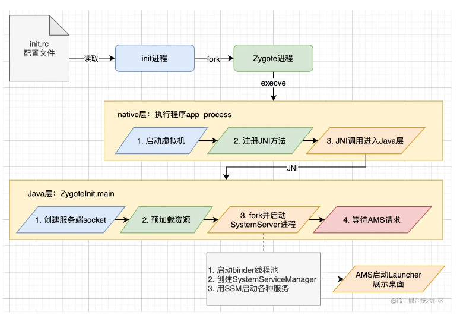
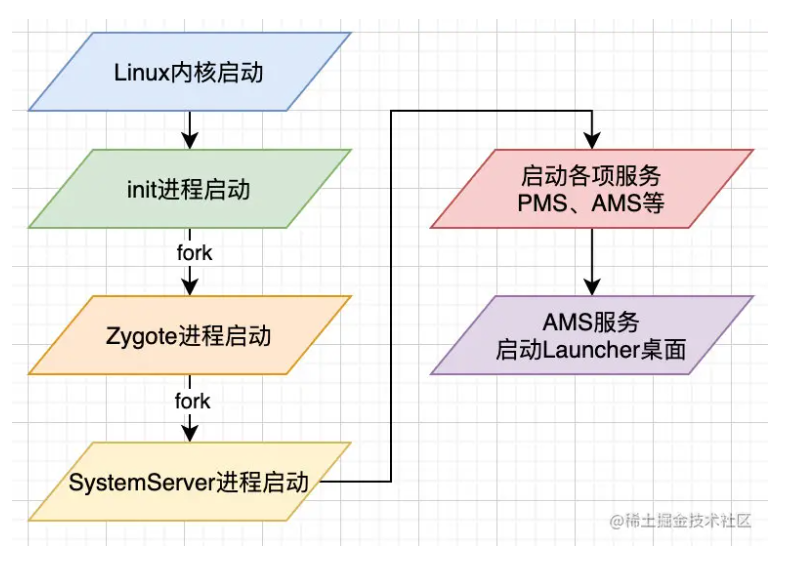

### 环境
Android 8.0
*** 

### 大纲

* Zygote启动
* SystemServer启动
* Launcher启动
* 总结
* 细节补充
* 参考资料
*** 


**init进程**是Linux内核启动完成后在用户空间启动的第一个进程，主要负责初始化工作、启动属性服务、解析init.rc文件并启动Zygote进程。

**Zygote进程**是一个进程孵化器，负责创建虚拟机实例、应用程序进程、系统服务进程SystemServer。他通过fork（复制进程）的方式创建子进程，子进程能继承父进程的系统资源如常用类、注册的JNI函数、主题资源、共享库等。
由于Zygote进程启动时会创建虚拟机实例，由Zygote fork出的应用程序进程和SystemServer进程则可以在内部获取到一个虚拟机实例副本。

### Zygote启动

init进程会解析配置文件init.rc，来启动一些需要在开机时就启动的系统进程，如Zygote进程、ServiceManager进程等。
init.rc是由Android初始化语言编写的脚本配置。由于Android 5.0开始支持了64bit程序，在init.rc里改成了通过${ro.zygote}的值来引入Zygote相关的配置，
```
//system/core/rootdir/init.rc
import /init.${ro.zygote}.rc
```

${ro.zygote}的取值有4种，在init.rc的同级目录/system/core/rootdir下，可以看到4个Zygote相关的配置文件，表示系统所支持程序的bit位数，

*   init.zygote32.rc，Zygote进程的执行程序路径为/system/bin/app_process
*   init.zygote64.rc，Zygote进程的执行程序路径为/system/bin/app_process64
*   init.zygote32_64.rc，会启动两个Zygote进程，有两个执行程序，32为主模式
*   init.zygote64_32.rc，会启动两个Zygote进程，有两个执行程序，64为主模式

我们看到init.zygote32.rc文件，
```
service zygote /system/bin/app_process -Xzygote /system/bin --zygote --start-system-server
    class main
    priority -20
    user root
    group root readproc reserved_disk
    socket zygote stream 660 root system
    ...
```

第一行中，service表示Zygote进程以服务的形式来启动，zygote则是进程的名字，/system/bin/app_process是执行程序的路径，后面几项则是传给执行程序的参数，其中--start-system-server表示在Zygote进程启动后需要启动SystemServer进程。
然后是最后一行，Zygote进程是使用socket来进行跨进程通信的，所以会创建一个名为zygote的socket，660表示访问权限rw-rw----，表示文件拥有者和同一群组用户具有读写权限。
init进程启动后，通过fork和execve来启动Zygote进程，
```
//system/core/init/service.cpp
bool Service::Start() {
    //fork出子进程
    pid = fork();
    if (pid == 0) {//子进程会返回0，父进程会返回子进程的pid
        //strs[0]是执行程序的路径，即execve会运行app_process
        if (execve(strs[0], (char**) &strs[0], (char**) ENV) < 0) {
        }
    }
}
```

运行执行程序app_process的入口函数main，
```
//frameworks/base/cmds/app_process/app_main.cpp
int main(int argc, char* const argv[]){
    if (zygote) {
        //启动Zygote，进入ZygoteInit.main函数
        runtime.start("com.android.internal.os.ZygoteInit", args, zygote);
    }
}
```
至此Zygote就正式启动了。


综上，init进程读取配置文件init.rc后，fork出Zygote进程，通过execve函数执行Zygote的执行程序app_process，进入ZygoteInit类的main函数。
下面详细分析app_main和ZygoteInit。

### native层app_main
前边可知app_main.cpp的main函数会调用runtime.start()，
```
//frameworks/base/core/jni/AndroidRuntime.cpp
void AndroidRuntime::start(...){
    //1. 启动java虚拟机
    if (startVm(&mJavaVM, &env, zygote) != 0) {
        return;
    }
    //2. 为java虚拟机注册JNI方法
    if (startReg(env) < 0) {
        return;
    }
    //根据传入的参数找到ZygoteInit类和他的main函数
    //3. 通过JNI调用ZygoteInit的main函数
    env->CallStaticVoidMethod(startClass, startMeth, strArray);
}
```

### Java层ZygoteInit
来到ZygoteInit的main函数，
java复制代码//ZygoteInit.java
public static void main(String argv[]) {
    //是否要创建SystemServer
    boolean startSystemServer = false;
    //默认的socket名字
    String socketName = "zygote";
    //是否要延迟资源的预加载
    boolean enableLazyPreload = false;

    for (int i = 1; i < argv.length; i++) {
        if ("start-system-server".equals(argv[i])) {
            //在init.rc文件中，有--start-system-server参数，表示要创建SystemServer
            startSystemServer = true;
        } else if ("--enable-lazy-preload".equals(argv[i])) {
            //init.rc没有这个参数，资源的预加载不会被延迟
            enableLazyPreload = true;
        } else if (argv[i].startsWith(SOCKET_NAME_ARG)) {
            //init.rc可以通过--socket-name=指定socket名字来覆盖默认值
            socketName = argv[i].substring(SOCKET_NAME_ARG.length());
        }
    }

    //1. 创建服务端socket，名字为socketName即zygote
    zygoteServer.registerServerSocket(socketName);

    if (!enableLazyPreload) {
        //2. 没有被延迟，就预加载资源
        preload(bootTimingsTraceLog);
    }

    if (startSystemServer) {
        //3. fork并启动SystemServer进程
        startSystemServer(abiList, socketName, zygoteServer);
    }

    //4. 等待AMS请求（AMS会通过socket请求Zygote来创建应用程序进程）
    zygoteServer.runSelectLoop(abiList);
}

总结一下native层的3个环节和Java层的4个环节：


### SystemServer启动
SystemServer进程主要负责创建启动系统服务如AMS、WMS和PMS等。
从前边可知SystemServer进程由Zygote进程fork出来并启动，在ZygoteInit类中，
```
//ZygoteInit.java
private static boolean startSystemServer(...){
    String args[] = {
        //...
        //启动的类名：
        "com.android.server.SystemServer",
    };
    //fork进程，由native层实现
    pid = Zygote.forkSystemServer();
    //处理SystemServer进程
    handleSystemServerProcess(parsedArgs);
}

private static void handleSystemServerProcess(...){
    ZygoteInit.zygoteInit(...);
}

public static final void zygoteInit(...){
    //启动binder线程池
    ZygoteInit.nativeZygoteInit();
    //内部经过层层调用，找到"com.android.server.SystemServer"类和他的main函数，然后执行
    RuntimeInit.applicationInit(targetSdkVersion, argv, classLoader);
}
```
这里启动了binder线程池，SystemServer进程就可以用binder机制来跨进程通信了（Zygote进程是用socket来通信的），接着进入了SystemServer的main函数，
```//SystemServer.java
public static void main(String[] args) {
    new SystemServer().run();
}

private void run() {
    //创建looper
    Looper.prepareMainLooper();
    //加载动态库libandroid_servers.so
    System.loadLibrary("android_servers");
    //创建系统上下文
    createSystemContext();

    //创建SSM，用于服务的创建、启动和生命周期管理
    mSystemServiceManager = new SystemServiceManager(mSystemContext);
    
    //服务根据优先级被分成3批来启动：
    //启动引导服务，如AMS、PMS等
    startBootstrapServices();
    //启动核心服务
    startCoreServices();
    //启动其他服务
    startOtherServices();

    //开启looper循环
    Looper.loop();
}
```
看下AMS的启动，
```
//SystemServer.java
private void startBootstrapServices() {
    //由SSM创建启动
    mActivityManagerService = mSystemServiceManager.startService(
        ActivityManagerService.Lifecycle.class).getService();
    mActivityManagerService.setSystemServiceManager(mSystemServiceManager);
}

private void startOtherServices() {
    //AMS准备就绪
    mActivityManagerService.systemReady(...);
}
```
总结一下，SystemServer进程被创建后，主要做了3件事情：启动binder线程池、创建SystemServiceManager（SSM）、用SSM启动各种服务。



### Launcher的启动
Launcher作为Android的桌面，用于管理应用图标和桌面组件。
前边可知SystemServer进程会启动各种服务，其中PackageManagerService启动后会将系统中的应用程序安装完成，然后由AMS来启动Launcher。
```
//SystemServer.java
private void startOtherServices() {
    //AMS准备就绪
    mActivityManagerService.systemReady(...);
}

跟进ActivityManagerService，
java复制代码//ActivityManagerService.java
public void systemReady(...) {
    //经过层层调用来到startHomeActivityLocked
}

boolean startHomeActivityLocked(...) {
    //最终会启动Launcher应用的Activity
    mActivityStarter.startHomeActivityLocked(...);
}
```
Activity类是Launcher.java，剩下的流程就是加载已安装的应用程序信息，然后展示，就不具体分析了。

### 总结
Android系统启动的核心流程如下：

* Linux内核启动
* init进程启动
* init进程fork出Zygote进程
* Zygote进程fork出SystemServer进程
* SystemServer进程启动各项服务（PMS、AMS等）
* AMS服务启动Launcher桌面



Zygote进程启动好服务端socket后，便会等待AMS的socket请求，来创建应用程序进程。
### 细节补充

* Zygote的跨进程通信没有使用binder，而是socket，所以应用程序进程的binder机制不是继承而来，而是进程创建后自己启动的。
* Zygote跨进程通信之所以用socket而不是binder，是因为binder通信是多线程的，而Zygote需要在单线程状态下fork子进程来避免死锁问题。
* PMS、AMS等系统服务启动后会调用ServiceManager.addService()注册，然后运行在自己的工作线程。

***
引用：https://juejin.cn/post/6884785484766117895
***