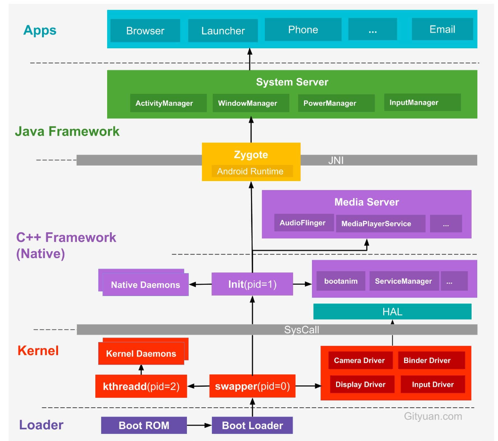
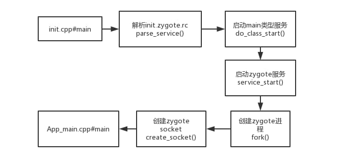
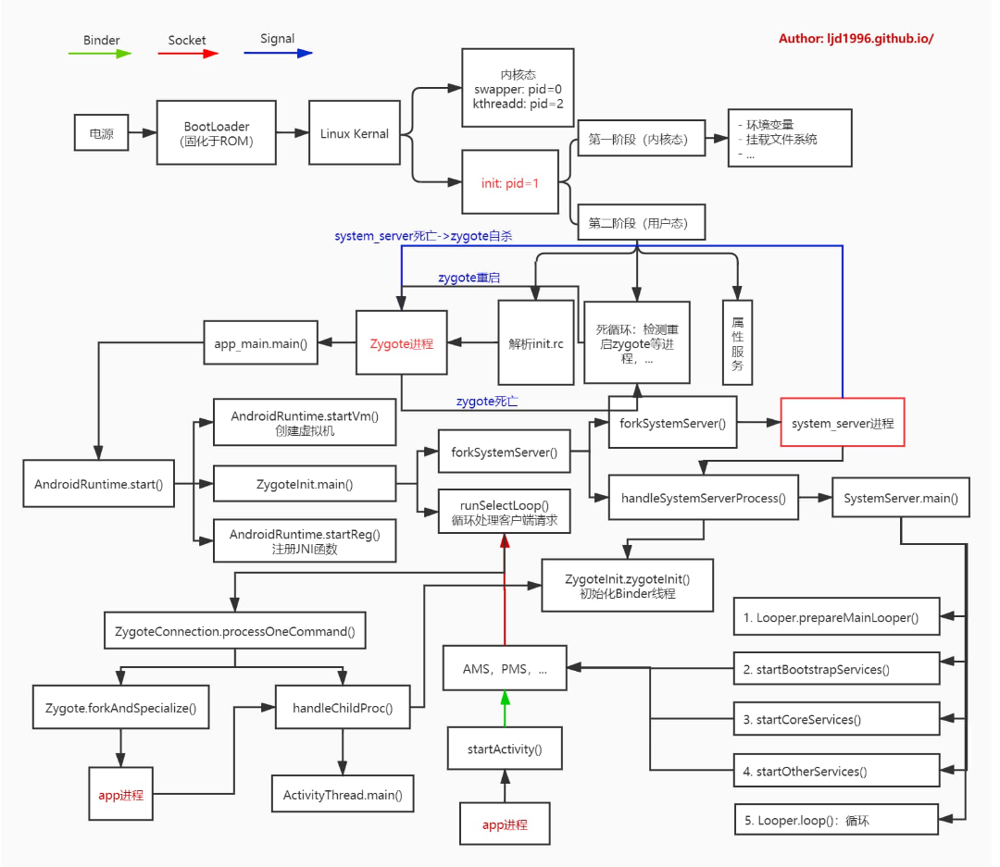

### 环境
Android 9.0
*** 

本文主要分析Android系统在启动之后系统服务之间的关系以及各个关键进程的启动逻辑，Android系统简要启动流程如下(图片来源网络，总结得非常好)：



### 系统启动
当电源按下时引导芯片代码会从预定义的地方（固化在ROM）开始执行，加载引导程序BootLoader到RAM，然后执行。

### 引导程序BootLoader
它是Android操作系统开始运行前的一个小程序，主要将操作系统OS拉起来并进行。

### Linux内核启动
当内核启动时，会设置缓存、加载驱动等。此外，还启动了Kernel的swapper进程(pid = 0)和kthreadd进程(pid = 2)：

*   swapper进程：又称为idle进程，系统初始化过程Kernel由无到有开创的第一个进程, 用于初始化进程管理、内存管理，加载Binder Driver、Display、Camera Driver等相关工作。
*   kthreadd进程：Linux系统的内核进程，是所有内核进程的鼻祖，会创建内核工作线程kworkder，软中断线程ksoftirqd，thermal等内核守护进程。

当内核完成系统设置时，它首先在系统中寻找init.rc文件，并启动init进程。init进程是一个由内核启动的第一个用户级进程，它的进程号是1，父进程id号是0。init进程是所有用户空间的鼻祖, 它会启动servicemanager(binder服务管家，其功能为查询和注册服务), Zygote进程(Java进程的鼻祖). Zygote进程会创建 system_server进程以及各种app进程。

### init进程
####    init.cpp
init进程的入口函数是system/core/init/init.cpp的main函数，它的代码如下所示：
```
int main(int argc, char** argv) {
    add_environment("PATH", _PATH_DEFPATH);

    // 第一阶段：内核态
    // 第二阶段：用户态
    bool is_first_stage = (getenv("INIT_SECOND_STAGE") == nullptr);

    if (is_first_stage) {
        // Clear the umask，与Linux系统权限有关
        umask(0);

        // Get the basic filesystem setup we need put together in the initramdisk
        // on / and then we'll let the rc file figure out the rest.
        mount("tmpfs", "/dev", "tmpfs", MS_NOSUID, "mode=0755");
        mkdir("/dev/pts", 0755);
        // ...

        InitKernelLogging(argv);

        LOG(INFO) << "init first stage started!";

        if (!DoFirstStageMount()) {
            LOG(ERROR) << "Failed to mount required partitions early ...";
            panic();
        }

        // Set up SELinux(Security-Enhanced Linux), loading the SELinux policy.
        selinux_initialize(true);

        // We're in the kernel domain, so re-exec init to transition to the init domain now
        // that the SELinux policy has been loaded.
        // 按selinux policy要求，重新设置init文件属性
        if (restorecon("/init") == -1) {
            // 失败的话会reboot
            PLOG(ERROR) << "restorecon failed";
            security_failure();
        }

        setenv("INIT_SECOND_STAGE", "true", 1);
        setenv("INIT_STARTED_AT", StringPrintf("%" PRIu64, start_ms).c_str(), 1);

        // 再次调用init的main函数，启动用户态的init进程
        char* path = argv[0];
        char* args[] = { path, nullptr };
        execv(path, args);

        // execv() only returns if an error happened, in which case we
        // panic and never fall through this conditional.
        PLOG(ERROR) << "execv(\"" << path << "\") failed";
        security_failure();
    }

    // 第二阶段：用户态
    InitKernelLogging(argv);
    LOG(INFO) << "init second stage started!";

    property_init();  // 初始化属性服务

    // 执行内核命令
    process_kernel_dt();
    process_kernel_cmdline();
    export_kernel_boot_props();

    // 设置属性
    property_set("ro.boottime.init", getenv("INIT_STARTED_AT"));
    property_set("ro.boottime.init.selinux", getenv("INIT_SELINUX_TOOK"));

    // 重置之前使用过的一些环境变量
    unsetenv("INIT_SECOND_STAGE");
    unsetenv("INIT_STARTED_AT");
    unsetenv("INIT_SELINUX_TOOK");
    unsetenv("INIT_AVB_VERSION");

    // Now set up SELinux for second stage.
    selinux_initialize(false);
    selinux_restore_context();

    signal_handler_init();

    // 开启属性服务
    start_property_service();

    // 解析init.rc
    // ...

    while (true) {
        // 默认会休眠直到有事件唤醒
        int epoll_timeout_ms = -1;

        if (!(waiting_for_prop || ServiceManager::GetInstance().IsWaitingForExec())) {
            am.ExecuteOneCommand();
        }
        // 重启一些挂掉的进程，例如Zygote
        if (!(waiting_for_prop || ServiceManager::GetInstance().IsWaitingForExec())) {
            restart_processes();
            // If there's a process that needs restarting, wake up in time for that.
            if (process_needs_restart_at != 0) {
                epoll_timeout_ms = (process_needs_restart_at - time(nullptr)) * 1000;
                if (epoll_timeout_ms < 0) epoll_timeout_ms = 0;
            }

            // If there's more work to do, wake up again immediately.
            if (am.HasMoreCommands()) epoll_timeout_ms = 0;
        }

        epoll_event ev;
        int nr = TEMP_FAILURE_RETRY(epoll_wait(epoll_fd, &ev, 1, epoll_timeout_ms));
        if (nr == -1) {
            PLOG(ERROR) << "epoll_wait failed";
        } else if (nr == 1) {
            ((void (*)()) ev.data.ptr)();
        }
    }

    return 0;
}
```
第一阶段：

*   判断及增加环境变量
*   创建文件系统目录并挂载相关的文件系统
*   重定向输入输出/内核Log系统
*   挂载一些分区设备
*   完成SELinux相关工作
*   is_first_stage 收尾

第二阶段：

*   初始化属性域，清空环境变量
*   完成SELinux相关工作
*   启动属性服务
*   解析init.rc配置文件，执行各个阶段的动作，创建Zygote的工作就是在其中的某个阶段完成的。
*   init进入一个无限循环，并且等待一些事情的发生。
*   下面给出 init.rc 部分内容(Mi Max3–MIUI 10–Android 9)：

```
on early-init
on init
on property:sys.boot_from_charger_mode=1
on load_persist_props_action
on firmware_mounts_complete
on late-init
on post-fs      // mount file system
    start logd
    mount rootfs rootfs / ro remount
    mount rootfs rootfs / shared rec
    mount none /mnt/runtime/default /storage slave bind rec
    // ...
// ...
on post-fs-data  // mount /data/
    // 启动 logd
    start logd
    // 启动 vold, 用于管理Android外部存储介质的后台进程，包括SD卡的插拔等
    start vold
    // ...
// ...
on boot
    // ...
    class_start core
```

#### 启动service
在 init.zygote64_32.rc 文件中：
```
service zygote /system/bin/app_process64 -Xzygote /system/bin --zygote --start-system-server --socket-name=zygote
    class main
    priority -20
    user root
    group root readproc reserved_disk
    socket zygote stream 660 root system
    onrestart write /sys/android_power/request_state wake
    onrestart write /sys/power/state on
    onrestart restart audioserver
    onrestart restart cameraserver
    onrestart restart media
    onrestart restart netd
    onrestart restart wificond
    writepid /dev/cpuset/foreground/tasks

service zygote_secondary /system/bin/app_process32 -Xzygote /system/bin --zygote --socket-name=zygote_secondary --enable-lazy-preload
    class main
    priority -20
    user root
    group root readproc reserved_disk
    socket zygote_secondary stream 660 root system
    onrestart restart zygote
    writepid /dev/cpuset/foreground/tasks
```

通过 init_parser.cpp 完成整个 service 解析工作，此处就不详细展开讲解析过程。

zygote所对应的可执行文件是/system/bin/app_process，通过调用pid = fork()创建子进程，通过execve(svc->args[0], (char**)svc->args, (char**) ENV)，进入app_main.cpp的main()函数。故zygote是通过fork和execv共同创建的。

流程如下：



当init子进程退出时，会产生 SIGCHLD 信号，并发送给init进程，通过socket套接字传递数据，调用到 wait_for_one_process() 方法，根据是否是oneshot，来决定是重启子进程，还是放弃启动。surfaceflinger, servicemanager, zygote 以及 system_server 进程被杀都会触发Zygote重启。

#### 属性服务

我们知道，Windows平台上有一个叫注册表的东西。注册表可以存储一些类似key/value的键值对。一般而言，系统或某些应用程序会把自己的一些属性存储在注册表中，即使下次系统重启或应用程序重启，它还能够根据之前在注册表中设置的属性，进行相应的初始化工作。

Android平台也提供了一个类型机制，可称之为属性服务（property service）。应用程序可通过这个属性机制，查询或设置属性。当某个进程A修改属性值后，init进程会检查访问权限，当权限满足要求后，则更改相应的属性值，属性值一旦改变则会触发相应的触发器(即rc文件中的on开头的语句)，

属性服务初始化：
```
void property_init(void)
{
    init_property_area();//初始化属性存储区域
    //加载default.prop文件
    load_properties_from_file(PROP_PATH_RAMDISK_DEFAULT);
}
```

在 properyty_init 函数中，先调用 init_property_area 函数，创建一块用于存储属性的存储区域(共享内存)，然后加载 default.prop 文件中的内容。

访问方法：

*   Native: property_get/property_set
*   Java: SystemProperties
*   Shell: adb shell getprop
### zygote进程
####    概述

Zygote是由init进程通过解析init.zygote.rc文件而创建的，zygote所对应的可执行程序app_process，所对应的源文件是app_main.cpp，进程名为zygote。

当Zygote进程启动后, 便会执行到frameworks/base/cmds/app_process/app_main.cpp文件的main()方法。整个调用流程:
```
app_main.main
    AndroidRuntime.start
        AndroidRuntime.startVm
        AndroidRuntime.startReg
        ZygoteInit.main (首次进入Java世界)
            registerServerSocketFromEnv
            preload
            forkSystemServer
            runSelectLoop
```

Zygote进程创建Java虚拟机，并注册JNI方法，真正成为Java进程的母体，用于孵化Java进程。在创建完system_server进程后，zygote功成身退，调用runSelectLoop()随时待命，当接收到创建新进程请求时立即唤醒并执行相应工作。Zygote进程共做了如下几件事：

1.  创建AppRuntime并调用其start方法，启动Zygote进程。
2.  创建DVM（ART）并为DVM注册JNI。
3.  通过JNI调用ZygoteInit的main函数进入Zygote的Java框架层。
4.  通过registerServerSocketFromEnv函数创建服务端Socket，并通过runSelectLoop函数等待ActivityManagerService的请求来创建新的应用程序进程。
5.  启动SystemServer进程。

####    app_main.cpp
Zygote本身是一个Native的应用程序，和驱动、内核等均无关系。Zygote是由init进程根据init.rc文件中的配置项而创建的。zygote最初的名字叫“app_process”，这个名字是在Android.mk文件中被指定的，但app_process在运行过程中，通过Linux下的pctrl系统调用将自己的名字换成了“zygote”，所以我们通过ps命令看到的进程名是“zygote”。

zygote的原型app_process所对应的源文件是framework/base/cmds/app_process/app_main.cpp，代码如下所示：

```
int main(int argc, const char* const argv[])
{
    AppRuntime runtime(argv[0], computeArgBlockSize(argc, argv));

    // --zygote : Start in zygote mode
    // --start-system-server : Start the system server.
    // --application : Start in application (stand alone, non zygote) mode.
    // --nice-name : The nice name for this process.
    bool zygote = false;
    bool startSystemServer = false;
    bool application = false;
    String8 niceName;
    String8 className;

    while (i < argc) {
        const char* arg = argv[i++];
        if (strcmp(arg, "--zygote") == 0) {
            zygote = true;
            niceName = ZYGOTE_NICE_NAME;  // zygote64 or zygote
        } else if (strcmp(arg, "--start-system-server") == 0) {
            startSystemServer = true;
        } else if (strcmp(arg, "--application") == 0) {
            application = true;
        } else if (strncmp(arg, "--nice-name=", 12) == 0) {
            niceName.setTo(arg + 12);
        } else if (strncmp(arg, "--", 2) != 0) {
            className.setTo(arg);
            break;
        } else {
            --i;
            break;
        }
    }

    Vector<String8> args;
    if (!className.isEmpty()) {
        // We're not in zygote mode
        // 需要传递给RuntimeInit的唯一参数是application参数，剩余的args传递给启动类main
        args.add(application ? String8("application") : String8("tool"));
        runtime.setClassNameAndArgs(className, argc - i, argv + i);
    } else {
        // We're in zygote mode.
        maybeCreateDalvikCache();

        if (startSystemServer) {
            args.add(String8("start-system-server"));
        }

        char prop[PROP_VALUE_MAX];
        if (property_get(ABI_LIST_PROPERTY, prop, NULL) == 0) {
            LOG_ALWAYS_FATAL("app_process: Unable to determine ABI list from property %s.",
                ABI_LIST_PROPERTY);
            return 11;
        }

        String8 abiFlag("--abi-list=");
        abiFlag.append(prop);
        args.add(abiFlag);

        // In zygote mode, pass all remaining arguments to the zygote
        // main() method.
        for (; i < argc; ++i) {
            args.add(String8(argv[i]));
        }
    }

    if (!niceName.isEmpty()) {
        runtime.setArgv0(niceName.string(), true /* setProcName */);
    }

    if (zygote) {
        runtime.start("com.android.internal.os.ZygoteInit", args, zygote);
    } else if (className) {
        runtime.start("com.android.internal.os.RuntimeInit", args, zygote);
    } else {
        fprintf(stderr, "Error: no class name or --zygote supplied.\n");
        app_usage();
        LOG_ALWAYS_FATAL("app_process: no class name or --zygote supplied.");
    }
}
```
AppRuntime类的声明和实现均在app_main.cpp中，它是从AndroidRuntime类派生出来的，上述start函数使用的是基类AndroidRuntime的start。

####    AndroidRuntime.start
```
// frameworks/base/core/jni/AndroidRuntime.cpp
void AndroidRuntime::start(const char* className, const Vector<String8>& options, bool zygote)
{
    const char* rootDir = getenv("ANDROID_ROOT");
    if (rootDir == NULL) {
        rootDir = "/system";
        if (!hasDir("/system")) {
            LOG_FATAL("No root directory specified, and /android does not exist.");
            return;
        }
        setenv("ANDROID_ROOT", rootDir, 1);
    }

    /* start the virtual machine */
    JniInvocation jni_invocation;
    jni_invocation.Init(NULL);
    JNIEnv* env;
    if (startVm(&mJavaVM, &env, zygote) != 0) {
        return;
    }
    onVmCreated(env);

    // 因为后续Java世界用到的一些函数是采用native方式来实现的，所以必须提前注册这些函数
    if (startReg(env) < 0) {
        ALOGE("Unable to register all android natives\n");
        return;
    }

    // 将参数封装到strArray里

    /*
     * Start VM.  This thread becomes the main thread of the VM, and will
     * not return until the VM exits.
     */
    char* slashClassName = toSlashClassName(className != NULL ? className : "");
    jclass startClass = env->FindClass(slashClassName);
    if (startClass == NULL) {
        ALOGE("JavaVM unable to locate class '%s'\n", slashClassName);
    } else {
        // 找到ZygoteInit类的static main函数的jMethodId
        jmethodID startMeth = env->GetStaticMethodID(startClass, "main",
            "([Ljava/lang/String;)V");
        if (startMeth == NULL) {
            ALOGE("JavaVM unable to find main() in '%s'\n", className);
        } else {
            // 调用ZygoteInit.main函数后，Zygote便进入了Java世界
            env->CallStaticVoidMethod(startClass, startMeth, strArray);
        }
    }
    free(slashClassName);
}
```
####    ZygoteInit.main
CallStaticVoidMethod最终将调用com.android.internal.os.ZygoteInit的main函数，代码如下所示：

```
// frameworks/base/core/java/com/android/internal/os/ZygoteInit.java
public static void main(String argv[]) {
    ZygoteServer zygoteServer = new ZygoteServer();
    try {
        boolean startSystemServer = false;
        String socketName = "zygote";
        String abiList = null;
        boolean enableLazyPreload = false;
        for (int i = 1; i < argv.length; i++) {
            if ("start-system-server".equals(argv[i])) {
                startSystemServer = true;
            } else if ("--enable-lazy-preload".equals(argv[i])) {
                enableLazyPreload = true;
            } else if (argv[i].startsWith(ABI_LIST_ARG)) {
                abiList = argv[i].substring(ABI_LIST_ARG.length());
            } else if (argv[i].startsWith(SOCKET_NAME_ARG)) {
                socketName = argv[i].substring(SOCKET_NAME_ARG.length());
            } else {
                throw new RuntimeException("Unknown command line argument: " + argv[i]);
            }
        }
        // 创建一个Zygote的Socket接口，用来和AMS等通信
        zygoteServer.registerServerSocketFromEnv(socketName);
        if (!enableLazyPreload) {
            // 预加载一些类和资源，这是导致Android系统启动慢的原因之一
            // 应用程序都从Zygote孵化出来，应用程序都会继承Zygote的所有内容，如果在Zygote启动的时候加载这些类和资源，
            // 这些孵化的应用程序就继承Zygote的类和资源，这样启动引用程序的时候就不需要加载类和资源了，启动的速度就会快很多。
            preload(bootTimingsTraceLog);
        }

        // Do an initial gc to clean up after startup
        gcAndFinalize();

        if (startSystemServer) {
            Runnable r = forkSystemServer(abiList, socketName, zygoteServer);
            // 子进程（system_server）
            if (r != null) {
                // 调用com.android.server.SystemServer.main方法
                r.run();
                return;
            }
        }

        Log.i(TAG, "Accepting command socket connections");

        // The select loop returns early in the child process after a fork and
        // loops forever in the zygote.
        caller = zygoteServer.runSelectLoop(abiList);
    } catch (Throwable ex) {
        Log.e(TAG, "System zygote died with exception", ex);
        throw ex;
    } finally {
        zygoteServer.closeServerSocket();
    }

    // We're in the child process and have exited the select loop. Proceed to execute the command.
    if (caller != null) {
        caller.run();
    }
}
```

上面有三个重要的调用：

*   registerServerSocketFromEnv用来创建一个Zygote的Socket接口，用来和AMS等通信
*   forkSystemServer用来fork创建system_server进程；
*   runSelectLoop用来处理客户端连接与请求，包括AMS请求创建app进程。

### system_server进程
####    概述
SyetemServer在启动时做了如下工作：

1.  启动Binder线程池，这样就可以与其他进程进行通信。
2.  创建SystemServiceManager用于对系统的服务进行创建、启动和生命周期管理。
3.  启动各种系统服务。AMS，PMS，以及WMS等都是运行在system_server这个进程中的线程。

####    ZygoteInit.forkSystemServer
在上节中，ZygoteInit.main方法首次进入Java世界，然后调用了forkSystemServer方法创建system_server进程。
```
private static Runnable forkSystemServer(String abiList, String socketName,
        ZygoteServer zygoteServer) {
    /* Hardcoded command line to start the system server */
    String args[] = {
        "--setuid=1000",
        "--setgid=1000",
        "--setgroups=1001,1002,1003,1004,1005,1006,1007,1008,1009,1010,1018,1021,1023,1024,1032,1065,3001,3002,3003,3006,3007,3009,3010",
        "--capabilities=" + capabilities + "," + capabilities,
        "--nice-name=system_server",
        "--runtime-args",
        "--target-sdk-version=" + VMRuntime.SDK_VERSION_CUR_DEVELOPMENT,
        "com.android.server.SystemServer",
    };
    ZygoteConnection.Arguments parsedArgs = null;

    int pid;

    try {
        parsedArgs = new ZygoteConnection.Arguments(args);
        ZygoteConnection.applyDebuggerSystemProperty(parsedArgs);
        ZygoteConnection.applyInvokeWithSystemProperty(parsedArgs);

        boolean profileSystemServer = SystemProperties.getBoolean(
                "dalvik.vm.profilesystemserver", false);
        if (profileSystemServer) {
            parsedArgs.runtimeFlags |= Zygote.PROFILE_SYSTEM_SERVER;
        }

        /* Request to fork the system server process */
        pid = Zygote.forkSystemServer(
                parsedArgs.uid, parsedArgs.gid,
                parsedArgs.gids,
                parsedArgs.runtimeFlags,
                null,
                parsedArgs.permittedCapabilities,
                parsedArgs.effectiveCapabilities);
    } catch (IllegalArgumentException ex) {
        throw new RuntimeException(ex);
    }

    /* For child process */
    if (pid == 0) {
        if (hasSecondZygote(abiList)) {
            waitForSecondaryZygote(socketName);
        }

        zygoteServer.closeServerSocket();
        return handleSystemServerProcess(parsedArgs);
    }

    return null;
}
```
在这里设置了system_server进程的uid，gid和groups，nice-name等，有两个重要的调用：

*   Zygote.forkSystemServer()函数用来fork一个新的进程，如果pid==0，表示已经进入SystemServer子进程，于是先关闭“Zygote”socket，因为系统服务进程system_server也继承了Socket，不用所以close它；

*   调用了handleSystemServerProcess()方法，返回Runnable对象到ZygoteInit.main并调用，其实是调用到了com.android.server.SystemServer.main方法。

####    Zygote.forkSystemServer
首先看看Zygote.forkSystemServer方法，它调用的是nativeForkSystemServer方法：
```
// frameworks/base/core/jni/com_android_internal_os_Zygote.cpp
static jint com_android_internal_os_Zygote_nativeForkSystemServer(
        JNIEnv* env, jclass, uid_t uid, gid_t gid, jintArray gids,
        jint runtime_flags, jobjectArray rlimits, jlong permittedCapabilities,
        jlong effectiveCapabilities) {
    pid_t pid = ForkAndSpecializeCommon(env, uid, gid, gids,
                                        runtime_flags, rlimits,
                                        permittedCapabilities, effectiveCapabilities,
                                        MOUNT_EXTERNAL_DEFAULT, NULL, NULL, true, NULL,
                                        NULL, NULL, NULL);
    if (pid > 0) {
    }
    return pid;
}

static pid_t ForkAndSpecializeCommon(/* ... */) {
    SetSignalHandlers();
    pid_t pid = fork(); // fork子进程
    UnsetChldSignalHandler();
}

static void SetSignalHandlers() {
    struct sigaction sig_chld = {};
    sig_chld.sa_handler = SigChldHandler;

    if (sigaction(SIGCHLD, &sig_chld, NULL) < 0) {
        ALOGW("Error setting SIGCHLD handler: %s", strerror(errno));
    }

    struct sigaction sig_hup = {};
    sig_hup.sa_handler = SIG_IGN;
    if (sigaction(SIGHUP, &sig_hup, NULL) < 0) {
        ALOGW("Error setting SIGHUP handler: %s", strerror(errno));
    }
}

// Sets the SIGCHLD handler back to default behavior in zygote children.
static void UnsetChldSignalHandler() {
    struct sigaction sa;
    memset(&sa, 0, sizeof(sa));
    sa.sa_handler = SIG_DFL;

    if (sigaction(SIGCHLD, &sa, NULL) < 0) {
        ALOGW("Error unsetting SIGCHLD handler: %s", strerror(errno));
    }
}

static void SigChldHandler(int /*signal_number*/) {
    pid_t pid;
    int status;

    while ((pid = waitpid(-1, &status, WNOHANG)) > 0) {
        if (pid == gSystemServerPid) {
            ALOGE("Exit zygote because system server (%d) has terminated", pid);
            kill(getpid(), SIGKILL);
        }
    }
}
```

在ForkAndSpecializeCommon中有个逻辑是如果SystemServer进程停止工作，那么首先通过getpid()来获取Zygote进程的pid，然后调用kill函数杀死它，即SystemServer停止工作之后，Zygote进程自杀，然后在Init进程的main()函数中有一个死循环，如果它的子进程Zygote停止工作，就会去重启子进程。

####    handleSystemServerProcess
```
private static Runnable handleSystemServerProcess(ZygoteConnection.Arguments parsedArgs) {
    ClassLoader cl = createPathClassLoader(systemServerClasspath, parsedArgs.targetSdkVersion);
    Thread.currentThread().setContextClassLoader(cl);
    return ZygoteInit.zygoteInit(parsedArgs.targetSdkVersion, parsedArgs.remainingArgs, cl);
}

public static final Runnable zygoteInit(int targetSdkVersion, String[] argv, ClassLoader classLoader) {
    // 执行Binder驱动程序初始化的相关工作，它调用之后system_server进程就可以进行Binder进程通信
    ZygoteInit.nativeZygoteInit();
    return RuntimeInit.applicationInit(targetSdkVersion, argv, classLoader);
}

// frameworks/base/core/java/com/android/internal/os/RuntimeInit.java
protected static Runnable applicationInit(int targetSdkVersion, String[] argv,
        ClassLoader classLoader) {
    final Arguments args = new Arguments(argv);
    return findStaticMain(args.startClass, args.startArgs, classLoader);
}

// 通过反射获得com.android.server.SystemServer的main方法
protected static Runnable findStaticMain(String className, String[] argv,
        ClassLoader classLoader) {
    Class<?> cl = Class.forName(className, true, classLoader);
    Method m = cl.getMethod("main", new Class[] { String[].class });
    return new MethodAndArgsCaller(m, argv);
}

static class MethodAndArgsCaller implements Runnable {
    /** method to call */
    private final Method mMethod;

    /** argument array */
    private final String[] mArgs;

    public MethodAndArgsCaller(Method method, String[] args) {
        mMethod = method;
        mArgs = args;
    }

    public void run() {
        mMethod.invoke(null, new Object[] { mArgs });
    }
}
```

到这里可以知道ZygoteInit.main方法中的Runnable r = forkSystemServer(abiList, socketName, zygoteServer);返回的r即是MethodAndArgsCaller，在子进程中调用r.run方法便是调用了com.android.server.SystemServer.main方法。

####    SystemServer#main
```
// SystemServer.java
public final class SystemServer {
    ...
    public static void main(String[] args) {
        //先初始化SystemServer对象，再调用对象的run()方法
        new SystemServer().run();
    }
}

private void run() {
    Looper.prepareMainLooper();// 准备主线程looper

    //加载android_servers.so库，该库包含的源码在frameworks/base/services/目录下
    System.loadLibrary("android_servers");

    createSystemContext(); //初始化系统上下文

    //创建系统服务管理
    mSystemServiceManager = new SystemServiceManager(mSystemContext);
    LocalServices.addService(SystemServiceManager.class, mSystemServiceManager);

    //启动各种系统服务
    try {
        startBootstrapServices(); // 启动引导服务
        startCoreServices();      // 启动核心服务
        startOtherServices();     // 启动其他服务
    } catch (Throwable ex) {
        throw ex;
    }

    //一直循环执行
    Looper.loop();
    throw new RuntimeException("Main thread loop unexpectedly exited");
}
```
调用关系：
```
SystemServer.main
    SystemServer.run
        Looper.prepareMainLooper();
        createSystemContext
        startBootstrapServices();
        startCoreServices();
        startOtherServices();
        Looper.loop();
```

LocalServices通过用静态Map变量sLocalServiceObjects，来保存以服务类名为key，以具体服务对象为value的Map结构。

首先看看启动引导服务的方法startBootstrapServices：
```
private void startBootstrapServices() {
    // 阻塞等待与installd建立socket通道
    Installer installer = mSystemServiceManager.startService(Installer.class);

    // In some cases after launching an app we need to access device identifiers,
    // therefore register the device identifier policy before the activity manager.
    mSystemServiceManager.startService(DeviceIdentifiersPolicyService.class);

    mActivityManagerService = mSystemServiceManager.startService(
            ActivityManagerService.Lifecycle.class).getService();
    mActivityManagerService.setSystemServiceManager(mSystemServiceManager);
    mActivityManagerService.setInstaller(installer);

    mPowerManagerService = mSystemServiceManager.startService(PowerManagerService.class);
    mActivityManagerService.initPowerManagement();

    mSystemServiceManager.startService(RecoverySystemService.class);

    // Now that we have the bare essentials of the OS up and running, take
    // note that we just booted, which might send out a rescue party if
    // we're stuck in a runtime restart loop.
    RescueParty.noteBoot(mSystemContext);

    mSystemServiceManager.startService(LightsService.class);

    // Package manager isn't started yet; need to use SysProp not hardware feature
    if (SystemProperties.getBoolean("config.enable_sidekick_graphics", false)) {
        mSystemServiceManager.startService(WEAR_SIDEKICK_SERVICE_CLASS);
    }

    mDisplayManagerService = mSystemServiceManager.startService(DisplayManagerService.class);

    // We need the default display before we can initialize the package manager.
    mSystemServiceManager.startBootPhase(SystemService.PHASE_WAIT_FOR_DEFAULT_DISPLAY);

    // 当设备正在加密时，仅运行core apps
    String cryptState = SystemProperties.get("vold.decrypt");
    if (ENCRYPTING_STATE.equals(cryptState)) {
        Slog.w(TAG, "Detected encryption in progress - only parsing core apps");
        mOnlyCore = true;
    } else if (ENCRYPTED_STATE.equals(cryptState)) {
        Slog.w(TAG, "Device encrypted - only parsing core apps");
        mOnlyCore = true;
    }

    // Start the package manager.
    mPackageManagerService = PackageManagerService.main(mSystemContext, installer,
            mFactoryTestMode != FactoryTest.FACTORY_TEST_OFF, mOnlyCore);
    mFirstBoot = mPackageManagerService.isFirstBoot();
    mPackageManager = mSystemContext.getPackageManager();

    mSystemServiceManager.startService(UserManagerService.LifeCycle.class);

    AttributeCache.init(mSystemContext);

    // Set up the Application instance for the system process and get started.
    mActivityManagerService.setSystemProcess();

    mDisplayManagerService.setupSchedulerPolicies();
    mSystemServiceManager.startService(new OverlayManagerService(mSystemContext, installer));

    // 启动传感器服务
    startSensorService();
```

该方法所创建的服务：ActivityManagerService, PowerManagerService, LightsService, DisplayManagerService， PackageManagerService， UserManagerService， sensor服务等。

然后是启动核心服务startCoreServices：
```
private void startCoreServices() {
    // 启动服务BatteryService，用于统计电池电量，需要LightService.
    mSystemServiceManager.startService(BatteryService.class);

    // 启动服务UsageStatsService，用于统计应用使用情况
    mSystemServiceManager.startService(UsageStatsService.class);
    mActivityManagerService.setUsageStatsManager(
            LocalServices.getService(UsageStatsManagerInternal.class));

    if (mPackageManager.hasSystemFeature(PackageManager.FEATURE_WEBVIEW)) {
        // 启动服务WebViewUpdateService
        mWebViewUpdateService = mSystemServiceManager.startService(WebViewUpdateService.class);
    }

    BinderCallsStatsService.start();
}
```
启动服务BatteryService，UsageStatsService，WebViewUpdateService等。

启动其它服务的startOtherServices方法比较长，主要是启动一系列的服务：
```
private void startOtherServices() {
    // ...
    ServiceManager.addService("sec_key_att_app_id_provider", new KeyAttestationApplicationIdProviderService(context));
    mSystemServiceManager.startService(KeyChainSystemService.class);
    ServiceManager.addService("scheduling_policy", new SchedulingPolicyService());
    mSystemServiceManager.startService(TelecomLoaderService.class);
    telephonyRegistry = new TelephonyRegistry(context);
    ServiceManager.addService("telephony.registry", telephonyRegistry);
    mEntropyMixer = new EntropyMixer(context);

    mContentResolver = context.getContentResolver();

    mSystemServiceManager.startService(ACCOUNT_SERVICE_CLASS);
    mSystemServiceManager.startService(CONTENT_SERVICE_CLASS);

    // 准备好window, power, package, display服务
    wm.systemReady();
    mPowerManagerService.systemReady(...);
    mPackageManagerService.systemReady();
    mDisplayManagerService.systemReady(...);
    mActivityManagerService.systemReady(...);
    // ...
}
```
到此, System_server主线程的启动工作总算完成, 进入Looper.loop()状态，等待其他线程通过handler发送消息到主线再处理。

与system_server进程的Application相关的解析可见：Android-Application。

### app进程
####    AMS发送请求

ActivityManagerService也是由SystemServer创建的。假设通过startActivity来启动一个新的Activity，而这个Activity附属于一个还未启动的进程，则会启动一个新的进程，调用startActivity的进程通过Binder调用到ActivityManagerService中的方法，然后经过层层调用（具体可见Android-Activity启动原理），会调用到Process.start()方法，代码如下所示：
```
public static final ProcessStartResult start(final String processClass,
                                  final String niceName,
                                  int uid, int gid, int[] gids,
                                  int runtimeFlags, int mountExternal,
                                  int targetSdkVersion,
                                  String seInfo,
                                  String abi,
                                  String instructionSet,
                                  String appDataDir,
                                  String invokeWith,
                                  String[] zygoteArgs) {
    return zygoteProcess.start(processClass, niceName, uid, gid, gids,
            runtimeFlags, mountExternal, targetSdkVersion, seInfo,
            abi, instructionSet, appDataDir, invokeWith, zygoteArgs);
}
```
这里的参数processClass为“android.app.ActivityThread”，它是传进去的第一个参数，也就是程序初始化进程时要加载的主文件Java类。当应用进程启动之后，会把这个类加载到进程，调用它的main()方法作为应用程序进程的入口。Process类的start()直接调用了ZygoteProcess类的start()方法，该start()方法调用了ZygoteProcess类的startViaZygote()方法，下面看看该方法实现：
```
private Process.ProcessStartResult startViaZygote(final String processClass, final String niceName,
    final int uid, final int gid, final int[] gids, int runtimeFlags, int mountExternal, 
    int targetSdkVersion, String seInfo, String abi, String instructionSet,String appDataDir, 
    String invokeWith, String[] extraArgs) throws ZygoteStartFailedEx {
    ArrayList<String> argsForZygote = new ArrayList<String>();
    argsForZygote.add("--runtime-args");
    argsForZygote.add("--setuid=" + uid);
    argsForZygote.add("--setgid=" + gid);
    // ......
    synchronized(mLock) {
        return zygoteSendArgsAndGetResult(openZygoteSocketIfNeeded(abi), argsForZygote);
    }
}
```

首先给它设置值，包括uid、gid等。接着调用openZygoteSocketIfNeeded()方法来连接“zygote”Socket，链接Socket成功之后，就会调用zygoteSendArgsAndGetResult()方法来进一步处理。

先来看看openZygoteSocketIfNeeded()方法：
```
private ZygoteState openZygoteSocketIfNeeded(String abi) throws ZygoteStartFailedEx {
    if (primaryZygoteState == null || primaryZygoteState.isClosed()) {
        try {
            primaryZygoteState = ZygoteState.connect(mSocket);
        }
}
```
方法中的mSocket的值是“zygote”，通过connect()方法去连接“zygote”Socket。接着看看zygoteSendArgsAndGetResult()方法：

```
private static Process.ProcessStartResult zygoteSendArgsAndGetResult(
        ZygoteState zygoteState, ArrayList<String> args)
        throws ZygoteStartFailedEx {
    try {
        final BufferedWriter writer = zygoteState.writer;
        final DataInputStream inputStream = zygoteState.inputStream;
        writer.write(Integer.toString(args.size()));
        writer.newLine();
        for (int i = 0; i < sz; i++) {
            String arg = args.get(i);
            writer.write(arg);
            writer.newLine();
        }
        writer.flush();
}
```
通过Socket写入流writer把前面传过来的那些参数写进去，Socket即ZygoteServer类的runSelectLoop()方法监听。写入这些数据之后，ZygoteServer类的runSelectLoop()方法就能被监听到。

####    响应请求
```
void setForkChild() {
    mIsForkChild = true;
}

Runnable runSelectLoop(String abiList) {
    ArrayList<FileDescriptor> fds = new ArrayList<FileDescriptor>();
    ArrayList<ZygoteConnection> peers = new ArrayList<ZygoteConnection>();

    fds.add(mServerSocket.getFileDescriptor());
    peers.add(null);

    while (true) {
        StructPollfd[] pollFds = new StructPollfd[fds.size()];
        for (int i = 0; i < pollFds.length; ++i) {
            pollFds[i] = new StructPollfd();
            pollFds[i].fd = fds.get(i);
            pollFds[i].events = (short) POLLIN;
        }
        try {
            Os.poll(pollFds, -1);
        } catch (ErrnoException ex) {
            throw new RuntimeException("poll failed", ex);
        }
        for (int i = pollFds.length - 1; i >= 0; --i) {
            if ((pollFds[i].revents & POLLIN) == 0) {
                continue;
            }

            if (i == 0) {
                ZygoteConnection newPeer = acceptCommandPeer(abiList);
                peers.add(newPeer);
                fds.add(newPeer.getFileDesciptor());
            } else {
                try {
                    ZygoteConnection connection = peers.get(i);
                    final Runnable command = connection.processOneCommand(this);
                    // 通过mIsForkChild变量控制父进程接着死循环/子进程返回command
                    if (mIsForkChild) {
                        // We're in the child. We should always have a command to run at this
                        // stage if processOneCommand hasn't called "exec".
                        if (command == null) {
                            throw new IllegalStateException("command == null");
                        }

                        return command;
                    } else {
                        // We're in the server - we should never have any commands to run.
                        if (command != null) {
                            throw new IllegalStateException("command != null");
                        }

                        if (connection.isClosedByPeer()) {
                            connection.closeSocket();
                            peers.remove(i);
                            fds.remove(i);
                        }
                    }
                } catch (Exception e) {
                    if (!mIsForkChild) {
                        ZygoteConnection conn = peers.remove(i);
                        conn.closeSocket();
                        fds.remove(i);
                    } else {

                        throw e;
                    }
                } finally {
                    mIsForkChild = false;
                }
            }
        }
    }
}
```
进入ZygoteConnection类的processOneCommand()方法后：
```
Runnable processOneCommand(ZygoteServer zygoteServer) {
    pid = Zygote.forkAndSpecialize(parsedArgs.uid, parsedArgs.gid, parsedArgs.gids,
            parsedArgs.runtimeFlags, rlimits, parsedArgs.mountExternal, parsedArgs.seInfo,
            parsedArgs.niceName, fdsToClose, fdsToIgnore, parsedArgs.instructionSet,
            parsedArgs.appDataDir);
    try {
        if (pid == 0) {
            // in child
            zygoteServer.setForkChild();
            zygoteServer.closeServerSocket();
            IoUtils.closeQuietly(serverPipeFd);
            serverPipeFd = null;
            return handleChildProc(parsedArgs, descriptors, childPipeFd);
        }
    }
}
```
*   此处通过Zygote.forkAndSpecialize()来fork新的应用进程，而启动systemserver进程是通过Zygote.forkSystemServer()来fork SystemServer进程。

*   此处通过handleChildProc()方法处理，而之前是用handleSystemServerProcess()来处理。
通过fork新的应用程序进程之后，返回pid等于0就表示进入子进程，于是调用handleChildProc()方法进一步处理：
```
private Runnable handleChildProc(Arguments parsedArgs, FileDescriptor[] descriptors,FileDescriptor pipeFd) {
    // ZygoteInit.zygoteInit中会创建Binder线程池，
    // 也就是说每个进程无论是否包含任何activity等组件，一定至少会包含一个Binder线程
    return ZygoteInit.zygoteInit(parsedArgs.targetSdkVersion, parsedArgs.remainingArgs,null /* classLoader */);
}
```

到此处，后面便和上面一样的了，唯一不同的是，SystemServer进程启动之后进入的是主类SystemServer.java的main()函数，而这里应用程序启动起来后进入的是主类是ActivityThread.java的main()函数，进入ActivityThread.main()方法后，会创建Application实例，具体可见：Android-Application。

接下来就只剩下forkAndSpecialize方法的解析了：
```
public static int forkAndSpecialize(int uid, int gid, int[] gids, int runtimeFlags,
        int[][] rlimits, int mountExternal, String seInfo, String niceName, int[] fdsToClose,
        int[] fdsToIgnore, boolean startChildZygote, String instructionSet, String appDataDir) {
    // 停止Zygote的4个Daemon子线程的运行，等待并确保Zygote是单线程（用于提升fork效率），
    // 并等待这些线程的停止，初始化gc堆的工作
    VM_HOOKS.preFork();
    // Resets nice priority for zygote process.
    resetNicePriority();
    // 调用fork()创建新进程，设置新进程的主线程id，重置gc性能数据，设置信号处理函数
    int pid = nativeForkAndSpecialize(
                uid, gid, gids, runtimeFlags, rlimits, mountExternal, seInfo, niceName, fdsToClose,
                fdsToIgnore, startChildZygote, instructionSet, appDataDir);
    // 在fork新进程后，启动Zygote的4个Daemon线程，java堆整理等。
    VM_HOOKS.postForkCommon();
    return pid;
}
```
nativeForkAndSpecialize()方法是一个Native方法，最终调用的是frameworks/base/core/jni/com_android_internal_os_Zygote.cpp#com_android_internal_os_Zygote_nativeForkAndSpecialize()方法，该方法又调用的是ForkAndSpecializeCommon方法：
```
static const char kZygoteClassName[] = "com/android/internal/os/Zygote";

int register_com_android_internal_os_Zygote(JNIEnv* env) {
    gZygoteClass = MakeGlobalRefOrDie(env, FindClassOrDie(env, kZygoteClassName));
    gCallPostForkChildHooks = GetStaticMethodIDOrDie(env, gZygoteClass, "callPostForkChildHooks", "(IZZLjava/lang/String;)V");
    return RegisterMethodsOrDie(env, "com/android/internal/os/Zygote", gMethods, NELEM(gMethods));
}

static void SetSignalHandlers() {
    struct sigaction sig_chld = {};
    sig_chld.sa_handler = SigChldHandler;
}

// Sets the SIGCHLD handler back to default behavior in zygote children.
static void UnsetChldSignalHandler() {
    struct sigaction sa;
    memset(&sa, 0, sizeof(sa));
    sa.sa_handler = SIG_DFL;
}

static void SigChldHandler(int /*signal_number*/) {
    while ((pid = waitpid(-1, &status, WNOHANG)) > 0) {
        // If the just-crashed process is the system_server, bring down zygote
        // so that it is restarted by init and system server will be restarted
        // from there.
        if (pid == gSystemServerPid) {
            ALOGE("Exit zygote because system server (%d) has terminated", pid);
            kill(getpid(), SIGKILL);
        }
    }
}

static pid_t ForkAndSpecializeCommon(JNIEnv* env, uid_t uid, gid_t gid, jintArray javaGids, jint runtime_flags, 
    jobjectArray javaRlimits, jlong permittedCapabilities, jlong effectiveCapabilities,
    jint mount_external, jstring java_se_info, jstring java_se_name,
    bool is_system_server, jintArray fdsToClose, jintArray fdsToIgnore,
    bool is_child_zygote, jstring instructionSet, jstring dataDir) {
    // 设置子进程的signal信号处理函数
    SetSignalHandlers();

    pid_t pid = fork();

    if (pid == 0) {
        PreApplicationInit();

        // 清理所有必须立即关闭的描述符
        if (!DetachDescriptors(env, fdsToClose, &error_msg)) {
            fail_fn(error_msg);
        }
        // Re-open all remaining open file descriptors so that they aren't shared
        // with the zygote across a fork.
        if (!gOpenFdTable->ReopenOrDetach(&error_msg)) {
            fail_fn(error_msg);
        }
        MountEmulatedStorage(uid, mount_external, use_native_bridge, &error_msg);

        // If this zygote isn't root, it won't be able to create a process group,
        // since the directory is owned by root.
        if (!is_system_server && getuid() == 0) {
            int rc = createProcessGroup(uid, getpid());
        }
        // selinux上下文
        rc = selinux_android_setcontext(uid, is_system_server, se_info_c_str, se_name_c_str);

        if (se_name_c_str == NULL && is_system_server) {
            se_name_c_str = "system_server";
        }
        if (se_name_c_str != NULL) {
            SetThreadName(se_name_c_str);
        }

        // Unset the SIGCHLD handler, but keep ignoring SIGHUP (rationale in SetSignalHandlers).
        UnsetChldSignalHandler();
        // 等价于调用zygote.callPostForkChildHooks()
        env->CallStaticVoidMethod(gZygoteClass, gCallPostForkChildHooks, runtime_flags,
                                is_system_server, is_child_zygote, instructionSet);
    }
    return pid;
}
```

接着进入zygote.callPostForkChildHooks()方法：
```
private static void callPostForkChildHooks(int runtimeFlags, boolean isSystemServer,
        boolean isZygote, String instructionSet) {
    // 调用ZygoteHooks.postForkChild()
    VM_HOOKS.postForkChild(runtimeFlags, isSystemServer, isZygote, instructionSet);
}

// ZygoteHooks.java
public void postForkChild(int runtimeFlags, boolean isSystemServer, boolean isZygote,
        String instructionSet) {
    nativePostForkChild(token, runtimeFlags, isSystemServer, isZygote, instructionSet);
    // 设置了新进程Random随机数种子为当前系统时间，也就是在进程创建的那一刻就决定了未来随机数的情况，也就是伪随机。
    Math.setRandomSeedInternal(System.currentTimeMillis());
}
```

nativePostForkChild通过JNI最终调用调用如下方法：art/runtime/native/dalvik_system_ZygoteHooks.cc#ZygoteHooks_nativePostForkChild()：
```
static void ZygoteHooks_nativePostForkChild(JNIEnv* env, jclass, jlong token, jint debug_flags, jstring instruction_set) {
    // 此处token记录着当前线程
    Thread* thread = reinterpret_cast<Thread*>(token);
    // 设置新进程的主线程id
    thread->InitAfterFork();
    if (instruction_set != nullptr && !is_system_server) {
        ScopedUtfChars isa_string(env, instruction_set);
        InstructionSet isa = GetInstructionSetFromString(isa_string.c_str());
        Runtime::NativeBridgeAction action = Runtime::NativeBridgeAction::kUnload;
        if (isa != InstructionSet::kNone && isa != kRuntimeISA) {
            action = Runtime::NativeBridgeAction::kInitialize;
        }
        Runtime::Current()->InitNonZygoteOrPostFork(env, is_system_server, action, isa_string.c_str());
    } else {
        Runtime::Current()->InitNonZygoteOrPostFork(env, is_system_server,
            Runtime::NativeBridgeAction::kUnload, nullptr, profile_system_server);
    }
}
```
接着调用了art/runtime/runtime.cc#InitNonZygoteOrPostFork方法：
```
void Runtime::InitNonZygoteOrPostFork(JNIEnv* env, bool is_system_server,
    NativeBridgeAction action, const char* isa, bool profile_system_server) {
    is_zygote_ = false;

    if (is_native_bridge_loaded_) {
        switch (action) {
            case NativeBridgeAction::kUnload:
                UnloadNativeBridge(); // 卸载用于跨平台的桥连库
                is_native_bridge_loaded_ = false;
                break;

            case NativeBridgeAction::kInitialize:
                InitializeNativeBridge(env, isa); // 初始化用于跨平台的桥连库
                break;
        }
    }

    // 创建Java堆处理的线程池
    heap_->CreateThreadPool();
    // 重置gc性能数据，以保证进程在创建之前的GCs不会计算到当前app上。
    heap_->ResetGcPerformanceInfo();

    if (!safe_mode_ && (jit_options_->UseJitCompilation() || jit_options_->GetSaveProfilingInfo()) && jit_ == nullptr) {
        // 创建JIT
        CreateJit();
    }
    // 设置信号处理函数
    StartSignalCatcher();
}
```
### 总结
init进程(pid=1)是Linux系统中用户空间的第一个进程，主要工作如下：

*   初始化环境变量及挂载文件;
*   解析并执行init.rc文件;
*   处理子进程的退出(signal方式);
*   创建一块共享的内存空间用于属性服务器，并启动属性服务进程;
*   进入无限循环状态，执行如下流程：
    *   检查是否需要重启的进程，若有则将其重新启动;
    *   进入等待状态，直到系统属性变化事件(property_set改变属性值)，或者收到子进程的信号SIGCHLD，或者keychord 键盘输入事件等，则会退出等待状态，执行相应的回调函数。

可见init进程在开机之后的核心工作就是响应property变化事件和回收僵尸进程以及重启进程。

*   当某个进程改变了一个系统属性值时，系统会通过socket向init进程发送一个property变化的事件通知，那么init进程会触发相关回调。

*   回收僵尸进程，在Linux内核中，如父进程不等待子进程的结束直接退出，会导致子进程在结束后变成僵尸进程，占用系统资源。为此，init进程专门安装了SIGCHLD信号接收器，当某些子进程退出时发现其父进程已经退出，则会向init进程发送SIGCHLD信号，init进程回收僵尸子进程。

Zygote启动过程的调用流程：

*   解析init.zygote.rc中的参数，创建AppRuntime并调用AppRuntime.start()方法；
*   调用AndroidRuntime的startVM()方法创建虚拟机，再调用startReg()注册JNI函数；
*   通过JNI方式调用ZygoteInit.main()，第一次进入Java世界；
*   registerServerSocketFromEnv()方法建立socket通道，zygote作为通信的服务端，用于响应客户端请求；
*   preload()预加载通用类、相关资源，共享库等，用于提高app启动效率；
*   接下来再通过startSystemServer()，fork出system_server进程，也是上层framework的运行载体；
*   zygote调用runSelectLoop()方法等待，当接收到创建新进程请求时唤醒并执行相应工作。

zygote预加载了一些资源，通过它来 fork system_server 进程，则 system_server 可以直接使用这些加载好的资源如 JNI 函数，常用的方法，共享库，资源等。此外，选择使用 zygote 进程来 fork 应用程序而不是使用 system_server 来 fork 是因为 system_server 有自己的工作要处理，其内有许多线程如 AMS, WMS, PKMS 等，这种多线程的父进程 fork 子进程可能会导致死锁。

在 Linux 系统中 fork 子进程会复制父进程用户空间的数据到子进程(copy-on-write)，然后复制当前线程到子进程，而父进程中的其它线程在子进程中都”蒸发”了。如果在fork之前，一个线程持有了某个锁，然后另外一个线程调用了fork创建子进程，在子进程中持有那个锁的线程却”蒸发”了，从子进程的角度来看，这个锁被“永久”的上锁了，因为它的持有者“蒸发”了。如果子进程中的任何一个线程对这个已经被持有的锁进行lock操作，就会发生死锁。

将整个流程总结为下图：




### 细节补充

* Zygote的跨进程通信没有使用binder，而是socket，所以应用程序进程的binder机制不是继承而来，而是进程创建后自己启动的。
* Zygote跨进程通信之所以用socket而不是binder，是因为binder通信是多线程的，而Zygote需要在单线程状态下fork子进程来避免死锁问题。
* PMS、AMS等系统服务启动后会调用ServiceManager.addService()注册，然后运行在自己的工作线程。

***
https://ljd1996.github.io/2019/10/21/Android-init-zygote/
***