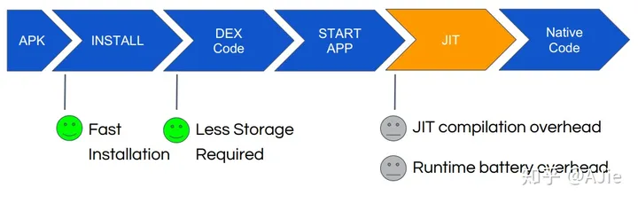

### Android 诞生之初
在 Android 系统初期，不同于 Java 平台使用 JVM 加载字节码文件(.class)，Android 系统由 Dalvik 担任虚拟机的角色，每次运行程序的时候，Dalvik 负责加载 dex/odex 文件并解析成机器码交由系统调用。

### Android 2.2 —— JIT 首次登场
为了适应硬件速度的提升，Android 系统系统也在不断更新，单一的 Dalvik 虚拟机已经渐渐地满足系统的要求了，2010 年 5 月 20 日，Google 发布 Android 2.2（Froyo冻酸奶），在这个版本中，Google 在 Android 虚拟中加入了 JIT 编译器（Just-In-Time Compiler）。

和其他大多数 JVM 一样，Dalvik 使用 JIT 进行即时编译，借助 Java HotSpot VM，JIT 编译器可以对执行次数频繁的 dex/odex 代码进行编译与优化，将 dex/odex 中的 Dalvik Code（Smali 指令集）翻译成相当精简的 Native Code 去执行，JIT 的引入使得 Dalvik 的性能提升了 3~6 倍。

但是 JIT 模式的缺点也不容忽视： - 每次启动应用都需要重新编译 - 运行时比较耗电，造成电池额外的开销

### Andorid 4.4 —— ART 和 AOT
2013 年 10 月 31 日，Google 发布 Android 4.4（奇巧Kitkat）,带来了全新的虚拟机运行环境 ART（Android RunTime）的预览版和全新的编译策略 AOT（Ahead-of-time），需要注意的是，彼时 ART 是和 Dalvik 共存的，用户可以在两者之间进行选择（感觉怪怪的，用户可是小透明啊）。

Android 5.0 —— ART 全面取代 Dalvik  
2014 年 10 月 16 日，Google 发布 Android 5.0（棒棒糖Lollipop），ART 全面取代 Dalvik 成为 Android 虚拟机运行环境，至此，Dalvik 退出历史舞台，AOT 也成为唯一的编译模式。

AOT 和 JIT 的不同之处在于：JIT 是在运行时进行编译，是动态编译，并且每次运行程序的时候都需要对 odex 重新进行编译；而 AOT 是静态编译，应用在安装的时候会启动 dex2oat 过程把 dex 预编译成 ELF 文件，每次运行程序的时候不用重新编译，是真正意义上的本地应用。

另外，相比于 Dalvik，ART 对 Garbage Collection（GC）过程的也进行了改进：

只有一次 GC 暂停（Dalvik 需要两次）
在 GC 保持暂停状态期间并行处理
在清理最近分配的短时对象这种特殊情况中，回收器的总 GC 时间更短
优化了垃圾回收的工效，能够更加及时地进行并行垃圾回收，这使得 GC_FOR_ALLOC 事件在典型用例中极为罕见
压缩 GC 以减少后台内存使用和碎片
AOT 模式解决了应用启动和运行速度和耗电问题的同时也带来了另外两个问题： - 应用安装和系统升级之后的应用优化比较耗时 - 优化后的文件会占用额外的存储空间

这也给 Android 系统后续的优化埋下了伏笔。

### Android 7.0 —— JIT 回归
用过 Android 手机的人应该都知道，在 Android 5.x 和 6.x 的机器上，系统每次 OTA 升级完成重启的时候都会有个应用优化的过程，这个过程就是刚才所说的 dex2oat 过程，这个过程比较耗时并且会占用额外的存储空间。

2016 年 8 月 22 日，Google 发布 Android 7.0（牛轧糖Nougat），JIT 编译器回归，形成 AOT/JIT 混合编译模式，这种混合编译模式的特点是：

应用在安装的时候 dex 不会被编译
应用在运行时 dex 文件先通过解析器（Interpreter）后会被直接执行（这一步骤跟 Android 2.2 - Android 4.4之前的行为一致），与此同时，热点函数（Hot Code）会被识别并被 JIT 编译后存储在 jit code cache 中并生成 profile 文件以记录热点函数的信息。
手机进入 IDLE（空闲） 或者 Charging（充电） 状态的时候，系统会扫描 App 目录下的 profile 文件并执行 AOT 过程进行编译。
可以看出，混合编译模式综合了 AOT 和 JIT 的各种优点，使得应用在安装速度加快的同时，运行速度、存储空间和耗电量等指标都得到了优化。

***
https://zhuanlan.zhihu.com/p/146863957
***