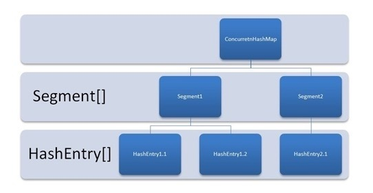
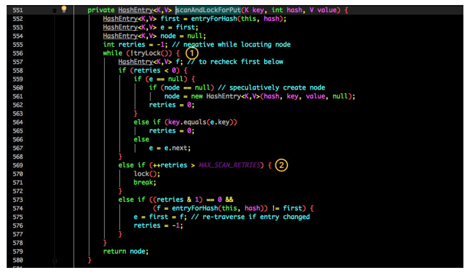
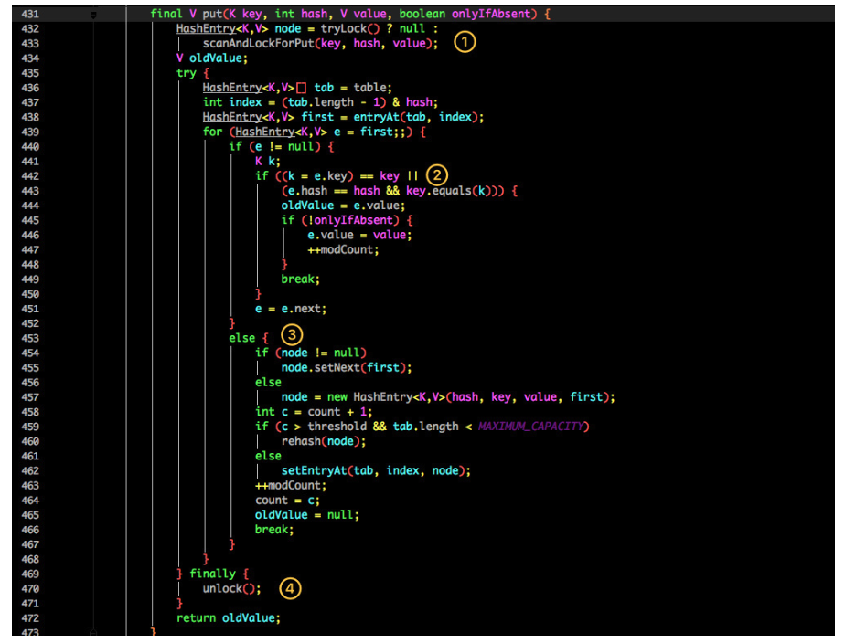
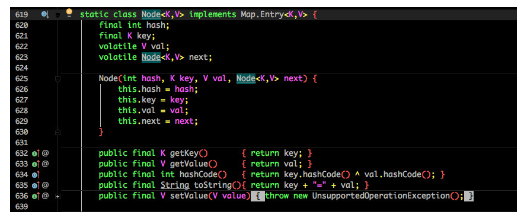
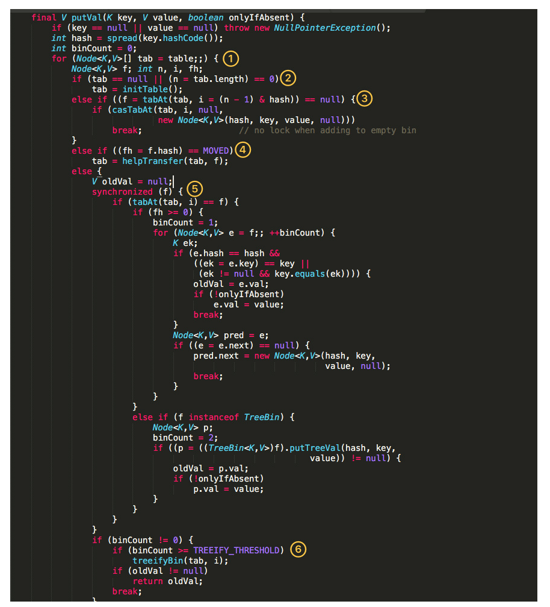

ConcurrentHashMap 同样也分为 1.7 、1.8 版，两者在实现上略有不同。

### Base 1.7
先来看看 1.7 的实现，下面是他的结构图：



如图所示，是由 Segment 数组、HashEntry 组成，和 HashMap 一样，仍然是数组加链表。

它的核心成员变量：

```
/**
 * Segment 数组，存放数据时首先需要定位到具体的 Segment 中。
 */
final Segment<K,V>[] segments;

transient Set<K> keySet;
transient Set<Map.Entry<K,V>> entrySet;
```

Segment 是 ConcurrentHashMap 的一个内部类，主要的组成如下：

```
   static final class Segment<K,V> extends ReentrantLock implements Serializable {

       private static final long serialVersionUID = 2249069246763182397L;
       
       // 和 HashMap 中的 HashEntry 作用一样，真正存放数据的桶
       transient volatile HashEntry<K,V>[] table;

       transient int count;

       transient int modCount;

       transient int threshold;

       final float loadFactor;
       
}
```

看看其中 HashEntry 的组成：


和 HashMap 非常类似，唯一的区别就是其中的核心数据如 value ，以及链表都是 volatile 修饰的，保证了获取时的可见性。

原理上来说：ConcurrentHashMap 采用了分段锁技术，其中 Segment 继承于 ReentrantLock。不会像 HashTable 那样不管是 put 还是 get 操作都需要做同步处理，理论上 ConcurrentHashMap 支持 CurrencyLevel (Segment 数组数量)的线程并发。每当一个线程占用锁访问一个 Segment 时，不会影响到其他的 Segment。

下面也来看看核心的 put get 方法。

####    put 方法

```
public V put(K key, V value) {
    Segment<K,V> s;
    if (value == null)
        throw new NullPointerException();
    int hash = hash(key);
    int j = (hash >>> segmentShift) & segmentMask;
    if ((s = (Segment<K,V>)UNSAFE.getObject          // nonvolatile; recheck
         (segments, (j << SSHIFT) + SBASE)) == null) //  in ensureSegment
        s = ensureSegment(j);
    return s.put(key, hash, value, false);
}
```

首先是通过 key 定位到 Segment，之后在对应的 Segment 中进行具体的 put。

```
final V put(K key, int hash, V value, boolean onlyIfAbsent) {
    HashEntry<K,V> node = tryLock() ? null :
        scanAndLockForPut(key, hash, value);
    V oldValue;
    try {
        HashEntry<K,V>[] tab = table;
        int index = (tab.length - 1) & hash;
        HashEntry<K,V> first = entryAt(tab, index);
        for (HashEntry<K,V> e = first;;) {
            if (e != null) {
                K k;
                if ((k = e.key) == key ||
                    (e.hash == hash && key.equals(k))) {
                    oldValue = e.value;
                    if (!onlyIfAbsent) {
                        e.value = value;
                        ++modCount;
                    }
                    break;
                }
                e = e.next;
            }
            else {
                if (node != null)
                    node.setNext(first);
                else
                    node = new HashEntry<K,V>(hash, key, value, first);
                int c = count + 1;
                if (c > threshold && tab.length < MAXIMUM_CAPACITY)
                    rehash(node);
                else
                    setEntryAt(tab, index, node);
                ++modCount;
                count = c;
                oldValue = null;
                break;
            }
        }
    } finally {
        unlock();
    }
    return oldValue;
}
```

虽然 HashEntry 中的 value 是用 volatile 关键词修饰的，但是并不能保证并发的原子性，所以 put 操作时仍然需要加锁处理。

首先第一步的时候会尝试获取锁，如果获取失败肯定就有其他线程存在竞争，则利用 scanAndLockForPut() 自旋获取锁。



1.  尝试自旋获取锁。
2.  如果重试的次数达到了 MAX_SCAN_RETRIES 则改为阻塞锁获取，保证能获取成功。



再结合图看看 put 的流程。

1.  将当前 Segment 中的 table 通过 key 的 hashcode 定位到 HashEntry。
2.  遍历该 HashEntry，如果不为空则判断传入的 key 和当前遍历的 key 是否相等，相等则覆盖旧的 value。
3.  不为空则需要新建一个 HashEntry 并加入到 Segment 中，同时会先判断是否需要扩容。
4.  最后会解除在 1 中所获取当前 Segment 的锁。

####    get 方法

```
public V get(Object key) {
    Segment<K,V> s; // manually integrate access methods to reduce overhead
    HashEntry<K,V>[] tab;
    int h = hash(key);
    long u = (((h >>> segmentShift) & segmentMask) << SSHIFT) + SBASE;
    if ((s = (Segment<K,V>)UNSAFE.getObjectVolatile(segments, u)) != null &&
        (tab = s.table) != null) {
        for (HashEntry<K,V> e = (HashEntry<K,V>) UNSAFE.getObjectVolatile
                 (tab, ((long)(((tab.length - 1) & h)) << TSHIFT) + TBASE);
             e != null; e = e.next) {
            K k;
            if ((k = e.key) == key || (e.hash == h && key.equals(k)))
                return e.value;
        }
    }
    return null;
}
```

get 逻辑比较简单：

只需要将 Key 通过 Hash 之后定位到具体的 Segment ，再通过一次 Hash 定位到具体的元素上。

由于 HashEntry 中的 value 属性是用 volatile 关键词修饰的，保证了内存可见性，所以每次获取时都是最新值。

ConcurrentHashMap 的 get 方法是非常高效的，因为整个过程都不需要加锁。

####    Base 1.8

1.7 已经解决了并发问题，并且能支持 N 个 Segment 这么多次数的并发，但依然存在 HashMap 在 1.7 版本中的问题。

    那就是查询遍历链表效率太低。

因此 1.8 做了一些数据结构上的调整。

首先来看下底层的组成结构：


看起来是不是和 1.8 HashMap 结构类似？

其中抛弃了原有的 Segment 分段锁，而采用了 CAS + synchronized 来保证并发安全性。



也将 1.7 中存放数据的 HashEntry 改为 Node，但作用都是相同的。

其中的 val next 都用了 volatile 修饰，保证了可见性。

####    put 方法

重点来看看 put 函数：



*   根据 key 计算出 hashcode 。
*   判断是否需要进行初始化。
*   f 即为当前 key 定位出的 Node，如果为空表示当前位置可以写入数据，利用 CAS 尝试写入，失败则自旋保证成功。
*   如果当前位置的 hashcode == MOVED == -1,则需要进行扩容。
*   如果都不满足，则利用 synchronized 锁写入数据。
*   如果数量大于 TREEIFY_THRESHOLD 则要转换为红黑树。

####    get 方法


*   根据计算出来的 hashcode 寻址，如果就在桶上那么直接返回值。
*   如果是红黑树那就按照树的方式获取值。
*   就不满足那就按照链表的方式遍历获取值。

    1.8 在 1.7 的数据结构上做了大的改动，采用红黑树之后可以保证查询效率（O(logn)），甚至取消了 ReentrantLock 改为了 synchronized，这样可以看出在新版的 JDK 中对 synchronized 优化是很到位的。

### 总结

看完了整个 HashMap 和 ConcurrentHashMap 在 1.7 和 1.8 中不同的实现方式相信大家对他们的理解应该会更加到位。

其实这块也是面试的重点内容，通常的套路是：

1.  谈谈你理解的 HashMap，讲讲其中的 get put 过程。
2.  1.8 做了什么优化？
3.  是线程安全的嘛？
4.  不安全会导致哪些问题？
5.  如何解决？有没有线程安全的并发容器？
6.  ConcurrentHashMap 是如何实现的？ 1.7、1.8 实现有何不同？为什么这么做？

***
https://crossoverjie.top/2018/07/23/java-senior/ConcurrentHashMap/#ConcurrentHashMap
***