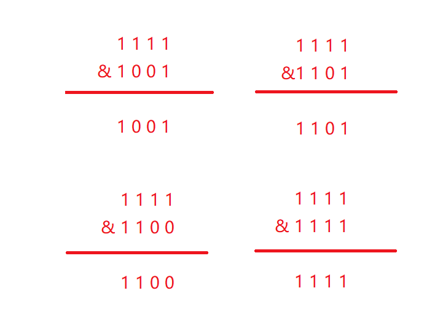

***
HashMap扩容为什么是2的n次幂?
***

首先先看一下HashMap中的putVal方法(存值的)和resize方法(扩容的)，之所以HashMap扩容是2的n次幂和这两个方法有千丝万缕的联系。

通过putVal方法可以看出来HashMap在存值时会先把key的hash值和扩容后的长度进行一次按位与运算，其中hash是在hash方法中把key进行计算后的出来的结果，n是扩容的长度（也就是数组的长度，默认为16），然后判断是否hash碰撞在进行不同的存储。如下图源码所示。

通过resize方法可以看出来扩容时会新建一个tab，然后遍历旧的tab，将旧的元素进行e.hash & (newCap - 1)的计算添加进新的tab中，也就是(n - 1) & hash的计算方法，其中n是集合的容量，hash是添加的元素经过hash函数计算出来的hash值。如下图源码所示。

之所以这样2n扩容和上面的两个方法有极大的关系，首先他们都使用了按位与运算，按位与运算就是把值先变成二进制然后进行运算，如果有0则为0，都为1时则输出为1，HashMap默认容量为16那么在存放到数组时就是n-1也就是15，而15二进制则是1111扩容后为32-1及11111111

，如果都为1的情况下是可以极大的减少hash碰撞，增加效率的。

通过下面例子来看一下当容量为11111111时按位与运算的结果，通过下面的结果可以看出来结果很分散，大大减少了hash碰撞的发生。

 再看一下当容量不为11111111而是为其他值的时候，通过下面的结果可以看出，1、2、4跟不同的值进行hash运算但是结果却是相同的，也就是发生了hash碰撞。

 通过上面的对比可以看出来11111111和其他值

**比较大大的减少了hash碰撞的发生，这样就是为什么HashMap为什么扩容采用2的n次幂的原因。**

***
https://cloud.tencent.com/developer/article/old/1708658
***