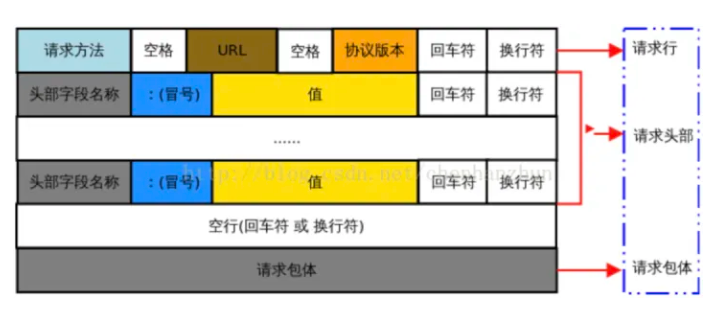
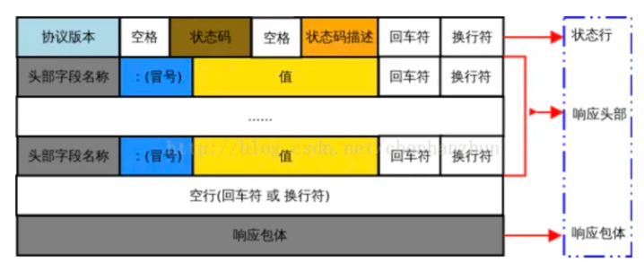
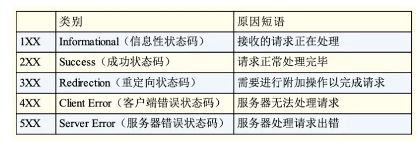
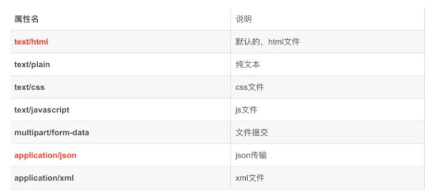
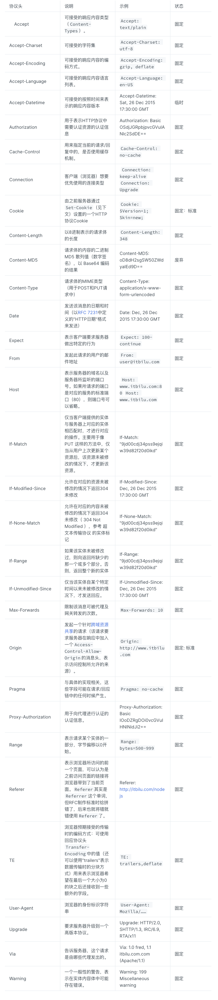
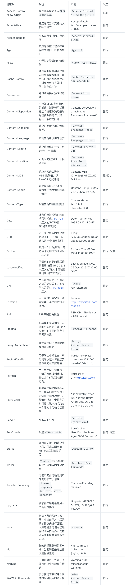

HTTP 报文是在应用程序之间发送的数据块,这些数据块将通过以文本形式的元信息开头，用于 HTTP 协议交互。请求端(客户端)的 HTTP 报文叫做请求报文，响应端(服务器端)的叫做响应报文。HTTP 报文本身是由多行(用 CR+LF 作换行符)数据构成的字符串文本。

### 请求报文
HTTP 请求报文由请求行、请求头、空行和请求包体(body)组成。如下图所示：



真实示例：
```
GET / HTTP/1.1     
Host: www.baidu.com
Connection: keep-alive
Cache-Control: max-age=0
sec-ch-ua: " Not A;Brand";v="99", "Chromium";v="96", "Google Chrome";v="96"
sec-ch-ua-mobile: ?0
sec-ch-ua-platform: "macOS"
Upgrade-Insecure-Requests: 1
User-Agent: Mozilla/5.0 (Macintosh; Intel Mac OS X 10_15_7) AppleWebKit/537.36 (KHTML, like Gecko) Chrome/96.0.4664.110 Safari/537.36
Accept: text/html,application/xhtml+xml,application/xml;q=0.9,image/avif,image/webp,image/apng,*/*;q=0.8,application/signed-exchange;v=b3;q=0.9
Sec-Fetch-Site: none
Sec-Fetch-Mode: navigate
Sec-Fetch-User: ?1
Sec-Fetch-Dest: document
Accept-Encoding: gzip, deflate, br
Accept-Language: zh-CN,zh;q=0.9,en;q=0.8
Cookie: BIDUPSID=8B0207CE0B6364E5934651E84F17999B; PSTM=1619707475; 
```

####    1.请求行
主要描述了客户端想要如何操作服务端的资源；请求行由三部分构成：

*   请求方法：表示对资源期望进行何种操作，常用的如 GET、POST
*   请求目标：通常是一个 URL ，表明了要操作的资源。
*   版本号：表示报文使用的 HTTP 协议版本。
这三个部分通常使用空格(space)来分隔，最后要用 CRLF 换行表示结束。

```
GET / HTTP/1.1  
```

这个请求行，结合之前的描述，意思就是 “服务端妹子你好，我是客户端蛋蛋，现在我想获取网站根目录的默认信息，我这边用的协议版本是 1.1，麻烦你也要用这个版本回复我哦”

####    2.请求头
HTTP的报文头，报文头包含若干个属性，格式为“属性名:属性值”，服务端据此获取客户端的信息。与缓存相关的规则信息，均包含在 header 中，请求头可大致分为四种类型：通用首部字段、请求首部字段、响应首部字段、实体首部字段。这里先简单罗列，稍后做具体解释。

####    3.请求体
请求体就是 HTTP 要传输的内容，HTTP 可以承载很多类型的数字数据:图片、音频、视频、HTML 文档等。

*   介绍响应报文
*   首部字段
*   介绍功能

### 响应报文
HTTP 响应报文由状态行、响应头部、空行和响应包体(body)组成。如下图所示：



以请求 http://www.baidu.com为例：

```
HTTP/1.1 200 OK
Bdpagetype: 1
Bdqid: 0xfb0d743100040ad2
Cache-Control: private
Connection: keep-alive
Content-Encoding: gzip
Content-Type: text/html;charset=utf-8
Date: Fri, 24 Dec 2021 08:20:44 GMT
Expires: Fri, 24 Dec 2021 08:20:44 GMT
Server: BWS/1.1
Set-Cookie: BDSVRTM=17; path=/
Set-Cookie: BD_HOME=1; path=/
Set-Cookie: H_PS_PSSID=35635_34439_35104_35628_35488_35436_35456_34584_35491_35584_35586_34873_35317_26350_35610_35562; path=/; domain=.baidu.com
Strict-Transport-Security: max-age=172800
Traceid: 1640334044050133761018090243032019634898
X-Frame-Options: sameorigin
X-Ua-Compatible: IE=Edge,chrome=1
Transfer-Encoding: chunked
```

####    1.状态行
状态行包含了 协议版本、状态码以及状态描述。

*   协议版本：指明了报文使用的 HTTP 协议版本

*   状态码：状态码是一个三位数字，用来表示处理的结果，下面列出了状态码的类别：



*   状态描述：这个是作为状态码的补充，是一段更详细的文字，帮助人们理解原因。

####    2.响应头部
和请求报文的请求头类似，响应头也由键值对组成，每行一对，键和值用英文冒号 : 分隔。响应头允许服务器传递不能放在状态行的附加信息，这些域主要描述服务器的信息和 Request-URI 进一步的信息

####    3.响应包体
服务器返回给浏览器的响应信息，响应数据的格式是根据服务器来的，常见的响应数据格式有：text/html、application/json 等。

常见的响应格式：



### 请求头



### 响应头



***
https://zhuanlan.zhihu.com/p/450128753
***
