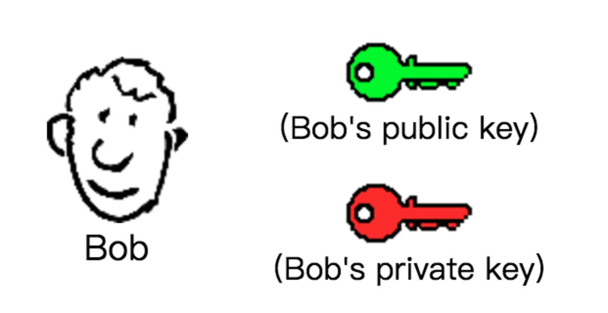
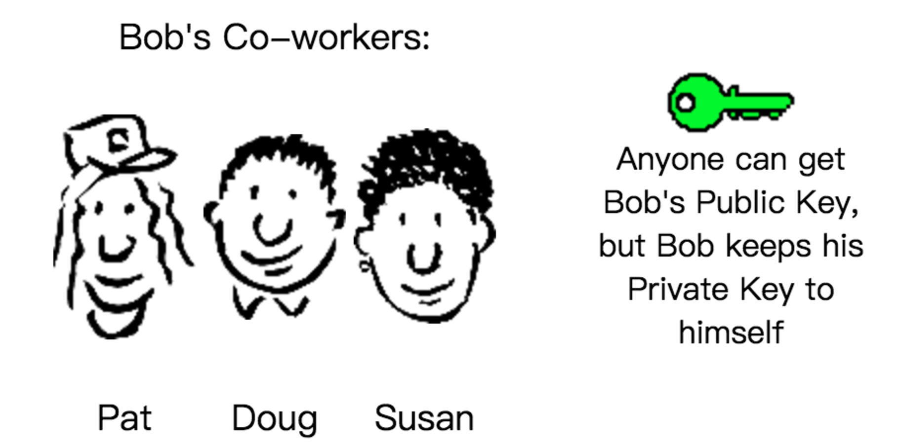
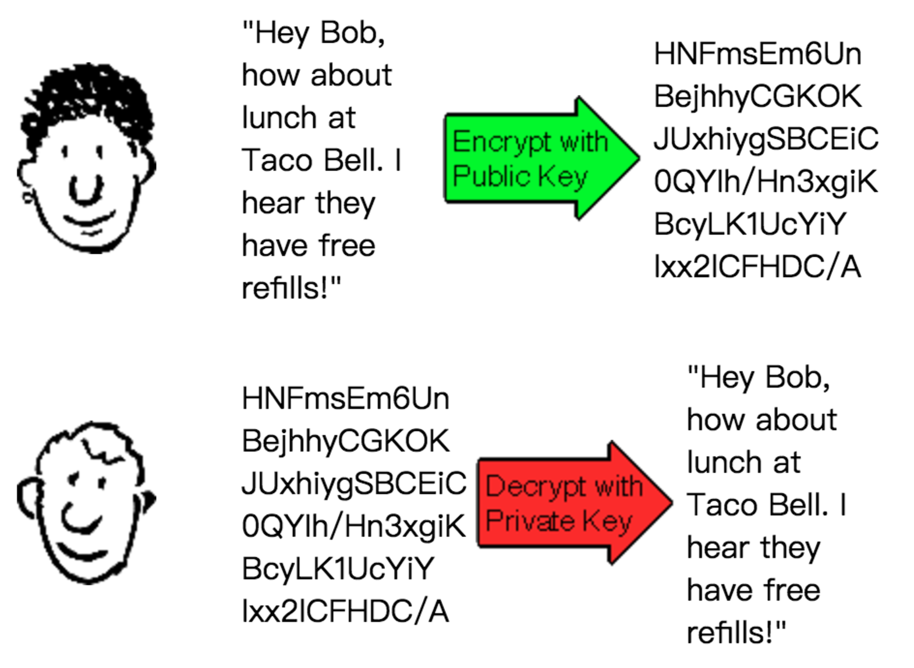
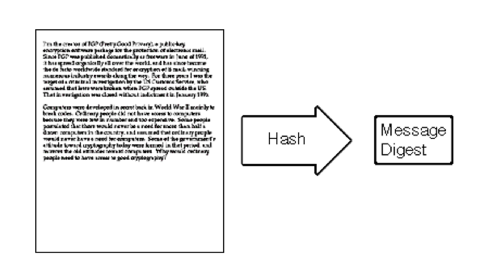
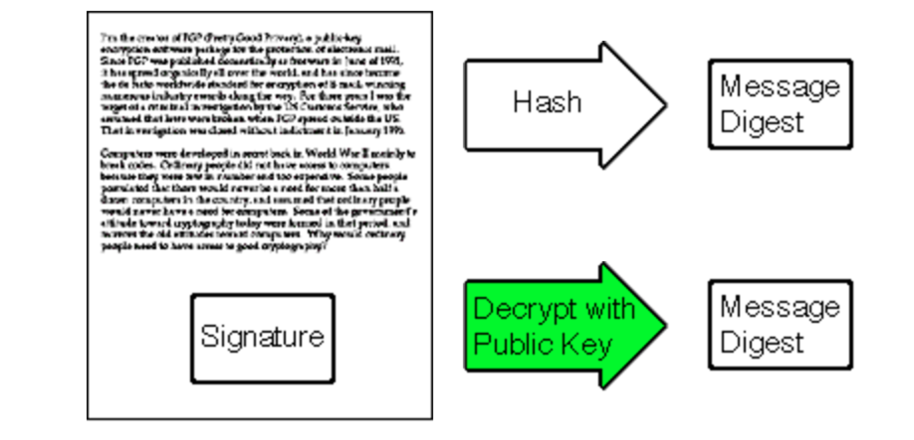
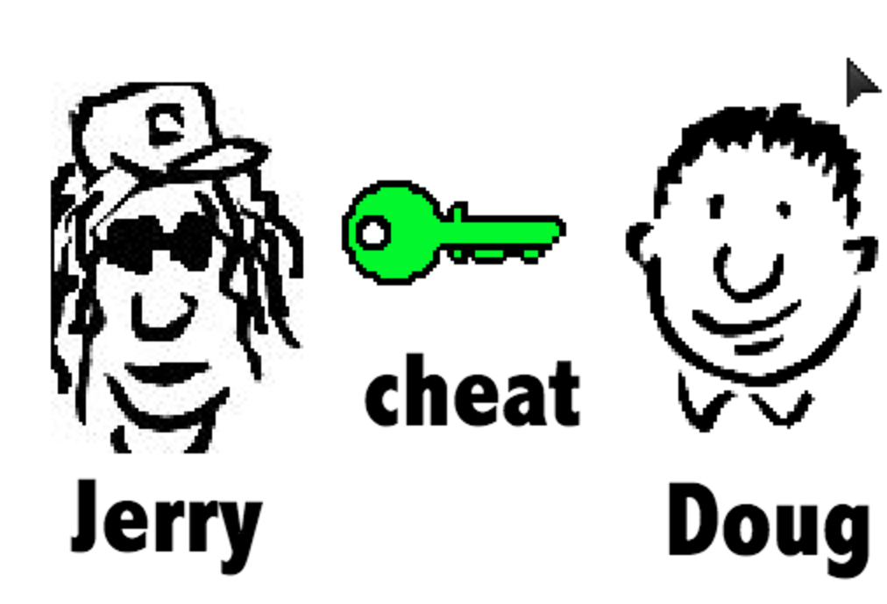
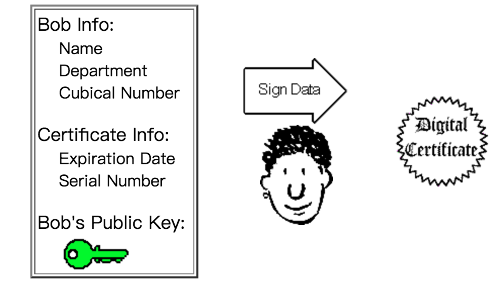
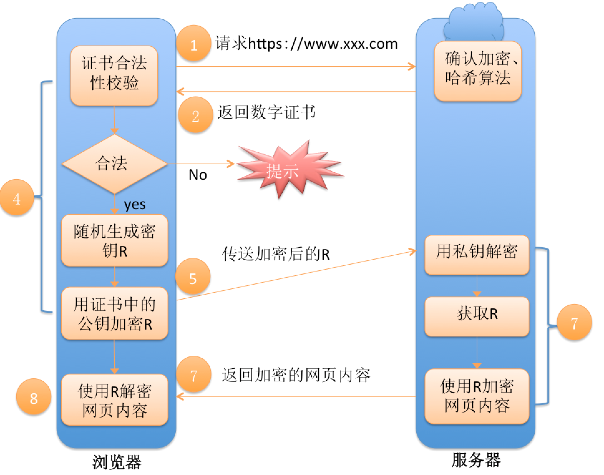

### HTTPS 工作原理

HTTP 协议由于是明文传送，所以存在三大风险：

**1、被窃听的风险：第三方可以截获并查看你的内容**
**2、被篡改的危险：第三方可以截获并修改你的内容**
**3、被冒充的风险：第三方可以伪装成通信方与你通信**

HTTP 因为存在以上三大安全风险，所以才有了 HTTPS 的出现。
HTTPS 涉及到了很多概念，比如 SSL/TSL，数字证书、数字签名、加密、认证、公钥和私钥等，比较容易混淆。我们先从一次简单的安全通信故事讲起吧，其中穿插复习一些密码学的概念。

###    一、关于 Bob 与他好朋友通信的故事

这个故事的原文是：这里重新叙述一下这个故事：
故事的主人公是 Bob，他有三个好朋友 Pat、Doug 和 Susan。Bob 经常跟他们写信，因为他的信是明文传输的，在传递过程可能被人截获偷窥，也可能被人截获然后又篡改了，更有可能别人伪装成 Bob 本人跟他的好朋友通信，总之是不安全的。他很苦恼，经过一番苦苦探索，诶，他发现计算机安全学里有一种叫非对称加密算法的东东，好像可以帮助他解决这个问题
说明：非对称加密算法（RSA）是内容加密的一类算法，它有两个秘钥：公钥与私钥。公钥是公开的钥匙，所有人都可以知道，私钥是保密的，只有持有者知道。通过公钥加密的内容，只能通过私钥解开。非对称加密算法的安全性很高，但是因为计算量庞大，比较消耗性能。
好了，来看看 Bob 是怎么应用非对称加密算法与他的好朋友通信的：
1、首先 Bob 弄到了两把钥匙：公钥和私钥；

​​

2、Bob 自己保留下了私钥，把公钥复制成三份送给了他的三个好朋友 Pat、Doug 和 Susan；​

​​

3、此时，Bob 总算可以安心地和他的好朋友愉快地通信了。比如 Susan 要和他讨论关于去哪吃午饭的事情，Susan 就可以先把自己的内容（明文）首先用 Bob 送给他的公钥做一次加密，然后把加密的内容传送给 Bob。Bob 收到信后，再用自己的私钥解开信的内容；

​​
​​
说明：这其实是计算机安全学里加密的概念，加密的目的是为了不让别人看到传送的内容，加密的手段是通过一定的加密算法及约定的密钥进行的（比如上述用了非对称加密算法以及 Bob 的公钥），而解密则需要相关的解密算法及约定的秘钥（如上述用了非对称加密算法和 Bob 自己的私钥），可以看出加密是可逆的（可解密的）。

4、Bob 看完信后，决定给 Susan 回一封信。为了防止信的内容被篡改（或者别人伪装成他的身份跟 Susan 通信），他决定先对信的内容用 hash 算法做一次处理，得到一个字符串哈希值，Bob 又用自己的私钥对哈希值做了一次加密得到一个签名，然后把签名和信（明文的）一起发送给 Susan；​​​
说明 2：Bob 的内容实质是明文传输的，所以这个过程是可以被人截获和窥探的，但是 Bob 不担心被人窥探，他担心的是内容被人篡改或者有人冒充自己跟 Susan 通信。这里其实涉及到了计算机安全学中的认证概念，Bob 要向 Susan 证明通信的对方是 Bob 本人，另外也需要确保自己的内容是完整的。

​​

5、Susan 接收到了 Bob 的信，首先用 Bob 给的公钥对签名作了解密处理，得到了哈希值 A，然后 Susan 用了同样的 Hash 算法对信的内容作了一次哈希处理，得到另外一个哈希值 B，对比 A 和 B，如果这两个值是相同的，那么可以确认信就是 Bob 本人写的，并且内容没有被篡改过；​

​​

说明：4 跟 5 其实构成了一次完整的通过数字签名进行认证的过程。数字签名的过程简述为：发送方通过不可逆算法对内容 text1 进行处理（哈希），得到的结果值 hash1，然后用私钥加密 hash1 得到结果值 encry1。对方接收 text1 和 encry1，用公钥解密 encry1 得到 hash1，然后用 text1 进行同等的不可逆处理得到 hash2，对 hash1 和 hash2 进行对比即可认证发送方。

6、此时，另外一种比较复杂出现了，Bob 是通过网络把公钥寄送给他的三个好朋友的，有一个不怀好意的家伙 Jerry 截获了 Bob 给 Doug 的公钥。Jerry 开始伪装成 Bob 跟 Doug 通信，Doug 感觉通信的对象不像是 Bob，但是他又无法确认；

​​

7、Bob 最终发现了自己的公钥被 Jerry 截获了，他感觉自己的公钥通过网络传输给自己的小伙伴似乎也是不安全的，不怀好意的家伙可以截获这个明文传输的公钥。为此他想到了去第三方权威机构"证书中心"（certificate authority，简称 CA）做认证。证书中心用自己的私钥对 Bob 的公钥和其它信息做了一次加密。这样 Bob 通过网络将数字证书传递给他的小伙伴后，小伙伴们先用 CA 给的公钥解密证书，这样就可以安全获取 Bob 的公钥了。

​​

### 二、HTTPS 通信过程

通过 Bob 与他的小伙伴的通信，我们已经可以大致了解一个安全通信的过程，也可以了解基本的加密、解密、认证等概念。HTTPS 就是基于这样一个逻辑设计的。
首先看看组成 HTTPS 的协议：HTTP 协议和 SSL/TSL 协议。HTTP 协议就不用讲了，而 SSL/TSL 就是负责加密解密等安全处理的模块，所以 HTTPS 的核心在 SSL/TSL 上面。整个通信如下：

1、浏览器发起往服务器的 443 端口发起请求，请求携带了浏览器支持的加密算法和哈希算法。
2、服务器收到请求，选择浏览器支持的加密算法和哈希算法。
3、服务器下将数字证书返回给浏览器，这里的数字证书可以是向某个可靠机构申请的，也可以是自制的。
4、浏览器进入数字证书认证环节，这一部分是浏览器内置的 TSL 完成的：

    4.1 首先浏览器会从内置的证书列表中索引，找到服务器下发证书对应的机构，如果没有找到，此时就会提示用户该证书是不是由权威机构颁发，是不可信任的。如果查到了对应的机构，则取出该机构颁发的公钥。
    4.2 用机构的证书公钥解密得到证书的内容和证书签名，内容包括网站的网址、网站的公钥、证书的有效期等。浏览器会先验证证书签名的合法性（验证过程类似上面 Bob 和 Susan 的通信）。签名通过后，浏览器验证证书记录的网址是否和当前网址是一致的，不一致会提示用户。如果网址一致会检查证书有效期，证书过期了也会提示用户。这些都通过认证时，浏览器就可以安全使用证书中的网站公钥了。
    4.3 浏览器生成一个随机数 R，并使用网站公钥对 R 进行加密。
5、浏览器将加密的 R 传送给服务器。
6、服务器用自己的私钥解密得到 R。
7、服务器以 R 为密钥使用了对称加密算法加密网页内容并传输给浏览器。
8、浏览器以 R 为密钥使用之前约定好的解密算法获取网页内容。

​​

**备注 1**：前 5 步其实就是 HTTPS 的握手过程，这个过程主要是认证服务端证书（内置的公钥）的合法性。因为非对称加密计算量较大，整个通信过程只会用到一次非对称加密算法（主要是用来保护传输客户端生成的用于对称加密的随机数私钥）。后续内容的加解密都是通过一开始约定好的对称加密算法进行的。

**备注 2**：SSL/TLS 是 HTTPS 安全性的核心模块，TLS 的前身是 SSL，TLS1.0 就是 SSL3.1，TLS1.1 是 SSL3.2，TLS1.2 则是 SSL3.3。 SSL/TLS 是建立在 TCP 协议之上，因而也是应用层级别的协议。其包括 TLS Record Protocol 和 TLS Handshaking Protocols 两个模块，后者负责握手过程中的身份认证，前者则保证数据传输过程中的完整性和私密性。

***
https://juejin.cn/post/6844903830916694030
***