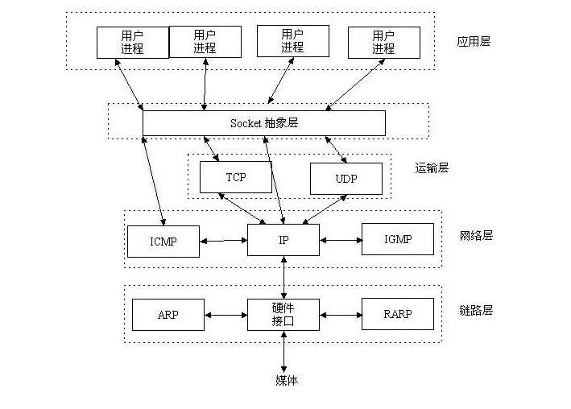
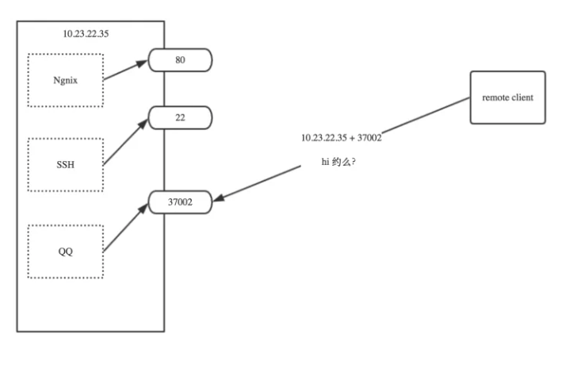
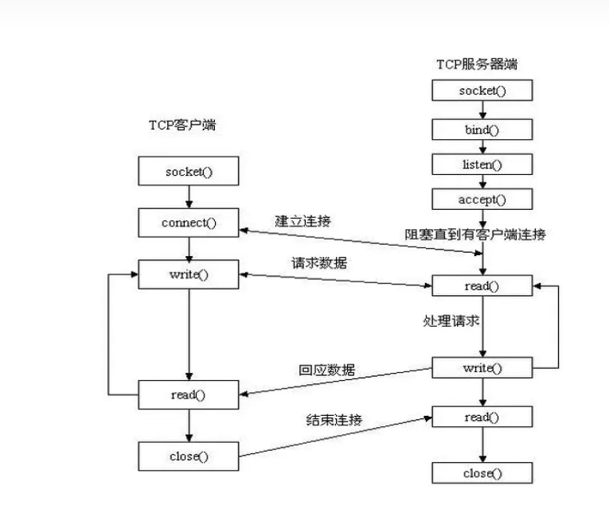

假设我现在要写一个程序，给另一台计算机发数据，必须通过tcp/ip协议 ，但具体的实现过程是什么呢？我应该怎么操作才能把数据封装成tcp/ip的包，又执行什么指令才能把数据发到对端机器上呢? 不能只有世界观，没有方法论呀。。。此时，socket隆重登场，简而言之，socket这个东东干的事情，就是帮你把tcp/ip协议层的各种数据封装啦、数据发送、接收等通过代码已经给你封装好了，你只需要调用几行代码，就可以给别的机器发消息了。

### Socket介绍
####    什么是socket?
Socket是应用层与TCP/IP协议族通信的中间软件抽象层，它是一组接口。在设计模式中，Socket其实就是一个门面模式，它把复杂的TCP/IP协议族隐藏在Socket接口后面，对用户来说，一组简单的接口就是全部。

socket起源于Unix，而Unix/Linux 基本哲学之一就是“一切皆文件”，都可以用“打开open –> 读写write/read –> 关闭close”模式 来操作。Socket就是该模式的一个实现，socket即是一种特殊的文件，一些socket函数就是对其进行的操作（读/写IO、打开、关闭）

你想给另一台计算机发消息，你知道他的IP地址，他的机器上同时运行着qq、迅雷、word、浏览器等程序，你想给他的qq发消息，那想一下，你现在只能通过ip找到他的机器，但如果让这台机器知道把消息发给qq程序呢？答案就是通过port,一个机器上可以有0-65535个端口，你的程序想从网络上收发数据，就必须绑定一个端口，这样，远程发到这个端口上的数据，就全会转给这个程序啦

####    Socket通信套路
当通过socket建立起2台机器的连接后，本质上socket只干2件事，一是收数据，一是发数据，没数据时就等着。

socket 建立连接的过程跟我们现实中打电话比较像，打电话必须是打电话方和接电话方共同完成的事情，我们分别看看他们是怎么建立起通话的

接电话方：

1.  首先你得有个电话
2.  你的电话要有号码
3.  你的电话必须连上电话线
4.  开始在家等电话
5.  电话铃响了，接起电话，听到对方的声音

打电话方：

1.  首先你得有个电话
2.  输入你想拨打的电话
3.  等待对方接听
4.  say“hi 约么，我有七天酒店的打折卡噢~”
5.  等待回应——》响应回应——》等待回应。。。。

把它翻译成socket通信

接电话方(socket服务器端)：

1.  首先你得有个电话\(生成socket对象\)
2.  你的电话要有号码\(绑定本机ip+port\)
3.  你的电话必须连上电话线\(连网\)
4.  开始在家等电话\(开始监听电话listen\)
5.  电话铃响了，接起电话，听到对方的声音\(接受新连接\)

打电话方(socket客户端)：

1.  首先你得有个电话\(生成socket对象\)
2.  输入你想拨打的电话\(connect 远程主机ip+port\)
3.  等待对方接听
4.  say“hi 约么，我有七天酒店的打折卡噢~”\(send\(\) 发消息。。。\)
5.  等待回应——》响应回应——》等待回应。。。。

### Socket套接字方法
####    socket 实例类
socket.socket(family=AF_INET, type=SOCK_STREAM, proto=0, fileno=None)

family(socket家族)

*   socket.AF_UNIX：用于本机进程间通讯，为了保证程序安全，两个独立的程序(进程)间是不能互相访问彼此的内存的，但为了实现进程间的通讯，可以通过创建一个本地的socket来完成
*   socket.AF_INET:(还有AF_INET6被用于ipv6，还有一些其他的地址家族，不过，他们要么是只用于某个平台，要么就是已经被废弃，或者是很少被使用，或者是根本没有实现，所有地址家族中，AF_INET是使用最广泛的一个，python支持很多种地址家族，但是由于我们只关心网络编程，所以大部分时候我么只使用AF_INET)
*   socket type类型
*   socket.SOCK_STREAM #for tcp
*   socket.SOCK_DGRAM #for udp
*   socket.SOCK_RAW #原始套接字，普通的套接字无法处理ICMP、IGMP等网络报文，而SOCK_RAW可以；其次，SOCK_RAW也可以处理特殊的IPv4报文；此外，利用原始套接字，可以通过IP_HDRINCL套接字选项由用户构造IP头。
*   socket.SOCK_RDM #是一种可靠的UDP形式，即保证交付数据报但不保证顺序。SOCK_RAM用来提供对原始协议的低级访问，在需要执行某些特殊操作时使用，如发送ICMP报文。SOCK_RAM通常仅限于高级用户或管理员运行的程序使用。
*   socket.SOCK_SEQPACKET #废弃了
    (Only SOCK_STREAM and SOCK_DGRAM appear to be generally useful.)

proto=0 请忽略，特殊用途

fileno=None 请忽略，特殊用途

####    服务端套接字函数
*   s.bind() 绑定(主机,端口号)到套接字
*   s.listen() 开始TCP监听
*   s.accept() 被动接受TCP客户的连接,(阻塞式)等待连接的到来客户端套接字函数(2分钟)
*   s.connect() 主动初始化TCP服务器连接
*   s.connect_ex() connect()函数的扩展版本,出错时返回出错码,而不是抛出异常公共用途的套接字函数(3-5分钟)
*   s.recv() 接收数据
*   s.send() 发送数据(send在待发送数据量大于己端缓存区剩余空间时,数据丢失,不会发完，可后面通过实例解释)
*   s.sendall() 发送完整的TCP数据(本质就是循环调用send,sendall在待发送数据量大于己端缓存区剩余空间时,数据不丢失,循环调用send直到发完)
*   s.recvfrom() Receive data from the socket. The return value is a pair (bytes, address)
*   s.getpeername() 连接到当前套接字的远端的地址
*   s.close() 关闭套接字
*   socket.setblocking(flag) #True or False,设置socket为非阻塞模式，以后讲io异步时会用
*   socket.getaddrinfo(host, port, family=0, type=0, proto=0, flags=0) 返回远程主机的地址信息，例子 socket.getaddrinfo(‘http://luffycity.com’,80)
*   socket.getfqdn() 拿到本机的主机名
*   socket.gethostbyname() 通过域名解析ip地址

***
https://zhuanlan.zhihu.com/p/106271407
***