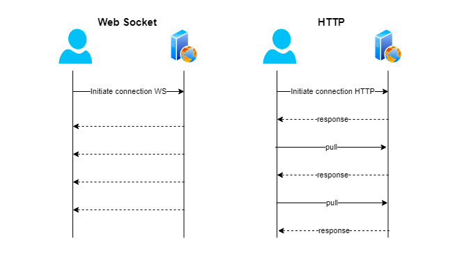

Websocket 是一种新型的协议，它允许客户端和服务器之间建立实时的双向通信通道。相比于 HTTP 协议来说，它具有以下优点：

*   实时性： Websocket支持服务器主动向客户端推送消息，使得客户端能够实时接收到服务器的事件和数据变化。
*   双向性： Websocket支持全双工通信，即客户端和服务器可以同时发送和接收数据。
*   节约资源： 相比于轮询机制，Websocket只需要建立一次连接即可实现实时通信，这样可以减少服务器的压力和网络流量。
*   兼容性： Websocket 协议能够支持所有主流的浏览器和移动设备。
*   统一性：网页端无法使用原生tcp，可以是用websocket统一网页端、native、server的技术栈

Websocket 协议在实时通信、在线聊天、多人游戏、实时监控等场景下具有广泛的应用价值。

### WebSocket和各协议区别

####    WebSocket 和 HTTP 的区别

HTTP 是一个无状态的协议，使客户端向服务器请求资源，并从服务器接收响应。客户端使用 HTTP 请求/响应语法，即请求发送到服务器之后，服务器向客户端返回 HTML 文件、图像和其他媒体内容。

WebSocket 通信协议尝试在较大范围内改进 Web 实时通信和插件技术，并提供全双工、基于事件的通信而无需采用低效的轮询方式。开发人员可以从 Web 浏览器的 JS 端轻松地创建 WebSocket 连接并发送数据，进而实现应用程序的实时数据传输的实现。

由于 WebSocket 是面向消息的，因此它更加适用于实时通信，而 HTTP 更适用于请求和服务器-客户端通信的响应。




**区别总结**

*   连接方式不同： HTTP 是一种单向请求-响应协议，每次请求需要重新建立连接，而 WebSocket 是一种双向通信协议，使用长连接实现数据实时推送。
*   数据传输方式不同： HTTP 协议中的数据传输是文本格式的，而 WebSocket 可以传输文本和二进制数据。
*   通信类型不同： HTTP 主要用于客户端和服务器之间的请求和响应，如浏览器请求网页和服务器返回网页的 HTML 文件。WebSocket 可以实现双向通信，常常用于实时通信场景。
*   性能方面不同： 由于 HTTP 的每次请求都需要建立连接和断开连接，而 WebSocket 可以在一次连接上进行多次通信，WebSocket 在性能上比 HTTP 有优势。

####    WebSocket 和 TCP 的区别
WebSocket 和 HTTP 都是基于 TCP 协议的应用层协议。

*   层次结构： WebSocket 是应用层协议，而 TCP 是传输层协议。
*   协议特点： TCP 是一种面向连接的协议，使用三次握手建立连接，提供可靠的数据传输。而 WebSocket 是一种无状态的协议，使用 HTTP 协议建立连接，可以进行*   双向通信，WebSocket 的数据传输比 TCP 更加轻量级。
*   数据格式： TCP 传输的数据需要自定义数据格式，而 WebSocket 可以支持多种数据格式，如 JSON、XML、二进制等。WebSocket 数据格式化可以更好的支持 Web 应用开发。
*   连接方式： TCP 连接的是物理地址和端口号，而 WebSocket 连接的是 URL 地址和端口号。

!> 经测试论证：TCP在请求+回复速度以及内存消耗上均游湖于WebSocket10倍，https://medium.com/kifi-engineering/websockets-vs-regular-sockets-b3b8e7ea0708

####    WebSocket 和 Socket 的区别
**协议不同**

Socket 是基于传输层 TCP 协议的，而 Websocket 是基于 HTTP 协议的。Socket 通信是通过 Socket 套接字来实现的，而 Websocket 通信是通过 HTTP 的握手过程实现的。

**持久化连接**
传统的 Socket 通信是基于短连接的，通信完成后即断开连接。而 Websocket 将 HTTP 协议升级后，实现了长连接，即建立连接后可以持续通信，避免了客户端与服务端频繁连接和断开连接的过程。

**双向通信**
传统的 Socket 通信只支持单向通信，即客户端向服务端发送请求，服务端进行响应。而 Websocket 可以实现双向通信，即客户端和服务端都可以发起消息，实时通信效果更佳。

**效率**
Socket 通信具有高效性和实时性，因为传输数据时没有 HTTP 协议的头信息，而 Websocket 除了HTTP协议头之外，还需要发送额外的数据，因此通信效率相对较低。

**应用场景**
Socket 适用于实时传输数据，例如在线游戏、聊天室等需要快速交换数据的场景。而 Websocket 适用于需要长时间保持连接的场景，例如在线音视频、远程控制等。


####    JavaScript 中的 WebSocket
在前端 Web 应用中使用 WebSocket 对象可以非常方便地实现双向实时通信。具体来说，需要以下步骤：

1.  创建 WebSocket 对象，并指定连接的 URL 地址。

```
let socket = new WebSocket('ws://localhost:8080');
监听 WebSocket 对象的各种事件，并编写相应的回调函数来处理事件：
Copy code
socket.onopen = function(event) {
    console.log('连接成功');
};

socket.onerror = function(event) {
    console.log('连接出错');
};

socket.onmessage = function(event) {
    console.log('收到消息：' + event.data);
};

socket.onclose = function(event) {
    console.log('连接关闭');
};
```

2.  发送消息到服务器端：
```
socket.send('Hello, WebSocket!');
```

3.  关闭WebSocket连接：
```
socket.close();
```

!>  需要注意的是，WebSocket 对象也需要与服务器进行握手，以完成连接的建立和维护。通常，服务器端的实现需要支持 WebSocket 协议，例如 Node.js 中的 ws 或 Java 中的 Jetty。

WebSocket 对象提供了丰富的 API，包括发送数据、关闭连接、获取连接状态等等。在使用 WebSocket 进行开发时，应该熟悉这些 API，并编写高效的消息传输代码，以确保 WebSocket 协议的高效、稳定和安全。

### Android中使用 WebSocket

####    1.  客户端接入

使用开源库：https://github.com/TooTallNate/Java-WebSocket，此库包含客户端和服务端，本章中省去服务端部署只使用客户端；build.gradle中增加依赖
```
dependencies {
    ...
    implementation 'org.java-websocket:Java-WebSocket:1.5.3'
}
```

自定义ExampleClient

```
package com.android.myapplication

import android.util.Log
import org.java_websocket.client.WebSocketClient
import org.java_websocket.drafts.Draft
import org.java_websocket.handshake.ServerHandshake
import java.net.URI

class ExampleClient : WebSocketClient {
    constructor(serverUri: URI?, draft: Draft?) : super(serverUri, draft) {}
    constructor(serverURI: URI?) : super(serverURI) {}
    constructor(serverUri: URI?, httpHeaders: Map<String?, String?>?) : super(
        serverUri,
        httpHeaders
    ) {
    }

    override fun onOpen(handshakedata: ServerHandshake) {
        send("Hello, it is me. Mario :)")
        println("opened connection")
        // if you plan to refuse connection based on ip or httpfields overload: onWebsocketHandshakeReceivedAsClient
    }

    override fun onMessage(message: String) {
        println("received: $message")
    }

    override fun onClose(code: Int, reason: String, remote: Boolean) {
        // The close codes are documented in class org.java_websocket.framing.CloseFrame
        println(
            "Connection closed by " + (if (remote) "remote peer" else "us") + " Code: " + code + " Reason: "
                    + reason
        )
    }

    private fun println(msg: String?) {
        Log.e("balance", msg!!)
    }

    override fun onError(ex: Exception) {
        ex.printStackTrace()
        // if the error is fatal then onClose will be called additionally
        println(ex.message)
    }
}
```
启动连接

```
val c = ExampleClient(
            URI(
                "${url from piesocket}"
            )
        ) // more about drafts here: http://github.com/TooTallNate/Java-WebSocket/wiki/Drafts
        c.connect()
```
!> 服务端的url将从下文中的 piesocket获取

#### 创建服务端

https://www.piesocket.com/，    创建一个工程获取免费的测试服务端，该服务端会可将客户端发送的消息进行返回


!> 将获取的 Example WebSockect URL 提供给ExampleClient

启动客户端，查看日志：
```
---------------------------- PROCESS STARTED (7288) for package com.android.myapplication ----------------------------
2023-06-15 16:19:45.936  7288-7445  balance                 com.android.myapplication            E  opened connection
2023-06-15 16:19:46.160  7288-7445  balance                 com.android.myapplication            E  received: Hello, it is me. Mario :)
```

###  将websocket服务放入独立进程(Messenger)

将Android WebSocket服务放在单独的进程中有几个潜在的好处：

*   隔离性：通过将WebSocket服务放在单独的进程中，可以实现与主应用程序进程的逻辑和状态的隔离。这意味着如果WebSocket服务发生故障或崩溃，它不会直接影响主应用程序的稳定性，从而提高了应用程序的健壮性和可靠性。

*   性能优化：WebSocket服务可能需要处理大量的网络数据传输和处理任务。通过将其放在单独的进程中，可以避免与主应用程序进程共享资源导致的性能问题。此外，WebSocket服务可以独立进行优化和调整，以提高其处理数据的效率，而不会受到主应用程序其他部分的影响。

*   独立生命周期管理：WebSocket服务在单独的进程中运行，具有自己的生命周期管理。这使得可以更好地控制WebSocket服务的启动、停止和重启。例如，当主应用程序进程发生崩溃或重新启动时，WebSocket服务可以独立地保持运行状态，并在需要时自动重新连接。

*   安全性：通过将WebSocket服务放在单独的进程中，可以提高应用程序的安全性。WebSocket服务可以在自己的沙盒环境中运行，与主应用程序进程隔离，从而降低了攻击者通过WebSocket连接对应用程序进行攻击的风险。

!>  需要注意的是，将WebSocket服务放在单独的进程中也会带来一些开发和管理上的复杂性。进程间通信和数据同步可能需要额外的处理。此外，内存和资源消耗也可能增加，因为需要维护额外的进程。因此，开发人员应根据具体应用程序的需求和性能要求来评估是否将WebSocket服务放在单独的进程中。

mainnifest.xml中注册service
```
<service android:name=".MessengerService"
            android:process=":websocket"
            ></service>
```
####    使用startService启动服务

**MessengerService**
```
package com.android.myapplication

import android.app.Service
import android.content.Intent
import android.os.*
import org.java_websocket.handshake.ServerHandshake
import java.net.URI


class MessengerService : Service(), WebSocketClientListener {

    private var mServiceMessenger: Messenger? = null
    private var clientReply: Messenger? = null
    private var webSocketClient: ExampleClient? = null
    override fun onCreate() {
        super.onCreate()
        if (webSocketClient == null) {
            webSocketClient = ExampleClient(
                URI(
                    "wss://s9194.nyc1.piesocket.com/v3/1?api_key=sfuRCN6ltd0PFSzhfn6NhiiTkCEzD5MRgSVXjrRH&notify_self=1"
                ), this
            ) // more about drafts here: http://github.com/TooTallNate/Java-WebSocket/wiki/Drafts
        }
        webSocketClient?.let {
            if (!it.isOpen) {
                it.connect()
            }
            mServiceMessenger = Messenger(MessengerHandler(it))
        }
    }

    override fun onStartCommand(intent: Intent?, flags: Int, startId: Int): Int {
        (intent?.getParcelableExtra("data") as? Message)?.let {
            when (it.what) {
                MessageAction.CONNECT.type -> {
                    clientReply = it.replyTo
                    ExampleClient.println("server: client connected")
                }
                MessageAction.SEND.type -> {
                    clientReply = it.replyTo
                    val msg = it.data.getString("data")
                    webSocketClient?.send(msg)
                }
                else -> {}
            }
        }
        return super.onStartCommand(intent, flags, startId)


    }

    override fun onBind(intent: Intent?): IBinder? {
        return mServiceMessenger?.binder
    }

    private fun sendToClient(msg: String) {
        val message: Message = Message.obtain()
        message.what = MessageAction.RECEIVED.type
        message.data = (Bundle().apply {
            putString("data", msg)
        })
        try {
            clientReply?.send(message)
        } catch (e: RemoteException) {
            e.printStackTrace()
        }
    }

    private class MessengerHandler(private val exampleClient: ExampleClient) : Handler() {
        override fun handleMessage(msg: Message) {
            super.handleMessage(msg)
            when (msg.what) {
                MessageAction.SEND.type -> {
                    val msg = msg.data.getString("data")
                    exampleClient.send(msg)
                    ExampleClient.println("server: $msg")
                }
            }
        }
    }

    enum class MessageAction(val type: Int) {
        SEND(0),
        RECEIVED(1),
        CONNECT(2)
    }

    override fun onOpen(handshakedata: ServerHandshake) {
    }

    override fun onMessage(message: String) {
        sendToClient(message)
    }

    override fun onClose(code: Int, reason: String, remote: Boolean) {
    }

    override fun onError(ex: Exception) {
    }
}
```
**MainActivity**
```
package com.android.myapplication

import android.annotation.SuppressLint
import android.content.ComponentName
import android.content.Intent
import android.os.Bundle
import android.os.Handler
import android.os.Message
import android.os.Messenger
import android.view.View
import android.widget.EditText
import androidx.appcompat.app.AppCompatActivity


class MainActivity : AppCompatActivity() {
    private var content: EditText? = null

    var clientHandler: Handler = object : Handler() {
        override fun handleMessage(msg: Message) {
            super.handleMessage(msg)
            when(msg.what){
                MessengerService.MessageAction.RECEIVED.type->{
                    msg.data?.getString("data")?.let {
                        ExampleClient.println("client received:${it}")
                    }
                }
            }
        }
    }
    var clientMessenger: Messenger = Messenger(clientHandler)

    @SuppressLint("MissingInflatedId")
    override fun onCreate(savedInstanceState: Bundle?) {
        super.onCreate(savedInstanceState)
        setContentView(R.layout.activity_main)
        content = findViewById(R.id.content)
        findViewById<View>(R.id.send).setOnClickListener {
            sendMessage()
        }
        startMessageService()
    }

    private fun startMessageService() {
        val message = Message.obtain()
        message.what = MessengerService.MessageAction.CONNECT.type // 定义消息代码
        message.replyTo = clientMessenger

        // 获取到Service的ComponentName
        val serviceComponent = ComponentName(this, MessengerService::class.java)
        // 创建Intent，并将ComponentName设置为Service的ComponentName
        val intent = Intent()
        intent.component = serviceComponent
        // 将Message对象作为额外数据放入Intent中
        intent.putExtra("data", message)
        // 启动Service
        startService(intent)
    }


    private fun sendMessage() {
        val contentStr = content?.text?.toString() ?:""
        contentStr?.let {
            val message = Message.obtain().apply {
                data = Bundle().apply {
                    putString("data",it)
                }
            }
            message.what = MessengerService.MessageAction.SEND.type // 定义消息代码
            message.replyTo = clientMessenger
            val serviceComponent = ComponentName(this, MessengerService::class.java)
            val intent = Intent()
            intent.component = serviceComponent
            intent.putExtra("data", message)
            startService(intent)
        }
        content?.setText("")
    }

    override fun onDestroy() {
        super.onDestroy()
        stopService(Intent(this,MessengerService::class.java))
    }
}
```

!> 由于使用startService启动的服务客户端无法使用IBinder进行持续通信，所以通过startService持续调用service的onStartCommand方法进行消息发送，也可使用广播

####    使用bindService启动服务

**MessengerService**
```
package com.android.myapplication

import android.app.Service
import android.content.Intent
import android.os.*
import org.java_websocket.handshake.ServerHandshake
import java.net.URI


class MessengerService : Service(), WebSocketClientListener {

    private var mServiceMessenger: Messenger? = null
    private var clientReply: Messenger? = null
    private var webSocketClient: ExampleClient? = null
    override fun onCreate() {
        super.onCreate()
        if (webSocketClient == null) {
            webSocketClient = ExampleClient(
                URI(
                    "wss://s9194.nyc1.piesocket.com/v3/1?api_key=sfuRCN6ltd0PFSzhfn6NhiiTkCEzD5MRgSVXjrRH&notify_self=1"
                ), this
            ) // more about drafts here: http://github.com/TooTallNate/Java-WebSocket/wiki/Drafts
        }
        webSocketClient?.let {
            if (!it.isOpen) {
                it.connect()
            }
            mServiceMessenger = Messenger(MessengerHandler(it))
        }
    }

    override fun onStartCommand(intent: Intent?, flags: Int, startId: Int): Int {
        (intent?.getParcelableExtra("data") as? Message)?.let {
            when (it.what) {
                MessageAction.CONNECT.type -> {
                    clientReply = it.replyTo
                    ExampleClient.println("server: client connected")
                }
                else -> {}
            }
        }
        return super.onStartCommand(intent, flags, startId)
    }

    override fun onBind(intent: Intent?): IBinder? {
        return mServiceMessenger?.binder
    }

    private fun sendToClient(msg: String) {
        val message: Message = Message.obtain()
        message.what = MessageAction.RECEIVED.type
        message.data = (Bundle().apply {
            putString("data", msg)
        })
        try {
            clientReply?.send(message)
        } catch (e: RemoteException) {
            e.printStackTrace()
        }
    }

    private class MessengerHandler(private val exampleClient: ExampleClient) : Handler() {
        override fun handleMessage(msg: Message) {
            super.handleMessage(msg)
            when (msg.what) {
                MessageAction.SEND.type -> {
                    val msg = msg.data.getString("data")
                    exampleClient.send(msg)
                    ExampleClient.println("server: $msg")
                }
            }
        }
    }

    enum class MessageAction(val type: Int) {
        SEND(0),
        RECEIVED(1),
        CONNECT(2)
    }

    override fun onOpen(handshakedata: ServerHandshake) {
    }

    override fun onMessage(message: String) {
        sendToClient(message)
    }

    override fun onClose(code: Int, reason: String, remote: Boolean) {
    }

    override fun onError(ex: Exception) {
    }
}
```
**MainActivity**
```
package com.android.myapplication

import android.annotation.SuppressLint
import android.content.ComponentName
import android.content.Context
import android.content.Intent
import android.content.ServiceConnection
import android.os.*
import android.view.View
import android.widget.EditText
import androidx.appcompat.app.AppCompatActivity


class MainActivity : AppCompatActivity() {
    private var content: EditText? = null

    var clientHandler: Handler = object : Handler() {
        override fun handleMessage(msg: Message) {
            super.handleMessage(msg)
            when(msg.what){
                MessengerService.MessageAction.RECEIVED.type->{
                    msg.data?.getString("data")?.let {
                        ExampleClient.println("client received:${it}")
                    }
                }
            }
        }
    }
    var clientMessenger: Messenger = Messenger(clientHandler)
    private var  serverMessenger:Messenger?=null
    private val serviceConnection: ServiceConnection = object : ServiceConnection {
        override fun onServiceConnected(componentName: ComponentName, iBinder: IBinder) {
            // 当服务连接成功时调用
            // 将返回的IBinder对象转换为Messenger对象
            serverMessenger = Messenger(iBinder)
        }

        override fun onServiceDisconnected(componentName: ComponentName) {
            // 当服务断开连接时调用
        }
    }

    @SuppressLint("MissingInflatedId")
    override fun onCreate(savedInstanceState: Bundle?) {
        super.onCreate(savedInstanceState)
        setContentView(R.layout.activity_main)
        content = findViewById(R.id.content)
        findViewById<View>(R.id.send).setOnClickListener {
            sendMessage()
        }
        startMessageService()
    }

    private fun startMessageService() {
        val message = Message.obtain()
        message.what = MessengerService.MessageAction.CONNECT.type // 定义消息代码
        message.replyTo = clientMessenger

        // 获取到Service的ComponentName
        val serviceComponent = ComponentName(this, MessengerService::class.java)
        // 创建Intent，并将ComponentName设置为Service的ComponentName
        val intent = Intent()
        intent.component = serviceComponent
        // 将Message对象作为额外数据放入Intent中
        intent.putExtra("data", message)
        // 启动Service
        bindService(intent,serviceConnection, Context.BIND_AUTO_CREATE)
    }


    private fun sendMessage() {
        val contentStr = content?.text?.toString() ?:""
        contentStr?.let {
            val message = Message.obtain().apply {
                data = Bundle().apply {
                    putString("data",it)
                }
            }
            message.what = MessengerService.MessageAction.SEND.type // 定义消息代码
            message.replyTo = clientMessenger
            val serviceComponent = ComponentName(this, MessengerService::class.java)
            val intent = Intent()
            intent.component = serviceComponent
            intent.putExtra("data", message)
            serverMessenger?.send(Message().apply {
                what = MessengerService.MessageAction.SEND.type
                data = Bundle().apply {
                    putString("data", it)
                }
            })
        }
        content?.setText("")
    }

    override fun onDestroy() {
        super.onDestroy()
        unbindService(serviceConnection)
    }
}
```

运行日志：
```
2023-06-15 20:14:10.119 24928-25034 balance                 com.android.myapplication            E  websocket: opened connection
2023-06-15 20:24:50.040 24928-24928 balance                 com.android.myapplication            E  server: 测试消息
2023-06-15 20:24:50.278 24928-25034 balance                 com.android.myapplication            E  websocket: received: 测试消息
2023-06-15 20:24:58.535 24928-24928 balance                 com.android.myapplication            E  server: 1
2023-06-15 20:24:58.830 24928-25034 balance                 com.android.myapplication            E  websocket: received: 1
2023-06-15 20:25:01.132 24928-24928 balance                 com.android.myapplication            E  server: 2
2023-06-15 20:25:01.368 24928-25034 balance                 com.android.myapplication            E  websocket: received: 2
```


