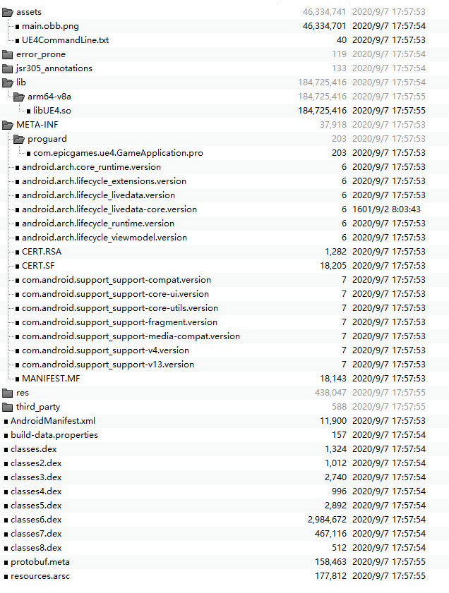
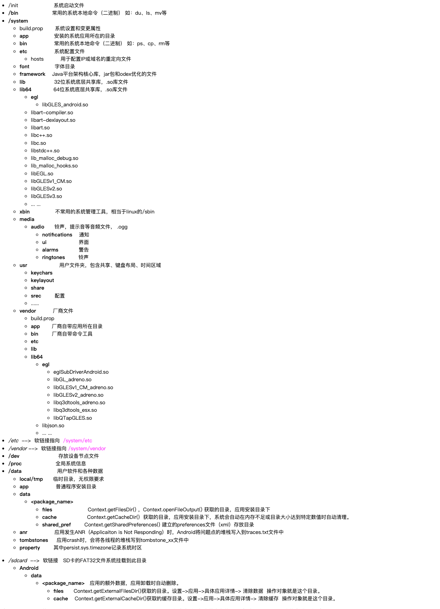
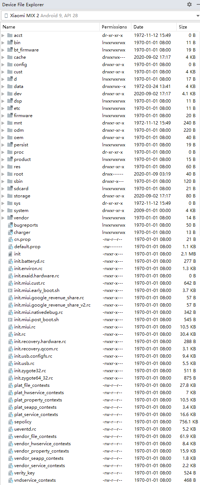
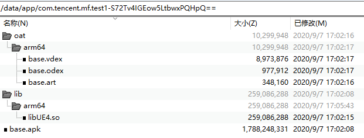
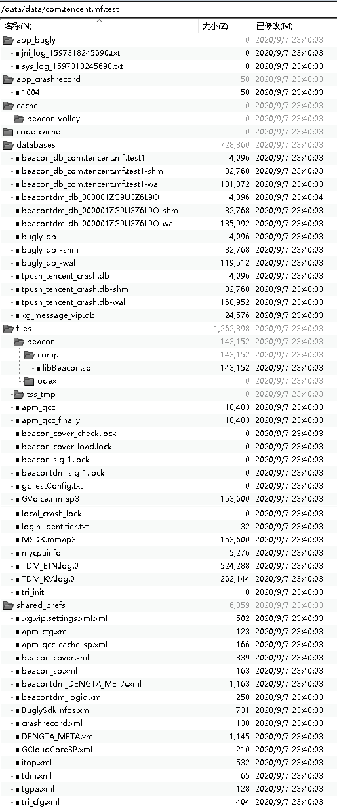

APK(Android package，wiki  chs)：android安装包，由aapt（Android Assert Packaging Tool，已集成到build-tools工具集中）把AndroidManifest.xml、资源文件、lib动态链接库、dex（Dalvik二进制字节码）等归档成的zip压缩包。



assets：对应项目工程asset目录下的文件，可以使用AssetManager获取     注：其下的main.obb.png为一个压缩方式为仅存储的标准zip文件

lib：包含适用于不同处理器的第三方动态链接库（*.so），这里边可以有多个子目录。如：armeabi、armeabi-v7a、 arm64-v8a,、x86,、x86_64以及mips

META-INF：存放签名证书等信息；其中包含两个签名文件（CERT.SF和CERT.RSA）和一个manifest文件（MANIFEST.MF）

        jdk1.8.0_77\bin\keytool.exe -printcert -file %apkdir%\CERT.RSA  // 查看当前apk的签名信息

res：包含那些没有被编译到resources.arsc的资源（如：应用图标、字符串表等）

AndroidManifest.xml：二进制格式的清单文件

classes*.dex：Dalvik EXcutable file，Dalvik虚拟机执行程序，java文件先编译为class文件，然后打包成dex二进制字节码文件。一个APK中有多个dex文件。

resources.arsc：存储编译好的资源，包括项目工程中的res/values目录里的xml文件，它们都被编译成二进制格式，也包括一些路径，指向那些没有被编译的资源，比如layout文件和图片

 

### Android系统目录结构



可在Android Studio的View菜单 -- Tool Windows -- Device File Explorer面板中查看手机上整个文件目录（手机无需root   更多信息详见这里）



 注：文件夹图标的右上角带箭头为一个软链接，右下角带问号的为一个文件

 

### 内部存储（Internal Storage）
在手机内部，属于手机自带存储空间的一部分

/data/app  // 应用程序安装的目录。安装时，系统的PackageManagerService（PMS）进程会把apk文件复制到该目录



1. com.tencent.mf.test1-S72Tv4IGEow5LtbwxPQHpQ==     // 字符串S72Tv4IGEow5LtbwxPQHpQ是随机字符串，每次安装都会变化

2. base.apk为原始的Android安装包。app运行时的资源从该文件中读取。

3. 在安装apk时，PMS会将apk中的so动态链接库释放到/data/app/com.tencent.mf.test1-S72Tv4IGEow5LtbwxPQHpQ==/lib/arm64中

   游戏so动态链接库的路径搜索路径依次为：/data/app/com.tencent.mf.test1-S72Tv4IGEow5LtbwxPQHpQ==/lib/arm64, /data/app/com.tencent.mf.test1-S72Tv4IGEow5LtbwxPQHpQ==/base.apk!/lib/arm64-v8a, /system/lib64, /vendor/lib64, /product/lib64

   注：通过在AndroidManifest.xml中配置android:extractNativeLibs="false"，以不释放apk中so动态链接库到/data/app/com.tencent.mf.test1-S72Tv4IGEow5LtbwxPQHpQ==/lib/arm64，运行时直接用apk中的so来加载

          这种方法优点是安装时不用再释放so文件，节省磁盘空间；缺点是apk的so文件不会压缩导致apk包变大     更多信息请查看：https://testerhome.com/topics/18463

4. 首次运行app时，会将apk中的classes*.dex编译释放到/data/app/com.tencent.mf.test1-S72Tv4IGEow5LtbwxPQHpQ==/oat/arm64中，会生成出3个文件：base.vdex、base.odex、base.art

   .vdex：未压缩DEX 代码，以及一些旨在加快验证速度的元数据（省去重新校验apk中dex文件合法性的过程 ）。Android 8引入。
   .odex：对于dalvik虚拟机，存放的是JIT后的优化后的字节码（Optimized Dalvik EXcutable file）；对于AOT Runtime，存放的是经过AOT（Ahead Of Time）编译后的本地机器码（即：oat文件，一种私有的ELF文件格式）。

    注1：为了保证安装速度，在安装时并没有AOT；而是当app启动运行一小段时间，收集了足够多的jit 热点方法信息时，

              Android会在后台重新进行dex2oat（该文件在/system/bin/dex2oat，是Android Art Runtime的重要模块）, 将热点函数（Hot Code）编译成odex本地机器码

    注2：odex + vdex = 全部java源码。随着更多的vdex的java代码被AOT成odex，其size会逐渐变小

   .art (可选)：包含APK中列出的某些字符串和类的 ART 内部表示，记录app启动热点函数相关地址，用于加快app启动速度。

 

/data/data  // 该目录存放应用程序的私有数据

对于设备中每一个安装的 App，系统都会在内部存储空间的/data/data 目录下以应用包名为名字自动创建与之对应的文件夹。

用户卸载 App 时，系统自动删除/data/data 目录下对应包名的文件夹及其内容。



/data/data/包名/cache： 存放的 APP 的缓存信息
```
context.getCacheDir(); // 返回/data/data/包名/cache目录路径
```

/data/data/包名/databases： 存放 APP 的数据库信息

```
context.getDataDir(); // 返回/data/data/包名/databases目录路径
context.getDatabasePath(name); // 获取指定数据库对象
context.deleteDatabase(name); // 删除指定数据库对象
```

/data/data/包名/files： 存放 APP 的文件信息

```
context.getFilesDir(); // 返回/data/data/包名/files目录路径
context.deleteFile(name); // 删除指定文件对象
context.fileList(); // 查询所有文件对象
```

/data/data/包名/shared_prefs： 存放 APP 内的 SharedPreferences

```
context.getSharedPreferences(name,mode) //返回指定的SharedPreferences对象
context.deleteSharedPreferences(name) // 删除指定的SharedPreferences
```

一些内部存储的根目录
```
Environment.getDataDirectory(); // 返回/data目录
Environment.getDownloadCacheDirectory(); // 返回/cache目录
Environment.getRootDirectory(); // 返回/system目录
```
 

外部存储（External Storage）
非root下，只要是能看得到，都是外部存储

该存储可能是可移除的存储介质（如：SD 卡）或内部（不可移除）存储。 保存到外部存储的文件是全局可读取文件。当用USB连接到计算机并以传输文件后，可由用户修改这些文件。

外部存储在Android 文件系统中是/sdcard目录（只是一个快捷方式），真正的目录是 /storage/emulated/0 文件夹

/sdcard -> /storage/self/primary -> /mnt/user/0/primary -> /storage/emulated/0

注1：对于不同版本的Android系统，/sdcard指向的真正目录有一些不同。

注2：Android设备一般都有内置 SD 卡，有一些设备同时也提供外置 SD 卡接口（用于插入的外置内存卡，其对应的路径形如：/storage/AFE0-2E94）

```
Environment.getExternalStorageDirectory();  //  返回/storage/emulated/0目录

Environment.getExternalStoragePublicDirectory(DIRECTORY_ALARMS);  //  返回/storage/emulated/0/Alarms目录
Environment.getExternalStoragePublicDirectory(DIRECTORY_DCIM);  //  返回/storage/emulated/0/DCIM目录
Environment.getExternalStoragePublicDirectory(DIRECTORY_DOWNLOADS);  //  返回/storage/emulated/0/Download目录
Environment.getExternalStoragePublicDirectory(DIRECTORY_MOVIES);  //  返回/storage/emulated/0/Movies目录
Environment.getExternalStoragePublicDirectory(DIRECTORY_MUSIC);  //  返回/storage/emulated/0/Music目录
Environment.getExternalStoragePublicDirectory(DIRECTORY_NOTIFICATIONS);  //  返回/storage/emulated/0/Notifications目录
Environment.getExternalStoragePublicDirectory(DIRECTORY_PICTURES);  //  返回/storage/emulated/0/Pictures目录
Environment.getExternalStoragePublicDirectory(DIRECTORY_PODCASTS);  //  返回/storage/emulated/0/Podcasts目录
Environment.getExternalStoragePublicDirectory(DIRECTORY_RINGTONES);  //  返回/storage/emulated/0/Ringtones目录
```

 

####    /sdcard/Android/data/包名    // App外部存储私有目录
```
context.getExternalFilesDir();  //外部存储私有目录/sdcard/Android/data/包名/files  UE4的FString GExternalFilePath全局变量即为该目录   一般存储长时间保存的数据   对应“设置”->“应用”-> “应用详情”里面的“清除数据”选项
context.getExternalCacheDir(); //外部存储私有目录/sdcard/Android/data/包名/cache  一般存储临时缓存数据   对应“设置”->“应用”-> “应用详情”里面的“清除缓存”选项
```

注：GCloud的log就放在/sdcard/Android/data/包名/cache/GCloudSDKLog/GCloud目录中

默认情况下，系统并不会自动创建外部存储空间的应用私有目录。开发人员需在需要时，通过 SDK 提供的 API 创建该目录文件夹和操作文件夹内容

当用户卸载 App 时，系统也会自动删除外部存储空间下的对应 App 私有目录文件夹及其内容，不会留下垃圾。

 

### APK安装过程
1. 拷贝apk文件到指定目录

在Android系统中，apk安装文件是会被保存起来的，默认情况下，用户安装的apk首先会被拷贝到 /data/app 目录下。/data/app目录是用户有权限访问的目录，在安装apk的时候会自动选择该目录存放用户安装的文件。

而系统出厂的apk文件则被放到了 /system 分区下,包括 /system/app，/system/vendor/app，以及 /system/priv-app 等等，该分区只有Root权限的用户才能访问，这也就是为什么在没有Root手机之前，我们无法删除系统出厂的app的原因了。

2. 解压apk，拷贝文件，创建应用的数据目录

apk在安装的时候，会将app的依赖的第三方动态链接库拷贝到/data/app/包名-XXXXXXXXXXXXXX==/lib/平台名的目录中。

然后，在/data/data/目录下创建应用程序的数据目录（以应用的包名命名），存放应用的相关数据，如数据库、xml文件、cache、二进制的so动态库等等。

3. 解析apk的AndroidManifinest.xml文件并写入/data/system/packages.xml中

/data/system/packages.xml类似于Windows的注册表，这个文件是在解析apk时由writeLP()创建的，里面记录了系统的permissions，以及每个apk的name,codePath,flags,ts,version,uesrid等信息。

这些信息主要通apk的AndroidManifest.xml解析获取，解析完apk后将更新信息写入这个文件并保存，下次开机直接从里面读取相关信息添加到内存相关列表中。当有apk升级，安装或删除时会更新这个文件。

```
<package name="com.tencent.mf.test1" codePath="/data/app/com.tencent.mf.test1-S72Tv4IGEow5LtbwxPQHpQ==" nativeLibraryPath="/data/app/com.tencent.mf.test1-S72Tv4IGEow5LtbwxPQHpQ==/lib" primaryCpuAbi="arm64-v8a" publicFlags="940097094" privateFlags="0" ft="173e7953470" it="173e795b2e4" ut="173e795b2e4" version="1" userId="10815" installer="com.miui.packageinstaller">
    <sigs count="1" schemeVersion="2">
        <cert index="34" key="3082033d30820225a003020102020425c2be86300d06092a864886f70d01010b0500304e310b300906035504061302636e310b3009060355040813026764310b300906035504071302737a310b3009060355040a13026d66310b3009060355040b13026d66310b3009060355040313026d663020170d3230303130363037343934385a180f32323933313032313037343934385a304e310b300906035504061302636e310b3009060355040813026764310b300906035504071302737a310b3009060355040a13026d66310b3009060355040b13026d66310b3009060355040313026d6630820122300d06092a864886f70d01010105000382010f003082010a0282010100b4455215e09e7cdb7830cebe51c0d79e6f5cb22e96d7ce11f3d1f40e1ef43be245f49fbabb1af8efeddb823dc7ca1273724421c478a315e01b57f69a3d642c062bd879e096904fb379692c6d62cb032b14d6ed687a53b620dcf6ddb925fea65bdad3eff2244786d3b22dbfb2e7cc77424336048c852b7e85bdf41d5a05da231528ae3bfebb6752a92cf895073b38c3b43e1f9f6d217d24bab868575b36d7efd29739ad5b34b4d7f53a9c2cbe2b8db349f730b0cda090b91e57a54cdc5803577ac84159f7144a69902f12bd8da4986a85aab9020bab076f5f2254fd57c75c3c8aaeb4b4eda6ba9c9369e08e77f4f99c801e8819c341743de17dce558470e5b19f0203010001a321301f301d0603551d0e0416041491e0d5be16fcfcfa80e39b370a70ec05236828ff300d06092a864886f70d01010b05000382010100919b40fc021831a196726201e528c4a3ceefce44890ec9c07e543b757e0a0fde0c1230c34e3883104ff7e3cac4d0fcf42dbb4cefaaf97853e04313d1a611b5198b8d969c00b041bb2de8484b4140c5d80a7bdcbe66bd03fbb37c78b794078fc5d512b0298144864691d01cbd12d3f052548c83cc6d76c62379ce1fe7b48c24af4f1cf0ddf35faa4f833ab556c60d1793a432cfb64e475fe01dad59417d1b6a3f97f24de881dc65842e361e2074edf23d80228ce5f242bd485dc60b43999c2328e11608376a60eacc9a0228356aa008a1d95c57d3526591dbd352aa46b06f9c21f90e1967a65ccd70859d9a420ee5b0cb62ca7ef18c4fa0da8534577e7677f7b8" />
    </sigs>
    <perms>
        <item name="android.permission.MODIFY_AUDIO_SETTINGS" granted="true" flags="0" />
        <item name="android.permission.BLUETOOTH" granted="true" flags="0" />
        <item name="android.permission.INTERNET" granted="true" flags="0" />
        <item name="com.android.vending.CHECK_LICENSE" granted="true" flags="0" />
        <item name="android.permission.BLUETOOTH_ADMIN" granted="true" flags="0" />
        <item name="android.permission.CHANGE_WIFI_STATE" granted="true" flags="0" />
        <item name="android.permission.ACCESS_NETWORK_STATE" granted="true" flags="0" />
        <item name="android.permission.VIBRATE" granted="true" flags="0" />
        <item name="android.permission.ACCESS_WIFI_STATE" granted="true" flags="0" />
        <item name="android.permission.WAKE_LOCK" granted="true" flags="0" />
    </perms>
    <proper-signing-keyset identifier="577" />
</package>
```

4. 显示icon图标

Launcher应用程序负责从PackageManagerService服务中把这些安装好的App取出来，并以快捷图标的方式在桌面上展现出来。

如小米10上的Launcher window为：com.miui.home/.launcher.Launcher

 

 ***
 https://www.cnblogs.com/kekec/p/13626063.html
 ***

