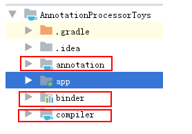
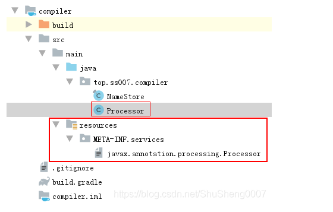

### 前言
现在Android开发中许多流行的第三方库都使用了注解生成代码的方式，例如 ButterKnife, Dagger2，Glide等等，初次接触时感觉好神奇，后来感觉很实用，再后来想知道怎么实现的，再后来就是试试自己也写一个。

我们先人很早就说过：纸上得来终觉浅，绝知此事要躬行，所以让我们干起来吧。

### 概述
Java 是从 Java 5 开始支持注解的，是其很重要的语言特性，然而其潜力的发掘也仅仅是近几年的事情。Java 5 真的是Java 一个里程碑式的版本，各种重要特性均源自此版本。

注解一般有两种方式处理方式：
第一：运行时获取并使用注解信息，此方式属于反射范畴，有性能损失，例如Retrofit2等。
第二：编译时获取注解信息，并据此产生java代码文件，无性能损失，例如ButterKnife, Dagger2等。

此次我们重点关注第二种方式

### 注解处理器
#####   预备知识
1.  理解java注解的基本知识， 如果不熟请参考 秒懂 Java注解类型（@Annotation）
2.  理解java代码生成库 javapoet的基本使用方法 JavpPoet

#####   工作原理
将我们的源码使用特殊的注解标记，然后在编译成字节码的时候根据这些注解生成新的java源码，省去了我们自己编写此部分代码的工作量。

#####   项目结构
我们准备实现类似于ButterKnife中最常使用到的两个注解，一个@BindView，一个是@OnClick。



如上图所示，整个项目主要有如下四个部分

1.  app : Android 项目主module，是一个 android application
2.  annotation: 定义了所有的注解， 是一个 java library
3.  compiler: 处理相关注解，关键的代码都在这个module里，是一个 java library
4.  binder： 处理生成代码的调用，是一个android library

接下来我们就从零构建一个Android 注解处理器，并在此过程中掌握相关的知识。首先我们先使用AS创建一个Android 工程，这个就不用再啰嗦了，如果这个都不会还搞个毛线。

#####   定义注解
在工程中添加一个java library类型的module，取名annotation

```
Android Studio -> file -> new module -> java library
```

定义三个注解

1.  BindView：其实不用做过多的解释，用过ButterKnife都知道这是干啥的。其作用就是将XML layout 文件中的view映射到代码中
```
@Retention(RetentionPolicy.SOURCE)
@Target(ElementType.FIELD)
public @interface BindView {
    @IdRes int value();
}
```
note: 如果对注解的定义有疑问， 秒懂 Java注解类型（@Annotation） 走起来。

2.  OnClick : 映射view的一个click事件，当一个view被点击后，此注解标记的对应方法就会触发。
```
@Retention(RetentionPolicy.SOURCE)
@Target(ElementType.METHOD)
public @interface OnClick {
    @IdRes int value();
}
```

3.  Keep ：这个就比较有意思了，我们准备使用此注解告诉编译器，不要混淆被此注解标记的类。由于混淆的存在程序中使用反射的类都不应该被混淆，不然运行时就找不到了。
```
@Retention(RetentionPolicy.CLASS)
@Target(ElementType.TYPE)
public @interface Keep {
}
```
至此，注解就定义完了，接下来我们定义本文最重要的部分，注解处理器

### 定义注解处理器
#####   原理
注解处理器和编译是并行运行的，注解处理器是一轮一轮的运行的。例如我们有一个包含注解的类MainActivity
```
public class MainActivity extends AppCompatActivity {

    @BindView(R.id.tv_hello)
    TextView tvHello;
  }
```

在第一轮处理注解时，我们生成了新的类,而这个类使用@Keep注解标记了，那么注解处理器就会开始下一轮的处理，直到生成的类里面再也没有任何注解了。
```
@Keep
public class MainActivity$Binding {
...
}
```
上述为java注解的运行机制，我们要使用这个机制还需要将我们写的注解处理器注册到编译器认识的地方去。

#####   创建项目
新建一个module，取名为compiler，类型必须为java library，如下所示
```
Android Studio -> file -> new module -> java library
```

1.  新建一个类Processor，这类必须继承至 AbstractProcessor
2.  必须严格按如下图所示的命名方式创建一个文件

javax.annotation.processing.Processor，文件的内容为你定义的注解处理器的全类名，例如此处就是Processor的全类名：top.ss007.compiler.Processor。

note: 这是java原生的方法，如果你觉得麻烦，可以使用google的 AutoService，使用@AutoService标记你的注解处理器，这个库就会为你产生这个注册目录了。



Processor 一般会重写父类的4个方法：

**init：**
初始化工作，我们可以得到一些有用的工具，例如 Filer，我们需要它将生成的代码写入文件中

**process：**
最重要的方法，所有的注解处理都是在此完成

**getSupportedAnnotationTypes：**
返回我们所要处理的注解的一个集合

**getSupportedSourceVersion：**
要支持的java版本

下面是processor的代码片段

```
public class Processor extends AbstractProcessor {
    private Filer filer;
    private Messager messager;
    private Elements elementUtils;

    //每个存在注解的类整理出来，key:package_classname value:被注解的类型元素
    private Map<String, List<Element>> annotationClassMap = new HashMap<>();

    @Override
    public synchronized void init(ProcessingEnvironment processingEnv) {
        super.init(processingEnv);
        filer = processingEnv.getFiler();
        messager = processingEnv.getMessager();
        elementUtils = processingEnv.getElementUtils();
    }

    @Override
    public boolean process(Set<? extends TypeElement> annotations, RoundEnvironment roundEnv) {      
        if (!roundEnv.processingOver()) {
           ...
            for (Map.Entry<String, List<Element>> entry : annotationClassMap.entrySet()) {
                /*
                创建要生成的类，如下所示
                @Keep
                public class MainActivity$Binding {}*/
                TypeSpec.Builder classBuilder = TypeSpec.classBuilder(generatedClassName)
                        .addModifiers(Modifier.PUBLIC)
                        .addAnnotation(Keep.class);
               ...

                //将类写入文件中
                try {
                    JavaFile.builder(packageName,
                            classBuilder.build())
                            .build()
                            .writeTo(filer);
                } catch (IOException e) {
                    messager.printMessage(Diagnostic.Kind.ERROR, e.toString());
                }
            }
        }
        return true;
    }

    @Override
    public Set<String> getSupportedAnnotationTypes() {
        return new TreeSet<>(Arrays.asList(
                BindView.class.getCanonicalName(),
                OnClick.class.getCanonicalName(),
                Keep.class.getCanonicalName()));
    }

    @Override
    public SourceVersion getSupportedSourceVersion() {
        return SourceVersion.latestSupported();
    }
...

}
```

上面的代码也没有什么神奇的，就是在process方法里面处理我们定义的注解，然后使用javapoet 生成相应的代码，而这些代码本应该是我们程序员自己手写的，现在自动生成了,具体的看源码吧，文章最后贴出了源代码的地址。

#####   定义初始化模块
代码是生成了，那我们怎么使用呢，注解生成器的代码需要我们主动去触发，还记得ButterKnife中那句ButterKnife.bind(this); 吗，就是干这个事情的

新建一个module，取名为binder，类型必须为android library，如下所示
```
Android Studio -> file -> new module -> android library
```

定义一个Binding类
```
public class Binding {
    private Binding(){}

    private static <T extends Activity> void instantiateBinder(T target,String suffix){
        Class<?> targetClass=target.getClass();
        String className=targetClass.getName();
        try {
            Class<?>bindingClass =targetClass
                    .getClassLoader()
                    .loadClass(className+suffix);
            Constructor<?> classConstructor=bindingClass.getConstructor(targetClass);
            try {
                classConstructor.newInstance(target);
            } catch (IllegalAccessException e) {
                throw new RuntimeException("Unable to invoke " + classConstructor, e);
            } 
            ...
    }

    public static <T extends Activity> void bind(T activity) {
        instantiateBinder(activity, BindingSuffix.GENERATED_CLASS_SUFFIX);
    }
}
我们通过反射调用生成类的构造方法，而所有的绑定逻辑都在那个类的构造方法里面，如下所示

  public MainActivity$Binding(MainActivity activity) {
    bindViews(activity);
    bindOnClicks(activity);
  }
```
是否还记得前面我们使用@Keep标记了生成的类，它的作用就是防止此类被混淆，确保反射调用可以顺利进行。那keep是怎么起作用的呢？

在此module的 proguard-rules.pro 文件中添加如下代码。
```
-keep class top.ss007.annotation.Keep
-keep @top.ss007.annotation.Keep public class *
-keepclassmembers @top.ss007.annotation.Keep class ** { *;}
```

然后在其build.gradle 文件中添加如下代码
```
apply plugin: 'com.android.library'
android {
    defaultConfig {
        ...
        consumerProguardFiles 'proguard-rules.pro'
    }
...

}
```
上面的代码表示使用此module的 android application 都要使用 proguard-rules.pro 文件中定义的规则，我们就是在这个文件中申明不要混淆带有@Keep标记的类的。

#####   如何使用
这个就比较简单了，毕竟我们使用ButterKnife那么多年了。在app的build.gradle 文件中添加
```
dependencies {
    ...
    implementation project(':binder')
    annotationProcessor project(':compiler')
    ...
```
在Activity中绑定即可
```
public class MainActivity extends AppCompatActivity {

    @BindView(R.id.tv_hello)
    TextView tvHello;

    @Override
    protected void onCreate(Bundle savedInstanceState) {
        super.onCreate(savedInstanceState);
        setContentView(R.layout.activity_main);
        Binding.bind(this);
    }

    @OnClick(R.id.btn_click)
    void onHelloBtnClick(View v){
        tvHello.setText("hello android annotation processor");
    }
}
```
### 总结
本文只是描述如何开发一个 Android Annotation Processor， 要想深入掌握这部分内容，必须自己动手实践一下，一些著名开源项目可能太大，那就从这个玩具开始吧，等了解了原理后就可以去看著名的开源库了，然后进而写一个著名的开源库。

好了，我媳妇叫我吃饭了,就到这吧... 翠花，今天啥饭啊？

源码
Github源码地址：[AnnotationProcessorToys](https://github.com/shusheng007/AnnotationProcessorToys)

参考文章：Android Annotation Processing Tutorial

***
https://shusheng007.top/2021/09/09/android-annotation-processor/
***