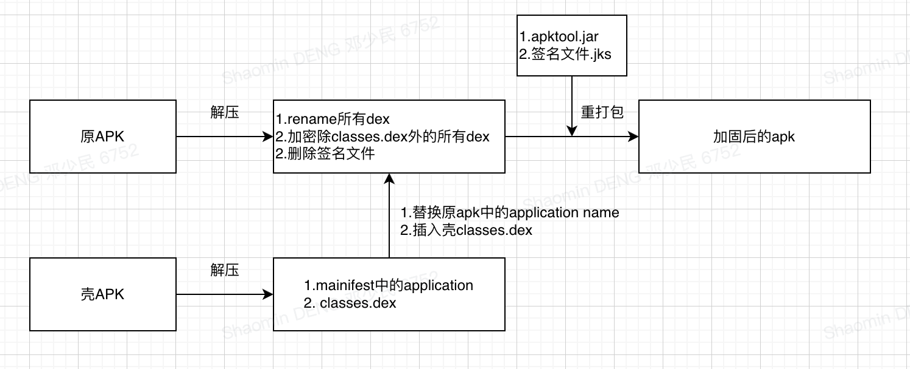
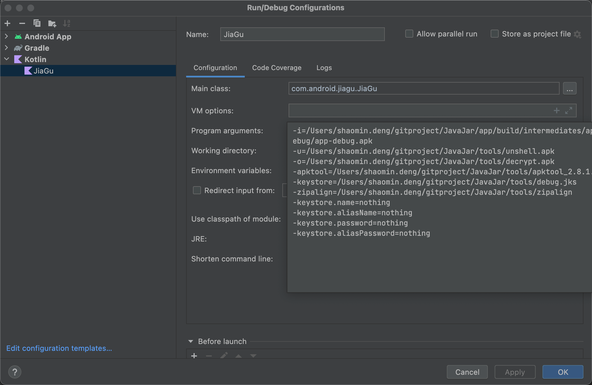

一种简单的方式对apk进行dex加密，加固的流程如下



对除classes.dex之外的所有dex进行aes加密，加密后的dex无法通过android studio或者其他工具进行打开或者反编译；根据流程图中的步骤，需要以下工具：

* apktool.jar：用来对apk进行解包合重打包，下载地址：https://bitbucket.org/iBotPeaches/apktool/downloads/ 本文使用的是2.8.1
* debug.jks：签名文件
* zipalign：用于v1签名后的字节码对齐，文件目录：Library/Android/sdk/build-tools/33.0.1/zipalign，本文用的33.0.1

### 壳apk
这个apk主要的职责就是在application中负责将加密后的dex进行解密然后插入到dexlist当中，因为要插入到加固后app当中，所以需要遵循以下规则：
* 1. 尽可能的小：
    *  对原apk的大小影响降到最低
    * 不要使用Kotlin编写，kotlin库有1.5M左右
* 2. 尽可能少依赖：防止和原apk存在冲突

新建一个apk命名为UnShellApp，不需要Activity，去除theme以及所有不需要的依赖，因为涉及到解密和文件相关操作引入部分hutool库，完整的build.gradle如下
```
plugins {
    id 'com.android.application'
}

android {
    namespace 'com.android.unshellapp'
    compileSdk 33

    defaultConfig {
        applicationId "com.android.unshellapp"
        minSdk 24
        targetSdk 33
        versionCode 1
        versionName "1.0"
        multiDexEnabled false
    }

    buildTypes {
        release {
            minifyEnabled false
            proguardFiles getDefaultProguardFile('proguard-android-optimize.txt'), 'proguard-rules.pro'
        }
    }
    compileOptions {
        sourceCompatibility JavaVersion.VERSION_1_8
        targetCompatibility JavaVersion.VERSION_1_8
    }
    packagingOptions {
        pickFirst('META-INF/INDEX.LIST')
    }
    applicationVariants.all { variant ->
        variant.outputs.all {
            outputFileName = "unshell.apk"
        }
    }
}

dependencies {

    implementation 'cn.hutool:hutool-crypto:5.8.16'
    implementation 'cn.hutool:hutool-core:5.8.16'
}
```
#### UnShellApplication.java
* 解密apk加密后的dex
* 反射调用原apk的application

```
public class UnShellApplication extends Application {
    private final String AES_KEY = "gH3p9sR6wQ2dE5fT";

    @Override
    protected void attachBaseContext(Context base) {
        super.attachBaseContext(base);
        long startTime = System.currentTimeMillis();
        File apkFile = new File(getApplicationInfo().sourceDir);
        File sourceDir = new File(getCacheDir(), "apk/source");
        File decryptDirs = new File(getCacheDir(), "apk/decrypt");
        List<File> loadDex = new ArrayList<>();
        ZipUtil.unzip(apkFile, sourceDir);
        for (int i = 0; i < sourceDir.listFiles().length; i++) {
            File file = sourceDir.listFiles()[i];
            if (file.getName().endsWith(".dex") && !file.getName().equals("classes.dex")) {
                byte[] decryptBytes = SecureUtil.aes(AES_KEY.getBytes()).decrypt(FileUtil.readBytes(file));
                File dest = FileUtil.writeBytes(decryptBytes, new File(decryptDirs, file.getName()));
                loadDex.add(dest);
            }
        }
        try {
            //6.把解密后的文件加载到系统
            loadDex(loadDex, decryptDirs);
        } catch (Exception e) {
            e.printStackTrace();
        }
        log("decrypt dex const:" + (System.currentTimeMillis() - startTime) + "");
    }

    private void loadDex(List<File> dexFiles, File versionDir) throws Exception {
        //1.先从 ClassLoader 中获取 pathList 的变量
        Field pathListField = ReflectUtils.findField(getClassLoader(), "pathList");
        //1.1 得到 DexPathList 类
        Object pathList = pathListField.get(getClassLoader());
        //1.2 从 DexPathList 类中拿到 dexElements 变量
        Field dexElementsField = ReflectUtils.findField(pathList, "dexElements");
        //1.3 拿到已加载的 dex 数组
        Object[] dexElements = (Object[]) dexElementsField.get(pathList);

        //2. 反射到初始化 dexElements 的方法，也就是得到加载 dex 到系统的方法
        Method makeDexElements = ReflectUtils.findMethod(pathList, "makePathElements", List.class, File.class, List.class);
        //2.1 实例化一个 集合  makePathElements 需要用到
        ArrayList<IOException> suppressedExceptions = new ArrayList<IOException>();
        //2.2 反射执行 makePathElements 函数，把已解码的 dex 加载到系统，不然是打不开 dex 的，会导致 crash
        Object[] addElements = (Object[]) makeDexElements.invoke(pathList, dexFiles, versionDir, suppressedExceptions);

        //3. 实例化一个新数组，用于将当前加载和已加载的 dex 合并成一个新的数组
        Object[] newElements = (Object[]) Array.newInstance(dexElements.getClass().getComponentType(), dexElements.length + addElements.length);
        //3.1 将系统中的已经加载的 dex 放入 newElements 中
        System.arraycopy(dexElements, 0, newElements, 0, dexElements.length);
        //3.2 将解密后已加载的 dex 放入新数组中
        System.arraycopy(addElements, 0, newElements, dexElements.length, addElements.length);

        //4. 将合并的新数组重新设置给 DexPathList的 dexElements
        dexElementsField.set(pathList, newElements);
    }

    @Override
    public void onCreate() {
        loadSourceApplication();
        super.onCreate();
    }

    private void loadSourceApplication() {
        try {
            String appClassName = null;
            ApplicationInfo ai = getPackageManager().getApplicationInfo(getPackageName(), PackageManager.GET_META_DATA);
            Bundle bundle = ai.metaData;
            if (bundle != null && bundle.containsKey("APPLICATION_CLASS_NAME")) {
                appClassName = bundle.getString("APPLICATION_CLASS_NAME");
            } else {
                return;
            }
            log("source apk application:" + appClassName);
            // 有值的话调用该Applicaiton
            Object currentActivityThread = ReflectUtils.invokeStaticMethod(
                    "android.app.ActivityThread", "currentActivityThread",
                    new Class[]{}, new Object[]{});
            Object mBoundApplication = ReflectUtils.getFieldOjbect(
                    "android.app.ActivityThread", currentActivityThread,
                    "mBoundApplication");
            Object loadedApkInfo = ReflectUtils.getFieldOjbect(
                    "android.app.ActivityThread$AppBindData",
                    mBoundApplication, "info");
            // 把当前进程的mApplication 设置成了null
            ReflectUtils.setFieldOjbect("android.app.LoadedApk", "mApplication",
                    loadedApkInfo, null);
            Object oldApplication = ReflectUtils.getFieldOjbect(
                    "android.app.ActivityThread", currentActivityThread,
                    "mInitialApplication");
            // http://www.codeceo.com/article/android-context.html
            ArrayList<Application> mAllApplications = (ArrayList<Application>) ReflectUtils
                    .getFieldOjbect("android.app.ActivityThread",
                            currentActivityThread, "mAllApplications");
            mAllApplications.remove(oldApplication);// 删除oldApplication

            ApplicationInfo appinfo_In_LoadedApk = (ApplicationInfo) ReflectUtils
                    .getFieldOjbect("android.app.LoadedApk", loadedApkInfo,
                            "mApplicationInfo");
            ApplicationInfo appinfo_In_AppBindData = (ApplicationInfo) ReflectUtils
                    .getFieldOjbect("android.app.ActivityThread$AppBindData",
                            mBoundApplication, "appInfo");
            appinfo_In_LoadedApk.className = appClassName;
            appinfo_In_AppBindData.className = appClassName;
            Application app = (Application) ReflectUtils.invokeMethod(
                    "android.app.LoadedApk", "makeApplication", loadedApkInfo,
                    new Class[]{boolean.class, Instrumentation.class},
                    new Object[]{false, null});// 执行
            // makeApplication（false,null）
            ReflectUtils.setFieldOjbect("android.app.ActivityThread",
                    "mInitialApplication", currentActivityThread, app);

            Iterator it;
            if (Build.VERSION.SDK_INT < 19) {
                // 解决了类型强转错误的问题，原因：
                // 4.4以下系统 mProviderMap 的类型是 HashMap
                // 4.4以上系统 mProviderMap 的类型是 ArrayMap
                HashMap mProviderMap = (HashMap) ReflectUtils.getFieldOjbect(
                        "android.app.ActivityThread", currentActivityThread,
                        "mProviderMap");
                it = mProviderMap.values().iterator();
            } else {
                ArrayMap mProviderMap = (ArrayMap) ReflectUtils.getFieldOjbect(
                        "android.app.ActivityThread", currentActivityThread,
                        "mProviderMap");
                it = mProviderMap.values().iterator();
            }
            while (it.hasNext()) {
                Object providerClientRecord = it.next();
                Object localProvider = ReflectUtils.getFieldOjbect(
                        "android.app.ActivityThread$ProviderClientRecord",
                        providerClientRecord, "mLocalProvider");
                ReflectUtils.setFieldOjbect("android.content.ContentProvider",
                        "mContext", localProvider, app);
            }
            app.onCreate();

        } catch (Exception ex) {
            ex.printStackTrace();
        }
    }

    private void log(String msg) {
        Log.e("unshell", msg);
    }
}

```
#### ReflectUtils.java
反射相关的工具类
```
package com.android.unshellapp;

import java.io.File;
import java.io.RandomAccessFile;
import java.lang.reflect.Field;
import java.lang.reflect.InvocationTargetException;
import java.lang.reflect.Method;
import java.util.Arrays;


public class ReflectUtils {


    /**
     * 反射获得 指定对象(当前-》父类-》父类...)中的 成员属性
     *
     * @param instance
     * @param name
     * @return
     * @throws NoSuchFieldException
     */
    public static Field findField(Object instance, String name) throws NoSuchFieldException {
        Class clazz = instance.getClass();
        //反射获得
        while (clazz != null) {
            try {
                Field field = clazz.getDeclaredField(name);
                //如果无法访问 设置为可访问
                if (!field.isAccessible()) {
                    field.setAccessible(true);
                }
                return field;
            } catch (NoSuchFieldException e) {
                //如果找不到往父类找
                clazz = clazz.getSuperclass();
            }
        }
        throw new NoSuchFieldException("Field " + name + " not found in " + instance.getClass());
    }


    /**
     * 反射获得 指定对象(当前-》父类-》父类...)中的 函数
     *
     * @param instance
     * @param name
     * @param parameterTypes
     * @return
     * @throws NoSuchMethodException
     */
    public static Method findMethod(Object instance, String name, Class... parameterTypes) throws NoSuchMethodException {
        Class clazz = instance.getClass();
        while (clazz != null) {
            try {
                Method method = clazz.getDeclaredMethod(name, parameterTypes);
                if (!method.isAccessible()) {
                    method.setAccessible(true);
                }
                return method;
            } catch (NoSuchMethodException e) {
                //如果找不到往父类找
                clazz = clazz.getSuperclass();
            }
        }
        throw new NoSuchMethodException("Method " + name + " with parameters " + Arrays.asList(parameterTypes) + " not found in " + instance.getClass());
    }
    /**
     * 反射执行类的静态函数(public)
     *
     * @param class_name
     *            类名
     * @param method_name
     *            函数名
     * @param pareTyple
     *            函数的参数类型
     * @param pareVaules
     *            调用函数时传入的参数
     * @return
     */
    @SuppressWarnings({ "unchecked", "rawtypes" })
    public static Object invokeStaticMethod(String class_name,
                                            String method_name, Class[] pareTyple, Object[] pareVaules) {

        try {
            Class obj_class = Class.forName(class_name);
            Method method = obj_class.getMethod(method_name, pareTyple);
            return method.invoke(null, pareVaules);
        } catch (SecurityException e) {
            e.printStackTrace();
        } catch (IllegalArgumentException e) {
            e.printStackTrace();
        } catch (IllegalAccessException e) {
            e.printStackTrace();
        } catch (NoSuchMethodException e) {
            e.printStackTrace();
        } catch (InvocationTargetException e) {
            e.printStackTrace();
        } catch (ClassNotFoundException e) {
            e.printStackTrace();
        }
        return null;

    }

    /**
     * 反射执行类的函数（public）
     *
     * @param class_name
     * @param method_name
     * @param obj
     * @param pareTyple
     * @param pareVaules
     * @return
     */
    @SuppressWarnings({ "rawtypes", "unchecked" })
    public static Object invokeMethod(String class_name, String method_name,
                                      Object obj, Class[] pareTyple, Object[] pareVaules) {

        try {
            Class obj_class = Class.forName(class_name);
            Method method = obj_class.getMethod(method_name, pareTyple);
            return method.invoke(obj, pareVaules);
        } catch (SecurityException e) {
            e.printStackTrace();
        } catch (IllegalArgumentException e) {
            e.printStackTrace();
        } catch (IllegalAccessException e) {
            e.printStackTrace();
        } catch (NoSuchMethodException e) {
            e.printStackTrace();
        } catch (InvocationTargetException e) {
            e.printStackTrace();
        } catch (ClassNotFoundException e) {
            e.printStackTrace();
        }
        return null;

    }

    /**
     * 反射得到类的属性（包括私有和保护）
     *
     * @param class_name
     * @param obj
     * @param filedName
     * @return
     */
    @SuppressWarnings("rawtypes")
    public static Object getFieldOjbect(String class_name, Object obj,
                                        String filedName) {
        try {
            Class obj_class = Class.forName(class_name);
            Field field = obj_class.getDeclaredField(filedName);
            field.setAccessible(true);
            return field.get(obj);
        } catch (SecurityException e) {
            e.printStackTrace();
        } catch (NoSuchFieldException e) {
            e.printStackTrace();
        } catch (IllegalArgumentException e) {
            e.printStackTrace();
        } catch (IllegalAccessException e) {
            e.printStackTrace();
        } catch (ClassNotFoundException e) {
            e.printStackTrace();
        }
        return null;

    }

    /**
     * 反射得到类的静态属性（包括私有和保护）
     *
     * @param class_name
     * @param filedName
     * @return
     */
    @SuppressWarnings("rawtypes")
    public static Object getStaticFieldOjbect(String class_name,
                                              String filedName) {

        try {
            Class obj_class = Class.forName(class_name);
            Field field = obj_class.getDeclaredField(filedName);
            field.setAccessible(true);
            return field.get(null);
        } catch (SecurityException e) {
            e.printStackTrace();
        } catch (NoSuchFieldException e) {
            e.printStackTrace();
        } catch (IllegalArgumentException e) {
            e.printStackTrace();
        } catch (IllegalAccessException e) {
            e.printStackTrace();
        } catch (ClassNotFoundException e) {
            e.printStackTrace();
        }
        return null;

    }

    /**
     * 设置类的属性（包括私有和保护）
     *
     * @param classname
     * @param filedName
     * @param obj
     * @param filedVaule
     */
    @SuppressWarnings("rawtypes")
    public static void setFieldOjbect(String classname, String filedName,
                                      Object obj, Object filedVaule) {
        try {
            Class obj_class = Class.forName(classname);
            Field field = obj_class.getDeclaredField(filedName);
            field.setAccessible(true);
            field.set(obj, filedVaule);
        } catch (SecurityException e) {
            e.printStackTrace();
        } catch (NoSuchFieldException e) {
            e.printStackTrace();
        } catch (IllegalArgumentException e) {
            e.printStackTrace();
        } catch (IllegalAccessException e) {
            e.printStackTrace();
        } catch (ClassNotFoundException e) {
            e.printStackTrace();
        }
    }

    /**
     * 设置类的静态属性（包括私有和保护）
     *
     * @param class_name
     * @param filedName
     * @param filedVaule
     */
    @SuppressWarnings("rawtypes")
    public static void setStaticOjbect(String class_name, String filedName,
                                       Object filedVaule) {
        try {
            Class obj_class = Class.forName(class_name);
            Field field = obj_class.getDeclaredField(filedName);
            field.setAccessible(true);
            field.set(null, filedVaule);
        } catch (SecurityException e) {
            e.printStackTrace();
        } catch (NoSuchFieldException e) {
            e.printStackTrace();
        } catch (IllegalArgumentException e) {
            e.printStackTrace();
        } catch (IllegalAccessException e) {
            e.printStackTrace();
        } catch (ClassNotFoundException e) {
            e.printStackTrace();
        }
    }
}
```
编译apk获取产物：unshell.apk 备用。

!> defaultconfig中配置multiDexEnabled = false，防止dex进行分包。

### 加密jar
用来加密apk dex的jar包，不涉及到注入到apk中，为了方便使用Kotlin编写，工作流程如下：
* 1. 解压原apk，
    * 将所有原apk的dex进行加密；
    * 所有dex按顺序进行rename(eg: classes2.dex -> classes3.dex)，因为要插入壳中的classes.dex，这里留好插入的坑
    * 获取原application name
* 2. 解压壳unshell.apk
    * 得到classes.dex，并将dex copy到原apk的解压目录
    * 获取到manifest中application的name
* 3. 使用壳中的application name替换原apk中的application，并将原application name写入meta data中

#### jar的入口函数
用来获取执行jar时的入口参数并对参数进行必要校验。
* -i：原apk路径
* -o：加固后的apk路径
* -u：壳apk路径，也就是上文中的unshell.apk
* -zipalign：zipalign工具路径
* -apktool：apktool路径
* -keystore：keystore文件路径
* -keystore.name：keystore对应参数
* -keystore.aliasName：keystore对应参数
* -keystore.password：keystore对应参数
* -keystore.aliasPassword：keystore对应参数

```
object JiaGu {
    const val AES_KEY = "gH3p9sR6wQ2dE5fT"
    var APKTOOL_PATH: String? = null
    var KEYSTORE_PATH: String? = null
    var keystore_name: String? = null
    var keystore_aliasName: String? = null
    var keystore_password: String? = null
    var keystore_aliasPassword: String? = null
    var ZIPALIGN_PATH: String? = null

    @JvmStatic
    fun main(args: Array<String>) {
        var inPath: String? = null
        var outPath: String? = null
        var unShellPath: String? = null
        args.map {
            inPath = findParams(args, "-i")
            outPath = findParams(args, "-o")
            unShellPath = findParams(args, "-u")
            ZIPALIGN_PATH = findParams(args,"-zipalign")
            APKTOOL_PATH = findParams(args, "-apktool")
            KEYSTORE_PATH = findParams(args, "-keystore")
            keystore_name = findParams(args, "-keystore.name")
            keystore_aliasName = findParams(args, "-keystore.aliasName")
            keystore_password = findParams(args, "-keystore.password")
            keystore_aliasPassword = findParams(args, "-keystore.aliasPassword")
        }
        if (!File(inPath).exists() || !File(inPath).name.endsWith(".apk")) {
            throw RuntimeException("-i params not available")
        }
        if (!File(unShellPath).exists() || !File(unShellPath).name.endsWith(".apk")) {
            throw RuntimeException("-u params not available")
        }
        if (!File(outPath).name.endsWith(".apk")) {
            throw RuntimeException("-o params not available")
        }
        if (!File(KEYSTORE_PATH).exists()) {
            throw RuntimeException("-keystore params not available")
        }
        if (!File(APKTOOL_PATH).exists()) {
            throw RuntimeException("-apktool params not available")
        }
        FileUtil.del(outPath)
        ApkShellUtils.apkShell(
            inPath!!,
            unShellPath!!,
            outPath!!
        )
    }

    fun findParams(args: Array<String>, name: String): String? {
        args.map {
            if (it.startsWith(name)) {
                val array = it.split("=")
                if (array.size > 1) {
                    return array[1]
                }
            }
        }
        return null
    }
}
```
#### ApkShellUtils.kt
加固的核心类，工作流程为：
* 1. 加压原apk，获取manifest路径
* 2. 解压unshell apk，获取manifest路径，获取classes.dex
* 3. 加密并重命名原apk下所有dex
* 4. 将unshell apk的classes.dex copy至原apk解压目录
* 5. 取壳apk中manifest application的name替换原apk manifest中application的name，并将原application name写入meta data中
* 6. 使用apktool重新打包
* 7. 使用zipalign对打包后的apk进行对齐
* 8. 删除中间过程的解压目录，清扫现场

```
object ApkShellUtils {
    fun apkShell(sourceApkPath: String, unShellApkPath: String, outApkPath: String) {
        //解压原apk
        val sourceApkDstPath = sourceApkPath.replace(".apk", "")
        FileUtil.del(sourceApkDstPath)
        decompile(sourceApkPath, sourceApkDstPath)
        val primaryManifestPath = sourceApkDstPath + File.separator + "AndroidManifest.xml"

        //解压解壳apk
        val unShellApkDstPath = unShellApkPath.replace(".apk", "")
        FileUtil.del(unShellApkDstPath)
        decompile(unShellApkPath, unShellApkDstPath)
        val unShellManifestPath = unShellApkDstPath + File.separator + "AndroidManifest.xml"
        val unShellDexPath = unShellApkDstPath + File.separator + "classes.dex"
        val unShellFile = File(unShellDexPath)
        val unApkDir = File(sourceApkDstPath)
        val dexArray = ArrayList<File>()
        for (file in unApkDir.listFiles()) { //读取解壳后的dex
            if (file.name.endsWith(".dex")) {
                dexArray.add(file)
            }
        }
        //合并所有dex
        mergeDex(dexArray, unShellFile)
        val mateInfPath = sourceApkDstPath + File.separator + "META-INF"
        //删除meta-inf，重新签名后会生成
        FileUtil.del(mateInfPath)
        //获取壳ApplicationName
        val unShellApplicationName =
            AndroidXmlUtils.readApplicationName(unShellManifestPath)
        //获取原applicationName
        val sourceApplicationName =
            AndroidXmlUtils.readApplicationName(primaryManifestPath)
        //改变原Applicationname为壳ApplicationName
        AndroidXmlUtils.changeApplicationName(
            primaryManifestPath,
            unShellApplicationName
        )
        //将原ApplicationName写入mateData中，解壳application中会读取并替换应用Application
        if (sourceApplicationName != null) {
            AndroidXmlUtils.addMateData(
                primaryManifestPath,
                "APPLICATION_CLASS_NAME",
                sourceApplicationName
            )
        }
        //apk回编
        compile(sourceApkDstPath, outApkPath)
        //v1签名
        V1(outApkPath, defaultKeystore)
        //由于使用的是v1签名(jarsigner)，所以在签名之后进行对齐
        ZipAlign.zipalign(outApkPath)
        //清理目录
        FileUtil.del(sourceApkDstPath)
        FileUtil.del(unShellApkDstPath)
    }

    private fun mergeDex(sourceDex: ArrayList<File>, unShellDex: File) {
        sourceDex.sortByDescending { it.name }
        sourceDex.map { file ->
            //0,2,3,4
            val ts = file.name.replace("classes", "").replace(".dex", "")
            var newIndex = if (ts.isNullOrEmpty()) 2 else ts.toInt() + 1
            val newName = "${file.parent}/classes${newIndex}.dex"
            val encryptBytes =
                SecureUtil.aes(JiaGu.AES_KEY.toByteArray()).encrypt(FileUtil.readBytes(file))
            FileUtil.writeBytes(encryptBytes, newName)
        }
        //将壳的dex改为默认启动的dex,提高dex的遍历效率
        FileUtil.copy(
            unShellDex.absolutePath,
            File(sourceDex[0].parent, "classes.dex").absolutePath,
            true
        )
    }
}
```
生成jiagu.jar，并执行jiagu.jar，完整的jar命令：

```
java -jar /Users/shaomin.deng/gitproject/JavaJar/jiagu/build/libs/jiagu.jar 
-i=/Users/shaomin.deng/gitproject/JavaJar/app/build/intermediates/apk/debug/app-debug.apk 
-u=/Users/shaomin.deng/gitproject/JavaJar/tools/unshell.apk 
-o=/Users/shaomin.deng/gitproject/JavaJar/tools/decrypt.apk 
-apktool=/Users/shaomin.deng/gitproject/JavaJar/tools/apktool_2.8.1.jar 
-zipalign=/Users/shaomin.deng/gitproject/JavaJar/tools/zipalign 
-keystore=/Users/shaomin.deng/gitproject/JavaJar/tools/debug.jks
 -keystore.name=nothing 
 -keystore.aliasName=nothing 
 -keystore.password=nothing 
 -keystore.aliasPassword=nothing

```
为调试方便可以在Edit Configurations中指定jar入参：


通过日志查看解密消耗的时间以及原app的application生命周期是否正常执行

```
---------------------------- PROCESS STARTED (15683) for package com.android.javajar ----------------------------
2023-08-29 16:57:53.019 15683-15683 unshell                 com.android.javajar                  E  decrypt dex const:864
2023-08-29 16:57:53.028 15683-15683 unshell                 com.android.javajar                  E  source apk application:com.android.javajar.MineApplication
2023-08-29 16:57:53.030 15683-15683 unshell                 com.android.javajar                  E  call source apk attachBaseContext
2023-08-29 16:57:53.030 15683-15683 unshell                 com.android.javajar                  E  call source apk onCreate
```

### source code

[壳工程](node/app-encrypt/UnShellApp.zip)

***
其他一些加密方式，合并所有dex：

https://github.com/yangkun19921001/DexEncryptionDecryption

https://github.com/ray-tianfeng/dex-shell
***