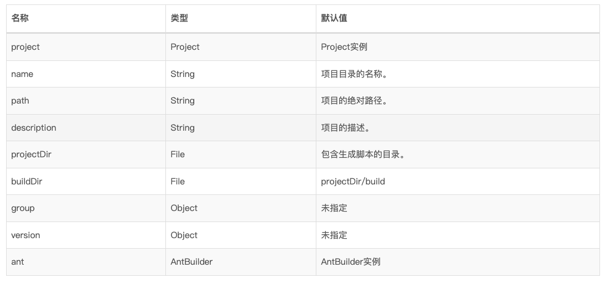
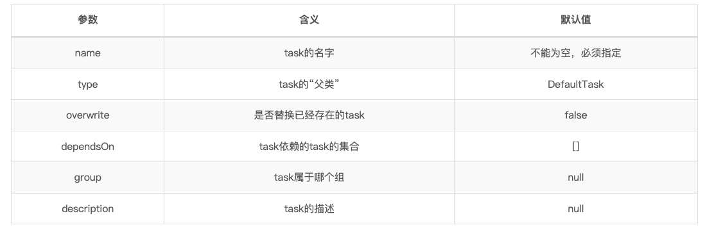
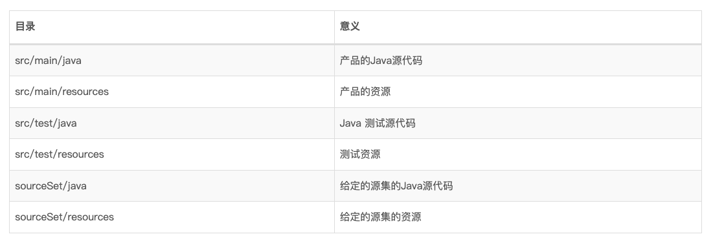

### 概述
Gradle是一个基于 JVM 的富有突破性构建工具，Gradle 的核心在于基于 Groovy 的丰富而可扩展的域描述语言(DSL)。

Gradle最重要的是Project和Task：

*   任何一个Gradle项目都是由一个或多个projects组成的，projects其实就是Idea、AndroidStudio中的Module；
*   tasks是任务，它是Gradle中的原子性操作，如编译、打包、生成javadoc等，一个project中会有多个tasks；

可以通过gradle tasks查看当前可执行的tasks。

需要注意的一些地方：

*   Gradle设计之初就是一个通用的构建工具，它允许你用它来构建任何应用，唯一的限制是Gradle的远程依赖管理目前仅支持Maven和Ivy的仓库；
*   Gradle的构建模块是基于task的，Gradle要做的就是按照task之间的依赖关系来组织task按照合适的顺序运行；
*   Gradle评估(evaluate)和指定构建脚本时有三个固定步骤：

    1.  初始化(Initialization): 初始化构建所需的运行环境，并检查哪些projects参与构建
    2.  配置(Configuration): 将tasks组织起来，决定它们按何种顺序执行
    3.  执行(Execution): 执行tasks
*   Gradle提供了集中方式以扩展：
    *  自定义task types
    *  自定义task actions
    *  在projects和tasks中指定额外的属性
    *  自定义conventions
    *   custon model
可以通过在命令行运行gradle命令来执行构建，gradle 命令会从当前目录下寻找build.gradle文件来执行构建。称 build.gradle 文件为构建脚本，严格来说这其实是一个构建配置脚本。

```
task hello {
    doLast {
        println 'Hello world!'
    }
}
```

执行 gradle -q hello（-q 参数的目的是：用来控制 gradle 的日志级别，可以保证只输出我们需要的内容）

### 构建基础

####    创建工程
使用gradle init可创建一个新工程。

####    Gradle 图形用户界面
可以通过gradle –gui 参数来启动GUI界面，通过gradle –gui& 让它作为后台任务运行。

####    Conventions
Conventions：声明式，约定式。Gradle吸收了Maven的声明式的特点，所谓声明式直接的体现就是我们将特定的文件（如代码、资源文件）放在特定的目录下，Gradle会自动地在相应的目录下找到对应的文件，减少了需要自定义的构建脚本。

项目创建完成之后，目录结构如下：
```
.gradle/    # 存放Gradle的缓存，缓存可用于加快构建速度
.idea/      # Idea生成的，与Gradle无关
gradle/     # gradle文件夹中只含有wrapper文件夹，用于存放GradleWraper的jar包以及配置文件
module1/    # module
module2/    # module
build.gradle        # 根目录下的build.gradle文件，是项目的构建脚本
gradle.properties   # 配置文件
gradlew             # Gradle Wrapper的执行脚本
gradlew.bat         # Gradle Wrapper的执行脚本
settings.gradle     # 项目的设置文件，最重要的作用是用于设置Multi-Project构建时哪些project参与构建
Project API
```

在 Gradle 中构建脚本定义了一个项目（project）。在构建的每一个项目中，Gradle 创建了一个 Project 类型的实例，并在构建脚本中关联此 Project 对象。当构建脚本执行时，它会配置此 Project 对象：

*   在构建脚本中，你所调用的任何一个方法，如果在构建脚本中未定义，它将被委托给 Project 对象。
*   在构建脚本中，你所访问的任何一个属性，如果在构建脚本里未定义，它也会被委托给 Project 对象。
```
println name
println project.name  
> gradle -q check
projectApi
projectApi
```

这两个 println 语句打印出相同的属性。在生成脚本中未定义的属性，第一次使用时自动委托到 Project 对象。其他语句使用了在任何构建脚本中可以访问的 project 属性，则返回关联的 Project 对象。只有当定义的属性或方法是 Project 对象的一个成员相同名字时，才需要使用 project 属性。

Project对象提供了一些在构建脚本中可用的标准的属性。下表列出了常用的几个属性：



### 属性配置

Gradle提供了许多种配置属性的方式：

1.  Gradle安装目录下的gradle.properties文件
2.  项目根目录下的gradle.properties文件
3.  环境变量GRADLE_USER_HOME所指向目录的gradle.properties文件
4.  通过命令行设定的系统属性，从Gradle启动的JVM，可以使用-D命令行选项向它传入一个系统属性。

除了在声明时可以定义属性之外，Gradle还提供了一个叫 “额外属性” 的东西来添加一些自定义属性，在Groovy中使用ext命名空间来声明额外属性。
```
task hello << {
    println 'Hello world!'
}
hello.doLast {
    println "Greetings from the $hello.name task."
}
```
也可以为一个任务添加额外的属性。例如，新增一个叫做 myProperty 的属性，用 ext.myProperty 的方式给他一个初始值。这样便增加了一个自定义属性。

```
task myTask {
    ext.myProperty = "myValue"
}

task printTaskProperties << {
    println myTask.myProperty
}
```
如果构建脚本依赖于一些可选属性，而这些属性用户可能在比如 gradle.properties 文件中设置，这时可以通过使用方法hasProperty('propertyName')来进行检查，它返回true或false。

比如可以在gradle.properties中配置代理：

*   配置 HTTP 代理服务器
```
systemProp.http.proxyHost=www.somehost.org
systemProp.http.proxyPort=8080
systemProp.http.proxyUser=userid
systemProp.http.proxyPassword=password
systemProp.http.nonProxyHost=*.nonproxyrepos.com|localhost
```
*   配置 HTTPS 代理服务器

```
systemProp.https.proxyHost=www.somehost.org
systemProp.https.proxyPort=8080
systemProp.https.proxyUser=userid
systemProp.https.proxyPassword=password
systemProp.https.nonProxyHost=*.nonproxyrepos.com|localhost
```
####    配置与执行阶段
Gradle运行构建脚本时有配置(Configuration)阶段和执行(Execution)阶段，先配置后执行。

当配置阶段执行完了之后，Gradle就知道哪些tasks将要被执行，Gradle给我们提供了一个hook的能力，在两个阶段之间执行一些操作。

下面的demo将根据release这个task是否将会被执行做出不同操作，这个demo具有实际意义，代表我们在开发时debug和release的两种情况。
```
//build.gradle
task distribution {
    doLast {
        println "We build the zip with version=$version"
    }
}
task release {
    dependsOn 'distribution'
    doLast {
        println 'We release now'
    }
}
gradle.taskGraph.whenReady { taskGraph ->
    if (taskGraph.hasTask(":release")) {
        version = '1.0'
    } else {
        version = '1.0-SNAPSHOT'
    }
}

> gradle -q distribution
We build the zip with version=1.0-SNAPSHOT
> gradle -q release
We build the zip with version=1.0
We release now
```

####    外部依赖
如果你的构建脚本需要使用一些外部的依赖，比如说需要一些开源库来执行某些操作时，可以将它们的classpath添加至脚本中，使用buildscript方法。
```
//build.gradle
import org.apache.commons.codec.binary.Base64

buildscript {
    repositories {
        mavenCentral()
    }
    dependencies {
        classpath group: 'commons-codec', name: 'commons-codec', version:'1.2'
    }
}

task encode {
    doLast {
        def byte[] encodedString = new Base64().encode('hello world\n').getBytes()
        println new String(encodedString)
    }
}

> gradle -q encode
aGVsbG8gd29ybGQK
```

注意：implementation和api等都是Java插件提供的！

####    外部构建脚本
可以使用外部构建脚本来配置当前项目，Gradle构建语言的所有内容在外部脚本中也可以使用。
```
// other.gradle
android {

    buildTypes {
        release {
            test()
        }
    }
}

void test() {
    println "other: method"
}

task other {
    doLast {
        println "other: task"
    }
}
```
可以在build.gradle中引用它：
```
// build.gradle
apply from: 'other.gradle'

android {
    buildTypes {
        release {
            minifyEnabled true // Enables code shrinking for the release build type.
            proguardFiles getDefaultProguardFile('proguard-android.txt'), 'proguard-rules.pro'
        }
    }
}

other.doLast {
    println "build: task"
}
```
通过这种方式引用了other.gradle后，可以在build.gradle中使用other task，通过其release的buildTypes还会执行test()函数。

####    守护进程(Daemon)
Gradle运行在JVM上，它会一些额外的类库，但这些类库在初始化时会花费一些时间，这会导致在某些时候，Gradle在启动的时候有些慢。解决办法是使用Gradle守护进程：它是一个长期在后台运行的进程，可以更快速的执行一些构建任务。

它的实现方式是避免昂贵的启动过程和使用缓存，将项目的相关数据保存在内存当中。使用守护进程运行构建和以普通方式运行构建没有区别，只需要简单的配置，所有这些操作对于使用者来是透明的。

Gradle不使用已经运行的守护进程而创建一个新的守护进程有几个原因。基本规则是:如果没有可用的空闲或兼容的守护进程，Gradle将启动一个新的守护进程。Gradle会杀死已经闲置3个小时以上的守护进程，所以你不必担心手动清理它们。

从Gradle 3.0开始，默认情况下启用守护程序，但如果您使用的是旧版本，则应该在本地开发人员计算机上启用它。在旧版本上启动守护进程的方式：

1.  通过命令传递参数：-Dorg.gradle.daemon=true
2.  在gradle配置文件（GRADLE_USER_HOME/gradle.properties）中配置：org.gradle.daemon=true

守护进程是运行在后台的进程，如果连续3个小时，守护进程都没有被激活（运行Gradle的任务），那么守护进程就会停掉。当然，如果你想要手动关掉守护进程，可以执行：gradle --stop

默认情况下，Gradle将为您的构建保留1GB的堆空间，这对于大多数项目来说是足够的，一些非常大的构建可能需要更多内存来保存Gradle的模型和缓存。如果是这种情况，您可以在gradle.properties文件中检入更大的内存要求：
```
// gradle.properties
org.gradle.jvmargs=-Xmx2048M
```

### Task
####    创建task
```
// 下面三种定义也一模一样
task myTask {
    doLast {
        println "after execute myTask"
    }
}

project.task('myTask').doLast {
    println "after execute myTask"
}

project.tasks.create('myTask').doLast {
    println "after execute myTask"
}
```
还有一种创建Task的方式：
```
class MyTask extends DefaultTask {

    
    void action() {
        println "action1+++++"
    }
}

//创建 hello3 task
task hello3 (type: MyTask) {
    doLast {
       println "action2+++++"
    }
}

->gradle hello3
action1+++++
action2+++++
```

####    Action
一个项目可以有多个Project、每个Project中又有多个Task，Task是原子性的操作，一个Task又由多个Action组成，多个Action组成一个Action List，按顺序执行。

doLast函数就是往Task的Action List的末端插入一个Action，相应的还有doFirst函数——往Action List的前端插入一个Action。doLast、doFirst都可以被调用多次。

创建Action的相关API：
```
//在Action 队列头部添加Action
Task doFirst(Action<? super Task> action);
Task doFirst(Closure action);

//在Action 队列尾部添加Action
Task doLast(Action<? super Task> action);
Task doLast(Closure action);

//已经过时了，建议用 doLast 代替
Task leftShift(Closure action);

//删除所有的Action
Task deleteAllActions();
```

####    Groovy与Kotlin

Gradle的构建脚本完全支持Groovy和Kotlin两种语言，当用Groovy书写构建脚本时，文件名为build.gradle；用kotlin书写时，文件名为build.gradle.kts。

以下是两个例子，分别用两种语言实现同一个功能：
```
//build.gradle
task upper {
    doLast {
        String someString = 'mY_nAmE'
        println "Original: $someString"
        println "Upper case: ${someString.toUpperCase()}"
    }
}
```
```
//build.gradle.kts
tasks.register("upper") {
    doLast {
        val someString = "mY_nAmE"
        println("Original: $someString")
        println("Upper case: ${someString.toUpperCase()}")
    }
}
```



####    task依赖
有些任务之间可能会有先后关系，这时候就可以用tasks之间的依赖关系来，依赖关系使用dependsOn方法来表示，比如下面的demo就表示taskX的运行依赖于taskY的运行：
```
//build.gradle
task taskX {
    dependsOn 'taskY'
    doLast {
        println 'taskX'
    }
}

task taskY {
    doLast {
        println 'taskY'
    }
}

> gradle -q taskX
taskY
taskX
```

####    动态创建task
```
//build.gradle
4.times { counter ->
    task "task$counter" {
        doLast {
            println "I'm task number $counter"
        }
    }
}

> gradle -q task1
I'm task number 1
```
####    Task操纵
一旦任务被创建后，任务之间可以通过 API 进行相互访问。

####    增加依赖
```
4.times { counter ->
    task "task$counter" << {
        println "I'm task number $counter"
    }
}

task0.dependsOn task2, task3

->output
Output of gradle -q task0
\> gradle -q task0
I'm task number 2
I'm task number 3
I'm task number 0
```

####    增加任务行为

doFirst 和 doLast 可以进行多次调用。他们分别被添加在任务的开头和结尾。当任务开始执行时这些动作会按照既定顺序进行。其中 << 操作符 是 doLast 的简写方式（弃用）。
```
task hello << {
    println 'Hello Earth'
}
hello.doFirst {
    println 'Hello Venus'
}
hello.doLast {
    println 'Hello Mars'
}
hello << {
    println 'Hello Jupiter'
}

task hello1

hello1.doLast {
    println 'Hello world!'
}

hello1.doFirst {
    println("first")
}

> gradle -q hello
Hello Venus
Hello Earth
Hello Mars
Hello Jupiter
```

####    定义默认任务
Gradle允许添加默认Task，当执行gradle命令而不指定task时就会执行这些默认的Tasks，当gradle命令指定了task时，默认的Task除非被依赖，否则不会执行。
```
//build.gradle
defaultTasks 'clean', 'run'
task clean {
    doLast {
        println 'Default Cleaning!'
    }
}
task run {
    doLast {
        println 'Default Running!'
    }
}
task other {
    doLast {
        println "I'm not a default task!"
    }
}

> gradle -q
Default Cleaning!
Default Running!
> gradle -q other
I'm not a default task!
```

执行gradle -q 与直接调用gradle clean run效果是一样的。在多项目构建中，每个子项目都可以指定单独的默认任务。如果子项目未进行指定将会调用父项目指定的的默认任务。

### Extension
在Gradle插件中可以通过自定义的Extension，实现在build脚本中增加类似于Android插件中android{}命名空间的配置，gradle可以读取这些配置，然后在自定义的插件中做处理。

####    ExtensionContainer
这个类与 TaskContainer 命名有点类似，TaskContainer 是用来创建并管理 Task 的，而 ExtensionContainer 则是用来创建并管理 Extension 的。通过 Project 的以下 API 可以获取到 ExtensionContainer 对象：
```
ExtensionContainer getExtensions​()
```

####    简单示例：
```
//先定义一个普通的java类，包含2个属性
class Foo {
    int age
    String username

    String toString() {
        return "name = ${username}, age = ${age}"
    }
}

//创建一个名为 foo 的Extension
getExtensions().create("foo", Foo)

//配置Extension
foo {
    age = 30
    username = "hjy"
}

task testExt << {
    //能直接通过 project 获取到自定义的 Extension
    println project.foo
}
```

创建Extension的方法：
```
// Extension名称, 实现类, 参数
<T> T create(String var1, Class<T> var2, Object... var3);
```

前面的 create() 方法会创建并返回一个 Extension 对象，与之相似的还有一个 add() 方法，唯一的差别是它并不会返回一个 Extension 对象。

查找Extension的方法：
```
Object findByName(String name)
<T> T findByType(Class<T> type)
Object getByName(String name)
<T> T getByType(Class<T> type)
```

创建嵌套Extension：
```
class OuterExt {
    String outerName
    String msg
    InnerExt innerExt = new InnerExt()

    void outerName(String name) {
        outerName = name
    }

    void msg(String msg) {
        this.msg = msg
    }

    //创建内部Extension，名称为方法名 inner
    void inner(Action<InnerExt> action) {
        action.execute(inner)
    }

    //创建内部Extension，名称为方法名 inner
    void inner(Closure c) {
        org.gradle.util.ConfigureUtil.configure(c, innerExt) 
    }

    String toString() {
        return "OuterExt[ name = ${outerName}, msg = ${msg}] " + innerExt
    }
}

class InnerExt {
    
    String innerName
    String msg

    void innerName(String name) {
        innerName = name
    }

    void msg(String msg) {
        this.msg = msg
    }

    String toString() {
        return "InnerExt[ name = ${innerName}, msg = ${msg}]"
    }
}

def outExt = getExtensions().create("outer", OuterExt)

outer {
    outerName "outer"
    msg "this is a outer message."
    inner {
        innerName "inner"
        msg "This is a inner message."
    }
}

task testExt << {
    println outExt
}
```

这里的关键点在于下面这2个方法的定义，只需要定义任意一个即可：
```
void inner(Action<InnerExt> action)
void inner(Closure c)
```

####    NamedDomainObjectContainer
```
android {

    buildTypes {
        release {
            minifyEnabled true
            proguardFiles getDefaultProguardFile('proguard-android.txt'), 'proguard-rules.pro'
            signingConfig signingConfigs.hmiou
        }

        debug {
            signingConfig signingConfigs.hmiou
        }
    }
}
```
上述的release和debug可以修改成任意名字，且可以新增其它name，这是通过NamedDomainObjectContainer实现的。

####    创建NamedDomainObjectContainer：
```
// Project.container
<T> NamedDomainObjectContainer<T> container​(Class<T> type)
<T> NamedDomainObjectContainer<T> container​(Class<T> type, NamedDomainObjectFactory<T> factory)
<T> NamedDomainObjectContainer<T> container​(java.lang.Class<T> type, Closure factoryClosure
```

示例：
```
//这是领域对象类型定义
class TestDomainObj {

    //必须定义一个 name 属性，并且这个属性值初始化以后不要修改
    String name

    String msg

    //构造函数必须有一个 name 参数
    public TestDomainObj(String name) {
        this.name = name
    }

    void msg(String msg) {
        this.msg = msg
    }

    String toString() {
        return "name = ${name}, msg = ${msg}"
    }
}

//创建一个扩展
class TestExtension {

    //定义一个 NamedDomainObjectContainer 属性
    NamedDomainObjectContainer<TestDomainObj> testDomains

    public TestExtension(Project project) {
        //通过 project.container(...) 方法创建 NamedDomainObjectContainer 
        NamedDomainObjectContainer<TestDomainObj> domainObjs = project.container(TestDomainObj)
        testDomains = domainObjs
    }

    //让其支持 Gradle DSL 语法
    void testDomain(Action<NamedDomainObjectContainer<TestDomainObj>> action) {
        action.execute(testDomains)
    }

    void test() {
        //遍历命名领域对象容器，打印出所有的领域对象值
        testDomains.all { data ->
            println data
        }
    }
}

//创建一个名为 test 的 Extension
def testExt = getExtensions().create("test", TestExtension, project)

test {
    testDomain {
        domain2 {
            msg "This is domain2"
        }
        domain1 {
            msg "This is domain1"
        }
        domain3 {
            msg "This is domain3"
        }
    }   
}

task myTask << {
    testExt.test()
}
```
查找和遍历：
```
//遍历
void all(Closure action)
//查找
<T> T getByName(String name)
//查找
<T> T findByName(String name)

//通过名字查找
TestDomainObj testData = testDomains.getByName("domain2")
println "getByName: ${testData}"

//遍历命名领域对象容器，打印出所有的领域对象值
testDomains.all { data ->
    println data        
}
```

需要注意的是，Gradle 中有很多容器类的迭代遍历方法有 each(Closure action)、all(Closure action)，但是一般我们都会用 all(…) 来进行容器的迭代。all(…) 迭代方法的特别之处是，不管是容器内已存在的元素，还是后续任何时刻加进去的元素，都会进行遍历。

### 多项目构建
####    概述
项目结构如下：

*   mult_demo/
    *   part1
    *   part2
定义一个多项目构建工程需要在根目录创建一个setting 配置文件来指明构建包含哪些项目。并且这个文件必需叫 settings.gradle。本例的配置文件如下:
```
rootProject.name = 'mult_demo'
include 'part1'
include 'part2'
```

####    公共配置
根项目就像一个容器，子项目会迭代访问它的配置并注入到自己的配置中。这样我们就可以简单的为所有工程定义主配置单了。

allprojects和subprojects的区别：allprojects是对所有project的配置，包括Root Project。而subprojects是对所有Child Project的配置。

新建一个工程test，其下有两个submodule：app和lib。
```
// settings.gradle
include ':app',':lib'
// test: build.gradle
allprojects {
    tasks.create('hello') {
        doLast { task ->
            print "project name is $task.project.name \n"
        }
    }
}

subprojects {
    hello << {
        print "here is subprojects \n"
    }
}
->output
$ gradle -q hello
project name is test_gradle 

project name is app 
here is subprojects 

project name is lib 
here is subprojects
```
在rootProject下的build.gradle中：buildscript的repositories和allprojects的repositories的区别：
```
//build.gradle
buildscript {
    repositories {
        jcenter()
        google()
        maven {
            url 'https://maven.google.com/'
            name 'Google'
        }
    }
    dependencies {
        classpath 'com.android.tools.build:gradle:2.3.3'
    }
}
allprojects {
    repositories {
        jcenter()
        google()
        maven {
            url "http://maven.xxxxxxxx/xxxxx"
        }
    }
}
```
1.  buildscript里是gradle脚本执行所需依赖，分别是对应的maven库和插件
2.  allprojects里是项目本身需要的依赖，比如代码中某个类是打包到maven私有库中的，那么在allprojects—>repositories中需要配置maven私有库，而不是buildscript中，不然找不到。

####    工程依赖
Gradle在构建api之前总是会先构建shared工程：
```
dependencies {
    implementation project(':shared')
}
```
### 仓库
一个项目可以采用多个库。Gradle 会按照顺序从各个库里寻找所需的依赖文件，并且一旦找到第一个便停止搜索。

Maven中央仓库：
```
repositories {
    mavenCentral()
}
```

Maven远程仓库：
```
repositories {
    maven {
        url "http://repo.mycompany.com/maven2"
    }
}
```
远程Ivy仓库：
```
repositories {
    ivy {
        url "http://repo.mycompany.com/repo"
    }
}
```
本地Ivy目录：
```
repositories {
    ivy {
        url "/home/hearing/WorkSpace/gradle/repo"
    }
    mavenCentral()
}

dependencies {
    compile "com.hearing:part1:1.0-SNAPSHOT"
}
```
### 打包发布

####    发布到Ivy仓库：
```
uploadArchives {
    repositories {
        ivy {
            credentials {
                username "username"
                password "pw"
            }
            url "http://repo.mycompany.com"
        }
    }
}

uploadArchives {
    repositories {
        ivy {
            url "/home/hearing/WorkSpace/gradle/repo"
        }
    }
}
```
执行 gradle uploadArchives，Gradle 便会构建并上传你的 jar 包，同时会生成一个 ivy.xml 一起上传到目标仓库。

####    发布到Maven仓库：
```
apply plugin: 'maven'
uploadArchives {
    repositories {
        mavenDeployer {
            repository(url: "file://localhost/tmp/myRepo/")
        }
    }
}
```
####    发布到Jcenter：
```
apply plugin: 'com.novoda.bintray-release'
apply plugin: 'maven'

Properties properties = new Properties()
properties.load(project.rootProject.file('local.properties')
        .newDataInputStream())

// publish to bintray
publish {
    userOrg = 'ljd1997'
    groupId = 'com.hearing.gradle'
    artifactId = 'ipcbridge'
    uploadName = 'com.hearing.gradle:ipcbridge'
    publishVersion = '1.0.0'
    desc = 'IpcBridge for Android'
    website = 'https://github.com/ljd1996/IpcBridge'
    bintrayUser = "${properties.get('bintray.user')}"
    bintrayKey = "${properties.get('bintray.apikey')}"
    dryRun = false
}

// publish to local
uploadArchives {
    repositories {
        mavenDeployer {
            pom.groupId = 'com.hearing.gradle'
            pom.artifactId = 'ipcbridge'
            pom.version = '1.0.0'
            repository(url: uri('../maven'))
        }
    }
}

tasks.withType(JavaCompile) {
    options.encoding = "UTF-8"
}
```

具体使用见：bintray-release-wiki。

### Gradle生命周期
####    概述
生命周期阶段：

1.  初始化阶段
2.  配置阶段
3.  执行阶段

在初始化阶段，Gradle 根据 settings.gradle 文件的配置为项目创建了 Project 实例。在给定的构建脚本中只定义了一个项目。在多项目构建中，这个构建阶段变得更加重要。根据你正在执行的项目，Gradle 找出哪些项目需要参与到构建中。实质为执行 settings.gradle 脚本。注意，在这个阶段当前已有的构建脚本代码都不会被执行。

用户可以在 settings.gradle 文件中调用 Settings 类的各种方法配置项目，最常用的就是 include 方法，它可以将用户新建的module加入项目中。

在配置阶段，Gradle 构造了一个模型来表示任务，并参与到构建中来。增量式构建特性决定了模型中的 task 是否需要运行。配置阶段完成后，整个 build 的 project 以及内部的 Task 关系就确定了。这个阶段非常适合于为项目或指定 task 设置所需的配置。配置阶段的实质为解析每个被加入构建项目的 build.gradle 脚本，比如通过 apply 方法引入插件，为插件扩展属性进行的配置等等。

注意，项目的每一次构建的任何配置代码都可以被执行–即使你只执行 gradle tasks。
```
$ ./gradlew testPluginTask1
> Configure project :app
** Test This is my first gradle plugin **
## hello
before apply CustomPlugin
** This is my first gradle plugin. msg = null
after apply CustomPlugin
> Task :app:testPluginTask1
## This is my first gradle plugin in testPlugin task. msg = testMSG
```

比如这里是执行 task，但是仍然经历了配置阶段。

在执行阶段，所有的 task 都应该以正确的顺序被执行。执行顺序时由它们的依赖决定的。如果任务被认为没有被修改过，将被跳过。

Gradle 的增量式的构建特性紧紧地与生命周期相结合。

####    生命周期监听
有两种方式可以编写回调声明周期事件：在闭包中，或者是通过 Gradle API 所提供的监听器接口实现。

Projet 提供的一些生命周期回调方法：

*   afterEvaluate(closure)，afterEvaluate(action)
*   beforeEvaluate(closure)，beforeEvaluate(action)

Gradle 提供的一些生命周期回调方法：

*   afterProject(closure)，afterProject(action)
*   beforeProject(closure)，beforeProject(action)
*   buildFinished(closure)，buildFinished(action)
*   projectsEvaluated(closure)，projectsEvaluated(action)
*   projectsLoaded(closure)，projectsLoaded(action)
*   settingsEvaluated(closure)，settingsEvaluated(action)
*   addBuildListener(buildListener)
*   addListener(listener)
*   addProjectEvaluationListener(listener)

可以看到，每个方法都有两个不同参数的方法，一个接收闭包作为回调，另外一个接受 Action 作为回调。

注意：一些声明周期事件只有在适当的位置上声明才会发生。

####    beforeEvaluate
beforeEvaluate()是在 project 开始配置前调用，当前的 project 作为参数传递给闭包。

这个方法很容易误用，你要是直接当前子模块的 build.gradle 中使用是肯定不会调用到的，因为Project都没配置好所以也就没它什么事情，这个代码块的添加只能放在父工程的 build.gradle 中，如此才可以调用的到。
```
this.project.subprojects { sub ->
    sub.beforeEvaluate { project
        println "#### Evaluate before of "+project.path
    }
}
```
Action 作为参数的方法：
```
this.project.subprojects { sub ->
    sub.beforeEvaluate(new Action<Project>() {
        
        void execute(Project project) {
            println "#### Evaluate before of "+project.path
        }
    })
}
```

####    afterEvaluate
afterEvaluate 是一般比较常见的一个配置参数的回调方式，只要 project 配置成功均会调用，不论是在父模块还是子模块。参数类型以及写法与afterEvaluate相同：
```
project.afterEvaluate { pro ->
    println("#### Evaluate after of " + pro.path)
}
```

####    afterProject
设置一个 project 配置完毕后立即执行的闭包或者回调方法。

afterProject 在配置参数失败后会传入两个参数，前者是当前 project，后者显示失败信息。
```
this.getGradle().afterProject { project,projectState ->
    if(projectState.failure){
        println "Evaluation afterProject of "+project+" FAILED"
    } else {
        println "Evaluation afterProject of "+project+" succeeded"
    }
}
```

####    beforeProject
设置一个 project 配置前执行的闭包或者回调方法，当前 project 作为参数传递给闭包。

子模块的该方法声明在 root project 中回调才会执行，root project 的该方法声明在 settings.gradle 中才会执行。
```
gradle.beforeProject { p ->
    println("Evaluation beforeProject"+p)
}
```
####    buildFinished
构建结束时的回调，此时所有的任务都已经执行，一个构建结果的对象 BuildResult 作为参数传递给闭包。
```
gradle.buildFinished { r ->
    println("buildFinished "+r.failure)
}
```
####    projectsEvaluated
所有的 project 都配置完成后的回调，此时，所有的project都已经配置完毕，准备开始生成 task 图。gradle 对象会作为参数传递给闭包。
```
gradle.projectsEvaluated {gradle ->
    println("projectsEvaluated")
}
```
####    projectsLoaded
当 setting 中的所有project 都创建好时执行闭包回调。gradle 对象会作为参数传递给闭包。

这个方法也比较特殊，只有声明在适当的位置上才会发生，如果将这个声明周期挂接闭包声明在 build.gradle 文件中，那么将不会发生这个事件，因为项目创建发生在初始化阶段。

放在 settings.gradle 中是可以执行的。
```
gradle.projectsLoaded {gradle ->
    println("@@@@@@@ projectsLoaded")
}
```
####    settingsEvaluated
当 settings.gradle 加载并配置完毕后执行闭包回调，setting对象已经配置好并且准备开始加载构建 project。

这个回调在 build.gradle 中声明也是不起作用的，在 settings.gradle 中声明是可以的。
```
gradle.settingsEvaluated {
    println("@@@@@@@ settingsEvaluated")
}
```
前面我们说过，设置监听回调还有另外一种方法，通过设置接口监听添加回调来实现。作用的对象均是所有的 project 实现。

####    addProjectEvaluationListener
```
gradle.addProjectEvaluationListener(new ProjectEvaluationListener() {
    
    void beforeEvaluate(Project project) {
        println " add project evaluation lister beforeEvaluate,project path is: "+project
    }
    
    void afterEvaluate(Project project, ProjectState state) {
        println " add project evaluation lister afterProject,project path is:"+project
    }
})
```
####    addListener
添加一个实现来 listener 接口的对象到 build。

####    addBuildListener
添加一个 BuildListener 对象到 Build 。
```
gradle.addBuildListener(new BuildListener() {
    
    void buildStarted(Gradle gradle) {
        println("### buildStarted")
    }
    
    void settingsEvaluated(Settings settings) {
        println("### settingsEvaluated")
    }
    
    void projectsLoaded(Gradle gradle) {
        println("### projectsLoaded")
    }
    
    void projectsEvaluated(Gradle gradle) {
        println("### projectsEvaluated")
    }
    
    void buildFinished(BuildResult result) {
        println("### buildFinished")
    }
})
```

####    TaskExecutionGraph
在配置时，Gradle 决定了在执行阶段要运行的 task 的顺序，他们的依赖关系的内部结构被建模为一个有向无环图，我们可以称之为 taks 执行图，它可以用 TaskExecutionGraph 来表示。可以通过 gradle.taskGraph 来获取。

在 TaskExecutionGraph 中也可以设置一些 Task 生命周期的回调：
```
addTaskExecutionGraphListener(TaskExecutionGraphListener listener)
addTaskExecutionListener(TaskExecutionListener listener)
afterTask(Action action)，afterTask(Closure closure)
beforeTask(Action action)，beforeTask(Closure closure)
whenReady(Action action)，whenReady(Closure closure)
addTaskExecutionGraphListener
```

添加 task 执行图的监听器，当执行图配置好会执行通知。
```
gradle.taskGraph.addTaskExecutionGraphListener(new TaskExecutionGraphListener() {
    
    void graphPopulated(TaskExecutionGraph graph) {
        println("@@@ gradle.taskGraph.graphPopulated ")
    }
})
```

####    addTaskExecutionListener
添加 task 执行监听器，当 task 执行前或者执行完毕会执行回调发出通知。
```
gradle.taskGraph.addTaskExecutionListener(new TaskExecutionListener() {
    
    void beforeExecute(Task task) {
        println("@@@ gradle.taskGraph.beforeTask "+task)
    }
    
    void afterExecute(Task task, TaskState state) {
        println("@@@ gradle.taskGraph.afterTask "+task)
    }
})
```
####    afterTask
设置一个 task 执行完毕的闭包或者回调方法。该 task 作为参数传递给闭包。
```
gradle.taskGraph.afterTask { task ->
    println("### gradle.taskGraph.afterTask "+task)
}
```
####    beforeTask
设置一个 task 执行前的闭包或者回调方法。该 task 作为参数传递给闭包。
```
gradle.taskGraph.beforeTask { task ->
    println("### gradle.taskGraph.beforeTask "+task)
}
```
####    whenReady
设置一个 task 执行图准备好后的闭包或者回调方法。该 taskGrahp 作为参数传递给闭包。
```
gradle.taskGraph.whenReady { taskGrahp ->
    println("@@@ gradle.taskGraph.whenReady ")
}
```
####    生命周期顺序
我们通过在生命周期回调中添加打印的方法来看一下他们的执行顺序。为了看一下配置 task 的时机，我们在 app 模块中创建来一个 taks：
```
task hello {
    doFirst {
        println '*** task hello doFirst'
    }
    doLast {
        println '*** task hello doLast'
    }
    println '*** config task hello'
}
```
为了保证生命周期的各个回调方法都被执行，我们在 settings.gradle 中添加各个回调方法。
```
gradle.addBuildListener(new BuildListener() {
    
    void buildStarted(Gradle gradle) {
        println("### gradle.buildStarted")
    }
    
    void settingsEvaluated(Settings settings) {
        println("### gradle.settingsEvaluated")
    }
    
    void projectsLoaded(Gradle gradle) {
        println("### gradle.projectsLoaded")
    }
    
    void projectsEvaluated(Gradle gradle) {
        println("### gradle.projectsEvaluated")
    }
    
    void buildFinished(BuildResult result) {
        println("### gradle.buildFinished")
    }
})
gradle.afterProject { project,projectState ->
    if(projectState.failure){
        println "### gradld.afterProject "+project+" FAILED"
    } else {
        println "### gradle.afterProject "+project+" succeeded"
    }
}
gradle.beforeProject { p ->
    println("### gradle.beforeProject "+p)
}
gradle.allprojects(new Action<Project>() {
    
    void execute(Project project) {
        project.beforeEvaluate { project
            println "### project.beforeEvaluate "+project
        }
        project.afterEvaluate { pro ->
            println("### project.afterEvaluate " + pro)
        }
    }
})
gradle.taskGraph.addTaskExecutionListener(new TaskExecutionListener() {
    
    void beforeExecute(Task task) {
        if (task.name.equals("hello")){
            println("@@@ gradle.taskGraph.beforeTask "+task)
        }
    }
    
    void afterExecute(Task task, TaskState state) {
        if (task.name.equals("hello")){
            println("@@@ gradle.taskGraph.afterTask "+task)
        }
    }
})
gradle.taskGraph.addTaskExecutionGraphListener(new TaskExecutionGraphListener() {
    
    void graphPopulated(TaskExecutionGraph graph) {
        println("@@@ gradle.taskGraph.graphPopulated ")
    }
})
gradle.taskGraph.whenReady { taskGrahp ->
    println("@@@ gradle.taskGraph.whenReady ")
}
```

执行 task hello：
```
./gradlew hello
### gradle.settingsEvaluated
### gradle.projectsLoaded
> Configure project : 
### gradle.beforeProject root project 'TestSomething'
### project.beforeEvaluate root project 'TestSomething'
### gradle.afterProject root project 'TestSomething' succeeded
### project.afterEvaluate root project 'TestSomething'
> Configure project :app 
### gradle.beforeProject project ':app'
### project.beforeEvaluate project ':app'
*** config task hello
### gradle.afterProject project ':app' succeeded
### project.afterEvaluate project ':app'
> Configure project :common 
### gradle.beforeProject project ':common'
### project.beforeEvaluate project ':common'
### gradle.afterProject project ':common' succeeded
### project.afterEvaluate project ':common'
### gradle.projectsEvaluated
@@@ gradle.taskGraph.graphPopulated 
@@@ gradle.taskGraph.whenReady 
> Task :app:hello 
@@@ gradle.taskGraph.beforeTask task ':app:hello'
*** task hello doFirst
*** task hello doLast
@@@ gradle.taskGraph.afterTask task ':app:hello'
BUILD SUCCESSFUL in 1s
1 actionable task: 1 executed
### gradle.buildFinished
因此，生命周期回调的执行顺序是：

gradle.settingsEvaluated->
gradle.projectsLoaded->
gradle.beforeProject->
project.beforeEvaluate->
gradle.afterProject->
project.afterEvaluate->
gradle.projectsEvaluated->
gradle.taskGraph.graphPopulated->
gradle.taskGraph.whenReady->
gradle.buildFinished
```

### Gradle命令行
####    多任务调用
可以以列表的形式在命令行中一次调用多个任务。例如 gradle compile test 命令会依次调用，并且每个任务仅会被调用一次。compile 和 test 任务以及它们的依赖任务，无论它们是否被包含在脚本中：即无论是以命令行的形式定义的任务还是依赖于其它任务都会被调用执行。

下面定义了四个任务。dist 和 test 都依赖于 compile，只用当 compile 被调用之后才会调用 gradle dist test 任务。
```
task compile << {
    println 'compiling source'
}
task compileTest(dependsOn: compile) << {
    println 'compiling unit tests'
}
task test(dependsOn: [compile, compileTest]) << {
    println 'running unit tests'
}
task dist(dependsOn: [compile, test]) << {
    println 'building the distribution'
}

\> gradle dist test
:compile
compiling source
:compileTest
compiling unit tests
:test
running unit tests
:dist
building the distribution
```

由于每个任务仅会被调用一次，所以调用 gradle test test 与调用 gradle test 效果是相同的。

使用gradle dist -x test可排除test任务。

默认情况下只要有任务调用失败 Gradle 就是中断执行。这可能会使调用过程更快，但那些后面隐藏的错误不会被发现。所以你可以使用–continue 在一次调用中尽可能多的发现所有问题。采用了–continue 选项，Gralde会调用每一个任务以及它们依赖的任务。而不是一旦出现错误就会中断执行。所有错误信息都会在最后被列出来。

####    简化任务名
当试图调用某个任务的时候，无需输入任务的全名。只需提供足够的可以唯一区分出该任务的字符即可。例如，上面的例子也可以这么写。用 gradle di 来直接调用 dist 任务。

也可以用驼峰命名的任务中每个单词的首字母进行调用。例如，可以执行 gradle compTest或gradle cT 来调用 compileTest 任务。

简化后仍然可以使用 -x 参数。

####    选择构建位置
调用 gradle 时，默认情况下总是会构建当前目录下的文件，可以使用-b 参数选择构建的文件，当使用此参数时settings.gradle 将不会生效
```
// subdir/myproject.gradle

task hello << {
    println "using build file '$buildFile.name' in '$buildFile.parentFile.name'."
}

\> gradle -q -b subdir/myproject.gradle hello
using build file 'myproject.gradle' in 'subdir'.
```
另外，可以使用 -p 参数来指定构建的目录，例如在多项目构建中可以用 -p 来替代 -b 参数。
```
\> gradle -q -p subdir hello
using build file 'build.gradle' in 'subdir'.
```
####    获取项目信息
*   执行 gradle projects 会列出子项目名称列表。
*   在项目中可以用description属性来指定这些描述信息：
*   执行 gradle tasks 会列出项目中所有任务，这会显示项目中所有的默认任务以及每个任务的描述。默认情况下，这只会显示那些被分组的任务。可以通过为任务设置 group 属性和 description 来把这些信息展示到结果中。
*   可以用–all 参数来收集更多任务信息。这会列出项目中所有任务以及任务之间的依赖关系。

####    获取依赖列表
执行 gradle dependencies 会列出项目的依赖列表，所有依赖会根据任务区分，以树型结构展示出来。
```
\> gradle -q dependencies api:dependencies webapp:dependencies
\------------------------------------------------------------
Root project
\------------------------------------------------------------
No configurations
\------------------------------------------------------------
Project :api - The shared API for the application
\------------------------------------------------------------
compile
\--- org.codehaus.groovy:groovy-all:2.2.0
testCompile
\--- junit:junit:4.11
     \--- org.hamcrest:hamcrest-core:1.3
\------------------------------------------------------------
Project :webapp - The Web application implementation
\------------------------------------------------------------
compile
+--- project :api
|    \--- org.codehaus.groovy:groovy-all:2.2.0
\--- commons-io:commons-io:1.2
testCompile
No dependencies
```
####    过滤依赖信息
可以通过–configuration 参数来查看指定构建任务的依赖情况。
```
\> gradle -q api:dependencies --configuration testCompile
\------------------------------------------------------------
Project :api - The shared API for the application
\------------------------------------------------------------
testCompile
\--- junit:junit:4.11
     \--- org.hamcrest:hamcrest-core:1.3
```

####    查看特定依赖
执行 Running gradle dependencyInsight 可以查看指定的依赖情况。如下例。
```
\> gradle -q webapp:dependencyInsight --dependency groovy --configuration compile
org.codehaus.groovy:groovy-all:2.2.0
\--- project :api
     \--- compile
```

dependencyInsight 任务是’Help’任务组中的一个。这项任务需要进行配置才可以。如果用了 Java 相关的插件，那么 dependencyInsight 任务已经预先被配置到’Compile’下了。只需要通过’–dependency’参数来制定所需查看的依赖即可。如果不想用默认配置的参数项可以通过 ‘–configuration’ 参数来进行指定。


####    获取项目属性列表
执行 gradle properties 可以获取项目所有属性列表。
```
\> gradle -q api:properties
\------------------------------------------------------------
Project :api - The shared API for the application
\------------------------------------------------------------
allprojects: [project ':api']
ant: org.gradle.api.internal.project.DefaultAntBuilder@12345
antBuilderFactory: org.gradle.api.internal.project.DefaultAntBuilderFactory@12345
artifacts: org.gradle.api.internal.artifacts.dsl.DefaultArtifactHandler@12345
asDynamicObject: org.gradle.api.internal.ExtensibleDynamicObject@12345
buildDir: /home/user/gradle/samples/userguide/tutorial/projectReports/api/build
buildFile: /home/user/gradle/samples/userguide/tutorial/projectReports/api/build.gradle
```

####    构建日志
–profile 参数可以收集一些构建期间的信息并保存到 build/reports/profile 目录下并且以构建时间命名这些文件。

如果采用了 buildSrc，那么在 buildSrc/build 下同时也会生成一份日志记录记录。

####    Try Run
有时可能只想知道某个任务在一个任务集中按顺序执行的结果，但并不想实际执行这些任务。那么可以用-m 参数。例如 gradle -m clean compile 会调用 clean 和 compile，这与 tasks 可以形成互补，让你知道哪些任务可以用于执行。

### 插件
Gradle本身只是一个框架，它的核心部分在构建过程中起的作用实际上很小。真正起作用的步骤来自于插件，比如编译Java代码的功能就是由“java”插件提供。

### 分类
Gradle的插件分为两种类型：脚本插件(script plugins)和二进制插件(binary plugins)。

*   脚本插件就是额外的构建脚本，脚本插件通常用来对构建过程进行深度配置，同样遵循声明式的思想。脚本插件常常作为另一个脚本文件（即*.gradle）文件被放置在项目目录中，以本地文件的形式应用插件。虽然脚本插件也可以放置在云端，比如说共享仓库jcenter，但不常用，一般共享的插件都是二进制插件。
*   二进制插件就是实现了Plugin接口的类，可以用java、kotlin和groovy编写，更容易进行测试，还可以被打包成jar包共享出去。

一个插件项目最开始写的时候通常都是以脚本插件的形式，因为它们更容易编写，当项目变得更有价值之后再被迁移成二进制插件，这样更容易测试以及共享。
```
// 脚本插件
apply from: 'other.gradle'

// 二进制插件
apply plugin: pluginName
```

Gradle的插件根据是否内置又分为核心插件和社区插件，核心插件是Gradle必要的插件（如java插件），核心插件随着Gradle安装已经解析好了，只需要应用即可；社区插件是共享在社区上的插件，在需要时才被解析到本地。

### 实现方式
1.  脚本插件：可以直接在build.gradle中编写一个实现了org.gradle.api.plugins接口的类，这个类就是一个插件
2.  buildSrc：Gradle提供了一种在现有项目中编写二进制插件的方法，依旧遵循声明式的思想。二进制插件可以用Java、Kotlin、Groovy多种语言编写，例如使用的是Groovy语言，那么就创建目录rootProjectDir/buildSrc/src/main/groovy，如果是kotlin则为.../kotlin。Gradle会自动编译这些目录下的插件，并且将它们解析，使得在项目的所有构建脚本中都可以应用这些目录下的插件。
3.  独立项目：可以为插件单独建立一个项目，这个项目可以被打包成一个jar包，可以实现更好的复用，还可以分享到在线仓库成为社区插件，给别的项目使用。

####    apply

**传统apply语法**
每个插件都有一个id，可以通过指定插件的id的方式来应用插件：
```
//build.gradle
apply plugin: 'java'
```
也可以直接指定插件的实现类的类名：
```
//build.gradle
apply plugin: JavaPlugin
```
对于内置插件，我们可以直接通过上述的apply语法应用插件，指定类名时也不需要前缀(org.gradle.api.plugins)以及.class后缀。

但对于社区插件，我们还需要先解析插件。解析插件使用的是buildscript{}语法块，语法规则如下：
```
//build.gradle
buildscript {
    repositories {
        jcenter()
    }
    dependencies {
        classpath 'com.jfrog.bintray.gradle:gradle-bintray-plugin:0.4.1'
    }
}

apply plugin: 'com.jfrog.bintray'
```

*   repositories{}语法块，用于指定仓库，有以下常用选项：
    *   mavenLocal()：本地Maven仓库（ ${user.home}/.m2/repository ）
    *   mavenCentral()：中央Maven仓库（ http://repo1.maven.org/maven2 ）
    *   maven { url ‘https://…’ }：可用于Maven私服、镜像服务器等
    *   ivy {url “../local-repo”}：本地的ivy仓库
    *   ivy {url “http://repo.mycompany.com/repo"}：远程的ivy仓库
    *   google()：google仓库（https://maven.google.com）
*   dependencies{}语法块，用于指定要使用的插件，由classpath关键字指定，格式为：classpath ‘group:name:version’

####    plugins DSL语法
核心插件只需要指定插件名：
```
//build.gradle
plugins {
    id 'java'
}

//build.gradle.kts
plugins {
    java
}
```
社区插件还需要指定版本：
```
//build.gradle
plugins {
    id 'com.jfrog.bintray' version '0.4.1'
}

//build.gradle.kts
plugins {
    id("com.jfrog.bintray") version "0.4.1"
}
```
####    pluginManagement
pluginManagement语法块是专门用于管理整个项目插件的，只能出现在settings.gradle文件或”初始化脚本“中，并且在settings.gradle文件中pluginManagement必须是文件中的第一个块。
```
//build.gradle
pluginManagement {
    // 用于统一指定整个项目使用的某个插件的版本
    plugins {
        id 'org.gradle.sample.hello' version "${helloPluginVersion}"
    }
    resolutionStrategy {
    }
    repositories {
        maven {
            url '../maven-repo'
        }
        gradlePluginPortal()
        ivy {
            url '../ivy-repo'
        }
    }
}

//init.gradle
settingsEvaluated { settings ->
    settings.pluginManagement {
        plugins {
        }	
        resolutionStrategy {
        }
        repositories {
        }
    }
}
```

在根目录下的settings.gradle指定了插件的版本后，在build.gradle中只需要指定插件的id即可，插件版本配置在gradle.properties中。

### 自定义插件

####    方法一：build.gradle
```
//使用插件
apply plugin: CustomPlugin

//自定义插件：实现Plugin类接口，重写apply方法
class CustomPlugin implements Plugin<Project> {
    
    void apply(Project project) {
        project.task('CustomPluginTask') {
            doLast {
                println "大家好,我是一个自定义插件，在这里写下你的具体功能"
            }
        }
    }
}
```
####    方法二：buildSrc
在现有项目下新建buildSrc目录，其中目录结构如下：
```
src/
  main/
    groovy/
build.gradle
```
在groovy/目录下新建一个包(com.hearing.plugin)，包内新建一个groovy文件，这里起名为PluginImpl.groovy，内容如下：
```
// PluginImpl.groovy
package com.hearing.plugin

import org.gradle.api.Plugin
import org.gradle.api.Project

class PluginImpl implements Plugin<Project> {
    void apply(Project project) {
        project.task('testTask') << {
            println "Hello gradle plugin"
        }
    }
}
```
build.gradle内容如下：
```
plugins {
    id 'groovy'
}

dependencies {
    implementation gradleApi()
    implementation localGroovy()
}
```
使用apply plugin: com.hearing.plugin.PluginImpl即可引用该插件。

####    方法三：独立项目
如果想要分享给其他人或者自己用，可以在一个独立的项目中编写插件，这个项目会生成一个包含插件类的JAR文件。

新建一个项目，在项目内部新建一个module(module_plugin)，其目录结构如下：
```
src/
  main/
    groovy/
    resources/
build.gradle
```

*   在groovy/目录下新建一个包(com.hearing.plugin)，包内新建一个groovy文件，这里起名为PluginImpl.groovy。
*   在resources目录下新建一个META-INF文件夹，在META-INF文件夹下新建一个gradle-plugins文件夹，在gradle-plugins里创建一个.properties文件，文件名是上步骤里的那个包名com.hearing.plugin.properties（也可以取其它名，该properties文件的文件名是就是插件名）：
```
// com.hearing.plugin.properties
implementation-class=com.hearing.plugin.PluginImpl
build.gradle内容如下：

apply plugin: 'groovy'
apply plugin: 'maven'

dependencies {
    implementation gradleApi()
    implementation localGroovy()
}

repositories {
    mavenCentral()
}

uploadArchives {
    repositories {
        mavenDeployer {
            //设置插件的GAV参数
            pom.groupId = 'com.hearing.plugin' //你的包名
            pom.artifactId = 'myPlugin'
            pom.version = '1.1.9'   //版本号
            repository(url: uri('../repo'))
        }
    }
}
```

然后执行uploadArchives可以得到jar包，在其它项目里可以引用它：

1.  项目build.gradle文件
```
buildscript {
    ...
    repositories {
        ...
        maven {//本地Maven仓库地址
            url uri('../repo')
        }
    }
    dependencies {
    ...
        classpath 'com.hearing.plugin:myPlugin:1.1.9'
    }
}
```
2.  module的build.gradle文件
```
apply plugin: 'com.hearing.plugin'
```

### Groovy插件
添加groovy插件后可以在项目中同时包含java和groovy源文件，源码包含在src/main/groovy目录下。
```
apply plugin: 'groovy'

repositories {
    mavenCentral()
}

dependencies {
    implementtation 'org.codehaus.groovy:groovy-all:2.2.0'
}
```
运行 gradle build 将会对项目进行编译，测试和打成 jar 包。

### Java插件
```
apply plugin: 'java'
```
####    项目布局
默认项目布局：



更改项目布局：
```
sourceSets {
    main {
        java {
            srcDir 'src/java'
        }
        resources {
            srcDir 'src/resources'
        }
    }
}
```
####    Tasks
*   build：当执行 gradle build 时，Gralde 会编译并执行单元测试，并且将 src/main/* 下面 class 和资源文件打包。
*   clean：删除 build 目录以及所有构建完成的文件。
*   assemble：编译并打包 jar 文件，但不会执行单元测试。一些其他插件可能会增强这个任务的功能。例如，如果采用了 War 插件，这个任务便会为你的项目打出 War 包。
*   check：编译并测试代码。一些其他插件也可能会增强这个任务的功能。例如，如果采用了 Code-quality 插件，这个任务会额外执行 Checkstyle。

####    外部依赖
*   implementation：会添加依赖到编译路径，并且会将依赖打包到输出（aar或apk等），但是在编译时不会将依赖的实现暴露给其他module，也就是只有在运行时其他module才能访问这个依赖中的实现。使用这个配置，可以显著提升构建时间，因为它可以减少重新编译的module的数量。
*   api：会添加依赖到编译路径，并且会将依赖打包到输出（aar或apk），与implementation不同，这个依赖可以传递，其他module无论在编译时和运行时都可以访问这个依赖的实现。
*   compileOnly：Gradle把依赖加到编译路径，编译时使用，不会打包到输出（aar或apk）。
*   runtimeOnly：gradle添加依赖只打包到APK/Jar/aar，运行时使用，但不会添加到编译路径。
*   annotationProcessor：用于注解处理器的依赖配置。
*   testImplementation
*   debugImplementation
*   releaseImplementation
classpath、implementation、api 的区别：

*   classpath：一般是添加buildscript本身需要运行的东西，buildScript是用来加载gradle脚本自身需要使用的资源，可以声明的资源包括依赖项、第三方插件、maven仓库地址等。某种意义上来说，classpath声明的依赖，不会编译到最终的apk里面。
*   implementation、api ：在模块中的build.gradle中，给dependencies中添加的使应用程序所需要的依赖包，也就是项目运行所需要的东西。
用法：
```
apply plugin: 'java'

repositories {
    mavenCentral()
}

dependencies {
    implementation group: 'org.hibernate', name: 'hibernate-core', version: '3.6.7.Final'
}
```
####    源集
可以使用sourceSets属性访问项目的源集，另外还有一个sourceSets{}的脚本块，可以传入一个闭包来配置源集容器：
```
// Various ways to access the main source set
println sourceSets.main.output.classesDir
println sourceSets['main'].output.classesDir

sourceSets {
    println main.output.classesDir
}

sourceSets {
    main {
        println output.classesDir
    }
}

// Iterate over the source sets
sourceSets.all {
    println name
}
```
可以创建一个名为api的source set来存放程序中的接口类：
```
sourceSets {
   api
}
```
当然，以上配置也可以与main放在一起。在默认情况下，该api所对应的Java源文件目录被Gradle设置为${path-to-project}/src/api/java，而资源文件目录则被设置成了${path-to-project}/src/api/resources。

源集中的属性如下图：


####    项目打包
**jar**

缺省时jar.
```
jar {
    baseName = ‘myProjectName’
    version   =  ‘2.0’
}
```
**war**
```
apply plugin: "war"

war {

}
```
**可执行jar**
```
apply plugin: 'java'

jar {
    manifest {
        attributes 'Main-Class': 'com.hearing.Hello'
        attributes 'Class-Path': 'my-lib.jar'
    }
}
```
这种打包方式不会将依赖的jar包打包到一起.

####    完整构建脚本
```
apply plugin: 'java'

sourceCompatibility = 1.5
version = '1.0'

jar {
    manifest {
        attributes 'Implementation-Title': 'Gradle Quickstart', 'Implementation-Version': version
    }
}

repositories {
    mavenCentral()
}

dependencies {
    implementation group: 'commons-collections', name: 'commons-collections', version: '3.2'
}

test {
    systemProperties 'property': 'value'
}

uploadArchives {
    repositories {
       flatDir {
           dirs 'repos'
       }
    }
}
```

***
https://ljd1996.github.io/2019/08/16/Gradle%E7%AC%94%E8%AE%B0/
***