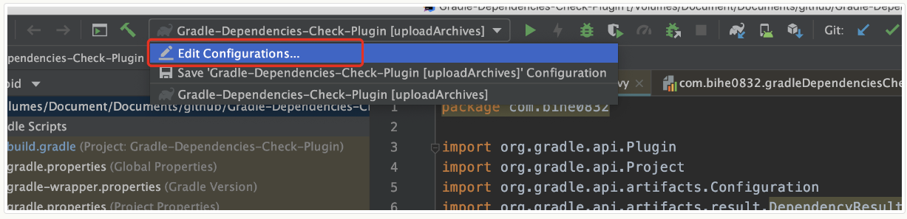
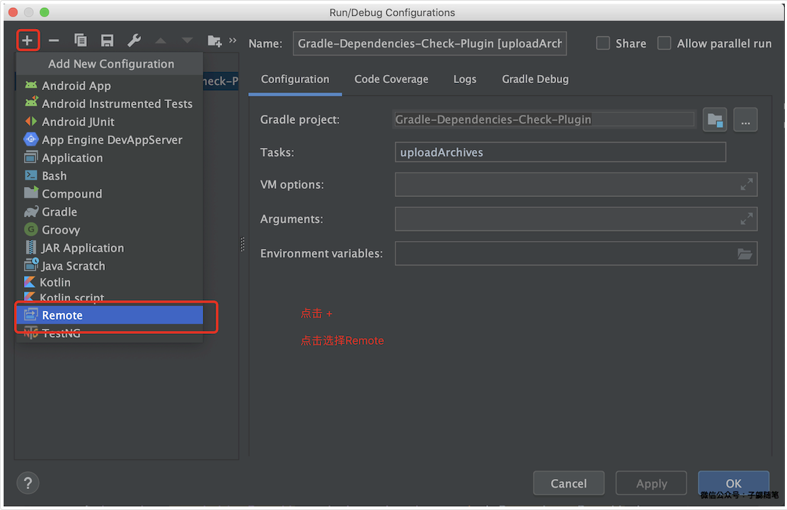
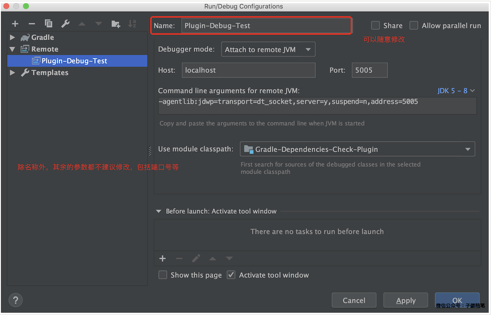

### 背景
这是Gradle插件开发系列（点击查看）系列的第三篇，整个文档基于开发的插件一款检查Gradle依赖配置是否冲突的插件完成。相关源码在 https://github.com/bihe0832/Gradle-Dependencies-Check。

这篇文章主要介绍在插件开发过程中，如何设置断点动态调试插件。首先由于插件项目和实际使用的项目是两个不同的项目，因此只能使用gradle的远程调试功能。下面以上面提到的插件一款检查Gradle依赖配置是否冲突的插件为例介绍。

### 启动插件和应用项目
####    代码目录
下面是事例项目的代码目录
```
Gradle-Dependencies-Check
	│
	├─── Gradle-Dependencies-Check-Plugin 构建依赖自动检查插件源码
	|
	├─── Sample 构建依赖自动检查插件测试用Demo
	│
	└─── README.md 项目介绍
```

### 启动项目
使用Android Studio 分别启动插件项目Gradle-Dependencies-Check-Plugin和应用项目Sample


!>  为了后面介绍方便，我们会把插件项目Gradle-Dependencies-Check-Plugin简称插件工程，把应用项目Sample简称Demo工程

### 配置调试信息
####    创建远程调试任务
首先为插件工程添加远程调试任务，点击选择 Edit Configurations …



点击添加，在弹出的对话框中选择 Remote。



这时会自动生成一个 Remote debug 的配置，建议所有配置都使用默认值，点击 OK 按钮。




### 配置调试环境变量
在Demo工程根目录输入下面的命令开启gradle的远程调试：
```
export GRADLE_OPTS="-Xdebug -Xrunjdwp:transport=dt_socket,server=y,suspend=y,address=5005"
```
例如：
```
➜  Gradle-Dependencies-Check git:(master) cd Sample
➜  Sample git:(master) ✗ export GRADLE_OPTS="-Xdebug -Xrunjdwp:transport=dt_socket,server=y,suspend=y,address=5005"
➜  Sample git:(master) ✗
```

### 开始调试
1.  在插件工程添加断点

2.  然后在Demo工程根目录输入下面命令启动远程调试器：
```
 ./gradlew --no-daemon checkGradleDependencies  -Dorg.gradle.debug=true
 ```
此时，终端会提示Listening for transport dt_socket at address: 5005，表示调试环境已经OK，等待 attach 调试器。

例如：
```
 ➜  Sample git:(master) ✗ ./gradlew --no-daemon checkGradleDependencies  -Dorg.gradle.debug=true
 Java HotSpot(TM) 64-Bit Server VM warning: ignoring option MaxPermSize=1g; support was removed in 8.0
 Listening for transport dt_socket at address: 5005
```
3.  在插件工程的IDE中点击 Debug 按钮，添加调试器，这时在插件工程的IDE的调试器终端中会打印：
```
 Connected to the target VM, address: 'localhost:5005', transport: 'socket'
```

而在刚才Demo工程命令行终端中会打印：
```
 Starting a Gradle Daemon, 1 incompatible Daemon could not be reused, use --status for details

 > Starting Daemon
```
接上前面Demo工程的日志完整内容例如：
```
 ➜  Sample git:(master) ✗ ./gradlew --no-daemon checkGradleDependencies  -Dorg.gradle.debug=true
 Java HotSpot(TM) 64-Bit Server VM warning: ignoring option MaxPermSize=1g; support was removed in 8.0
 Listening for transport dt_socket at address: 5005
 Starting a Gradle Daemon, 1 incompatible Daemon could not be reused, use --status for details
	
 > Starting Daemon
```
此时调试器已经添加完成

4.  在插件工程的IDE中再次点击 Debug 按钮，在Demo工程命令行查看构建开始执行，当运行到插件工程断点时，就会自动暂停。后续调试与正常调试一致。如下图：


调试结束，命令执行成功，插件工程的IDE的调试器终端中会打印另一行日志：
```
 Disconnected from the target VM, address: 'localhost:5005', transport: 'socket'
 ```

一次调试结束以后，如果需要再次调试，只需循坏执行上面的第1 ~ 5步

### 结束调试
彻底调试结束以后，在Demo工程根目录输入下面命令关闭gradle远程调试：
```
export GRADLE_OPTS=""
```


***
https://blog.bihe0832.com/gradle_plugin_debug.html
***