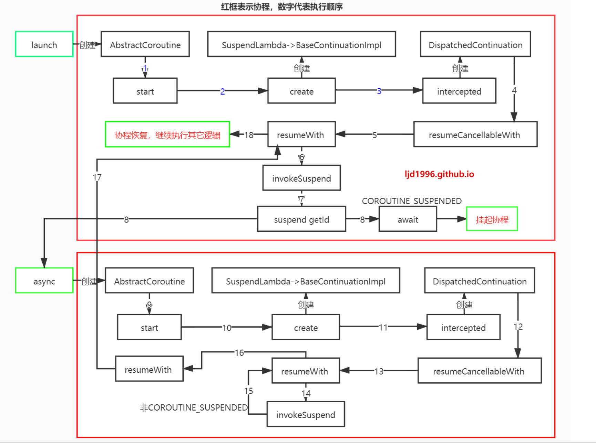

***
#####    suspend
​使用 suspend 表示函数支持挂起操作，目的在于告诉编译器，该方法可能产生阻塞(因为普通方法也能使用 suspend 标记，但是实际不会起作用)。suspend 方法会被编译为继承 SuspendLambda 的类

#####    创建协程
*   launch：返回 Job，​能够获取和控制当前 Scope 下的协程的状态，比如取消(cancel)协程、获取是否运行(isActive)。

*   async：​返回 Deferred，Deferred 继承自 Job，它拥有 Job 的功能。另外 Deferred 还类似 Java UTC 中的 Future 接口，通过 Deferred 能够获取协程执行完毕之后的结果。

*   withContext：​切换代码块的执行上下文

#####    结构化并发
​将多个协程放到一个可以管理的空间里面，这个空间的名字就叫 CoroutineScope。通过 Scope 就能够统一的管理内部的协程，方便对多个协程整体上做取消(cancel)、等待结果(join)等操作。
***
### 协程的状态机

这一章会以下面的代码为例解析一下协程启动，挂起以及恢复的流程：
```
private suspend fun getId(): String {
    return GlobalScope.async(Dispatchers.IO) {
        delay(1000)
        "hearing"
    }.await()
}

private suspend fun getAvatar(id: String): String {
    return GlobalScope.async(Dispatchers.IO) {
        delay(1000)
        "avatar-$id"
    }.await()
}

fun main() {
    GlobalScope.launch {
        val id = getId()
        val avatar = getAvatar(id)
        println("${Thread.currentThread().name} - $id - $avatar")
    }
}
```
上面 main 方法中，GlobalScope.launch 启动的协程体在执行到 getId 后，协程体会挂起，直到 getId 返回可用结果，才会 resume launch 协程，执行到 getAvatar 也是同样的过程。协程内部实现使用状态机来处理不同的挂起点，将 GlobalScope.launch 协程体字节码反编译成 Java 代码，大致如下(有所删减)：
```
BuildersKt.launch$default((CoroutineScope)GlobalScope.INSTANCE, (CoroutineContext)null,
    (CoroutineStart)null, (Function2)(new Function2((Continuation)null) {
    int label;

    public final Object invokeSuspend( Object $result) {
        Object var10000;
        String id;
        label17: {
            CoroutineScope $this$launch;
            switch(this.label) {
            case 0: // a
                ResultKt.throwOnFailure($result);
                $this$launch = this.p$;
                this.label = 1; // label置为1
                var10000 = getId(this);
                if (var10000 == COROUTINE_SUSPENDED) {
                    return COROUTINE_SUSPENDED;
                }
                // 若此时已经有结果，则不挂起，直接break
                break;
            case 1: // b
                ResultKt.throwOnFailure($result);
                var10000 = $result;
                break;
            case 2: // d
                id = (String)this.L$1;
                ResultKt.throwOnFailure($result);
                var10000 = $result;
                break label17; // 退出label17
            default:
                throw new IllegalStateException("call to 'resume' before 'invoke' with coroutine");
            }
            // c
            id = (String)var10000;
            this.L$1 = id; // 将id赋给L$1
            this.label = 2; // label置为2
            var10000 = getAvatar(id, this);
            if (var10000 == COROUTINE_SUSPENDED) {
                return COROUTINE_SUSPENDED;
            }
        }
        // e
        String avatar = (String)var10000;
        String var5 = var9.append(var10001.getName()).append(" - ").append(id).append(" - ").append(avatar).toString();
        System.out.println(var5);
        return Unit.INSTANCE;
    }

    
    public final Continuation create( Object value,  Continuation completion) {
        Intrinsics.checkParameterIsNotNull(completion, "completion");
        Function2 var3 = new <anonymous constructor>(completion);
        var3.p$ = (CoroutineScope)value;
        return var3;
    }

    public final Object invoke(Object var1, Object var2) {
        return ((<undefinedtype>)this.create(var1, (Continuation)var2)).invokeSuspend(Unit.INSTANCE);
    }
}
```

这里我们根据上面的注释以及字母标签来看一下执行流程(invokeSuspend 方法会在协程体中的 suspend 函数得到结果后被调用，具体是在哪里被调用的稍后会讲到)：

*   a: launch 协程体刚执行到 getId 方法时，getId 方法的返回值将是 COROUTINE_SUSPENDED, 此时直接 return, 则 launch 协程体中 getId 后面的代码暂时不会执行，即 launch 协程体被挂起(非阻塞, 该线程依旧会做其它工作)。这里将 label 置为了 1. 而若此时 getId 已经有结果(内部没有调用 delay 之类的 suspend 函数等)，则不挂起，而是直接 break。
*   b: 若上面 a 中 getId 返回 COROUTINE_SUSPENDED, 则当 getId 有可用结果返回后，会重新执行 launch 协程体的 invokeSuspend 方法，根据上面的 label==1, 会执行到这里检查一下 result 没问题的话就 break, 此时 id 赋值给了 var10000。
*   c: 在 a 中若直接 break 或 在 b 中得到 getId 的结果然后 break 后，都会执行到这里，得到 id 的值并把 label 置为2。然后调用 getAvatar 方法，跟 getId 类似，若其返回 COROUTINE_SUSPENDED 则 return，协程被挂起，等到下次 invokeSuspend 被执行，否则离开 label17 接着执行后续逻辑。
*   d: 若上面 c 中 getAvatar 返回 COROUTINE_SUSPENDED, 则当 getAvatar 有可用结果返回后会重新调用 launch 协程体的 invokeSuspend 方法，此时根据 label==2 来到这里并取得之前的 id 值，检验 result(即avatar)，然后break label17。
*   e: c 中直接返回了可用结果 或 d 中 break label17 后，launch 协程体中的 suspend 函数都执行完毕了，这里会执行剩下的逻辑。
suspend 函数不会阻塞线程，且 suspend 函数不一定会挂起协程，如果相关调用的结果已经可用，则继续运行而不挂起，例如 async{} 返回值 Deferred 的结果已经可用时，await()挂起函数可以直接返回结果，不用再挂起协程。

这一节看了一下 launch 协程体反编译成 Java 后的代码逻辑，关于 invokeSuspend 是何时怎么被调用的，将会在下面讲到。

### 协程的创建与启动
这一节以 CoroutineScope.launch {} 默认参数为例，从源码角度看看 Kotlin 协程是怎样创建与启动的：
```
public fun CoroutineScope.launch(
    context: CoroutineContext = EmptyCoroutineContext,
    start: CoroutineStart = CoroutineStart.DEFAULT,
    block: suspend CoroutineScope.() -> Unit
): Job {
    val newContext = newCoroutineContext(context)
    val coroutine = if (start.isLazy) LazyStandaloneCoroutine(newContext, block) else StandaloneCoroutine(newContext, active = true)
    coroutine.start(start, coroutine, block)
    return coroutine
}

// AbstractCoroutine.kt
// receiver: StandaloneCoroutine
// block: suspend StandaloneCoroutine.() -> Unit
// private open class StandaloneCoroutine(...) : AbstractCoroutine<Unit>(...) {}
// public abstract class AbstractCoroutine<in T>(...) : JobSupport(active), Job, Continuation<T>, CoroutineScope {}
public fun <R> start(start: CoroutineStart, receiver: R, block: suspend R.() -> T) {
    // 调用 CoroutineStart 中的 invoke 方法
    start(block, receiver, this)
}

public enum class CoroutineStart {
    // block - StandaloneCoroutine.() -> Unit
    // receiver - StandaloneCoroutine
    // completion - StandaloneCoroutine<Unit>
    public operator fun <R, T> invoke(block: suspend R.() -> T, receiver: R, completion: Continuation<T>): Unit =
        when (this) {
            // 根据 start 参数的类型调用不同的方法
            DEFAULT -> block.startCoroutineCancellable(receiver, completion)
            ATOMIC -> block.startCoroutine(receiver, completion)
            UNDISPATCHED -> block.startCoroutineUndispatched(receiver, completion)
            LAZY -> Unit // will start lazily
        }
}
```
接下来看看 startCoroutineCancellable 方法：
```
// receiver - StandaloneCoroutine
// completion - StandaloneCoroutine<Unit>
internal fun <R, T> (suspend (R) -> T).startCoroutineCancellable(receiver: R, completion: Continuation<T>) =
    runSafely(completion) {
        createCoroutineUnintercepted(receiver, completion).intercepted().resumeCancellableWith(Result.success(Unit))
    }
```

createCoroutineUnintercepted 方法创建了一个 Continuation 类型(协程)的实例，即创建了一个协程：
```
public actual fun <R, T> (suspend R.() -> T).createCoroutineUnintercepted(
    receiver: R, completion: Continuation<T>
): Continuation<Unit> {
    return if (this is BaseContinuationImpl) create(receiver, completion) else // ...
}
```

调用的是 (suspend (R) -> T) 的 createCoroutineUnintercepted 方法，(suspend (R) -> T) 就是协程体。直接看上面示例代码中 GlobalScope.launch 编译后的字节码，可以发现 CoroutineScope.launch 传入的 lambda 表达式被编译成了继承 SuspendLambda 的子类：

final class Main$main$1 extends kotlin/coroutines/jvm/internal/SuspendLambda implements kotlin/jvm/functions/Function2
其继承关系为: SuspendLambda -> ContinuationImpl -> BaseContinuationImpl -> Continuation, 因此走 create(receiver, completion) 方法，从上面反编译出的 Java 代码可以看到 create 方法创建了一个 Continuation 实例，再看一下 Kotlin 代码编译后的字节码(包名已省略)：
```
public final create(Ljava/lang/Object;Lkotlin/coroutines/Continuation;)Lkotlin/coroutines/Continuation;
// ...
NEW Main$main$1
```

从上面可以看到，create 方法创建了 Main$main$1 实例，而其继承自 SuspendLambda, 因此 create 方法创建的 Continuation 是一个 SuspendLambda 对象。

即 createCoroutineUnintercepted 方法创建了一个 SuspendLambda 实例。然后看看 intercepted 方法：
```
public actual fun <T> Continuation<T>.intercepted(): Continuation<T> =
    // 如果是ContinuationImpl类型，则调用intercepted方法，否则返回自身
    // 这里的 this 是 Main$main$1 实例 - ContinuationImpl的子类
    (this as? ContinuationImpl)?.intercepted() ?: this

// ContinuationImpl
public fun intercepted(): Continuation<Any?> =
    // context[ContinuationInterceptor]是 CoroutineDispatcher 实例
    // 需要线程调度 - 返回 DispatchedContinuation，其 continuation 参数值为 SuspendLambda
    // 不需要线程调度 - 返回 SuspendLambda
    intercepted ?: (context[ContinuationInterceptor]?.interceptContinuation(this) ?: this).also { intercepted = it }

// CoroutineDispatcher
// continuation - SuspendLambda -> ContinuationImpl -> BaseContinuationImpl
public final override fun <T> interceptContinuation(continuation: Continuation<T>): Continuation<T> =
    DispatchedContinuation(this, continuation)
```

接下来看看 resumeCancellableWith 是怎么启动协程的，这里还涉及到Dispatchers线程调度的逻辑：
```
internal class DispatchedContinuation<in T>(
     val dispatcher: CoroutineDispatcher,
     val continuation: Continuation<T>
) : DispatchedTask<T>(MODE_ATOMIC_DEFAULT), CoroutineStackFrame, Continuation<T> by continuation {
    public fun <T> Continuation<T>.resumeCancellableWith(result: Result<T>): Unit = when (this) {
        // 进行线程调度，最后也会执行到continuation.resumeWith方法
        is DispatchedContinuation -> resumeCancellableWith(result)
        // 直接执行continuation.resumeWith方法
        else -> resumeWith(result)
    }

    inline fun resumeCancellableWith(result: Result<T>) {
        val state = result.toState()
        // 判断是否需要线程调度
        if (dispatcher.isDispatchNeeded(context)) {
            _state = state
            resumeMode = MODE_CANCELLABLE
            // 需要调度则先进行调度
            dispatcher.dispatch(context, this)
        } else {
            executeUnconfined(state, MODE_CANCELLABLE) {
                if (!resumeCancelled()) {
                    // 不需要调度则直接在当前线程执行协程
                    resumeUndispatchedWith(result)
                }
            }
        }
    }

    inline fun resumeUndispatchedWith(result: Result<T>) {
        withCoroutineContext(context, countOrElement) {
            continuation.resumeWith(result)
        }
    }
}
```
*   当需要线程调度时，则在调度后会调用 DispatchedContinuation.continuation.resumeWith 来启动协程，其中 continuation 是 SuspendLambda 实例；
*   当不需要线程调度时，则直接调用 SuspendLambda.resumeWith 来启动协程。

resumeWith 方法调用的是父类 BaseContinuationImpl 中的 resumeWith 方法：
```
internal abstract class BaseContinuationImpl(public val completion: Continuation<Any?>?) : Continuation<Any?>, CoroutineStackFrame, Serializable {
    public final override fun resumeWith(result: Result<Any?>) {
        // ...
        val outcome = invokeSuspend(param)
        // ...
    }
}
```
因此，协程的启动是通过 BaseContinuationImpl.resumeWith 方法调用到了子类 SuspendLambda.invokeSuspend 方法，然后通过状态机来控制顺序运行。

### 协程的挂起和恢复

Kotlin 编译器会为 协程体 生成继承自 SuspendLambda 的子类，协程的真正运算逻辑都在其 invokeSuspend 方法中。上一节介绍了 launch 是怎么创建和启动协程的，在这一节我们再看看当协程代码执行到 suspend 函数后，协程是怎么被挂起的 以及 当 suspend 函数执行完成得到可用结果后是怎么恢复协程的。

Kotlin 协程的内部实现使用了 Kotlin 编译器的一些编译技术，当 suspend 函数被调用时，都有一个隐式的参数额外传入，这个参数是 Continuation 类型，封装了协程 resume 后执行的代码逻辑。
```
private suspend fun getId(): String {
    return GlobalScope.async(Dispatchers.IO) {
        delay(1000)
        "hearing"
    }.await()
}

// Decompile成Java
final Object getId( Continuation $completion) {
    // ...
}
```
其中传入的 $completion 参数，从上一节可以看到是调用 getId 方法所在的协程体对象，也就是一个 SuspendLambda 对象。Continuation的定义如下：
```
public interface Continuation<in T> {
    public val context: CoroutineContext

    public fun resumeWith(result: Result<T>)
}
```
将 getId 方法编译后的字节码反编译成 Java 代码如下(为便于阅读，删减及修改了部分代码)：

```
final Object getId( Continuation $completion) {
    // 新建与启动协程
    return BuildersKt.async$default((CoroutineScope)GlobalScope.INSTANCE, (CoroutineContext)Dispatchers.getIO(), (CoroutineStart)null, (Function2)(new Function2((Continuation)null) {
        int label;

        
        public final Object invokeSuspend( Object $result) {
            switch(this.label) {
            case 0:
                ResultKt.throwOnFailure($result);
                this.label = 1;
                if (DelayKt.delay(1000L, this) == COROUTINE_SUSPENDED) {
                    return COROUTINE_SUSPENDED;
                }
                break;
            case 1:
                ResultKt.throwOnFailure($result);
                break;
            default:
                throw new IllegalStateException("call to 'resume' before 'invoke' with coroutine");
            }
            return "hearing";
        }

        // ...
    }), 2, (Object)null).await($completion); // 调用 await() suspend 函数
}
```
结合协程的状态机一节，当上面的 launch 协程体执行到 getId 方法时, 会根据其返回值是否为 COROUTINE_SUSPENDED 来决定是否挂起，由于 getId 的逻辑是通过 async 启动一个新的协程，协程体内调用了 suspend delay 方法，然后通过 await suspend 函数等待结果，当 async 协程没完成时, await 会返回 COROUTINE_SUSPENDED, 因此 launch 协程体的 invokeSuspend 方法直接 return COROUTINE_SUSPENDED 值执行完成，此时 launch 启动的协程处于挂起状态但不阻塞所处线程，而 async 启动的协程开始执行。

我们看一下 async 的源码：
```
public fun <T> CoroutineScope.async(...): Deferred<T> {
    val newContext = newCoroutineContext(context)
    val coroutine = if (start.isLazy) LazyDeferredCoroutine(newContext, block) else
        DeferredCoroutine<T>(newContext, active = true)
    coroutine.start(start, coroutine, block)
    return coroutine
}
```
默认情况下，上面的 coroutine 取 DeferredCoroutine 实例，于是我们看一下其 await 方法以及在 async 协程执行完成后，是怎么恢复 launch 协程的：
```
private open class DeferredCoroutine<T>(
    parentContext: CoroutineContext, active: Boolean
) : AbstractCoroutine<T>(parentContext, active), Deferred<T>, SelectClause1<T> {
    override suspend fun await(): T = awaitInternal() as T
}

// JobSupport
internal suspend fun awaitInternal(): Any? {
    while (true) { // lock-free loop on state
        val state = this.state
        if (state !is Incomplete) {
            // 已经完成，则直接返回结果
            if (state is CompletedExceptionally) { // Slow path to recover stacktrace
                recoverAndThrow(state.cause)
            }
            return state.unboxState()
        }
        // 不需要重试时直接break，执行awaitSuspend
        if (startInternal(state) >= 0) break
    }
    return awaitSuspend() // slow-path
}

// suspendCoroutineUninterceptedOrReturn: 获取当前协程，且挂起当前协程(返回COROUTINE_SUSPENDED)或不挂起直接返回结果
private suspend fun awaitSuspend(): Any? = suspendCoroutineUninterceptedOrReturn { uCont ->
    val cont = AwaitContinuation(uCont.intercepted(), this)
    cont.disposeOnCancellation(invokeOnCompletion(ResumeAwaitOnCompletion(this, cont).asHandler))
    cont.getResult()
}
```
上面 awaitInternal 的大致逻辑是当挂起函数已经有结果时则直接返回，否则挂起父协程，然后 invokeOnCompletion 方法将 ResumeAwaitOnCompletion 插入一个队列(state.list)中，源码就不再贴出了。接着看看在 async 执行完成后是怎么调用 ResumeAwaitOnCompletion 来 resume 被挂起的协程的。注意：不要绕进 async 协程体中 delay 是怎么挂起和恢复 async 协程的这一逻辑，我们不需要关注这一层！

接着 async 协程的执行往下看，从前面可知它会调用 BaseContinuationImpl.resumeWith 方法来执行协程逻辑，我们详细看一下这个方法，在这里会执行该协程的 invokeSuspend 函数：
```
internal abstract class BaseContinuationImpl(
    public val completion: Continuation<Any?>?
) : Continuation<Any?>, CoroutineStackFrame, Serializable {
    public final override fun resumeWith(result: Result<Any?>) {
        var current = this
        var param = result
        while (true) {
            with(current) {
                val completion = completion!! // fail fast when trying to resume continuation without completion
                val outcome: Result<Any?> =
                    try {// 调用 invokeSuspend 方法执行协程逻辑
                        val outcome = invokeSuspend(param)
                        // 协程挂起时返回的是 COROUTINE_SUSPENDED，即协程挂起时，resumeWith 执行结束
                        // 再次调用 resumeWith 时协程挂起点之后的代码才能继续执行
                        if (outcome === COROUTINE_SUSPENDED) return
                        Result.success(outcome)
                    } catch (exception: Throwable) {
                        Result.failure(exception)
                    }
                releaseIntercepted() // this state machine instance is terminating
                if (completion is BaseContinuationImpl) {
                    // unrolling recursion via loop
                    current = completion
                    param = outcome
                } else {
                    // top-level completion reached -- invoke and return
                    completion.resumeWith(outcome)
                    return
                }
            }
        }
    }
}
```
我们从上面的源码可以看到，在 createCoroutineUnintercepted 方法中创建的 SuspendLambda 实例是 BaseContinuationImpl 的子类对象，其 completion 参数为下：
*   launch: if (isLazy) LazyStandaloneCoroutine else StandaloneCoroutine
*   async: if (isLazy) LazyDeferredCoroutine else DeferredCoroutine

上面这几个类都是 AbstractCoroutine 的子类。而根据 completion 的类型会执行不同的逻辑：

*   BaseContinuationImpl: 执行协程逻辑
*   其它: 调用 resumeWith 方法，处理协程的状态，协程挂起后的恢复即与它有关

在上面的例子中 async 启动的协程，它也会调用其 invokeSuspend 方法执行 async 协程逻辑，假设 async 返回的结果已经可用时，即非 COROUTINE_SUSPENDED 值，此时 completion 是 DeferredCoroutine 对象，因此会调用 DeferredCoroutine.resumeWith 方法，然后返回，父协程的恢复逻辑便是在这里。
```
// AbstractCoroutine
public final override fun resumeWith(result: Result<T>) {
    val state = makeCompletingOnce(result.toState())
    if (state === COMPLETING_WAITING_CHILDREN) return
    afterResume(state)
}
```
在 makeCompletingOnce 方法中，会根据 state 去处理协程状态，并执行上面插入 state.list 队列中的 ResumeAwaitOnCompletion.invoke 来恢复父协程，必要的话还会把 async 的结果给它，具体代码实现太多就不贴了，不是本节的重点。直接看 ResumeAwaitOnCompletion.invoke 方法：
```
private class ResumeAwaitOnCompletion<T>(
    job: JobSupport, private val continuation: CancellableContinuationImpl<T>
) : JobNode<JobSupport>(job) {
    override fun invoke(cause: Throwable?) {
        val state = job.state
        assert { state !is Incomplete }
        if (state is CompletedExceptionally) {
            // Resume with with the corresponding exception to preserve it
            continuation.resumeWithException(state.cause)
        } else {
            // resume 被挂起的协程
            continuation.resume(state.unboxState() as T)
        }
    }
}
```
这里的 continuation 就是 launch 协程体，也就是 SuspendLambda 对象，于是 invoke 方法会再一次调用到 BaseContinuationImpl.resumeWith 方法，接着调用 SuspendLambda.invokeSuspend, 然后根据 label 取值继续执行接下来的逻辑！

####    suspendCoroutineUninterceptedOrReturn

接下来我们看一下怎么将一个基于回调的方法改造成一个基于协程的 suspend 方法，要实现这个需求，重点在于 suspendCoroutineUninterceptedOrReturn 方法，根据注释，这个方法的作用是: Obtains the current continuation instance inside suspend functions and either suspends currently running coroutine or returns result immediately without suspension. 即获取当前协程的实例，并且挂起当前协程或不挂起直接返回结果。函数定义如下：
```
public suspend inline fun <T> suspendCoroutineUninterceptedOrReturn(crossinline block: (Continuation<T>) -> Any?): T {
    // ...
}
```
根据 block 的返回值，有两种情况：

*   如果 block 返回 COROUTINE_SUSPENDED, 意味着 suspend 函数会挂起当前协程而不会立即返回结果。这种情况下, block 中的 Continuation 需要在结果可用后调用 Continuation.resumeWith 来 resume 协程。
如果 block 返回的 T 是 suspend 函数的结果，则协程不会被挂起, block 中的 Continuation 不会被调用。
(   调用 Continuation.resumeWith 会直接在调用者的线程 resume 协程，而不会经过 CoroutineContext 中可能存在的 ContinuationInterceptor。建议使用更安全的 suspendCoroutine 方法，在其 block 中可以同步或在异步线程调用 Continuation.resume 和 Continuation.resumeWithException:

public suspend inline fun <T> suspendCoroutine(crossinline block: (Continuation<T>) -> Unit): T {
    contract { callsInPlace(block, InvocationKind.EXACTLY_ONCE) }
    return suspendCoroutineUninterceptedOrReturn { c: Continuation<T> ->
        // 调用拦截器
        val safe = SafeContinuation(c.intercepted())
        block(safe)
        safe.getOrThrow()
    }
}
此外除了 suspendCoroutine 方法，还有 suspendCancellableCoroutine, suspendAtomicCancellableCoroutine, suspendAtomicCancellableCoroutineReusable 等方法都可以用来将异步回调的方法封装成 suspend 函数。

下面来看一个例子来介绍怎么将异步回调函数封装成 suspend 函数：
```
class NetFetcher {
    // 将下面的 request 方法封装成 suspend 方法
    suspend fun requestSuspend(id: Int): String = suspendCoroutine { continuation ->
        request(id, object : OnResponseListener {
            override fun onResponse(response: String) {
                continuation.resume(response)
            }

            override fun onError(error: String) {
                continuation.resumeWithException(Exception(error))
            }
        })
    }

    fun request(id: Int, listener: OnResponseListener) {
        Thread.sleep(5000)
        if (id % 2 == 0) {
            listener.onResponse("success")
        } else {
            listener.onError("error")
        }
    }

    interface OnResponseListener {
        fun onResponse(response: String)
        fun onError(error: String)
    }
}

object Main {
    fun main() {
        requestByCoroutine()
    }

    // 使用回调
    private fun requestByCallback() {
        NetFetcher().request(21, object : NetFetcher.OnResponseListener {
            override fun onResponse(response: String) {
                println("result = $response")
            }

            override fun onError(error: String) {
                println("result = $error")
            }
        })
    }

    // 使用协程
    private fun requestByCoroutine() {
        GlobalScope.launch(Dispatchers.Main) {
            val result = withContext(Dispatchers.IO) {
                try {
                    NetFetcher().requestSuspend(22)
                } catch (e: Exception) {
                    e.message
                }
            }
            println("result = $result")
        }
    }
}
```
为加深理解，再介绍一下 Kotlin 提供的两个借助 suspendCancellableCoroutine 实现的挂起函数: delay & yield。

####    delay

delay 方法借助了 suspendCancellableCoroutine 方法来挂起协程：
```
public suspend fun delay(timeMillis: Long) {
    if (timeMillis <= 0) return // don't delay
    return suspendCancellableCoroutine sc@ { cont: CancellableContinuation<Unit> ->
        cont.context.delay.scheduleResumeAfterDelay(timeMillis, cont)
    }
}

override fun scheduleResumeAfterDelay(timeMillis: Long, continuation: CancellableContinuation<Unit>) {
    postDelayed(Runnable {
        with(continuation) { resumeUndispatched(Unit) }
    }, timeMillis)
}
```
可以看出这里 delay 的逻辑类似于 Handle 机制，将 resumeUndispatched 封装的 Runnable 放到一个队列中，在延迟的时间到达便会执行 resume 恢复协程。

####    yield

yield 方法作用是挂起当前协程，这样可以让该协程所在线程运行其他逻辑，当其他协程执行完成或也调用 yield 让出执行权时，之前的协程可以恢复执行。
```
launch(Dispatchers.Main) {
    repeat(3) {
        println("job1 $it")
        yield()
    }
}
launch(Dispatchers.Main) {
    repeat(3) {
        println("job2 $it")
        yield()
    }
}

// output
job1 0
job2 0
job1 1
job2 1
job1 2
job2 2
```
看一下 yield 的源码：
```
public suspend fun yield(): Unit = suspendCoroutineUninterceptedOrReturn sc@ { uCont ->
    val context = uCont.context
    // 如果协程没有调度器，或者像 Unconfined 一样没有进行调度则直接返回
    val cont = uCont.intercepted() as? DispatchedContinuation<Unit> ?: return@sc Unit
    if (cont.dispatcher.isDispatchNeeded(context)) {
        // this is a regular dispatcher -- do simple dispatchYield
        cont.dispatchYield(context, Unit)
    } else {
        // This is either an "immediate" dispatcher or the Unconfined dispatcher
        // ...
    }
    COROUTINE_SUSPENDED
}

// DispatchedContinuation
internal fun dispatchYield(context: CoroutineContext, value: T) {
    _state = value
    resumeMode = MODE_CANCELLABLE
    dispatcher.dispatchYield(context, this)
}

public open fun dispatchYield(context: CoroutineContext, block: Runnable): Unit = dispatch(context, block)
```

可知 dispatchYield 会调用到 dispatcher.dispatch 方法将协程分发到调度器队列中，这样线程可以执行其他协程，等到调度器再次执行到该协程时，会 resume 该协程。

### 总结

通过上面协程的工作原理解析，可以从源码中发现 Kotlin 中的协程存在着三层包装：

*   第一层包装: launch & async 返回的 Job, Deferred 继承自 AbstractCoroutine, 里面封装了协程的状态，提供了 cancel 等接口；
*   第二层包装: 编译器生成的 SuspendLambda 子类，封装了协程的真正执行逻辑，其继承关系为 SuspendLambda -> ContinuationImpl -> BaseContinuationImpl, 它的 completion 参数就是第一层包装实例；
*   第三层包装: DispatchedContinuation, 封装了线程调度逻辑，它的 continuation 参数就是第二层包装实例。

这三层包装都实现了 Continuation 接口，通过代理模式将协程的各层包装组合在一起，每层负责不同的功能，如下图：

Kotlin协程工作流程



***
https://jiyang.site/posts/kotlin-coroutine-inner/

https://ljd1996.github.io/2021/05/19/Kotlin%E7%AC%94%E8%AE%B0%E4%B9%8B%E5%8D%8F%E7%A8%8B%E5%B7%A5%E4%BD%9C%E5%8E%9F%E7%90%86/
***