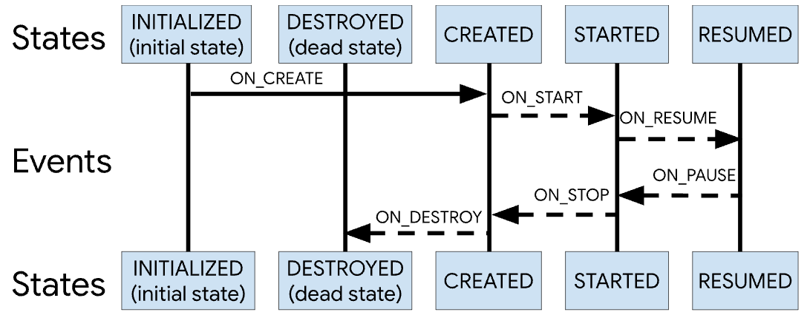

### 概述
Lifecycle是Android-Jetpack中的架构组件，它具有生命周期感知能力，也就是说我们能在Activity或者Fragment的生命周期发生变化的时候得到通知。

在以往的开发中，我们经常在Activity的生命周期回调中进行各种注册解绑等，比如说EventBus的注册解绑，广播的注册解绑等。如果我们把很多这种与生命周期相关的代码都直接放在Activity的生命周期回调中，Activity将会变得难以维护。而本质上我们需要的只是Activity或者Fragment的生命周期发生改变的时候能通知我们，以便在对应生命周期中执行对应的方法，因此可以使用Lifecycle。

androix中导入依赖：
```
def lifecycle_version = "2.2.0"

// Lifecycles only (without ViewModel or LiveData)
implementation "androidx.lifecycle:lifecycle-runtime:$lifecycle_version"

// 注解处理器：
// 1. 添加时则使用注解处理器的方式处理Lifecycle的注解
// 2. 未添加时则使用反射方式处理Lifecycle的注解
// Annotation processor
annotationProcessor "androidx.lifecycle:lifecycle-compiler:$lifecycle_version"
// alternately - if using Java8, use the following instead of lifecycle-compiler
implementation "androidx.lifecycle:lifecycle-common-java8:$lifecycle_version"
```

### 生命周期
Lifecycle使用两个枚举来跟踪其关联组件的生命周期状态：

*   Event：Lifecycle类分派的生命周期事件，这些事件映射到Activity和Fragment中的回调事件。
*   State：Lifecycle对象跟踪的组件的当前状态。
如下图：



### 基本使用
####    LifecycleObserver
```
public class MyLifecycleObserver implements LifecycleObserver {
    private static final String TAG = "Lifecycle";

    
    public void onCreate() {
        Log.d(TAG, "onCreate");
    }

    
    public void onStart() {
        Log.d(TAG, "onStart");
    }

    
    public void onResume() {
        Log.d(TAG, "onResume");
    }

    
    public void onPause() {
        Log.d(TAG, "onPause");
    }

    
    public void onStop() {
        Log.d(TAG, "onStop");
    }

    
    public void onDestroy() {
        Log.d(TAG, "onDestroy");
    }
}
// or
public class MyLifecycleObserver implements LifecycleEventObserver {
    
    public void onStateChanged( LifecycleOwner source,  Lifecycle.Event event) {
        switch (event) {
            case ON_CREATE:
                register();
                break;
            case ON_DESTROY:
                unregister();
                break;
        }
    }

    private void register() {
        // ...
    }

    private void unregister() {
        // ...
    }
}
```

####    Activity
```
public class MainActivity extends Activity implements LifecycleOwner {

    private LifecycleRegistry mLifecycleRegistry = new LifecycleRegistry(this);

    
    protected void onCreate(Bundle savedInstanceState) {
        super.onCreate(savedInstanceState);
        setContentView(R.layout.activity_main);

        getLifecycle().addObserver(new MyLifecycleObserver());
//        mLifecycleRegistry.setCurrentState(Lifecycle.State.CREATED);
        mLifecycleRegistry.handleLifecycleEvent(Lifecycle.Event.ON_CREATE);
    }

    
    protected void onStart() {
        super.onStart();
//        mLifecycleRegistry.setCurrentState(Lifecycle.State.STARTED);
        mLifecycleRegistry.handleLifecycleEvent(Lifecycle.Event.ON_START);
    }

    
    protected void onResume() {
        super.onResume();
//        mLifecycleRegistry.setCurrentState(Lifecycle.State.RESUMED);
        mLifecycleRegistry.handleLifecycleEvent(Lifecycle.Event.ON_RESUME);
    }

    
    protected void onPause() {
//        mLifecycleRegistry.setCurrentState(Lifecycle.State.STARTED);
        mLifecycleRegistry.handleLifecycleEvent(Lifecycle.Event.ON_PAUSE);
        super.onPause();
    }

    
    protected void onStop() {
//        mLifecycleRegistry.setCurrentState(Lifecycle.State.CREATED);
        mLifecycleRegistry.handleLifecycleEvent(Lifecycle.Event.ON_STOP);
        super.onStop();
    }

    
    protected void onDestroy() {
//        mLifecycleRegistry.setCurrentState(Lifecycle.State.DESTROYED);
        mLifecycleRegistry.handleLifecycleEvent(Lifecycle.Event.ON_DESTROY);
        super.onDestroy();
    }

    
    
    public Lifecycle getLifecycle() {
        return mLifecycleRegistry;
    }
}
```

####    AppCompatActivity(默认实现了LifecycleOwner)
```
public class MainActivity extends AppCompatActivity {

    
    protected void onCreate( Bundle savedInstanceState) {
        super.onCreate(savedInstanceState);
        setContentView(R.layout.activity_main);
        getLifecycle().addObserver(new MyLifecycleObserver());
    }
}
```
### Lifecycle
Lifecycle是一个抽象类，其实现类为：LifecycleRegistry。
```
public abstract class Lifecycle {

    
    
    AtomicReference<Object> mInternalScopeRef = new AtomicReference<>();

    
    public abstract void addObserver( LifecycleObserver observer);

    
    public abstract void removeObserver( LifecycleObserver observer);

    
    
    public abstract State getCurrentState();

    public enum Event {
        ON_CREATE,
        ON_START,
        ON_RESUME,
        ON_PAUSE,
        ON_STOP,
        ON_DESTROY,
        ON_ANY
    }

    public enum State {
        /**
         * Destroyed state for a LifecycleOwner. After this event, this Lifecycle will not dispatch
         * any more events. For instance, for an {@link android.app.Activity}, this state is reached
         * <b>right before</b> Activity's {@link android.app.Activity#onDestroy() onDestroy} call.
         */
        DESTROYED,

        /**
         * Initialized state for a LifecycleOwner. For an {@link android.app.Activity}, this is
         * the state when it is constructed but has not received
         * {@link android.app.Activity#onCreate(android.os.Bundle) onCreate} yet.
         */
        INITIALIZED,

        /**
         * Created state for a LifecycleOwner. For an {@link android.app.Activity}, this state
         * is reached in two cases:
         * <ul>
         *     <li>after {@link android.app.Activity#onCreate(android.os.Bundle) onCreate} call;
         *     <li><b>right before</b> {@link android.app.Activity#onStop() onStop} call.
         * </ul>
         */
        CREATED,

        /**
         * Started state for a LifecycleOwner. For an {@link android.app.Activity}, this state
         * is reached in two cases:
         * <ul>
         *     <li>after {@link android.app.Activity#onStart() onStart} call;
         *     <li><b>right before</b> {@link android.app.Activity#onPause() onPause} call.
         * </ul>
         */
        STARTED,

        /**
         * Resumed state for a LifecycleOwner. For an {@link android.app.Activity}, this state
         * is reached after {@link android.app.Activity#onResume() onResume} is called.
         */
        RESUMED;

        /**
         * Compares if this State is greater or equal to the given {@code state}.
         *
         * @param state State to compare with
         * @return true if this State is greater or equal to the given {@code state}
         */
        public boolean isAtLeast( State state) {
            return compareTo(state) >= 0;
        }
    }
}
```

### Lifecycle初始化
```
public class LifecycleRegistry extends Lifecycle {
    private final WeakReference<LifecycleOwner> mLifecycleOwner;
    private State mState;

    public LifecycleRegistry( LifecycleOwner provider) {
        mLifecycleOwner = new WeakReference<>(provider);
        mState = INITIALIZED;
    }
}
```
LifecycleOwner是一个接口：
```
public interface LifecycleOwner {
    
    Lifecycle getLifecycle();
}
```
### 添加观察者
```
private FastSafeIterableMap<LifecycleObserver, ObserverWithState> mObserverMap = new FastSafeIterableMap<>();

public void addObserver( LifecycleObserver observer) {
    State initialState = mState == DESTROYED ? DESTROYED : INITIALIZED;
    ObserverWithState statefulObserver = new ObserverWithState(observer, initialState);
    ObserverWithState previous = mObserverMap.putIfAbsent(observer, statefulObserver);
    // ...
}
```
LifecycleObserver是一个空接口：
```
public interface LifecycleObserver {

}
```

### 生命周期回调
####    moveToState
```
public void setCurrentState( State state) {
    moveToState(state);
}

public void handleLifecycleEvent( Lifecycle.Event event) {
    State next = getStateAfter(event);
    moveToState(next);
}

static State getStateAfter(Event event) {
    switch (event) {
        case ON_CREATE:
        case ON_STOP:
            return CREATED;
        case ON_START:
        case ON_PAUSE:
            return STARTED;
        case ON_RESUME:
            return RESUMED;
        case ON_DESTROY:
            return DESTROYED;
        case ON_ANY:
            break;
    }
    throw new IllegalArgumentException("Unexpected event value " + event);
}
```
moveToState 方法最后调用的是 ObserverWithState 的 dispatchEvent 方法：
```
static class ObserverWithState {
    State mState;
    LifecycleEventObserver mLifecycleObserver;

    ObserverWithState(LifecycleObserver observer, State initialState) {
        mLifecycleObserver = Lifecycling.lifecycleEventObserver(observer);
        mState = initialState;
    }

    void dispatchEvent(LifecycleOwner owner, Event event) {
        State newState = getStateAfter(event);
        mState = min(mState, newState);
        mLifecycleObserver.onStateChanged(owner, event);
        mState = newState;
    }
}
```
这里主要看看lifecycleEventObserver方法，Lifecycle会根据不同的LifecycleObserver实例执行不同的onStateChanged逻辑。

####    lifecycleEventObserver
```
private static final int REFLECTIVE_CALLBACK = 1;   // 反射
private static final int GENERATED_CALLBACK = 2;    // 注解处理器

static LifecycleEventObserver lifecycleEventObserver(Object object) {
    // 是否是 LifecycleEventObserver/FullLifecycleObserver 的子类，可直接处理生命周期事件
    boolean isLifecycleEventObserver = object instanceof LifecycleEventObserver;
    boolean isFullLifecycleObserver = object instanceof FullLifecycleObserver;
    if (isLifecycleEventObserver && isFullLifecycleObserver) {
        return new FullLifecycleObserverAdapter((FullLifecycleObserver) object,
                (LifecycleEventObserver) object);
    }
    if (isFullLifecycleObserver) {
        return new FullLifecycleObserverAdapter((FullLifecycleObserver) object, null);
    }

    if (isLifecycleEventObserver) {
        return (LifecycleEventObserver) object;
    }
    // 不是上面的子类，则走反射或注解逻辑，前面的实例便是如此
    final Class<?> klass = object.getClass();
    // 此处根据klass类去查找是否有注解处理器生成的类
    int type = getObserverConstructorType(klass);
    if (type == GENERATED_CALLBACK) {
        // 如果注解处理器有起作用，则通过生成的GeneratedAdapter子类构造器创建实例
        List<Constructor<? extends GeneratedAdapter>> constructors = sClassToAdapters.get(klass);
        if (constructors.size() == 1) {
            GeneratedAdapter generatedAdapter = createGeneratedAdapter(constructors.get(0), object);
            return new SingleGeneratedAdapterObserver(generatedAdapter);
        }
        GeneratedAdapter[] adapters = new GeneratedAdapter[constructors.size()];
        for (int i = 0; i < constructors.size(); i++) {
            adapters[i] = createGeneratedAdapter(constructors.get(i), object);
        }
        return new CompositeGeneratedAdaptersObserver(adapters);
    }
    // 使用反射方式
    return new ReflectiveGenericLifecycleObserver(object);
}
```
####    GeneratedAdapter
GeneratedAdapter接口如下：
```
public interface GeneratedAdapter {

    /**
     * Called when a state transition event happens.
     *
     * @param source The source of the event
     * @param event The event
     * @param onAny approveCall onAny handlers
     * @param logger if passed, used to track called methods and prevent calling the same method
     *              twice
     */
    void callMethods(LifecycleOwner source, Lifecycle.Event event, boolean onAny, MethodCallsLogger logger);
}
```
注解处理器生成的GeneratedAdapter子类命名规则类似于MyLifecycleObserver_LifecycleAdapter：
```
public class MyLifecycleObserver_LifecycleAdapter implements GeneratedAdapter {
    final MyLifecycleObserver mReceiver;

    MyLifecycleObserver_LifecycleAdapter(MyLifecycleObserver receiver) {
        this.mReceiver = receiver;
    }

    
    public void callMethods(LifecycleOwner owner, Lifecycle.Event event, boolean onAny,
                            MethodCallsLogger logger) {
        boolean hasLogger = logger != null;
        if (onAny) {
            return;
        }
        if (event == Lifecycle.Event.ON_CREATE) {
            if (!hasLogger || logger.approveCall("onCreate", 1)) {
                mReceiver.onCreate();
            }
            return;
        }
        if (event == Lifecycle.Event.ON_START) {
            if (!hasLogger || logger.approveCall("onStart", 1)) {
                mReceiver.onStart();
            }
            return;
        }
        if (event == Lifecycle.Event.ON_RESUME) {
            if (!hasLogger || logger.approveCall("onResume", 1)) {
                mReceiver.onResume();
            }
            return;
        }
        if (event == Lifecycle.Event.ON_PAUSE) {
            if (!hasLogger || logger.approveCall("onPause", 1)) {
                mReceiver.onPause();
            }
            return;
        }
        if (event == Lifecycle.Event.ON_STOP) {
            if (!hasLogger || logger.approveCall("onStop", 1)) {
                mReceiver.onStop();
            }
            return;
        }
        if (event == Lifecycle.Event.ON_DESTROY) {
            if (!hasLogger || logger.approveCall("onDestroy", 1)) {
                mReceiver.onDestroy();
            }
            return;
        }
    }
}
```
接下来介绍几个LifecycleObserver的实例。

####    LifecycleEventObserver
```
public interface LifecycleEventObserver extends LifecycleObserver {
    void onStateChanged( LifecycleOwner source,  Lifecycle.Event event);
}
```
####    FullLifecycleObserver
```
interface FullLifecycleObserver extends LifecycleObserver {

    void onCreate(LifecycleOwner owner);

    void onStart(LifecycleOwner owner);

    void onResume(LifecycleOwner owner);

    void onPause(LifecycleOwner owner);

    void onStop(LifecycleOwner owner);

    void onDestroy(LifecycleOwner owner);
}
```
####    FullLifecycleObserverAdapter
```
class FullLifecycleObserverAdapter implements LifecycleEventObserver {

    private final FullLifecycleObserver mFullLifecycleObserver;
    private final LifecycleEventObserver mLifecycleEventObserver;

    FullLifecycleObserverAdapter(FullLifecycleObserver fullLifecycleObserver,
            LifecycleEventObserver lifecycleEventObserver) {
        mFullLifecycleObserver = fullLifecycleObserver;
        mLifecycleEventObserver = lifecycleEventObserver;
    }

    
    public void onStateChanged( LifecycleOwner source,  Lifecycle.Event event) {
        switch (event) {
            case ON_CREATE:
                mFullLifecycleObserver.onCreate(source);
                break;
            case ON_START:
                mFullLifecycleObserver.onStart(source);
                break;
            case ON_RESUME:
                mFullLifecycleObserver.onResume(source);
                break;
            case ON_PAUSE:
                mFullLifecycleObserver.onPause(source);
                break;
            case ON_STOP:
                mFullLifecycleObserver.onStop(source);
                break;
            case ON_DESTROY:
                mFullLifecycleObserver.onDestroy(source);
                break;
            case ON_ANY:
                throw new IllegalArgumentException("ON_ANY must not been send by anybody");
        }
        if (mLifecycleEventObserver != null) {
            mLifecycleEventObserver.onStateChanged(source, event);
        }
    }
}
```

####    SingleGeneratedAdapterObserver
```
class SingleGeneratedAdapterObserver implements LifecycleEventObserver {

    private final GeneratedAdapter mGeneratedAdapter;

    SingleGeneratedAdapterObserver(GeneratedAdapter generatedAdapter) {
        mGeneratedAdapter = generatedAdapter;
    }

    
    public void onStateChanged( LifecycleOwner source,  Lifecycle.Event event) {
        mGeneratedAdapter.callMethods(source, event, false, null);
        mGeneratedAdapter.callMethods(source, event, true, null);
    }
}
```
####    CompositeGeneratedAdaptersObserver
```
class CompositeGeneratedAdaptersObserver implements LifecycleEventObserver {

    private final GeneratedAdapter[] mGeneratedAdapters;

    CompositeGeneratedAdaptersObserver(GeneratedAdapter[] generatedAdapters) {
        mGeneratedAdapters = generatedAdapters;
    }

    
    public void onStateChanged( LifecycleOwner source,  Lifecycle.Event event) {
        MethodCallsLogger logger = new MethodCallsLogger();
        for (GeneratedAdapter mGenerated: mGeneratedAdapters) {
            mGenerated.callMethods(source, event, false, logger);
        }
        for (GeneratedAdapter mGenerated: mGeneratedAdapters) {
            mGenerated.callMethods(source, event, true, logger);
        }
    }
}
```
####    ReflectiveGenericLifecycleObserver
```
class ReflectiveGenericLifecycleObserver implements LifecycleEventObserver {
    private final Object mWrapped;
    private final CallbackInfo mInfo;

    ReflectiveGenericLifecycleObserver(Object wrapped) {
        mWrapped = wrapped;
        mInfo = ClassesInfoCache.sInstance.getInfo(mWrapped.getClass());
    }

    
    public void onStateChanged( LifecycleOwner source,  Event event) {
        mInfo.invokeCallbacks(source, event, mWrapped);
    }
}
```
因为反射会消耗性能，因此通过 ClassesInfoCache 类为 ReflectiveGenericLifecycleObserver 类要调用的各种方法的相关信息进行了缓存。

### 总结
Lifecycle的工作流程简要如下：

1.  首先初始化Lifecycle实例，然后添加观察者；
2.  当组件生命周期变化时，调用Lifecycle的方法设置状态；
3.  根据状态获取对应的Event，然后调用观察者们通过注解注册的方法；
4.  调用观察者们的@OnLifecycleEvent注解的方法，有三种途径：
    *   用户注册的观察者直接继承了onStateChanged方法，如：FullLifecycleObserverAdapter；
    *   用户添加了注解处理器依赖，则使用其编译期生成的类；
    *   反射，通过缓存，避免每次都通过反射来获取相关方法；
    
Lifecycle 通过观察者模式，封装了生命周期管理的复杂操作，开发者只需调用 getLifecycle().addObserver(...) 即可使得第三方组件在自己内部感知 LifecycleOwner 生命周期的变化，进而进行注册，解注册等处理。

***
https://ljd1996.github.io/2020/06/08/Android-Jetpack%E7%BB%84%E4%BB%B6%E4%B9%8BLifecycle/
***