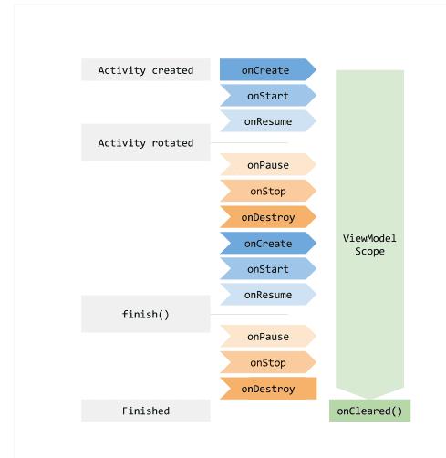
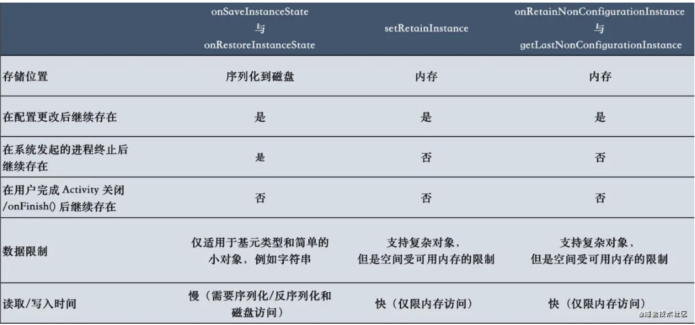

### 概述
LiveData是一个可观测的数据持有类，不同于通常的被观察者，LiveData具有生命周期感知能力。当它所持有的数据发生改变的时候，并且Lifecycle对象(比如Activity或者Fragment等)处于活跃状态(STARTED或者RESUMED），LiveData将立即通知观察者数据发生了变化。

ViewModel是一种用来存储和管理UI相关数据的类。但不同的是，它支持在系统配置发生改变的时候自动对数据进行保存，需要配合LiveData。此外，它也使得View的数据持有者和UI controller逻辑更加分离，便于解耦和测试。

LiveData&ViewModel的优势：

*   确保UI和数据状态匹配。当数据发生改变的时候，会自动通知UI进行更新。
*   避免内存泄漏。Observers是绑定到Lifecycle对象上的，当与其关联的lifecycle被销毁的时候，它们会自动被清理。
*   避免了由于Activity停止而导致的闪退。当Observer所绑定的Lifecycle处于非活跃状态时，比如处于返回栈中的Activity，它将不会收到任何LiveData事件。
*   不再需要手动处理生命周期。UI组件只需要对相关的数据进行监听，不需要关心是否应该暂停或者恢复监听。LiveData具有生命周期感知能力，它会自动对这些进行管理。
*   数据总处于最新状态。如果一个Lifecycle处于非活跃状态，那当它由非活跃状态变为活跃状态的时候，它将收到最新的数据。
*   系统配置更改时，比如说当Activity或者Fragment由于配置更改而重新创建时（比如旋转屏幕等），它将收到最新的可用数据，需要配合ViewModel使用。这样可以不用通过onSaveInstanceState()方法来进行数据的存储。onSaveInstanceState()方法为了使Activity能够尽快的重建只能存储少量的数据进行恢复，而且在Activity进行重建的时候，会比较浪费资源。但是如果方法在ViewModel中的话，Activity的重建将不会导致获取数据。当然，屏幕的旋转也可以通过configChanges的设置来阻止它的重建，但是其它的有些意外情况Activity也是有可能重建的。
*   资源共享。我们可以使用单例模式来扩展LiveData，或者结合ViewModel使用，这样就能达到数据变化的时候，通知所有的观察者。
LiveData的作用是在使得数据能具有生命周期感知能力，在Activity等变为活跃状态的时候，自动回调观察者中的回调方法。也就是说对数据的变化进行实时监听。而ViewModel的作用则是，当因系统配置发生改变导致Activity重建的时候（比如旋转屏幕），能对LiveData进行正确的保存和恢复。两者通常结合在一起使用。

### LiveData使用
####    基本使用
为了便于理解LiveData的使用，这里先单独学习一下LiveData的用法。LiveData 的使用分三步：

1.  创建一个LiveData的实例，让它持有一种特定的数据类型，通常是将LiveData放在ViewModel中使用的（这里我们先单独使用）。
2.  创建一个Observer对象，并实现其onChanged方法，在这里定义当LiveData持有的数据发生改变的时候，应该做何操作。可以在这进行UI的更新，一般Observer是在UI controller中创建，比如Activity或者Fragment。
3.  通过创建的LiveData实例的observe方法，将Observer对象添加进LiveData中。

根据这三个步骤，代码如下：
```
public class MainActivity extends AppCompatActivity {
    private static final String TAG = "JetPack";
    private MutableLiveData<Integer> mLiveData;
    private int value = 0;

    
    protected void onCreate( Bundle savedInstanceState) {
        super.onCreate(savedInstanceState);
        setContentView(R.layout.activity_main);
        mLiveData = new MutableLiveData<>();
        mLiveData.observe(this, new Observer<Integer>() {
            
            public void onChanged(Integer integer) {
                Log.d(TAG, "onChanged: " + integer);
            }
        });
        Timer timer = new Timer();
        timer.schedule(new TimerTask() {
            
            public void run() {
                mLiveData.postValue(value++);
            }
        }, 0, 1000);
    }
}
```
当APP进入后台时，计数依旧在进行，但是并不会打印日志，APP重新进入前台后，接着打印数据：
```
2020-06-09 11:04:23.618 16442-16442/com.hearing.mvvmdemo D/JetPack: onChanged: 0
2020-06-09 11:04:24.251 16442-16442/com.hearing.mvvmdemo D/JetPack: onChanged: 1
2020-06-09 11:04:25.251 16442-16442/com.hearing.mvvmdemo D/JetPack: onChanged: 2
2020-06-09 11:04:26.256 16442-16442/com.hearing.mvvmdemo D/JetPack: onChanged: 3
2020-06-09 11:04:27.257 16442-16442/com.hearing.mvvmdemo D/JetPack: onChanged: 4
2020-06-09 11:04:28.260 16442-16442/com.hearing.mvvmdemo D/JetPack: onChanged: 5
2020-06-09 11:04:33.510 16442-16442/com.hearing.mvvmdemo D/JetPack: onChanged: 10
2020-06-09 11:04:34.397 16442-16442/com.hearing.mvvmdemo D/JetPack: onChanged: 11
2020-06-09 11:04:35.402 16442-16442/com.hearing.mvvmdemo D/JetPack: onChanged: 12
```

如果想在数据更新的时候让Observer立即得到通知，也就是说忽略生命周期状态，可以使用LiveData的observeForever方法。

####    LiveData扩展
有时候我们需要在observer的lifecycle处于active状态时做一些操作，那么我们就可以通过继承LiveData或者MutableLiveData，然后覆写其onActive()和onInactive()方法。

####    LiveData转换
可以通过Transformations类的map操作符将LiveData中存储的数据在分发给Observer之前进行一些修改：
```
mLiveData = new MutableLiveData<>();
Transformations.map(mLiveData, new Function<Integer, String>() {
    
    public String apply(Integer input) {
        return "from " + input;
    }
}).observe(this, new Observer<String>() {
    
    public void onChanged(String s) {
        Log.d(TAG, "onChanged: " + s);
    }
});
```

可以使用Transformations类的switchMap操作符返回一个新的LiveData类型实例：
```
mLiveData = new MutableLiveData<>();
Transformations.switchMap(mLiveData, new Function<Integer, LiveData<String>>() {
    
    public LiveData<String> apply(Integer input) {
        return new MutableLiveData<>("from " + input);
    }
}).observe(this, new Observer<String>() {
    
    public void onChanged(String s) {
        Log.d(TAG, "onChanged: " + s);
    }
});
```

### LiveData&ViewModel使用
####    基本使用
MyViewModel
```
public class MyViewModel extends ViewModel {
    private MutableLiveData<String> mLiveData;
    private int value;

    public MutableLiveData<String> getLiveData() {
        if (mLiveData == null) {
            mLiveData = new MutableLiveData<>();
            scheduleData();
        }
        return mLiveData;
    }

    private void scheduleData() {
        Timer timer = new Timer();
        timer.schedule(new TimerTask() {
            
            public void run() {
                mLiveData.postValue("value " + value++);
            }
        }, 0, 1000);
    }
}
```
MainActivity
```
public class MainActivity extends AppCompatActivity {
    private static final String TAG = "JetPack";

    
    protected void onCreate( Bundle savedInstanceState) {
        Log.d(TAG, "onCreate");
        super.onCreate(savedInstanceState);
        setContentView(R.layout.activity_main);

        MyViewModel viewModel = new ViewModelProvider(this).get(MyViewModel.class);
        viewModel.getLiveData().observe(this, new Observer<String>() {
            
            public void onChanged(String s) {
                Log.d(TAG, "onChanged: " + s);
            }
        });
    }
}
```
上面当旋转屏幕时，MainActivity会被重建，onCreate会被重新调用，但是获取到的MyViewModel实例是同一个：
```
2020-06-09 11:40:55.243 24576-24576/com.hearing.mvvmdemo D/JetPack: onCreate
2020-06-09 11:40:55.534 24576-24576/com.hearing.mvvmdemo D/JetPack: onChanged: value 0
2020-06-09 11:40:56.387 24576-24576/com.hearing.mvvmdemo D/JetPack: onChanged: value 1
2020-06-09 11:40:57.386 24576-24576/com.hearing.mvvmdemo D/JetPack: onChanged: value 2
2020-06-09 11:40:58.389 24576-24576/com.hearing.mvvmdemo D/JetPack: onChanged: value 3
2020-06-09 11:40:59.387 24576-24576/com.hearing.mvvmdemo D/JetPack: onChanged: value 4
2020-06-09 11:41:00.387 24576-24576/com.hearing.mvvmdemo D/JetPack: onChanged: value 5
2020-06-09 11:41:01.388 24576-24576/com.hearing.mvvmdemo D/JetPack: onChanged: value 6
2020-06-09 11:41:02.387 24576-24576/com.hearing.mvvmdemo D/JetPack: onChanged: value 7
2020-06-09 11:41:02.605 24576-24576/com.hearing.mvvmdemo D/JetPack: onCreate
2020-06-09 11:41:02.703 24576-24576/com.hearing.mvvmdemo D/JetPack: onChanged: value 7
2020-06-09 11:41:03.390 24576-24576/com.hearing.mvvmdemo D/JetPack: onChanged: value 8
2020-06-09 11:41:04.390 24576-24576/com.hearing.mvvmdemo D/JetPack: onChanged: value 9
2020-06-09 11:41:05.390 24576-24576/com.hearing.mvvmdemo D/JetPack: onChanged: value 10
2020-06-09 11:41:06.390 24576-24576/com.hearing.mvvmdemo D/JetPack: onChanged: value 11
2020-06-09 11:41:07.391 24576-24576/com.hearing.mvvmdemo D/JetPack: onChanged: value 12
```

####    数据共享
可以使用ViewModel结合LivaData实现数据共享，如在Fragment之间可以通过这种方式共享数据。

#####   ViewModel
```
public class SharedViewModel extends ViewModel {
    private final MutableLiveData<String> selected = new MutableLiveData<>();

    public void select(String item) {
        selected.setValue(item);
    }

    public LiveData<String> getSelected() {
        return selected;
    }
}
```

#####   Fragment
```
public class MasterFragment extends Fragment {
    private int value;

    
    public void onCreate( Bundle savedInstanceState) {
        super.onCreate(savedInstanceState);
        final SharedViewModel viewModel = new ViewModelProvider(getActivity()).get(SharedViewModel.class);
        Timer timer = new Timer();
        timer.schedule(new TimerTask() {
            
            public void run() {
                getActivity().runOnUiThread(new Runnable() {
                    
                    public void run() {
                        viewModel.select("master " + value++);
                    }
                });
            }
        }, 0, 1000);
    }
}

public class DetailFragment extends Fragment {
    private static final String TAG = "JetPack";

    
    public void onCreate( Bundle savedInstanceState) {
        super.onCreate(savedInstanceState);
        final SharedViewModel viewModel = new ViewModelProvider(getActivity()).get(SharedViewModel.class);
        viewModel.getSelected().observe(getActivity(), new Observer<String>() {
            
            public void onChanged(String s) {
                Log.d(TAG, "onChanged: " + s);
            }
        });
    }
}
```

### LiveData源码分析
####    MutableLiveData
MutableLiveData源码如下：
```
public class MutableLiveData<T> extends LiveData<T> {
    public MutableLiveData(T value) {
        super(value);
    }

    public MutableLiveData() {
        super();
    }

    
    public void postValue(T value) {
        super.postValue(value);
    }

    
    public void setValue(T value) {
        super.setValue(value);
    }
}
```
可以看出MutableLiveData本身没有逻辑，它只是暴露了几个接口，其实现方法都在父类LiveData中。

####    LiveData初始化
```
public abstract class LiveData<T> {
    private volatile Object mData;
    private int mVersion;
    static final int START_VERSION = -1;
    static final Object NOT_SET = new Object();
    int mActiveCount = 0;

    public LiveData(T value) {
        mData = value;
        mVersion = START_VERSION + 1;
    }

    public LiveData() {
        mData = NOT_SET;
        mVersion = START_VERSION;
    }
}
```

####    ObserverWrapper
在介绍下面的源码之前，先看一看ObserverWrapper及其子类的逻辑：
```
private abstract class ObserverWrapper {
    final Observer<? super T> mObserver;
    boolean mActive;
    int mLastVersion = START_VERSION;

    ObserverWrapper(Observer<? super T> observer) {
        mObserver = observer;
    }

    abstract boolean shouldBeActive();

    boolean isAttachedTo(LifecycleOwner owner) {
        return false;
    }

    void detachObserver() {
    }

    // newActive：是否active
    void activeStateChanged(boolean newActive) {
        if (newActive == mActive) {
            return;
        }
        mActive = newActive;
        boolean wasInactive = LiveData.this.mActiveCount == 0; // 是否inactive
        LiveData.this.mActiveCount += mActive ? 1 : -1; // mActiveCount为处于active的观察者数量
        if (wasInactive && mActive) {
            onActive();
        }
        if (LiveData.this.mActiveCount == 0 && !mActive) {
            // 只有当所有的观察者都inactive了才会调用
            onInactive();
        }
        // 如果是active，则会马上分发当前的数据
        if (mActive) {
            dispatchingValue(this);
        }
    }
}
```
其子类有两个：

*   AlwaysActiveObserver：对应LiveData#observeForever方法，观察者忽略生命周期状态，状态一变更就会收到notify；
*   LifecycleBoundObserver：对应LiveData#observe方法，观察者受控制于LifecycleOwner的生命周期；

源码如下：
```
private class AlwaysActiveObserver extends ObserverWrapper {

    AlwaysActiveObserver(Observer<? super T> observer) {
        super(observer);
    }

    
    boolean shouldBeActive() {
        // 永远active
        return true;
    }
}
class LifecycleBoundObserver extends ObserverWrapper implements LifecycleEventObserver {
    
    final LifecycleOwner mOwner;

    LifecycleBoundObserver( LifecycleOwner owner, Observer<? super T> observer) {
        super(observer);
        mOwner = owner;
    }

    
    boolean shouldBeActive() {
        return mOwner.getLifecycle().getCurrentState().isAtLeast(STARTED);
    }

    
    public void onStateChanged( LifecycleOwner source,  Lifecycle.Event event) {
        if (mOwner.getLifecycle().getCurrentState() == DESTROYED) {
            removeObserver(mObserver);
            return;
        }
        activeStateChanged(shouldBeActive());
    }

    
    boolean isAttachedTo(LifecycleOwner owner) {
        return mOwner == owner;
    }

    
    void detachObserver() {
        mOwner.getLifecycle().removeObserver(this);
    }
}
```
####    observe
```
public void observe( LifecycleOwner owner,  Observer<? super T> observer) {
    assertMainThread("observe");
    if (owner.getLifecycle().getCurrentState() == DESTROYED) {
        // 如果owner已经处于DESTROYED，则直接返回
        return;
    }
    LifecycleBoundObserver wrapper = new LifecycleBoundObserver(owner, observer);
    ObserverWrapper existing = mObservers.putIfAbsent(observer, wrapper);
    if (existing != null && !existing.isAttachedTo(owner)) {
        // 同一个observer不能观察不同的LifecycleOwner
        throw new IllegalArgumentException("Cannot add the same observer with different lifecycles");
    }
    if (existing != null) {
        return;
    }
    owner.getLifecycle().addObserver(wrapper);
}
```
可知observe方法中使用的是LifecycleBoundObserver，并将其添加到了owner的Lifecycle的观察者集合中。这样当owner的state一变化，则会调用LifecycleBoundObserver的onStateChanged方法，如果owner未处于DESTROYED，则调用父类ObserverWrapper的activeStateChanged方法。

####    observeForever
// 需要手动调用removeObserver移除观察者
```
public void observeForever( Observer<? super T> observer) {
    assertMainThread("observeForever");
    AlwaysActiveObserver wrapper = new AlwaysActiveObserver(observer);
    ObserverWrapper existing = mObservers.putIfAbsent(observer, wrapper);
    if (existing instanceof LiveData.LifecycleBoundObserver) {
        throw new IllegalArgumentException("Cannot add the same observer with different lifecycles");
    }
    if (existing != null) {
        return;
    }
    wrapper.activeStateChanged(true);
}
```
observeForever方法中使用的是AlwaysActiveObserver，且直接调用到父类ObserverWrapper的activeStateChanged方法。需要注意的是需要手动调用removeObserver方法移除观察者。

####    removeObserver(s)
```
public void removeObserver( final Observer<? super T> observer) {
    assertMainThread("removeObserver");
    ObserverWrapper removed = mObservers.remove(observer);
    if (removed == null) {
        return;
    }
    removed.detachObserver();
    // 表示active状态变化
    removed.activeStateChanged(false);
}


public void removeObservers( final LifecycleOwner owner) {
    assertMainThread("removeObservers");
    for (Map.Entry<Observer<? super T>, ObserverWrapper> entry : mObservers) {
        if (entry.getValue().isAttachedTo(owner)) {
            removeObserver(entry.getKey());
        }
    }
}
```
####    postValue/setValue
```
volatile Object mPendingData = NOT_SET;
private final Runnable mPostValueRunnable = new Runnable() {
    
    
    public void run() {
        Object newValue;
        synchronized (mDataLock) {
            newValue = mPendingData;
            mPendingData = NOT_SET;
        }
        // 最终调用的还是setValue方法
        setValue((T) newValue);
    }
};

// 在主线程setValue
protected void postValue(T value) {
    boolean postTask;
    synchronized (mDataLock) {
        postTask = mPendingData == NOT_SET;
        mPendingData = value;
    }
    if (!postTask) {
        return;
    }
    // 在主线程执行
    ArchTaskExecutor.getInstance().postToMainThread(mPostValueRunnable);
}


protected void setValue(T value) {
    assertMainThread("setValue");
    mVersion++;
    mData = value;
    dispatchingValue(null);
}
```

####    dispatchingValue
```
private boolean mDispatchingValue;
private boolean mDispatchInvalidated;

void dispatchingValue( ObserverWrapper initiator) {
    if (mDispatchingValue) {
        mDispatchInvalidated = true;
        return;
    }
    mDispatchingValue = true;
    do {
        mDispatchInvalidated = false;
        if (initiator != null) {
            // 如果指定了观察者，则只notify该观察者
            considerNotify(initiator);
            initiator = null;
        } else {
            // 否则notify所有的观察者
            for (Iterator<Map.Entry<Observer<? super T>, ObserverWrapper>> iterator =
                    mObservers.iteratorWithAdditions(); iterator.hasNext(); ) {
                considerNotify(iterator.next().getValue());
                if (mDispatchInvalidated) {
                    break;
                }
            }
        }
    } while (mDispatchInvalidated);
    mDispatchingValue = false;
}

// 通知指定的观察者
private void considerNotify(ObserverWrapper observer) {
    if (!observer.mActive) {
        return;
    }
    if (!observer.shouldBeActive()) {
        observer.activeStateChanged(false);
        return;
    }
    if (observer.mLastVersion >= mVersion) {
        return;
    }
    observer.mLastVersion = mVersion;
    observer.mObserver.onChanged((T) mData);
}
```

####    Transformations

Transformations可以对给定的LiveData做一些转换，常用的有map和switchMap操作符，类似于RxJava用法。

```
public static <X, Y> LiveData<Y> map(
         LiveData<X> source,
         final Function<X, Y> mapFunction) {
    final MediatorLiveData<Y> result = new MediatorLiveData<>();
    result.addSource(source, new Observer<X>() {
        
        public void onChanged( X x) {
            result.setValue(mapFunction.apply(x));
        }
    });
    return result;
}


public static <X, Y> LiveData<Y> switchMap(
         LiveData<X> source,
         final Function<X, LiveData<Y>> switchMapFunction) {
    final MediatorLiveData<Y> result = new MediatorLiveData<>();
    result.addSource(source, new Observer<X>() {
        LiveData<Y> mSource;

        
        public void onChanged( X x) {
            LiveData<Y> newLiveData = switchMapFunction.apply(x);
            if (mSource == newLiveData) {
                return;
            }
            if (mSource != null) {
                result.removeSource(mSource);
            }
            mSource = newLiveData;
            if (mSource != null) {
                result.addSource(mSource, new Observer<Y>() {
                    
                    public void onChanged( Y y) {
                        result.setValue(y);
                    }
                });
            }
        }
    });
    return result;
}
```
其原理都是使用了MediatorLiveData类。

####    MediatorLiveData
MediatorLiveData也是LiveData的子类，它是一个Mediator（中间人）：
```
public class MediatorLiveData<T> extends MutableLiveData<T> {
    private SafeIterableMap<LiveData<?>, Source<?>> mSources = new SafeIterableMap<>();

    
    public <S> void addSource( LiveData<S> source,  Observer<? super S> onChanged) {
        Source<S> e = new Source<>(source, onChanged);
        Source<?> existing = mSources.putIfAbsent(source, e);
        if (existing != null && existing.mObserver != onChanged) {
            throw new IllegalArgumentException("This source was already added with the different observer");
        }
        if (existing != null) {
            return;
        }
        if (hasActiveObservers()) {
            e.plug();
        }
    }

    
    public <S> void removeSource( LiveData<S> toRemote) {
        Source<?> source = mSources.remove(toRemote);
        if (source != null) {
            source.unplug();
        }
    }

    
    
    protected void onActive() {
        for (Map.Entry<LiveData<?>, Source<?>> source : mSources) {
            source.getValue().plug();
        }
    }

    
    
    protected void onInactive() {
        for (Map.Entry<LiveData<?>, Source<?>> source : mSources) {
            source.getValue().unplug();
        }
    }

    private static class Source<V> implements Observer<V> {
        final LiveData<V> mLiveData;
        final Observer<? super V> mObserver;
        int mVersion = START_VERSION;

        Source(LiveData<V> liveData, final Observer<? super V> observer) {
            mLiveData = liveData;
            mObserver = observer;
        }

        void plug() {
            mLiveData.observeForever(this);
        }

        void unplug() {
            mLiveData.removeObserver(this);
        }

        
        public void onChanged( V v) {
            if (mVersion != mLiveData.getVersion()) {
                mVersion = mLiveData.getVersion();
                mObserver.onChanged(v);
            }
        }
    }
}
```
####    总结
LiveData之所以具有生命周期感知，其实也是借用了Lifecycle的功能，其源码相对而言也不算很复杂。

### ViewModel源码分析
####    生命周期
ViewModel对象存在的时间范围是获取ViewModel时传递给ViewModelProvider的Lifecycle。ViewModel将一直留在内存中，直到其对应的Lifecycle永久消失：对于Activity，是在Activity Finished时；而对于Fragment，是在Fragment Detached时。

下图说明了Activity经历屏幕旋转而后结束的过程中所处的各种生命周期状态：



####    ViewModelStore
顾名思义，ViewModelStore是一个用来存储ViewModel的类，源码如下：
```
public class ViewModelStore {

    private final HashMap<String, ViewModel> mMap = new HashMap<>();

    final void put(String key, ViewModel viewModel) {
        ViewModel oldViewModel = mMap.put(key, viewModel);
        if (oldViewModel != null) {
            oldViewModel.onCleared();
        }
    }

    final ViewModel get(String key) {
        return mMap.get(key);
    }

    Set<String> keys() {
        return new HashSet<>(mMap.keySet());
    }

    public final void clear() {
        for (ViewModel vm : mMap.values()) {
            vm.clear();
        }
        mMap.clear();
    }
}
```
####    ViewModelProvider
#####   初始化
ViewModelProvider的初始化需要指定两个参数：

*   Factory：生产ViewModel实例的工厂
*   ViewModelStore：存储ViewModel实例的类
```
public class ViewModelProvider {
    private final Factory mFactory;
    private final ViewModelStore mViewModelStore;

    public ViewModelProvider( ViewModelStoreOwner owner) {
        this(owner.getViewModelStore(), owner instanceof HasDefaultViewModelProviderFactory
                ? ((HasDefaultViewModelProviderFactory) owner).getDefaultViewModelProviderFactory()
                : NewInstanceFactory.getInstance());
    }

    public ViewModelProvider( ViewModelStoreOwner owner,  Factory factory) {
        this(owner.getViewModelStore(), factory);
    }

    public ViewModelProvider( ViewModelStore store,  Factory factory) {
        mFactory = factory;
        mViewModelStore = store;
    }
}
public interface HasDefaultViewModelProviderFactory {
    
    ViewModelProvider.Factory getDefaultViewModelProviderFactory();
}
```

#####   Factory
Factory是一个生产ViewModel的工厂，通过实现这个接口可以自定义工厂：
```
public interface Factory {
    
    <T extends ViewModel> T create( Class<T> modelClass);
}
```
#####   NewInstanceFactory

直接通过 modelClass.newInstance() 创建 ViewModel 实例。

#####   AndroidViewModelFactory

创建 AndroidViewModel 实例。在ViewModel中最好不要持有Activity的引用，因为当Activity被reCreate时，ViewModel对象并没有被销毁，如果Model持有Activity的引用时就可能会导致内存泄漏。如果要使用到Context对象则可以使用ViewModel的子类AndroidViewModel：
```
public class AndroidViewModel extends ViewModel {
    private Application mApplication;

    public AndroidViewModel( Application application) {
        mApplication = application;
    }

    
    public <T extends Application> T getApplication() {
        return (T) mApplication;
    }
}
```
#####   get方法
get方法获取一个ViewModel实例：
```
private static final String DEFAULT_KEY = "androidx.lifecycle.ViewModelProvider.DefaultKey";

public <T extends ViewModel> T get( Class<T> modelClass) {
    String canonicalName = modelClass.getCanonicalName();
    if (canonicalName == null) {
        throw new IllegalArgumentException("Local and anonymous classes can not be ViewModels");
    }
    return get(DEFAULT_KEY + ":" + canonicalName, modelClass);
}

// 通过key从ViewModelStore中获取ViewModel实例


public <T extends ViewModel> T get( String key,  Class<T> modelClass) {
    ViewModel viewModel = mViewModelStore.get(key);

    if (modelClass.isInstance(viewModel)) {
        if (mFactory instanceof OnRequeryFactory) {
            ((OnRequeryFactory) mFactory).onRequery(viewModel);
        }
        return (T) viewModel;
    } else {
        if (viewModel != null) {
        }
    }
    if (mFactory instanceof KeyedFactory) {
        viewModel = ((KeyedFactory) (mFactory)).create(key, modelClass);
    } else {
        viewModel = (mFactory).create(modelClass);
    }
    mViewModelStore.put(key, viewModel);
    return (T) viewModel;
}
```

####    ViewModel数据保存
当 Activity 因旋转发生改变时，系统会重新创建一个新的 Activity 实例，那旧 Activity 中的 ViewModel 是如何传递给新的 Activity 的呢？首先了解一下数据恢复的几种常见方式：

onSaveInstanceState 与 onRestoreInstanceState

当 Activity 开始停止时，系统会调用 onSaveInstanceState() 方法将状态信息保存到 Bundle 中。重建先前被销毁的 Activity 后，可以从系统传递给 Activity 的 Bundle 中恢复保存的实例状态。onCreate() 和 onRestoreInstanceState() 回调方法均会收到包含实例状态信息的相同 Bundle。

Fragment.setRetainInstance

当配置发生改变时，Fragment 会随着宿主 Activity 销毁与重建。在调用 Fragment.setRetainInstance(true) 方法时，系统允许 Fragment 绕开销毁-重建的过程：

*   使用该方法后，不会调用 Fragment 的 onDestory() 方法，但仍然会调用 onDetach() 方法。
*   使用该方法后，不会调用 Fragment 的 onCreate(Bundle) 方法。
*   使用该方法后，Fragment 的 onAttach(Activity) 与 onActivityCreated(Bundle) 方法仍然会被调用。
onRetainNonConfigurationInstance 与 getLastNonConfigurationInstance

在 Activity 中提供了 onRetainNonConfigurationInstance 方法用于处理配置发生改变时数据的保存。随后在重新创建的 Activity 中调用 getLastNonConfigurationInstance 获取上次保存的数据。我们不能直接重写上述方法，如果想在 Activity 中自定义想要恢复的数据，需要调用上述两个方法的内部方法: onRetainCustomNonConfigurationInstance(), getLastCustomNonConfigurationInstance().

几种数据恢复方式的总结




#####   ViewModel的恢复

Google 在 Androidx 版本的 Activity 源码中重写了 onRetainNonConfigurationInstance 逻辑：
```
// androidx.activity.ComponentActivity
public final Object onRetainNonConfigurationInstance() {
    Object custom = onRetainCustomNonConfigurationInstance();

    ViewModelStore viewModelStore = mViewModelStore;
    if (viewModelStore == null) {
        NonConfigurationInstances nc = (NonConfigurationInstances) getLastNonConfigurationInstance();
        if (nc != null) {
            viewModelStore = nc.viewModelStore;
        }
    }

    if (viewModelStore == null && custom == null) {
        return null;
    }
    // 将 ViewModel 存储在 NonConfigurationInstances 对象中
    NonConfigurationInstances nci = new NonConfigurationInstances();
    nci.custom = custom;
    nci.viewModelStore = viewModelStore;
    return nci;
}

// androidx.fragment.app.FragmentActivity
public final Object onRetainNonConfigurationInstance() {
    Object custom = onRetainCustomNonConfigurationInstance();
    FragmentManagerNonConfig fragments = mFragments.retainNestedNonConfig();

    if (fragments == null && mViewModelStore == null && custom == null) {
        return null;
    }

    NonConfigurationInstances nci = new NonConfigurationInstances();
    nci.custom = custom;
    nci.viewModelStore = mViewModelStore;
    nci.fragments = fragments;
    return nci;
}
```

然后当新的 Activity 重新创建并调用 ViewModelProviders.of(this).get(xxxModel.class) 时又会在 getViewModelStore() 方法中获取老 Activity 保存的 ViewModelStore：
```
// androidx.activity.ComponentActivity
// androidx.fragment.app.FragmentActivity
public ViewModelStore getViewModelStore() {
    if (getApplication() == null) {
        throw new IllegalStateException("...");
    }
    if (mViewModelStore == null) {
        NonConfigurationInstances nc = (NonConfigurationInstances) getLastNonConfigurationInstance();
        if (nc != null) {
            mViewModelStore = nc.viewModelStore;
        }
        if (mViewModelStore == null) {
            mViewModelStore = new ViewModelStore();
        }
    }
    return mViewModelStore;
}
```
因此在屏幕旋转后，ViewModel 保存的数据可以被恢复。

另外 ViewModel 在 Fragment 中不会因配置改变而销毁的原因其实是因为其声明的 ViewModel 是存储在 FragmentManagerViewModel 中的，而 FragmentManagerViewModel 是存储在宿主 Activity 中的 ViewModelStore 中，又因 Activity 中 ViewModelStore不会因配置改变而销毁，故 Fragment 中 ViewModel 也不会因配置改变而销毁。
```
// androidx.fragment.app.Fragment implements ViewModelStoreOwner
public ViewModelStore getViewModelStore() {
    if (mFragmentManager == null) {
        throw new IllegalStateException("Can't access ViewModels from detached fragment");
    }
    return mFragmentManager.getViewModelStore(this);
}
```

#####   ViewModel能在Fragment中共享的原理

假如想在 FragmentB 获取 FragmentA 中的数据，那么只有在 Activity 中的 ViewModelStore 下添加 ViewModel 才能在不同 Fragment 中获取相同的数据。这也是为什么在 Fragment 中使用共享的 ViewModel 时，我们要在调用 ViewModelProvider.of() 创建 ViewModel 时传入 getActivity() 的原因。

#### 总结
ViewModel之所以比Activity/Fragment生命周期长，是因为在ViewModelStore中存储了其实例，当重建后获取的ViewModel实例是之前已经存储了的实例，只有当Activity Finished或者Fragment Detached时才会被销毁，可以参考下面的代码：
```
public class ComponentActivity extends androidx.core.app.ComponentActivity implements
        LifecycleOwner,
        ViewModelStoreOwner, ... {
    public ComponentActivity() {
        getLifecycle().addObserver(new LifecycleEventObserver() {
            
            public void onStateChanged( LifecycleOwner source,  Lifecycle.Event event) {
                if (event == Lifecycle.Event.ON_DESTROY) {
                    if (!isChangingConfigurations()) {
                        getViewModelStore().clear();
                    }
                }
            }
        });
    }
}
```
Fragment中也可以找到类似逻辑的代码。

### 总结
通常LiveData是需要配合ViewModel使用的。ViewModel负责在系统配置更改时保存LiveData，而LiveData则负责在生命周期状态发生改变的时候，对数据的变化进行监听。

***
https://ljd1996.github.io/2020/06/09/Android-Jetpack%E7%BB%84%E4%BB%B6%E4%B9%8BLiveData-ViewModel/
***