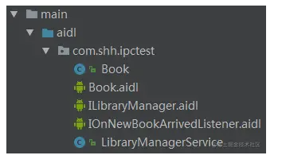
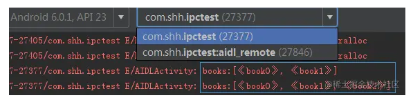
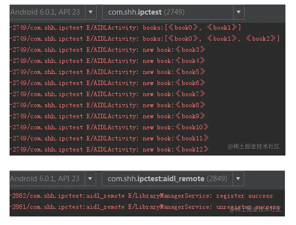
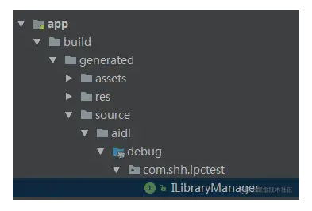

### 一、Android 中的多进程
#### 1、定义

首先，进程一般指一个执行单元，在移动设备上就是一个程序或应用，我们在Android中所说的多进程（IPC）一般指一个应用包含多个进程。之所以要使用多进程有两方面原因：某些模块由于特殊的需求要运行在单独的进程；增加应用可用的内存空间。

#### 2、开启多进程
Android中开启多线程只有一种方法，就是在AndroidManifest.xml中注册Service、Activity、Receiver、ContentProvider时指定android:process属性，例如：
```
<service
    android:name=".MyService"
    android:process=":remote">
</service>

<activity
    android:name=".MyActivity"
    android:process="com.shh.ipctest.remote2">
</activity>
```

我们为MyService和MyActivity指定的android:process属性值有所不同，它们的区别如下：

*   :remote：以:开头是一种简写，系统会在当前进程名前附件当前包名，完整的进程名为：com.shh.ipctest:remote，同时以:开头的进程属于当前应用的私有进程，其它应用的组件不能和它跑在同一进程。

*   com.shh.ipctest.remote2：这是完整的命名方式，不会附加包名，其它应用如果和该进程的ShareUID、签名相同，则可以和它跑在同一个进程，实现数据共享。

#### 3、多进程引发的问题
开启多进程虽简单，但会引发如下问题，必须引起注意。

*   静态成员和单例模式失效
*   线程同步机制失效
*   SharedPreferences 可靠性降低
*   Application 被多次创建

对于前两个问题，可以这么理解，在Android中，系统会为每个应用或进程分配独立的虚拟机，不同的虚拟机自然占有不同的内存地址空间，所以同一个类的对象会产生不同的副本，导致共享数据失败，必然也不能实现线程的同步。

由于SharedPreferences底层采用读写XML的文件的方式实现，多进程并发的的读写很可能导致数据异常。

Application被多次创建和前两个问题类似，系统在分配多个虚拟机时相当于把同一个应用重新启动多次，必然会导致 Application 多次被创建，为了防止在 Application中出现无用的重复初始化，可使用进程名来做过滤，只让指定进程的才进行全局初始：
```
public class MyApplication extends Application{
    @Override
    public void onCreate() {
        super.onCreate();
        String processName = "com.shh.ipctest";
        if (getPackageName().equals(processName)){
            // do some init
        }
    }
}
```
#### 4、Android中的多进程通信方式

Android中支持的多进程通信方式主要有以下几种，它们之间各有优缺点，可根据使用场景选择选择：

*   AIDL：功能强大，支持进程间一对多的实时并发通信，并可实现 RPC (远程过程调用)。
*   Messenger：支持一对多的串行实时通信， AIDL 的简化版本。
*   Bundle：四大组件的进程通信方式，只能传输 Bundle 支持的数据类型。
*   ContentProvider：强大的数据源访问支持，主要支持 CRUD 操作，一对多的进程间数据共享，例如我们的应用访问系统的通讯录数据。
*   BroadcastReceiver：即广播，但只能单向通信，接收者只能被动的接收消息。
*   文件共享：在非高并发情况下共享简单的数据。
*   Socket：通过网络传输数据。

这里我们主要讨论四大组件中Service在多进程通信中的使用，这就涉及到了 AIDL、Messenger这两种多进程通信方式，接下来重点看这两种 IPC 方式。

### 二、AIDL
AIDL 的意思是 Android 接口定义语言，使用AIDL进行进程间通信需要定义服务端和客户端，其中客户端和服务端可以在同一应用也可以在不同应用。这里我们服务端可以看做是图书馆，为客户端提供近期新书查询、图书捐赠、新书通知的服务。

####    1、服务端实现
先创建一个 AIDL 文件，声明服务端要暴露给客户端的接口，然后创建一个 Service 监听客户端的连接请求，并在其中实现 AIDL 文件中的接口。
注意，为了方便开发，我们一般把 AIDL 相关的文件放在同一包中，这样当客户端是另一个应用时可方便的把整个包复制到客户端工程中。最终的AIDL文件包如下：



首先了解下 AIDL 文件支持的几种数据类型：

*   基本数据类型
*   String、CharSequence
*   ArrayList、HashMap，其内部元素也需要被AIDL支持
*   实现了 Parcelable 接口的对象
*   AIDL 类型的接口，非普通接口

Book是实现了Parcelable的图书类，只定义了图书名name字段，按照规定如果 AIDL 文件用到了自定义Parcelable对象，同时需要提供一个Book.aidl文件：
```
package com.shh.ipctest;

parcelable Book;
```
ILibraryManager.aidl定义了服务端要暴露给客户端的接口：

```
package com.shh.ipctest;

import com.shh.ipctest.Book;

interface ILibraryManager{
    // 近期新书查询
    List<Book> getNewBookList();
    // 图书捐赠
    void donateBook(in Book book);
}
```

注意，尽管ILibraryManager.aidl和Book在同一包中，还是需要显示的导入Book类。除了基本类型数据外，其它类型的参数需要标注方向，可选的方向标识有：

*   in：输入类型参数
*   out：输出类型参数
*   inout：输入输出类型参数

接下来就是LibraryManagerService这个服务类了，在编写服务类前要先编译项目，这样在服务类里使用 AIDL 生成的java类。
```
public class LibraryManagerService extends Service {

    private static final String TAG = "LibraryManagerService";

    // CopyOnWriteArrayList 支持并发读写
    private CopyOnWriteArrayList<Book> mBookList = new CopyOnWriteArrayList<>();
   
    private Binder mBinder = new ILibraryManager.Stub() {

        @Override
        public List<Book> getNewBookList() throws RemoteException {
            return mBookList;
        }

        @Override
        public void donateBook(Book book) throws RemoteException {
            mBookList.add(book);
        }
    };

    public LibraryManagerService() {
    }

    @Override
    public IBinder onBind(Intent intent) {
        return mBinder;
    }

    @Override
    public void onCreate() {
        super.onCreate();
        mBookList.add(new Book("book0"));
        mBookList.add(new Book("book1"));
    }
}
```

首先通过ILibraryManager.Stub()创建一个mBinder对象，并实现了ILibraryManager.aidl中定义的接口方法，在onBind()方法中返回创建的mBinder，并在服务onCreate()时添加两本书。最后在 AndroidManifest.xml 注册服务：
```
<service
    android:name=".LibraryManagerService"
    android:process=":aidl_remote">
</service>
```

到这里服务端的基本功能就完成了。

#### 2、客户端实现
这里先把客户端和服务端放在同一个应用，客户端的实现相对简单些，首先在项目 app 的build.gradle指定 AIDL 文件路径：

```
android {
    ......

    // 指定 aidl 路径
    sourceSets {
        main {
            java.srcDirs = ['src/main/java', 'src/main/aidl']
        }
    }
}
```
之后就是绑定服务了：

```
public class AIDLActivity extends AppCompatActivity {
    private static final String TAG = "AIDLActivity";

    private ServiceConnection mServiceConnection = new ServiceConnection() {
        @Override
        public void onServiceConnected(ComponentName name, IBinder service) {
            ILibraryManager libraryManager = ILibraryManager.Stub.asInterface(service);
            try {
                // 近期新书查询
                List<Book> books = libraryManager.getNewBookList();
                Log.e(TAG, "books:" + books.toString());
                // 捐赠一本书
                libraryManager.donateBook(new Book("book" + books.size()));
                List<Book> books2 = libraryManager.getNewBookList();
                Log.e(TAG, "books:" + books2.toString());
            } catch (RemoteException e) {
                e.printStackTrace();
            }
        }

        @Override
        public void onServiceDisconnected(ComponentName name) {

        }
    };

    @Override
    protected void onCreate(Bundle savedInstanceState) {
        super.onCreate(savedInstanceState);
        setContentView(R.layout.activity_aidl);
        bindNewService();
    }

    private void bindNewService() {
        Intent intent = new Intent(AIDLActivity.this, LibraryManagerService.class);
        bindService(intent, mServiceConnection, Context.BIND_AUTO_CREATE);
    }

    @Override
    protected void onDestroy() {
        unbindService(mServiceConnection);
        super.onDestroy();
    }
}
```
先实现ServiceConnection接口，在onServiceConnected()方法中将IBinder对象转换成ILibraryManager对象，通过该对象就能调用ILibraryManager.aidl中声明的方法了。

接下来绑定服务：
```
Intent intent = new Intent(AIDLActivity.this, LibraryManagerService.class);
bindService(intent, mServiceConnection, Context.BIND_AUTO_CREATE);
```

运行项目后观察log：



出现了两个进程，并在客户端进程打印了对应的图书名，到这里我们一个简单的 AIDL 多进程通信就实现了。

如果客户端和服务端在不同的应用怎么实现呢？首先将服务端的 AIDL 包复制到客户端项目的main目录下，在客户端项目 app 的build.gradle指定 AIDL 文件路径，最后就是绑定服务了，由于客户端需要隐式绑定服务，所以要先修改服务端LibraryManagerService的注册方式为：

```
<service
    android:name=".LibraryManagerService"
    android:process=":aidl_remote">
    <intent-filter>
        <action android:name="android.intent.action.LibraryManagerService" />
    </intent-filter>
</service>
```
然后就是在客户端隐式启动服务：

```
Intent intent = new Intent();
intent.setAction("android.intent.action.LibraryManagerService");
intent.setPackage("com.shh.ipctest");
bindService(intent, mServiceConnection, Context.BIND_AUTO_CREATE);
```

####    3、通知
如果要添加一个新书提醒功能，即图书馆每采购一本新书后需要通知订阅了新书提醒功能的用户，要怎么修改服务端和客户端呢？

首先创建一个服务端通知客户端的 IOnNewBookArrivedListener.aidl 接口：

```
package com.shh.ipctest;

import com.shh.ipctest.Book;

interface IOnNewBookArrivedListener {
    void onNewBookArrived(in Book book);
}
我们约定服务端要先注册后才能收到通知，同时也可以取消注册，所以要给之前的ILibraryManager.aidl添加连个方法了：
java复制代码package com.shh.ipctest;

import com.shh.ipctest.Book;
import com.shh.ipctest.IOnNewBookArrivedListener;

interface ILibraryManager{
    ......
    // 注册通知
    void register(IOnNewBookArrivedListener listener);
    // 取消注册
    void unregister(IOnNewBookArrivedListener listener);
}
```

接下来就是修改服务端的LibraryManagerService：
```
// 只保留了相关核心代码
public class LibraryManagerService extends Service {
    ......
    // 系统提供的专门用于保存、删除跨进程 listener 的类
    private RemoteCallbackList<IOnNewBookArrivedListener> mListenerList = new RemoteCallbackList<>();
    // AtomicBoolean 支持并发读写
    private AtomicBoolean mIsServiceDestroy = new AtomicBoolean(false);

    private Binder mBinder = new ILibraryManager.Stub() {
        ......
        @Override
        public void register(IOnNewBookArrivedListener listener) throws RemoteException {
            mListenerList.register(listener);
            Log.e(TAG, "register success");
        }

        @Override
        public void unregister(IOnNewBookArrivedListener listener) throws RemoteException {
            mListenerList.unregister(listener);
            Log.e(TAG, "unregister success");
        }
    };

   .......

    @Override
    public void onCreate() {
        super.onCreate();
        ......
        // 在子线程中每隔3秒创建一本新书，并通知所有已注册的客户端
        new Thread(new Runnable() {
            @Override
            public void run() {
                // 如果服务还没终止
                while (!mIsServiceDestroy.get()) {
                    try {
                        Thread.sleep(3 * 1000);
                    } catch (InterruptedException e) {
                        e.printStackTrace();
                    }

                    Book book = new Book("book" + mBookList.size());
                    mBookList.add(book);
                    bookArrivedNotify(book);
                }
            }
        }).start();
    }
    
    private void bookArrivedNotify(Book book) {
        int n = mListenerList.beginBroadcast();
        for (int i = 0; i < n; i++) {
            IOnNewBookArrivedListener listener = mListenerList.getBroadcastItem(i);
            if (listener != null) {
                try {
                    listener.onNewBookArrived(book);
                } catch (RemoteException e) {
                    e.printStackTrace();
                }
            }
        }
        mListenerList.finishBroadcast();
    }

    @Override
    public void onDestroy() {
        super.onDestroy();
        mIsServiceDestroy.set(true);
    }
}
```

注意这里用到了RemoteCallbackList类，它是系统提供的专门用于删除跨进程 listener 的类，用普通的集合难以保证客户端注册的 listener 和服务端存储的 listener 是同一个，会取消注册失败。在的register()、unregister()中实现了通知接口的绑定和解绑操作。在onCreate()周期性的通知客户端有新书了。

在客户端中需要完成通知接口的注册和取消注册：
```
// 只保留了相关核心代码
public class AIDLActivity extends AppCompatActivity {
    ......
    private ILibraryManager mLibraryManager;

    private Handler mHandler = new Handler(new Handler.Callback() {
        @Override
        public boolean handleMessage(Message msg) {
            switch (msg.what) {
                case MESSAGE_NEW_BOOK_ARRIVED:
                    Log.e(TAG, "new book:" + msg.obj);
                    break;
            }
            return true;
        }
    });

    private IOnNewBookArrivedListener listener = new IOnNewBookArrivedListener.Stub() {
        @Override
        public void onNewBookArrived(Book book) throws RemoteException {
            // 由于 onNewBookArrived 方法在子线程被调用，所以通过Handler切换到UI线程，方便UI操作
            mHandler.obtainMessage(MESSAGE_NEW_BOOK_ARRIVED, book).sendToTarget();
        }
    };

    private ServiceConnection mServiceConnection = new ServiceConnection() {
        @Override
        public void onServiceConnected(ComponentName name, IBinder service) {
            ILibraryManager libraryManager = ILibraryManager.Stub.asInterface(service);
            mLibraryManager = libraryManager;
            try {
                ......
                // 注册通知
                libraryManager.register(listener);
            } catch (RemoteException e) {
                e.printStackTrace();
            }
        }
        ......
    };

    @Override
    protected void onCreate(Bundle savedInstanceState) {
        super.onCreate(savedInstanceState);
        setContentView(R.layout.activity_aidl);
        bindNewService();
    }

    @Override
    protected void onDestroy() {
        unbindService(mServiceConnection);
        if (mLibraryManager != null && mLibraryManager.asBinder().isBinderAlive()) {
            try {
                // 取消注册
                mLibraryManager.unregister(listener);
            } catch (RemoteException e) {
                e.printStackTrace();
            }
        }
        super.onDestroy();
    }
}
```

首先是创建IOnNewBookArrivedListener接口的对象，为了方便 UI 操作可以在回调中用Handler将服务端通知的结果切换到 UI 线程，并打印新书名，在onServiceConnected()中注册接口，在onDestroy()中取消注册。运行项目后看下客户端、服务端的log：



####    4、权限校验

目前我们的服务端任何客户端都可以连接，项目开发中为了安全起见，我们需要在服务端做权限校验，只有客户端配置了指定的权限，才能调用服务端的方法。
服务端可以使用permission+包名的方式来验证，首先在服务端的AndroidManifest.xml声明一个permission：

```
<permission
        android:name="com.shh.ipctest.permission.ACCESS_LIBRARY_SERVICE"
        android:protectionLevel="normal" />
```

接下来就是在LibraryManagerService中校验要连接的客户端是配置了该permission，以及包名是否符合指定规则，可以做校验的地方有两个，第一个是在onBind()中校验：
```
@Override
public IBinder onBind(Intent intent) {
    if (!passBindCheck()) {
        Log.e(TAG, "bind denied");
        return null;
    }
    return mBinder;
}

private boolean permissionCheck() {
    // 客户端是否已申请了指定权限
    int check = checkCallingOrSelfPermission("com.shh.ipctest.permission.ACCESS_LIBRARY_SERVICE");
    if (check == PackageManager.PERMISSION_DENIED) {
        return false;
    }

    // 检验客户端包名会否以com.shh开头
    String[] packages = getPackageManager().getPackagesForUid(getCallingUid());
    if (packages != null && packages.length > 0 && !packages[0].startsWith("com.shh")) {
        return false;
    }
    return true;
}
```

注意，onBind()是在客户端连接服务端时调用，如果客户端不能在此处通过校验则无发连接到服务。如果客户端和服务端是两个应用，则无法在onBind()实现校验的功能！
第二个地方是在ILibraryManager.Stub类的onTransact()方法中，在该方法里校验解决了客户端和服务端是两个应用时无法在onBind()实现校验的问题，代码如下：
```
private Binder mBinder = new ILibraryManager.Stub() {
    ......
    @Override
    public boolean onTransact(int code, Parcel data, Parcel reply, int flags) throws RemoteException {
        if (!permissionCheck()) {
            Log.e(TAG, "bind denied");
            return false;
        }
        return super.onTransact(code, data, reply, flags);
    }
};
```

注意，该方法在onBind()之后执行，意味着客户端和服务端已经连接，当客户端调用服务端的方法时会走onTransact()方法。

最后需要在客户端的AndroidManifest.xml配置permission权限：
```
<uses-permission android:name="com.shh.ipctest.permission.ACCESS_LIBRARY_SERVICE" />
```
####    5、重新连接
服务端进程可能会由于内存不足等原因意外终止而导致服务被杀死，所以有必要在这种情况下重新连接到服务。连接的方式有两种：

第一种相对简单，是在ServiceConnection接口的onServiceDisconnected()方法中重新连接服务，注意该方法在UI线程执行。

第二种是给客户端得到的Binder对象注册一个DeathRecipient监听，首先来创建该监听：
```
private IBinder.DeathRecipient mDeathRecipient = new IBinder.DeathRecipient() {
    @Override
    public void binderDied() {
        if (mLibraryManager != null) {
            mLibraryManager.asBinder().unlinkToDeath(mDeathRecipient, 0);
            mLibraryManager = null;
            // 重新连接服务
            bindNewService();
        }
    }
}
```
当服务被杀死时binderDied()方法会被调用，接下来就是在服务连接成功后设置死亡监听：
```
@Override
    public void onServiceConnected(ComponentName name, IBinder service) {
        ILibraryManager libraryManager = ILibraryManager.Stub.asInterface(service);
        mLibraryManager = libraryManager;
        try {
            // 将mLibraryManager转成Binder对象然后注册死亡监听
            mLibraryManager.asBinder().linkToDeath(mDeathRecipient, 0);
        } catch (RemoteException e) {
            e.printStackTrace();
        }
        ......
    }
```

### 三、Binder

在 AIDL 的例子中，客户端之所以能和服务端通信，主要依靠系统提供的Binder类实现，它实现了IBinder接口，我们在前边的例子已经用到了Binder类，例如在服务端的 Service 中创建了一个Binder对象并在onBind()中返回：
```
Binder mBinder = new ILibraryManager.Stub(){
......
}
```
当在客户端绑定服务成功后，会得到服务端返回的Binder对象，并将其转换成可调用服务端暴露的方法的ILibraryManager对象：

```
private ServiceConnection mServiceConnection = new ServiceConnection() {
        @Override
        public void onServiceConnected(ComponentName name, IBinder service) {
            ILibraryManager libraryManager = ILibraryManager.Stub.asInterface(service);
            .......
        }
        ......
    };
```

可以发现不管是客户端还是服务端都用到了ILibraryManager.java类，回想一下之前我们创建过一个ILibraryManager.aidl文件，所以ILibraryManager.java应该是ILibraryManager.aidl在编译后生成的，果然在如下目录有这个类：



ILibraryManager.java的代码如下：

```
public interface ILibraryManager extends android.os.IInterface {
    
    public static abstract class Stub extends android.os.Binder implements com.shh.ipctest.ILibraryManager {
        // Binder 的唯一标识
        private static final java.lang.String DESCRIPTOR = "com.shh.ipctest.ILibraryManager";

        public Stub() {
            this.attachInterface(this, DESCRIPTOR);
        }
        // 将服务端的 Binder 对象转换成客户端需要的接口对象
        // 如果客户端和服务端在同一进程则返回 Stub 对象本身，否则返回Stub.Proxy这个代理对象
        public static com.shh.ipctest.ILibraryManager asInterface(android.os.IBinder obj) {
            if ((obj == null)) {
                return null;
            }
            android.os.IInterface iin = obj.queryLocalInterface(DESCRIPTOR);
            if (((iin != null) && (iin instanceof com.shh.ipctest.ILibraryManager))) {
                return ((com.shh.ipctest.ILibraryManager) iin);
            }
            return new com.shh.ipctest.ILibraryManager.Stub.Proxy(obj);
        }
        // 返回当前 Binder 对象
        @Override
        public android.os.IBinder asBinder() {
            return this;
        }
        /**
         * 运行在服务端的 Binder 线程池，客户端发起的跨进程方法调用最终会交给该方法处理
         * @param code 确定客户端调用的是哪个方法
         * @param data  保存要调用的方法需要的参数
         * @param reply 保存要调用的方法最后的返回值
         * @param flags 
         * @return 返回false调用
         * @throws android.os.RemoteException
         */
        @Override
        public boolean onTransact(int code, android.os.Parcel data, android.os.Parcel reply, int flags) throws android.os.RemoteException {
            switch (code) {
                case INTERFACE_TRANSACTION: {
                    reply.writeString(DESCRIPTOR);
                    return true;
                }
                case TRANSACTION_getNewBookList: {
                    data.enforceInterface(DESCRIPTOR);
                    java.util.List<com.shh.ipctest.Book> _result = this.getNewBookList();
                    // 封装返回的数据
                    reply.writeNoException();
                    reply.writeTypedList(_result);
                    return true;
                }
                case TRANSACTION_donateBook: {
                    data.enforceInterface(DESCRIPTOR);
                    com.shh.ipctest.Book _arg0;
                    if ((0 != data.readInt())) {
                        // 反序列化出具体的请求参数
                        _arg0 = com.shh.ipctest.Book.CREATOR.createFromParcel(data);
                    } else {
                        _arg0 = null;
                    }
                    this.donateBook(_arg0);
                    reply.writeNoException();
                    return true;
                }
                case TRANSACTION_register: {
                    data.enforceInterface(DESCRIPTOR);
                    com.shh.ipctest.IOnNewBookArrivedListener _arg0;
                    _arg0 = com.shh.ipctest.IOnNewBookArrivedListener.Stub.asInterface(data.readStrongBinder());
                    this.register(_arg0);
                    reply.writeNoException();
                    return true;
                }
                case TRANSACTION_unregister: {
                    data.enforceInterface(DESCRIPTOR);
                    com.shh.ipctest.IOnNewBookArrivedListener _arg0;
                    _arg0 = com.shh.ipctest.IOnNewBookArrivedListener.Stub.asInterface(data.readStrongBinder());
                    this.unregister(_arg0);
                    reply.writeNoException();
                    return true;
                }
            }
            return super.onTransact(code, data, reply, flags);
        }
        // 客户端跨进程调用服务端方法时，会先在客户端执行该类里的对应方法，
        // 调用mRemote.transact()发起远程过程调用（RPC）请求，同时客户端对应的线程会挂起，
        // 进而执行服务端的onTransact()方法，直到 RPC 请求结束，客户端线程继续执行，
        // 这可能是一个耗时的过程，所以要避免客户端出现 ANR 的问题。
        private static class Proxy implements com.shh.ipctest.ILibraryManager {
            private android.os.IBinder mRemote;

            Proxy(android.os.IBinder remote) {
                mRemote = remote;
            }

            @Override
            public android.os.IBinder asBinder() {
                return mRemote;
            }

            public java.lang.String getInterfaceDescriptor() {
                return DESCRIPTOR;
            }

            @Override
            public java.util.List<com.shh.ipctest.Book> getNewBookList() throws android.os.RemoteException {
                // 保存请求参数的 Parcel 对象
                android.os.Parcel _data = android.os.Parcel.obtain();
                // 保存返回结果的 Parcel 对象
                android.os.Parcel _reply = android.os.Parcel.obtain();
                java.util.List<com.shh.ipctest.Book> _result;
                try {
                    _data.writeInterfaceToken(DESCRIPTOR);
                    // 发起 RPC 请求
                    mRemote.transact(Stub.TRANSACTION_getNewBookList, _data, _reply, 0);
                    _reply.readException();
                    // 从 RPC 请求的结果中取出最终要返回的数据
                    _result = _reply.createTypedArrayList(com.shh.ipctest.Book.CREATOR);
                } finally {
                    _reply.recycle();
                    _data.recycle();
                }
                return _result;
            }

            @Override
            public void donateBook(com.shh.ipctest.Book book) throws android.os.RemoteException {
                android.os.Parcel _data = android.os.Parcel.obtain();
                android.os.Parcel _reply = android.os.Parcel.obtain();
                try {
                    _data.writeInterfaceToken(DESCRIPTOR);
                    if ((book != null)) {
                        _data.writeInt(1);
                        // 将参数序列化保存
                        book.writeToParcel(_data, 0);
                    } else {
                        _data.writeInt(0);
                    }
                    mRemote.transact(Stub.TRANSACTION_donateBook, _data, _reply, 0);
                    _reply.readException();
                } finally {
                    _reply.recycle();
                    _data.recycle();
                }
            }

            @Override
            public void register(com.shh.ipctest.IOnNewBookArrivedListener listener) throws android.os.RemoteException {
                android.os.Parcel _data = android.os.Parcel.obtain();
                android.os.Parcel _reply = android.os.Parcel.obtain();
                try {
                    _data.writeInterfaceToken(DESCRIPTOR);
                    _data.writeStrongBinder((((listener != null)) ? (listener.asBinder()) : (null)));
                    mRemote.transact(Stub.TRANSACTION_register, _data, _reply, 0);
                    _reply.readException();
                } finally {
                    _reply.recycle();
                    _data.recycle();
                }
            }

            @Override
            public void unregister(com.shh.ipctest.IOnNewBookArrivedListener listener) throws android.os.RemoteException {
                android.os.Parcel _data = android.os.Parcel.obtain();
                android.os.Parcel _reply = android.os.Parcel.obtain();
                try {
                    _data.writeInterfaceToken(DESCRIPTOR);
                    _data.writeStrongBinder((((listener != null)) ? (listener.asBinder()) : (null)));
                    mRemote.transact(Stub.TRANSACTION_unregister, _data, _reply, 0);
                    _reply.readException();
                } finally {
                    _reply.recycle();
                    _data.recycle();
                }
            }
        }
        // 客户端可调用的方法的对应 code
        static final int TRANSACTION_getNewBookList = (android.os.IBinder.FIRST_CALL_TRANSACTION + 0);
        static final int TRANSACTION_donateBook = (android.os.IBinder.FIRST_CALL_TRANSACTION + 1);
        static final int TRANSACTION_register = (android.os.IBinder.FIRST_CALL_TRANSACTION + 2);
        static final int TRANSACTION_unregister = (android.os.IBinder.FIRST_CALL_TRANSACTION + 3);
    }

    public java.util.List<com.shh.ipctest.Book> getNewBookList() throws android.os.RemoteException;

    public void donateBook(com.shh.ipctest.Book book) throws android.os.RemoteException;

    public void register(com.shh.ipctest.IOnNewBookArrivedListener listener) throws android.os.RemoteException;

    public void unregister(com.shh.ipctest.IOnNewBookArrivedListener listener) throws android.os.RemoteException;
}
```

ILibraryManager类继承android.os.IInterface接口，其实 aidl类型文件中定义的接口在编译后都会生成一个继承IInterface的java类。这个类看起来有点复杂，但结构还是很清晰的，主要有两部分，首先是继承了Binder的Stub类，还有ILibraryManager.aidl中接口声明的方法。Stub类中关键部分都做了注释，其实它的核心就是将客户端进程中发起的跨进程方法调用转换到服务端进程去执行，最终得到执行结果！所以直观的看，在 Service 中Binder是作为跨进程通信的桥梁存在的，在此基础上，我们才能更好的理解使用 AIDL 背后的原理！

### 四、Messenger
Messenger 是一种轻量级的多进程通信方式，它是在 AIDL 的基础上封装而成的，可以看做是 AIDL 的简化版，支持一对多的串行实时通信，一次只处理一个请求，不存在并发的问题。和 AIDL 的使用类似，但要简单的多，同样需要实现服务端和客户端。

首先来看服务端，功能就是接收客户端发送的消息，同时回复一条消息：

```
public class MessengerService extends Service {
    private static final String TAG = "MessengerService";
    // 将Messenger和Handler关联起来
    private Messenger mServiceMessenger = new Messenger(new MessengerHandler());

    public MessengerService() {
    }

    @Override
    public IBinder onBind(Intent intent) {
        return mServiceMessenger.getBinder();
    }

    private static class MessengerHandler extends Handler {
        @Override
        public void handleMessage(Message msg) {
            super.handleMessage(msg);
            switch (msg.what) {
                case MessengerActivity.MESSAGE_FROM_CLIENT:
                    // 打印接收到的客户端消息
                    Log.e(TAG, "receive message from client:" + msg.getData().getString("msg"));
                    // 给客户端回复一条消息
                    Messenger clientMessenger = msg.replyTo;
                    Message message = Message.obtain();
                    message.what = MessengerActivity.MESSAGE_FROM_SERVICE;
                    Bundle bundle = new Bundle();
                    bundle.putString("msg", "I am fine,thank you!");
                    message.setData(bundle);
                    try {
                        clientMessenger.send(message);
                    } catch (RemoteException e) {
                        e.printStackTrace();
                    }
                    break;
            }
        }
    }
}
```

首先创建一个Handler对象，并在其handleMessage()中进行消息的接收和回复，注意回复消息是通过客户端传递过来的Messenger对象发送一个Message对象，有了Handler对象后，需要把它和服务端创建的Messenger关联起来：
```
Messenger mServiceMessenger = new Messenger(new MessengerHandler());
```

并在onBind()中返回服务端Messenger包含的Binder对象。

下来看客户端的实现，和服务端连接成功后，给服务端发送一条消息，并接收服务端回复的消息：
```
public class MessengerActivity extends AppCompatActivity {
    private static final String TAG = "MessengerActivity";

    public static final int MESSAGE_FROM_CLIENT = 1;
    public static final int MESSAGE_FROM_SERVICE = 2;

    private Messenger mServiceMessenger;

    private Messenger mClientMessenger = new Messenger(new MessengerHandler());

    private ServiceConnection mServiceConnection = new ServiceConnection() {
        @Override
        public void onServiceConnected(ComponentName name, IBinder service) {
            mServiceMessenger = new Messenger(service);
            Message message = Message.obtain();
            message.what = MESSAGE_FROM_CLIENT;
            Bundle bundle = new Bundle();
            bundle.putString("msg", "how are you?");
            message.setData(bundle);
            // 传递服务端回复客户端时需要使用的Messenger
            message.replyTo = mClientMessenger;
            try {
                mServiceMessenger.send(message);
            } catch (RemoteException e) {
                e.printStackTrace();
            }
        }

        @Override
        public void onServiceDisconnected(ComponentName name) {

        }
    };

    @Override
    protected void onCreate(Bundle savedInstanceState) {
        super.onCreate(savedInstanceState);
        setContentView(R.layout.activity_messenger);

        Intent intent = new Intent(MessengerActivity.this, MessengerService.class);
        bindService(intent, mServiceConnection, Context.BIND_AUTO_CREATE);
    }

    @Override
    protected void onDestroy() {
        unbindService(mServiceConnection);
        super.onDestroy();
    }

    private static class MessengerHandler extends Handler {
        @Override
        public void handleMessage(Message msg) {
            super.handleMessage(msg);
            switch (msg.what) {
                case MessengerActivity.MESSAGE_FROM_SERVICE:
                    Log.e(TAG, "receive message from service:" + msg.getData().getString("msg"));
                    break;
            }
        }
    }
}
```

在onServiceConnected()中，将服务端的Binder转换成服务端的Messenger对象，然后发送消息，由于服务端还需要给客服端回复消息，所以需要在客户端创建一个Messenger对象附加在消息上发送给服务端使用。

在Messenger中也可以进行权限校验、服务端终止重新连接的操作，实现了 AIDL 的类似。

***
https://juejin.cn/post/6844903571071188999
***