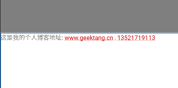
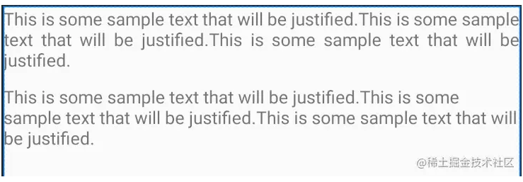

### AutoLink

AutoLink 可以自动检测文本中的模式并将其转换为可点击的链接。例如，如果 TextView 包含电子邮件地址或 URL，则 AutoLink 将识别它并使其可点击。此功能使开发人员无需手动创建文本中的可点击链接。
要在 TextView 上启用 AutoLink，您需要将autoLink属性设置为email，phone，web或all。您还可以使用Linkify类设置自定义链接模式。
以下是一个Android TextView AutoLink代码使用示例：

```
<TextView
    android:id="@+id/tv3"
    android:layout_width="match_parent"
    android:layout_height="wrap_content"
    android:autoLink="web"
    android:textColorLink="@android:color/holo_red_dark"
    android:text="这是我的个人博客地址: www.geektang.cn" />
```

在上面的示例中，我们将 autoLink 属性设置为 web ，这意味着 TextView 将自动检测文本中的 URL 并将其转换为可点击的链接。我们还将 text 属性将文本设置为 这是我的个人博客地址: www.geektang.cn 。当用户单击链接时，它们将被带到 www.geektang.cn 网站。另外，我们也可以通过 `textColorLink` 属性将 Link 颜色为我们喜欢的颜色。
AutoLink是一个非常有用的功能，它可以帮助您更轻松地创建可交互的文本。



### 对齐模式

对齐模式允许您通过在单词之间添加空格将文本对齐到左右边距，这使得文本更易读且视觉上更具吸引力。您可以将对齐模式属性设置为 inter_word 或 inter_character。

要使用对齐模式功能，您需要在 TextView 上设置 justificationMode 属性。但是，此功能仅适用于运行 Android 8.0（API 级别 26）或更高版本的设备。

以下是对齐模式功能的代码示例：

```
<TextView
    android:id="@+id/text_view"
    android:layout_width="match_parent"
    android:layout_height="wrap_content"
    android:text="This is some sample text that will be justified."
    android:justificationMode="inter_word"/>
```

在上面的示例中，我们将 justificationMode 属性设置为 inter_word 。这意味着 TextView 将在单词之间添加空格，以便将文本对齐到左右边距。
以下是对齐模式功能的显示效果示例：



***
https://juejin.cn/post/7217082232937283645
***