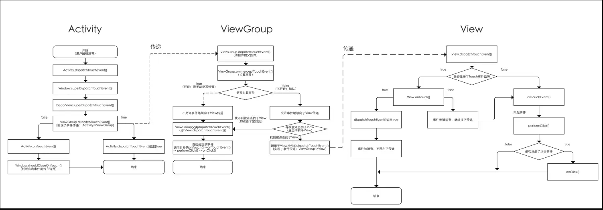

### 事件分发的顺序
即 事件传递的顺序：Activity -> ViewGroup -> View

即：1个点击事件发生后，事件先传到Activity、再传到ViewGroup、最终再传到 View

### 事件分发过程由哪些方法协作完成？
dispatchTouchEvent() 、onInterceptTouchEvent()和onTouchEvent()


### 事件分发机制流程详细分析
主要包括：Activity事件分发机制、ViewGroup事件分发机制、View事件分发机制

####    流程1：Activity的事件分发机制
Android事件分发机制首先会将点击事件传递到Activity中，具体是执行dispatchTouchEvent()进行事件分发。

```
/**
  * 源码分析：Activity.dispatchTouchEvent（）
  */ 
  public boolean dispatchTouchEvent(MotionEvent ev) {

    // 仅贴出核心代码

    // ->>分析1
    if (getWindow().superDispatchTouchEvent(ev)) {

        return true;
        // 若getWindow().superDispatchTouchEvent(ev)的返回true
        // 则Activity.dispatchTouchEvent（）就返回true，则方法结束。即 ：该点击事件停止往下传递 & 事件传递过程结束
        // 否则：继续往下调用Activity.onTouchEvent

    }
    // ->>分析3
    return onTouchEvent(ev);
  }

/**
  * 分析1：getWindow().superDispatchTouchEvent(ev)
  * 说明：
  *     a. getWindow() = 获取Window类的对象
  *     b. Window类是抽象类，其唯一实现类 = PhoneWindow类
  *     c. Window类的superDispatchTouchEvent() = 1个抽象方法，由子类PhoneWindow类实现
  */
  @Override
  public boolean superDispatchTouchEvent(MotionEvent event) {

      return mDecor.superDispatchTouchEvent(event);
      // mDecor = 顶层View（DecorView）的实例对象
      // ->> 分析2
  }

/**
  * 分析2：mDecor.superDispatchTouchEvent(event)
  * 定义：属于顶层View（DecorView）
  * 说明：
  *     a. DecorView类是PhoneWindow类的一个内部类
  *     b. DecorView继承自FrameLayout，是所有界面的父类
  *     c. FrameLayout是ViewGroup的子类，故DecorView的间接父类 = ViewGroup
  */
  public boolean superDispatchTouchEvent(MotionEvent event) {

      return super.dispatchTouchEvent(event);
      // 调用父类的方法 = ViewGroup的dispatchTouchEvent()
      // 即将事件传递到ViewGroup去处理，详细请看后续章节分析的ViewGroup的事件分发机制

  }
  // 回到最初的分析2入口处

/**
  * 分析3：Activity.onTouchEvent()
  * 调用场景：当一个点击事件未被Activity下任何一个View接收/处理时，就会调用该方法
  */
  public boolean onTouchEvent(MotionEvent event) {

        // ->> 分析5
        if (mWindow.shouldCloseOnTouch(this, event)) {
            finish();
            return true;
        }
        
        return false;
        // 即 只有在点击事件在Window边界外才会返回true，一般情况都返回false，分析完毕
    }

/**
  * 分析4：mWindow.shouldCloseOnTouch(this, event)
  * 作用：主要是对于处理边界外点击事件的判断：是否是DOWN事件，event的坐标是否在边界内等
  */
  public boolean shouldCloseOnTouch(Context context, MotionEvent event) {

  if (mCloseOnTouchOutside && event.getAction() == MotionEvent.ACTION_DOWN
          && isOutOfBounds(context, event) && peekDecorView() != null) {

        // 返回true：说明事件在边界外，即 消费事件
        return true;
    }

    // 返回false：在边界内，即未消费（默认）
    return false;
  } 
```

当一个点击事件发生时，从Activity的事件分发开始（Activity.dispatchTouchEvent()），流程总结如下：


核心方法总结：主要包括：dispatchTouchEvent()、onTouchEvent() 总结如下


那么，ViewGroup的dispatchTouchEvent()什么时候返回true / false？请继续往下看ViewGroup事件的分发机制

####    流程2： ViewGroup的事件分发机制
从上面Activity的事件分发机制可知，在Activity.dispatchTouchEvent()实现了将事件从Activity->ViewGroup的传递，ViewGroup的事件分发机制从dispatchTouchEvent()开始。
```
源码分析
/**
  * 源码分析：ViewGroup.dispatchTouchEvent（）
  */ 
  public boolean dispatchTouchEvent(MotionEvent ev) { 

  // 仅贴出关键代码
  ... 

  if (disallowIntercept || !onInterceptTouchEvent(ev)) {  
  // 分析1：ViewGroup每次事件分发时，都需调用onInterceptTouchEvent()询问是否拦截事件
    // 判断值1-disallowIntercept：是否禁用事件拦截的功能(默认是false)，可通过调用requestDisallowInterceptTouchEvent()修改
    // 判断值2-!onInterceptTouchEvent(ev) ：对onInterceptTouchEvent()返回值取反
        // a. 若在onInterceptTouchEvent()中返回false，即不拦截事件，从而进入到条件判断的内部
        // b. 若在onInterceptTouchEvent()中返回true，即拦截事件，从而跳出了该条件判断
        // c. 关于onInterceptTouchEvent() ->>分析1

  // 分析2
    // 1. 通过for循环，遍历当前ViewGroup下的所有子View
    for (int i = count - 1; i >= 0; i--) {  
        final View child = children[i];  
        if ((child.mViewFlags & VISIBILITY_MASK) == VISIBLE  
                || child.getAnimation() != null) {  
            child.getHitRect(frame);  

            // 2. 判断当前遍历的View是不是正在点击的View，从而找到当前被点击的View
            if (frame.contains(scrolledXInt, scrolledYInt)) {  
                final float xc = scrolledXFloat - child.mLeft;  
                final float yc = scrolledYFloat - child.mTop;  
                ev.setLocation(xc, yc);  
                child.mPrivateFlags &= ~CANCEL_NEXT_UP_EVENT;  

                // 3. 条件判断的内部调用了该View的dispatchTouchEvent()
                // 即 实现了点击事件从ViewGroup到子View的传递（具体请看下面章节介绍的View事件分发机制）
                if (child.dispatchTouchEvent(ev))  { 

                // 调用子View的dispatchTouchEvent后是有返回值的
                // 若该控件可点击，那么点击时dispatchTouchEvent的返回值必定是true，因此会导致条件判断成立
                // 于是给ViewGroup的dispatchTouchEvent()直接返回了true，即直接跳出
                // 即该子View把ViewGroup的点击事件消费掉了

                mMotionTarget = child;  
                return true; 
                      }  
                  }  
              }  
          }  
      }  
    }  

  ...

  return super.dispatchTouchEvent(ev);
  // 若无任何View接收事件(如点击空白处)/ViewGroup本身拦截了事件(复写了onInterceptTouchEvent()返回true)
  // 会调用ViewGroup父类的dispatchTouchEvent()，即View.dispatchTouchEvent()
  // 因此会执行ViewGroup的onTouch() -> onTouchEvent() -> performClick（） -> onClick()，即自己处理该事件，事件不会往下传递
  // 具体请参考View事件分发机制中的View.dispatchTouchEvent()

  ... 

}

/**
  * 分析1：ViewGroup.onInterceptTouchEvent()
  * 作用：是否拦截事件
  * 说明：
  *     a. 返回false：不拦截（默认）
  *     b. 返回true：拦截，即事件停止往下传递（需手动复写onInterceptTouchEvent()其返回true）
  */
  public boolean onInterceptTouchEvent(MotionEvent ev) {  
    
    // 默认不拦截
    return false;

  } 
  // 回到调用原处
```

Android事件分发传递到Acitivity后，总是先传递到ViewGroup、再传递到View。流程总结如下：(假设已经经过了Acitivity事件分发传递并传递到ViewGroup)


核心方法总结：dispatchTouchEvent()、onTouchEvent() 、onInterceptTouchEvent()总结如下


####    流程3：View的事件分发机制
从上面ViewGroup事件分发机制知道，View事件分发机制从dispatchTouchEvent()开始
```
/**
  * 源码分析：View.dispatchTouchEvent（）
  */
  public boolean dispatchTouchEvent(MotionEvent event) {  

       
        if ( (mViewFlags & ENABLED_MASK) == ENABLED && 
              mOnTouchListener != null &&  
              mOnTouchListener.onTouch(this, event)) {  
            return true;  
        } 

        return onTouchEvent(event);  
  }
  // 说明：只有以下3个条件都为真，dispatchTouchEvent()才返回true；否则执行onTouchEvent()
  //   1. (mViewFlags & ENABLED_MASK) == ENABLED
  //   2. mOnTouchListener != null
  //   3. mOnTouchListener.onTouch(this, event)
  // 下面对这3个条件逐个分析

/**
  * 条件1：(mViewFlags & ENABLED_MASK) == ENABLED
  * 说明：
  *    1. 该条件是判断当前点击的控件是否enable
  *    2. 由于很多View默认enable，故该条件恒定为true（除非手动设置为false）
  */

/**
  * 条件2：mOnTouchListener != null
  * 说明：
  *   1. mOnTouchListener变量在View.setOnTouchListener()里赋值
  *   2. 即只要给控件注册了Touch事件，mOnTouchListener就一定被赋值（即不为空）
  */
  public void setOnTouchListener(OnTouchListener l) { 

    mOnTouchListener = l;  

} 

/**
  * 条件3：mOnTouchListener.onTouch(this, event)
  * 说明：
  *   1. 即回调控件注册Touch事件时的onTouch()；
  *   2. 需手动复写设置，具体如下（以按钮Button为例）
  */
  button.setOnTouchListener(new OnTouchListener() {  
      @Override  
      public boolean onTouch(View v, MotionEvent event) {  
   
        return false;  
        // 若在onTouch()返回true，就会让上述三个条件全部成立，从而使得View.dispatchTouchEvent（）直接返回true，事件分发结束
        // 若在onTouch()返回false，就会使得上述三个条件不全部成立，从而使得View.dispatchTouchEvent（）中跳出If，执行onTouchEvent(event)
        // onTouchEvent()源码分析 -> 分析1
      }  
  });

/**
  * 分析1：onTouchEvent()
  */
  public boolean onTouchEvent(MotionEvent event) {  

    ... // 仅展示关键代码

    // 若该控件可点击，则进入switch判断中
    if (((viewFlags & CLICKABLE) == CLICKABLE || (viewFlags & LONG_CLICKABLE) == LONG_CLICKABLE)) {  

        // 根据当前事件类型进行判断处理
        switch (event.getAction()) { 

            // a. 事件类型=抬起View（主要分析）
            case MotionEvent.ACTION_UP:  
                    performClick(); 
                    // ->>分析2
                    break;  

            // b. 事件类型=按下View
            case MotionEvent.ACTION_DOWN:  
                postDelayed(mPendingCheckForTap, ViewConfiguration.getTapTimeout());  
                break;  

            // c. 事件类型=结束事件
            case MotionEvent.ACTION_CANCEL:  
                refreshDrawableState();  
                removeTapCallback();  
                break;

            // d. 事件类型=滑动View
            case MotionEvent.ACTION_MOVE:  
                final int x = (int) event.getX();  
                final int y = (int) event.getY();  

                int slop = mTouchSlop;  
                if ((x < 0 - slop) || (x >= getWidth() + slop) ||  
                        (y < 0 - slop) || (y >= getHeight() + slop)) {  
                    removeTapCallback();  
                    if ((mPrivateFlags & PRESSED) != 0) {  
                        removeLongPressCallback();  
                        mPrivateFlags &= ~PRESSED;  
                        refreshDrawableState();  
                    }  
                }  
                break;  
        }  

        // 若该控件可点击，就一定返回true
        return true;  
    }  
  // 若该控件不可点击，就一定返回false
  return false;  
}

/**
  * 分析2：performClick（）
  */  
  public boolean performClick() {  

      if (mOnClickListener != null) {
          // 只要通过setOnClickListener()为控件View注册1个点击事件
          // 那么就会给mOnClickListener变量赋值（即不为空）
          // 则会往下回调onClick() & performClick()返回true
          playSoundEffect(SoundEffectConstants.CLICK);  
          mOnClickListener.onClick(this);  
          return true;  
      }  
      return false;  
  }  
```


这里需要特别注意的是，onTouch（）的执行 先于 onClick（）

核心方法总结：dispatchTouchEvent()、onTouchEvent()


### 总结
在本章节中，将采用大量的图表从各个角度对Android事件分发机制进行总结。主要包括：

*   工作流程总结
*   业务流程总结
*   以分发对象为核心的总结
*   以方法为核心的总结
####    工作流程-总结
Android事件分发流程 = Activity -> ViewGroup -> View，即：1个点击事件发生后，事件先传到Activity、再传到ViewGroup、最终再传到View。


####    以分发对象为核心-总结
分发对象主要包括：Activity、ViewGroup、View。


####    以方法为核心-总结
事件分发的方法主要包括：dispatchTouchEvent()、onInterceptTouchEvent()和onTouchEvent()。


这里需要特别注意的是：

*   注意点1：左侧虚线代表具备相关性及逐层返回；

*   注意点2：各层dispatchTouchEvent() 返回true的情况保持一致（图中虚线）
原因是：上层dispatchTouchEvent() 的返回true情况 取决于 下层dispatchTouchEvent() 是否返回ture，如Activity.dispatchTouchEvent() 返回true的情况 = ViewGroup.dispatchTouchEvent() 返回true

*   注意点3：各层dispatchTouchEvent() 与 onTouchEvent()的返回情况保持一致
原因：最下层View的dispatchTouchEvent()的返回值 取决于 View.onTouchEvent()的返回值；结合注意点1，逐层往上返回，从而保持一致。
下面，将针对该3个方法，分别针对默认执行逻辑、返回true、返回false的三种情况进行流程图示意。

####    三者关系
下面，我用一段伪代码来阐述上述3个方法的关系 & 事件传递规则
```
// 点击事件产生后
// 步骤1：调用dispatchTouchEvent()
public boolean dispatchTouchEvent(MotionEvent ev) {

    boolean consume = false; //代表 是否会消费事件

    // 步骤2：判断是否拦截事件
    if (onInterceptTouchEvent(ev)) {
      // a. 若拦截，则将该事件交给当前View进行处理
      // 即调用onTouchEvent()去处理点击事件
      consume = onTouchEvent (ev) ;

    } else {

      // b. 若不拦截，则将该事件传递到下层
      // 即 下层元素的dispatchTouchEvent()就会被调用，重复上述过程
      // 直到点击事件被最终处理为止
      consume = child.dispatchTouchEvent (ev) ;
    }

    // 步骤3：最终返回通知 该事件是否被消费（接收 & 处理）
    return consume;

}
```

### 特殊说明
####     Touch事件的后续事件（MOVE、UP）层级传递
*   若给控件注册了Touch事件，每次点击都会触发一系列action事件（ACTION_DOWN，ACTION_MOVE，ACTION_UP等）

*   当dispatchTouchEvent（）事件分发时，只有前一个事件（如ACTION_DOWN）返回true，才会收到后一个事件（ACTION_MOVE和ACTION_UP）

!>  即如果在执行ACTION_DOWN时返回false，后面一系列的ACTION_MOVE、ACTION_UP事件都不会执行

从上面对事件分发机制分析知：

*   dispatchTouchEvent()、 onTouchEvent() 消费事件、终结事件传递（返回true）

*   而onInterceptTouchEvent 并不能消费事件，它相当于是一个分叉口起到分流导流的作用，对后续的ACTION_MOVE和ACTION_UP事件接收起到非常大的作用

!>  请记住：接收了ACTION_DOWN事件的函数不一定能收到后续事件（ACTION_MOVE、ACTION_UP）

这里给出ACTION_MOVE和ACTION_UP事件的传递结论：

*   **结论1**
若对象（Activity、ViewGroup、View）的dispatchTouchEvent()分发事件后消费了事件（返回true），那么收到ACTION_DOWN的函数也能收到ACTION_MOVE和ACTION_UP


流程讲解
*   **结论2**

若对象（Activity、ViewGroup、View）的onTouchEvent()处理了事件（返回true），那么ACTION_MOVE、ACTION_UP的事件从上往下传到该View后就不再往下传递，而是直接传给自己的onTouchEvent()& 结束本次事件传递过程。

####    onTouch()和onTouchEvent()的区别
*   该2个方法都是在View.dispatchTouchEvent（）中调用

*   但onTouch（）优先于onTouchEvent执行；若手动复写在onTouch（）中返回true（即 将事件消费掉），将不会再执行onTouchEvent（）

!>  注：若1个控件不可点击（即非enable），那么给它注册onTouch事件将永远得不到执行，具体原因看如下代码
```
// &&为短路与，即如果前面条件为false，将不再往下执行
//  故：onTouch（）能够得到执行需2个前提条件：
     // 1. mOnTouchListener的值不能为空
     // 2. 当前点击的控件必须是enable的
mOnTouchListener != null && (mViewFlags & ENABLED_MASK) == ENABLED &&  
            mOnTouchListener.onTouch(this, event)

// 对于该类控件，若需监听它的touch事件，就必须通过在该控件中重写onTouchEvent（）来实现
```

***
https://www.jianshu.com/p/38015afcdb58
***