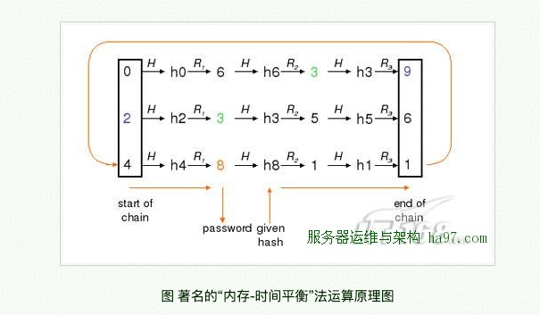

### 前言

利用 Android Keystore 系统，您可以在容器中存储加密密钥，从而提高从设备中提取密钥的难度。在密钥进入 Keystore 后，可以将它们用于加密操作，而密钥材料仍不可导出。此外，它提供了密钥使用的时间和方式限制措施，例如要求进行用户身份验证才能使用密钥，或者限制为只能在某些加密模式中使用。Keystore 系统由 KeyChain API 以及在 Android 4.3（API 级别 18）中引入的 Android Keystore 提供程序功能使用。

以上便是Google官方对于Android Keystore系统 的一些简单的介绍，简单的说Keystore 系统就是可以帮助我们完成一些我们应用中的一些比较私密敏感的信息的加密存储，以及解密，防止APP的一些关键信息泄露。我们在实际开发中应该如何使用呢？这里我简单做个介绍，主要分为三步：第一步，密钥的创建。第二步，对我们的数据进行加密，然后最后当然就是我们要使用到数据的时候再对加密后的数据进行解密了。

### 密钥的创建

在密钥的创建之前我们先确定我们这里要使用到的加密算法，关于加密算法这一块有兴趣的同学可以自行Google，这里的例子使用到的加密算法为“AES / GCM / NoPadding”。此外我们还需要确定一个别名，这个别名是密钥在加解密过程中的一个识别连接，相当于我们在传递数据中的键值对中的键这样的一个作用。密钥获取的代码也不复杂，具体如下：
```
@NonNull
    private SecretKey getSecretKey(final String alias) throws NoSuchAlgorithmException,
            NoSuchProviderException, InvalidAlgorithmParameterException {

        final KeyGenerator keyGenerator = KeyGenerator
                .getInstance(KeyProperties.KEY_ALGORITHM_AES, "AndroidKeyStore");

        keyGenerator.init(new KeyGenParameterSpec.Builder(alias,
                KeyProperties.PURPOSE_ENCRYPT | KeyProperties.PURPOSE_DECRYPT)
                .setBlockModes(KeyProperties.BLOCK_MODE_GCM)
                .setEncryptionPaddings(KeyProperties.ENCRYPTION_PADDING_NONE)
                .build());

        return keyGenerator.generateKey();
    }
```
可以看到，我们首先创建得到一个密钥生成器 KeyGenerator 的实例，其中两个参数的相关说明参看下图：



然后使用 KeyGenerator 的实例初始化一些相关的配置，如上我们配置了密钥的别名，以及使用到的相关属性加密解密，setBlockModes 使我们确信仅指定可用于加密和解密的数据块模式中，如果使用的任何其他类型的块模式，它将被拒绝。由于我们使用 “AES / GCM / NoPadding” 转换算法，我们还告诉KeyGenParameterSpec应该使用的填充类型为NoPadding。至此，我们便完成了通过密钥生成器生成密钥的全部过程了。

### 数据加密

我们加密的实际过程是通过 Cipher 类来完成的，还是先看代码：

```
byte[] encryptText(final String alias, final String textToEncrypt)
            throws NoSuchAlgorithmException,
            NoSuchProviderException, NoSuchPaddingException, InvalidKeyException, IOException,
            InvalidAlgorithmParameterException, BadPaddingException, IllegalBlockSizeException {

        final Cipher cipher = Cipher.getInstance("AES/GCM/NoPadding");
        cipher.init(Cipher.ENCRYPT_MODE, getSecretKey(alias));

        iv = cipher.getIV();

        return (encryption = cipher.doFinal(textToEncrypt.getBytes("UTF-8")));
    }
```

可以看到我们首先得到了 Cipher 的实例，并指定了加密的算法为 "AES/GCM/NoPadding" ,然后直接初始化 Cipher 的实例指定为加密模式，并传入我们的第一步创建的密钥，这里我们存储 Cipher 初始化向量（IV），因为我们在解密的时候会用到。最后一步我们便直接调用 Cipher 的
doFinal 完成对数据的加密，doFinal方法返回一个字节数组，它是实际的加密文本，我们直接 Base64 编码一次就好：
```
Base64.encodeToString(encryptedText, Base64.DEFAULT)
```

### 数据解密

还是老规矩，先上代码：
```
String decryptData(final String alias, final byte[] encryptedData, final byte[] encryptionIv)
            throws UnrecoverableEntryException, NoSuchAlgorithmException, KeyStoreException,
            NoSuchPaddingException, InvalidKeyException, IOException,
            BadPaddingException, IllegalBlockSizeException, InvalidAlgorithmParameterException {

        final Cipher cipher = Cipher.getInstance("AES/GCM/NoPadding");
        final GCMParameterSpec spec = new GCMParameterSpec(128, encryptionIv);
        cipher.init(Cipher.DECRYPT_MODE, getSecretKey(alias), spec);

        return new String(cipher.doFinal(encryptedData), "UTF-8");
    }
```

其实加密与解密是一组对称的操作，解密其实就是加密的一个反向操作。同样的我们还是需要先获得 Cipher 的实例，然后我们通过 GCMParameterSpec 类来赋予 Cipher 初始化向量的参数，这里简单的对 GCMParameterSpec 的两个参数进行说明，简单的块密码模式（例如CBC）通常只需要初始化向量（例如IvParameterSpec），但GCM需要以下参数：

*   IV：初始化向量（IV）
*   tLen：认证标签T的长度（以位为单位）

关于 GCMParameterSpec 的更多的信息可以自行查看文档，这里就不展开讨论了。

接下来跟加密一样的步骤，初始化 Cipher ，这里需要注意的一点便是我们密钥的获取：

```
private SecretKey getSecretKey(final String alias) throws NoSuchAlgorithmException,
            UnrecoverableEntryException, KeyStoreException {
        return ((KeyStore.SecretKeyEntry) keyStore.getEntry(alias, null)).getSecretKey();
    }
```

我们通过我们最初设定的别名识别对应的密钥，从而通过 keyStore.getEntry(alias, null)).getSecretKey()；方法进行获取得到。
至此我们便完成了通过Android Keystore 系统对APP中的关键信息进行加密以及解密的所有过程。
本文例子[GitHub地址](https://github.com/love-311/KeyStoreTest)

***
https://juejin.cn/post/6844903886080180231
***