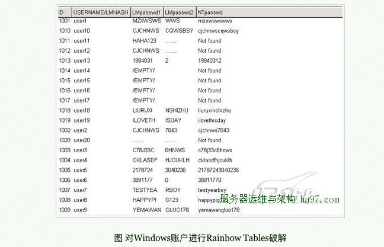

彩虹表（Rainbow Table）是一种破解哈希算法的技术，是一款跨平台密码破解器，主要可以破解MD5、HASH等多种密码。它的性能非常让人震惊，在一台普通PC上辅以NVidia CUDA技术，对于NTLM算法可以达到最高每秒103,820,000,000次明文尝试（超过一千亿次），对于广泛使用的MD5也接近一千亿次。更神奇的是，彩虹表技术并非针对某种哈希算法的漏洞进行攻击，而是类似暴力破解，对于任何哈希算法都有效。

### 一、彩虹表原理

先讲述一些基本概念：

####    Tables

可以说长期进行密码学研究的人很少有不知道这个的。在很多年前，国外的黑客们就发现单纯地通过导入字典，采用和目标同等算法破解，其速度其实是非常缓慢的，就效率而言根本不能满足实战需要。之后通过大量的尝试和总结，黑客们发现如果能够实现直接建立出一个数据文件，里面事先记录了采用和目标采用同样算法计算后生成的Hash散列数值，在需要破解的时候直接调用这样的文件进行比对，破解效率就可以大幅度地，甚至成百近千近万倍地提高，这样事先构造的Hash散列数据文件在安全界被称之为Table表(文件)。

####    Rainbow Tables

最出名的Tables是Rainbow Tables，即安全界中常提及的彩虹表，它是以Windows的用户帐户LM/NTLM散列为破解对象的。简单说明一下，在 Windows2000/XP/2003系统下，账户密码并不是明文保存的，而是通过微软所定义的算法，保存为一种无法直接识别的文件，即通常所说的SAM文件，这个文件在系统工作时因为被调用所以不能够被直接破解。但我们可以将其以Hash即散列的方式提取，以方便导入到专业工具破解，提取出来的密码散列类似于下面：

```
Administrator:500:96e95ed6bad37454aad3b435b51404ee:64e2d1e9b06cb8c8b05e42f0e6605c74:::
Guest:501:aad3b435b51404eeaad3b435b51404ee:31d6cfe0d16ae931b73c59d7e0c089c0:::
user1:1001:732b2c9a2934e481cd0a8808b19097ef:778620d5d5de064154e689fa4790129f:::
user2:1002:a042f67a99758fd727b99b2375d829f9:6127ee12a83da34fc19953e538e4d580:::
```


若是以传统破解方式而言，无论是本地，还是内网在线破解，效率都不是很高。据实际测试，单机环境下，破解一个14位长包含大小写字母以及数字的无规律密码，一般是需要3~~9小时的，这个时间值会随着密码的复杂度及计算机性能差异提升到几天甚至数月不等。虽然说大部分人都不会使用这样复杂的密码，但对于目前很多密码足够复杂并且长度超过10位的密码比如“Y1a9n7g9z0h7e”，还是会令黑客们头痛不已。

2003年7月瑞士洛桑联邦技术学院Philippe Oechslin公布了一些实验结果，他及其所属的安全及密码学实验室(LASEC)采用了时间内存替换的方法，使得密码破解的效率大大提高。作为一个例子，他们将一个常用操作系统的密码破解速度由1分41秒，提升到13.6秒。这一方法使用了大型查找表对加密的密码和由人输入的文本进行匹配，从而加速了解密所需要的计算。这种被称作“内存-时间平衡”的方法意味着使用大量内存的黑客能够减少破解密码所需要的时间。

于是，一些受到启发的黑客们事先制作出包含几乎所有可能密码的字典，然后再将其全部转换成NTLM Hash文件，这样，在实际破解的时候，就不需要再进行密码与Hash之间的转换，直接就可以通过文件中的Hash散列比对来破解Windows帐户密码，节省了大量的系统资源，使得效率能够大幅度提升。当然，这只是简单的表述，采用的这个方法在国际上就被称为Time-Memory Trade-Off ，即刚才所说的“内存-时间平衡”法，有的地方也会翻译成“时间—内存交替运算法”。其原理可以理解为以内存换取时间，可由下图3表示：


图 著名的“内存-时间平衡”法运算原理图



　　具体算法方面的内容本文就不再涉及，对于想进行更高深层次探究的读者，可以仔细参考2003年的这篇详细文档《Making a Faster Crytanalytical Time-Memory Trade-Off》以及2005年的文档《Time-Memory Trade-Offs: False Alarm Detection Using Checkpoints》。

正是由于Rainbow Tables的存在，使得普通电脑在5分钟内破解14位长足够复杂的Windows帐户密码成为可能。


图 对Windows账户进行Rainbow Tables破解

　　如上图4可以看到，类似于c78j33c6hnws、yemawangluo178、38911770这样的Windows帐户密码几乎全部在180秒即3分钟内破出，最短只用了5秒，个别稍长的密码破解开也没有超过3分钟。

这几乎是令人难以置信的，Roger迫不及待的去看了 http://www.project-rainbowcrack.com 所介绍的原理。这其实已经不是新的技术了，但是很遗憾的是，搜索“彩虹表原理”出来的文章对彩虹表原理的介绍都有不太正确，Roger就在这里简单的介绍一下，主要参考的是Wiki上的这篇 http://en.wikipedia.org/wiki/Rainbow_tables，英文好的可以去看这篇论文 http://lasecwww.epfl.ch/pub/lasec/doc/Oech03.pdf。

我们先来做点科普，哈希（Hash）算法就是单向散列算法，它把某个较大的集合P映射到另一个较小的集合Q中，假如这个算法叫H，那么就有Q = H（P）。对于P中任何一个值p都有唯一确定的q与之对应，但是一个q可以对应多个p。作为一个有用的Hash算法，H还应该满足：H(p)速度比较快； 给出一个q，很难算出一个p满足q = H(p)；给出一个p1，很难算出一个不等于p1的p2使得 H(p1)=H(p2)。正因为有这样的特性，Hash算法经常被用来保存密码————这样不会泄露密码明文，又可以校验输入的密码是否正确。常用的 Hash算法有MD5、SHA1等。

破解Hash的任务就是，对于给出的一个q，反算出一个p来满足q = H(p)。通常我们能想到的两种办法，一种就是暴力破解法，把P中的每一个p都算一下H(p)，直到结果等于q；另一种办法是查表法，搞一个很大的数据 库，把每个p和对应的q都记录下来，按q做一下索引，到时候查一下就知道了。这两种办法理论上都是可以的，但是前一种可能需要海量的时间，后一种需要海量 的存储空间，以至于以目前的人类资源无法实现。

我们可以简单的算一下，对于14位的大小写加数字（先不算特殊字符了）组成的密码的集合有多大？自然就是（26*2+10）^14 = 62^14 = 1.24 * 10^25，这个就约等于12亿亿亿，即使我们每纳秒可以校验一个p(一秒钟10亿次，目前PC做不到)，暴力破解法也大概需要4亿年；如果我们采用查表 法，假定Hash的结果是128Bit即16字节的，光存放Hash（不存放明文P）就需要10^26字节的存储空间。什么？现在硬盘很便宜？没错现在 1GB硬盘大概是五毛钱，那么按这个来算光存储这个Hash大概需要5亿亿人民币来买硬盘。所以有些文章说彩虹表就是依赖查一个巨大的表来破解Hash， 简直是个无知的玩笑。

也正因为如此，我们一直都认为Hash是足够安全的，十几位的密码也是强度足够的，直到彩虹表的出现。现在我们来看看彩虹表是怎么干的。

彩虹表的根本原理就是组合了暴力法和查表法，并在这两者之中取得一个折中，用我们可以承受的时间和存储空间进行破解。它的做法是，对于一个Q = H（P），建立另一个算法R使得 P = R(Q)，然后对于一个p，这样进行计算：

p0 -H-> q1 -R->p1 -H-> q2 -R->p2 -H-> q3 -R->p3  … -H-> q(n-1) -R->p(n-1) -H-> qn -R->pn

简单的说，就是把q用H、R依次迭代运算，最后得到pn，n可能比较大。最后我们把p0和pn都存储下来，把其他的结果都丢弃。然后用不同的p0代入计算，得到多个这样的p的对子。

我们在做破解的时候，给出了一个q，我们来寻找p。我们先把q做一次R运算得到一个值例如叫c1，然后把c1和每一个p对的最后一个做比较，假如和某一个 pn相等，那么有可能这个pn所对应的p(n-1)就是我们在追寻的q，为了验证我们把pn对应的p0再做一次链式计算，比对qn是否就是给出的q，如果 是，很明显p(n-1)就是我们在追寻的p，因为 p(n-1) -H-> qn。如果不是就继续寻找直到遍历所有的q0qn对。

事情还刚刚开始，我们再算q -R-> c1 -H-> -R-> c2，再比对c2是否是qn，如果是，那么p(n-2)就可能是p；再算c3、c4直到c（n-1），不知道这样说你明白了吗？

总的来说，就是用一个p0pn对来存储了一个链子的数据，如果n很大，就可以大大减小了存储的空间。这样带来的问题是必须做n次比对，时间更长，但是我们不需要瞬间破解，等待几秒乃至几天破解一个密码都是可以接受的。

当然这里只是讲述了最粗浅的原理，仔细想一下还有很多的问题，例如R的选择，Hash冲突的处理，如何选择p0来实现足够的覆盖，如何在有限资源下生成彩虹表等等。对这些感兴趣的可以去看看RainbowCrack的源码 http://www.project-rainbowcrack.com

### 二、获得彩虹表

彩虹表可以使用RainbowCrack或Cain来生成。表分割得越细，成功率就越高，生成的表体积也越大，所需时间也越长。但下载比生成快得多，有人做过测试，4核4GB内存的机器，生成2GB彩虹表，需要花费7天时间，而7天按2MB的带宽（256K/S左右）几乎可以下载48GB左右，效率明显要超过生成。当然，你要是有超级计算机群生成的话，也不妨自己生成。对于广大网络安全爱好者来说，还是直接下载来得靠谱！

Ophcrack彩虹表 官方下载地址：
http://ophcrack.sourceforge.net/

**120G彩虹表BT下载**（这是种子文件，迅雷上有资源，如果是会员使用迅雷下载还是很快的，我8M带宽，下了3天左右下完了。）：
http://www.ha97.com/code/tables.rar

### 三、彩虹表的使用

彩虹表工具很多，常用到的彩虹表工具有Ophcrack、rcracki_mt、Cain等，主流的彩虹表有以下三种。

Cain: http://www.onlinedown.net/soft/53494.htm

####    Free Rainbow Tables

官方网址：http://www.freerainbowtables.com/en/tables/
镜像下载：http://tbhost.eu/rt.php
提供了多种类型的彩虹表下载，LM、NTLM、MD5、SHA1等。千万别把人家法语字符的表也下了，对国人来说，几乎没什么用，不过如果你有特殊需要，那就下吧……这里提供的都是.rti格式的，有别于传统的.ri格式，.rti比.rt的多了一个目录.index文件，据说遍列速度比.rt的更快（未曾对比过，无法确定是否属实）。
比较新的，用的索引和压缩，所以速度更快，体积更小，而且支持分布式破解。
支持HASH类型：LM，MD5，NTLM，SHA1，HALFLMCHALL
网上有已经生成好的表可供下载，真是造福于民。
扩展名：rti

####    Ophcrack

官网网址：http://ophcrack.sourceforge.net/tables.php
最常用的，界面友好，与众不同，压缩储存，有自己独特的彩虹表结构，还有Live CD。
支持的HASH类型：LM，NTLM
扩展名：乱七八糟的。

高级的表要花钱买，免费的表有（推荐只下2和5，要求高的可以下载3和5）：
1.XP free（LM表：包含大小写+数字）380MB（官网免费下载）
2.XP free fast（和前一个一样，但是速度更快）703MB（官网免费下载）
3.XP special（LM表：大小写+数字+所有符号包括空格）7.5G
4.Vista free （NTLM表：包含常用密码）461MB（官网免费下载）
5.Vista special（NTLM表：包含6位的全部可打印字符，7位的大小写字母数字，8位的小写和数字）8G

####    RainbowCrack

官网网址：http://project-rainbowcrack.com/table.htm
通用的，一般的破解软件如saminside都支持，命令行界面，黑客的最爱，支持CUDA。
可以自己生成表，不要钱，传说中的120G就来自于此。
支持HASH类型：LM, NTLM, MD5, SHA1, MYSQLSHA1, HALFLMCHALL, NTLMCHALL.
扩展名：rt

最小彩虹表是最基本的字母数字表，就这样它的大小就有388MB，这是Ophcrack启动盘默认的表，该表可以在11分钟内破解所有可能14位数字字母密码组合中的99.9%。国内有比较流行的传说中的120G的彩虹表，国外还有几T的海量彩虹表。win2003及以前的windows操作系统的密码采用的LM算法加密，而Vista、Win7、Win2008/R2采用的是NTLM，NTLM比LM安全得多。

####    LM和NTLM详解：

1.  话说在远古时期，DES当道。微软在考虑9X系统口令加密的时候就自然地采用了国家标准DES一次加密8字节，留一位校检，还剩7字节（下文有解释）， 也就是LM（Lan Manage）的核心。

2.  那有人要问了，万一我的口令是8位怎么办呢？不用怕，微软的程序员很“聪明”：先把前7位加密，后一位补6个0，再当7位一起加密不就可以了吗，结果就真的这么做了。

3.  这就导致破解LM密码只需7位一分割，然后再逐块破解，这大大减低了破解的难度。因为最后一块往往不够7位，一般瞬间即可得出结果。也就是7位和13位的密码，在破解者眼里几乎是一样的，因为13位的后6位很快就能破解出来，而且可以根据后6位猜测出前7位的密码，这就是为什么我们破解XP和2003密码很快的原因，因为他们都使用了LM加密方式。

4.  由于LM的种种不安全性，微软在设计NT系列操作系统时采用了新的口令存储手段，即NTLM技术（New Technology Lan Manage），采用MD4+RSA存储，立马安全性要高很多。但是为了保证兼容性，直到2003微软仍然保持着LM的加密方式，也就是在2000、2003和XP中，我们的口令同时保存了两份，一份LM一份NTLM，我们仍然可以通过LM破解2003的口令。

5.  在Vista和2008、Win7中，微软终于下定决心对LM斩草除根，只留下NTLM，破解难度增大。

6.  回到彩虹表，由于LM最多只有7位，所以它的彩虹表很小。而NTLM用了散列函数，所以理论上口令是可以无限长的，所以NTLM的彩虹表往往很大，120G肯定是不够完成所有可打印字符的，最大的彩虹表已经是T量级了。

LM和NTLM验证机制：http://www.nsfocus.net/index.php?act=magazine&do=view&mid=1665

####    某人用彩虹表测试破解MD5的小结：

ophcrack的表不支持破解md5，具体讲.rt .rtc .rti格式的，只需对比一组数据就可以。同样是破解12位的纯数字密码：

.rt的需要20GB .rtc的需要8.75GB .rti的需要1.67+1.67+1.68+1.71=6.72GB

明显是.rti的小，但是我试过，我下了上面.rti格式破解12位的6.72GB的表中的1.67GB，其破解效果很让我惊讶，我本以为纯数字的破解出来的可能性是四分之一，因为我只下了4个表中的一个，我只下了那1.67GB，但我试着破解了几个12位数字加密的32位md5，结果大多数都能跑出来，很少有跑不出的，汗。但当我惊喜时发现他并不支持破解16位的md5，然后去那国外的官方论坛去逛了逛，才发现这并不支持破解16位的md5。原来老外不来16位这一套，但我们国内的网站用16位的md5占绝大多数，所以入侵时大部分得到的是16位的MD5密码，而老外的就不来16位的，郁闷。

####    Ophcrack文档描述了它所能使用的彩虹表之间的差异：

字母数字表 10k 388MB 包含所有字母数字混合密码中99.9%的LanManager表。这些都是用大小写字母和数字组成的密码（大约800亿组合）。
由于LanManager哈希表将密码截成每份7个字符的两份，我们就可以用该表破解长度在1到14之间的密码。由于LanManager哈希表也是不区分大小写的，该表中的800亿的组合就相当于12*10的11次方（或者2的83次方）个密码。

字母数字表 5k 720MB 包含所有字母数字组合的密码中99.9%的LanManager表。但是，由于表变成2倍大，如果你的计算机有1GB以上的RAM空间的话，它的破解速度是前一个的4倍。

扩展表 7.5GB 包含最长14个大小写字母、数字以及下列33个特殊字符（!”#$%&'()*+,-./:;?@[\]^_`{|} ~）组成的密码中96%的LanManager表。该表中大约有7兆的组合，5*10的12次方（或者2的92次方）密码。

NT 8.5 GB 我们可以使用该表来破解计算机上的NT哈希表，这是LanManager 哈希表所做不到的。该表包含了用如下字符组成的可能密码组合的90%：
·最高6位字符由大小写字母、数字以及33个特殊字符（同上面列举的一样）
·7 大小写字母及数字
·8 小写字母及数字
该表包含7兆种组合，对应7兆的密码（NT哈希表不存在LanManager哈希表的弱点）。

注意：所有这些彩虹表都有其特定适用的密码长度和字母组合。太长的密码（如数十位），或者包含表中没有的字符，那么用彩虹表就无法破解。

***
http://www.ha97.com/4009.html
***