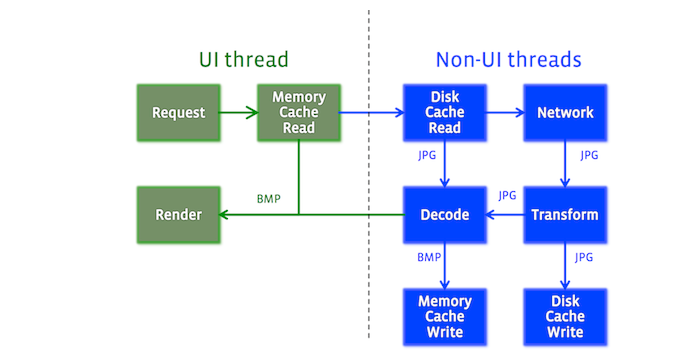

***
implementation 'com.facebook.fresco:fresco:2.3.0'

github项目地址：​https://github.com/facebook/fresco
***

fresco应该是android端最受欢迎的图片加载框架，图片格式支持png、jpg、webp、gif等；加载效果支持各种动画；支持进度回调；支持各种图层；支持渐进式加载等。fresco是一个经典的mvc模型，通过draweehoder绑定draweecontroller，draweecontroller再调用image pipleline请求图片，pipleline通过事件订阅机制由memory、net、disk等producter生产图片，完成整套加载流程。

图片加载由Image Pipeline完成，大致流程如下:

1.  检查内存缓存，如有，返回
2.  后台线程开始后续工作
3.  检查是否在未解码内存缓存中。如有，解码，变换，返回，然后缓存到内存缓存中。
4.  检查是否在磁盘缓存中，如果有，变换，返回。缓存到未解码缓存和内存缓存中。
5.  从网络或者本地加载。加载完成后，解码，变换，返回。存到各个缓存中。

既然本身就是一个图片加载组件，那么一图胜千言。



更详细的功能支持以及使用场景可以参考官方文档：​

一般直接通过使用SimpleDraweeView.setImageURI就可以实现加载图片，包括本地图片
```
simpleDraweeView.setImageURI("https://upload.wikimedia.org/wikipedia/commons/thumb/f/f9/Tracy_McGrady_1.jpg/1280px-Tracy_McGrady_1.jpg")
```
setImageURI中通过ControllerBuilder创建了DraweeController，并在基类DraweeView中将DraweeController绑定到DraweeHolder中

```
#SimpleDraweeView.java
public void setImageURI(Uri uri, @Nullable Object callerContext) {
    //创建controller
  DraweeController controller =
      mControllerBuilder
          .setCallerContext(callerContext)
          .setUri(uri)
          .setOldController(getController())
          .build();
  setController(controller);
}
​
#DraweeView.java
public void setController(@Nullable DraweeController draweeController) {
//绑定controller
    mDraweeHolder.setController(draweeController);
    super.setImageDrawable(mDraweeHolder.getTopLevelDrawable());
 }
 ```
DraweeHolder中的setController调用内部方法attatchController进行attach操作，最终走到AbstractDraweeController的onAttach
```
#DraweeHolder
public void setController(@Nullable DraweeController draweeController) {
  ...
  if (wasAttached) {
    attachController();
  }
}
​
private void attachController() {
   ...
    if (mController != null && mController.getHierarchy() != null) {
      //跳转AbstractDraweeController
      mController.onAttach();
    }
  }
```
AbstractDraweeController中onAttach方法通过submitRequest提交了一个request获取缓存，缓存是否获取成功是由mCacheKey和mIsOfFullQuality共同决定的，如果没有获取到缓存那么会去获取数据源由其生产图片数据并回调通知
```
#AbstractDraweeController.java
public void onAttach() {
  ...
  if (!mIsRequestSubmitted) {
    submitRequest();
  }
}
​
protected void submitRequest() {
    ...
    //获取缓存图片
    final T closeableImage = getCachedImage();
    if (closeableImage != null) {
      ...
      //回调监听获取数据完成
      onImageLoadedFromCacheImmediately(mId, closeableImage);
      //数据获取成功，通知图层绘制drawable
      onNewResultInternal(mId, mDataSource, closeableImage, 1.0f, true, true, true);
      ...
      return;
    }
    ...
    //获取数据源
    mDataSource = getDataSource();
    final String id = mId;
    //创建数据订阅者
    final DataSubscriber<T> dataSubscriber =
        new BaseDataSubscriber<T>() {
          @Override
          public void onNewResultImpl(DataSource<T> dataSource) {
            boolean isFinished = dataSource.isFinished();
            boolean hasMultipleResults = dataSource.hasMultipleResults();
            float progress = dataSource.getProgress();
            T image = dataSource.getResult();
            if (image != null) {
            //数据获取成功，通知图层绘制drawable
              onNewResultInternal(
                  id, dataSource, image, progress, isFinished, wasImmediate, hasMultipleResults);
            } else if (isFinished) {
              onFailureInternal(id, dataSource, new NullPointerException(), /* isFinished */ true);
            }
          }
​
          @Override
          public void onFailureImpl(DataSource<T> dataSource) {
            //失败回调
            onFailureInternal(id, dataSource, dataSource.getFailureCause(), /* isFinished */ true);
          }
​
          @Override
          public void onProgressUpdate(DataSource<T> dataSource) {
          //更新进度
            boolean isFinished = dataSource.isFinished();
            float progress = dataSource.getProgress();
            onProgressUpdateInternal(id, dataSource, progress, isFinished);
          }
        };
    //启动数据源工作流程
    mDataSource.subscribe(dataSubscriber, mUiThreadImmediateExecutor);
    ...
  }
​
#PipelineDraweeController.java
  @Override
  protected @Nullable CloseableReference<CloseableImage> getCachedImage() {
      ...
      try {
      //判断缓存列表和mCacheKey
      if (mMemoryCache == null || mCacheKey == null) {
        return null;
      }
      CloseableReference<CloseableImage> closeableImage = mMemoryCache.get(mCacheKey);
      //判断isOfFullQuality
      if (closeableImage != null && !closeableImage.get().getQualityInfo().isOfFullQuality()) {
        closeableImage.close();
        return null;
      }
      return closeableImage;
    } finally {
      if (FrescoSystrace.isTracing()) {
        FrescoSystrace.endSection();
      }
    }
  }
```

在获取缓存数据是涉及到CloseableReference<CloseableImage>：可关闭引用，这是fresco用来解决图片大量申请内存导致频繁gc从而引起界面卡顿问题，更详细介绍可参考：；在submitRequest中有行代码比较关键mDataSource = getDataSource即获取数据源PipelineDraweeController中的mDataSourceSupplier
```
#PipelineDraweeController.java
@Override
protected DataSource<CloseableReference<CloseableImage>> getDataSource() {
  ...
  //获取数据源
  DataSource<CloseableReference<CloseableImage>> result = mDataSourceSupplier.get();
  ...
  return result;
}
```

mDataSourceSupplier赋值链路是在前面创建controller时由AbstractDraweeControllerBuilder创建，AbstractDraweeControllerBuilder是个抽象类，具体赋值是由其实现类PipelineDraweeControllerBuilder最终进行赋值的
```
#AbstractDraweeController.java
@Override
public AbstractDraweeController build() {
    ...
    return buildController();
}

protected AbstractDraweeController buildController() {
    ...
    AbstractDraweeController controller = obtainController();
    ...
    return controller;
  }

#PipelineDraweeControllerBuilder.java
@Override
  protected PipelineDraweeController obtainController() {
    ...
    try {
     ...
      controller.initialize(
          //创建supplier
          obtainDataSourceSupplier(controller, controllerId),
          controllerId,
          getCacheKey(),
          getCallerContext(),
          mCustomDrawableFactories,
          mImageOriginListener);
      return controller;
    } finally {
      ...
    }
  }
```
回到PipelineDraweeController中的getDataSource中获取数据源的代码
```
DataSource<CloseableReference<CloseableImage>> result = mDataSourceSupplier.get();
```
当get被调用时会走到AbstractDraweeControllerBuilder中，这也是一个抽象类并最终由其实现类PipelineDraweeControllerBuilder实现，再经过ProducerSequenceFactory、ImagePipleline并最终获取到BitmapMemoryCacheProducer即内存数据提供者。

```
#PipelineDraweeControllerBuilder.java
@Override
protected DataSource<CloseableReference<CloseableImage>> getDataSourceForRequest(
    DraweeController controller,
    String controllerId,
    ImageRequest imageRequest,
    Object callerContext,
    AbstractDraweeControllerBuilder.CacheLevel cacheLevel) {
    //跳转到imagepipleline中
  return mImagePipeline.fetchDecodedImage(
      imageRequest,
      callerContext,
      convertCacheLevelToRequestLevel(cacheLevel),
      getRequestListener(controller),
      controllerId);
}

#ImagePipleline.java
public DataSource<CloseableReference<CloseableImage>> fetchDecodedImage(
      ImageRequest imageRequest,
      Object callerContext,
      ImageRequest.RequestLevel lowestPermittedRequestLevelOnSubmit,
      @Nullable RequestListener requestListener,
      @Nullable String uiComponentId) {
    try {
        //跳转ProducerSequenceFactory.java
      Producer<CloseableReference<CloseableImage>> producerSequence =
          mProducerSequenceFactory.getDecodedImageProducerSequence(imageRequest);
      //提交fetch请求
      return submitFetchRequest(
          producerSequence,
          imageRequest,
          lowestPermittedRequestLevelOnSubmit,
          callerContext,
          requestListener,
          uiComponentId);
    } catch (Exception exception) {
      return DataSources.immediateFailedDataSource(exception);
    }
  }
  
#ProducerSequenceFactory.java
 public Producer<CloseableReference<CloseableImage>> getDecodedImageProducerSequence(
      ImageRequest imageRequest) {
   ...
    Producer<CloseableReference<CloseableImage>> pipelineSequence =
        getBasicDecodedImageSequence(imageRequest);
    ...
    return pipelineSequence;
  }
  
  private Producer<CloseableReference<CloseableImage>> getBasicDecodedImageSequence(
      ImageRequest imageRequest) {
    try {
      ...
      //通过uri获取不同的数据序列
      switch (imageRequest.getSourceUriType()) {
        case SOURCE_TYPE_NETWORK:
          //获取网络请求序列
          return getNetworkFetchSequence();
        case SOURCE_TYPE_LOCAL_VIDEO_FILE:
          return getLocalVideoFileFetchSequence();
        case SOURCE_TYPE_LOCAL_IMAGE_FILE:
          return getLocalImageFileFetchSequence();
        case SOURCE_TYPE_LOCAL_CONTENT:
          if (MediaUtils.isVideo(mContentResolver.getType(uri))) {
            return getLocalVideoFileFetchSequence();
          }
          return getLocalContentUriFetchSequence();
        case SOURCE_TYPE_LOCAL_ASSET:
          return getLocalAssetFetchSequence();
        case SOURCE_TYPE_LOCAL_RESOURCE:
          return getLocalResourceFetchSequence();
        case SOURCE_TYPE_QUALIFIED_RESOURCE:
          return getQualifiedResourceFetchSequence();
        case SOURCE_TYPE_DATA:
          return getDataFetchSequence();
        default:
          throw new IllegalArgumentException(
              "Unsupported uri scheme! Uri is: " + getShortenedUriString(uri));
      }
    } finally {
      ...
    }
  }
  ```
拿getNetWorkFetchSequence()来说，这个函数往后的调用链为ProducerSequenceFactory->ProductFactory->BitmapMemoryCacheGetProducer->BitmapMemoryCacheProducer，这里留意一下BitmapMemoryCacheProducer的第三个入参inputProducer第一次是一个DecodeProducer，第二次是一个ThreadHandoffProducer：这仅仅是一个线程切换器，当获取内存缓存失败时需要将当前任务切换到后台进行
```
#ProducerSequenceFactory.java
private synchronized Producer<CloseableReference<CloseableImage>> getNetworkFetchSequence() {
    ...
    mNetworkFetchSequence =
        newBitmapCacheGetToDecodeSequence(getCommonNetworkFetchToEncodedMemorySequence());
    ...
  return mNetworkFetchSequence;
}

private Producer<CloseableReference<CloseableImage>> newBitmapCacheGetToBitmapCacheSequence(
      Producer<CloseableReference<CloseableImage>> inputProducer) {
      //创建一个memorycacheproducer,并将decodeproducer作为入参，如果取到缓存直接在当前线程
      //使用decodeproducer解码返回
    BitmapMemoryCacheProducer bitmapMemoryCacheProducer =
        mProducerFactory.newBitmapMemoryCacheProducer(inputProducer);
    BitmapMemoryCacheKeyMultiplexProducer bitmapKeyMultiplexProducer =
        mProducerFactory.newBitmapMemoryCacheKeyMultiplexProducer(bitmapMemoryCacheProducer);
    ThreadHandoffProducer<CloseableReference<CloseableImage>> threadHandoffProducer =
        mProducerFactory.newBackgroundThreadHandoffProducer(
            bitmapKeyMultiplexProducer, mThreadHandoffProducerQueue);
    if (mIsEncodedMemoryCacheProbingEnabled || mIsDiskCacheProbingEnabled) {
    //再次创建一个bitmapMemoryCacheGetProducer，当没取到内存缓存使用threadHandoffProducer切换
    //线程进行获取数据源操作
      BitmapMemoryCacheGetProducer bitmapMemoryCacheGetProducer =
          mProducerFactory.newBitmapMemoryCacheGetProducer(threadHandoffProducer);
      return mProducerFactory.newBitmapProbeProducer(bitmapMemoryCacheGetProducer);
    }
    return mProducerFactory.newBitmapMemoryCacheGetProducer(threadHandoffProducer);
  }
  

 private Producer<CloseableReference<CloseableImage>> newBitmapCacheGetToBitmapCacheSequence(
      Producer<CloseableReference<CloseableImage>> inputProducer) {
   ...
   //跳转到productfactory中
    return mProducerFactory.newBitmapMemoryCacheGetProducer(threadHandoffProducer);
  }
  
 #ProductFactory.java
 public BitmapMemoryCacheGetProducer newBitmapMemoryCacheGetProducer(
      Producer<CloseableReference<CloseableImage>> inputProducer) {
      //创建bitmapmemorycachegetproducter
    return new BitmapMemoryCacheGetProducer(mBitmapMemoryCache, mCacheKeyFactory, inputProducer);
  }
  
#BitmapMemoryCacheGetProducer.java
public BitmapMemoryCacheGetProducer(
      MemoryCache<CacheKey, CloseableImage> memoryCache,
      CacheKeyFactory cacheKeyFactory,
      Producer<CloseableReference<CloseableImage>> inputProducer) {
  //进入基类BitmapMemoryCacheProducer构造方法
    super(memoryCache, cacheKeyFactory, inputProducer);
  }

#BitmapMemoryCacheProducer.java
public BitmapMemoryCacheProducer(
      MemoryCache<CacheKey, CloseableImage> memoryCache,
      CacheKeyFactory cacheKeyFactory,
      Producer<CloseableReference<CloseableImage>> inputProducer) {
    mMemoryCache = memoryCache;
    mCacheKeyFactory = cacheKeyFactory;
    //ThreadHandoffProducer线程切换器
    mInputProducer = inputProducer;
  }
 ```

 Imagepipeline中submitFetchRequest通过CloseableProducerToDataSourceAdapter.create进入CloseableProducerToDataSourceAdapter中并调用其基类构造方法，AbstractProducerToDataSourceAdapter创建消费者Customer并进入BitmapMemoryCacheProducer

 ```
 #Imagepipeline.java
private <T> DataSource<CloseableReference<T>> submitFetchRequest(
    Producer<CloseableReference<T>> producerSequence,
    ImageRequest imageRequest,
    ImageRequest.RequestLevel lowestPermittedRequestLevelOnSubmit,
    Object callerContext,
    @Nullable RequestListener requestListener,
    @Nullable String uiComponentId) {
  try {
    ...
    //创建datasourceadapter
    return CloseableProducerToDataSourceAdapter.create(
        producerSequence, settableProducerContext, requestListener2);
  } catch (Exception exception) {
    return DataSources.immediateFailedDataSource(exception);
  } finally {
    if (FrescoSystrace.isTracing()) {
      FrescoSystrace.endSection();
    }
  }
}
#BitmapMemoryCacheProducer.java
private CloseableProducerToDataSourceAdapter(
      Producer<CloseableReference<T>> producer,
      SettableProducerContext settableProducerContext,
      RequestListener2 listener) {
      //调用父类构造方法
    super(producer, settableProducerContext, listener);
  }

#AbstractProducerToDataSourceAdapter.java
protected AbstractProducerToDataSourceAdapter(
      Producer<T> producer,
      SettableProducerContext settableProducerContext,
      RequestListener2 requestListener) {
    ...
    //创建消费者并跳转内容生产者BitmapMemoryCacheProducer
    producer.produceResults(createConsumer(), settableProducerContext);
    ..
  }
```
进入BitmapMemoryCacheProducer中，如果获取内存缓存成功则直接在当前线程返回结果，否则调用ThreadHandoffProducer将任务切换到后台进行
```
#BitmapMemoryCacheProducer.java
public void produceResults(
    final Consumer<CloseableReference<CloseableImage>> consumer,
    final ProducerContext producerContext) {
  try {
    ...
    final CacheKey cacheKey = mCacheKeyFactory.getBitmapCacheKey(imageRequest, callerContext);
    CloseableReference<CloseableImage> cachedReference = mMemoryCache.get(cacheKey);
    if (cachedReference != null) {
      //获取缓存成功的一系列回调
       ...
      consumer.onNewResult(cachedReference, BaseConsumer.simpleStatusForIsLast(isFinal));
      cachedReference.close();
      if (isFinal) {
        return;
      }
    }
    ...
    //调用ThreadHandoffProducer切换任务线程
    mInputProducer.produceResults(wrappedConsumer, producerContext);
    if (FrescoSystrace.isTracing()) {
      FrescoSystrace.endSection();
    }
  } finally {
    if (FrescoSystrace.isTracing()) {
      FrescoSystrace.endSection();
    }
  }
}

@Override
  public void produceResults(final Consumer<T> consumer, final ProducerContext context) {
    try {
      //进行任务包装
      final StatefulProducerRunnable<T> statefulRunnable =
          new StatefulProducerRunnable<T>(consumer, producerListener, context, PRODUCER_NAME) {
            @Override
            protected void onSuccess(T ignored) {
              producerListener.onProducerFinishWithSuccess(context, PRODUCER_NAME, null);
              //
              mInputProducer.produceResults(consumer, context);
            }

            @Override
            protected void disposeResult(T ignored) {}

            @Override
            protected @Nullable T getResult() throws Exception {
              return null;
            }
          };
      //将任务添加到后台线程池
      mThreadHandoffProducerQueue.addToQueueOrExecute(
          FrescoInstrumenter.decorateRunnable(statefulRunnable, getInstrumentationTag(context)));
    } finally {
      if (FrescoSystrace.isTracing()) {
        FrescoSystrace.endSection();
      }
    }
  }
```

后台线程池的创建是在ImagePipelineFactory的构造函数中
```
public ImagePipelineFactory(ImagePipelineConfig config) {
  //创建切换任务线程池
  mThreadHandoffProducerQueue =
      mConfig.getExperiments().isExperimentalThreadHandoffQueueEnabled()
          ? new ExperimentalThreadHandoffProducerQueueImpl(
              config.getExecutorSupplier().forLightweightBackgroundTasks())
          : new ThreadHandoffProducerQueueImpl(
              config.getExecutorSupplier().forLightweightBackgroundTasks());
  ...
}
```
当任务被切换到后台线程后再次进入到BitmapMemoryCacheProducer中，只不过这一次的inputProducer换成了DecodeProducer而这个类中的inputProducter又是EncodedMemoryCacheProducer
```
public void produceResults(
    final Consumer<CloseableReference<CloseableImage>> consumer,
    final ProducerContext producerContext) {
  try {
    //EncodedMemoryCacheProducer
    mInputProducer.produceResults(progressiveDecoder, producerContext);
  } finally {
    if (FrescoSystrace.isTracing()) {
      FrescoSystrace.endSection();
    }
  }
}
```
这里陆陆续续进入了很多个Producer，而且每个Producer都持有它的下一级inputProducer，这有点像Okhttp的职责链调用，每个producer处理完自己的任务之后如果没有通过自己的方式获取到相应的数据那么将任务交由下一个producer处理。整个任务链大概为
1.  BitmapMemoryCacheProducer
2.  ThreadHandoffProducer
3.  BitmapMemoryCacheProducer
4.  DecodeProducer
5.  EncodedMemoryCacheProducer
6.  DiskCacheReadProducer
7.  DiskCacheWriteProducer
8.  NetworkFetchProducer

fresco默认是使用系统自带的HttpUrlConnection进行网络请求的，所以在不配置使用okhttp的情况下最后走到HttpUrlConnectionNetworkFetcher的fetch中进行网络数据获取

```
@Override
public void fetch(final HttpUrlConnectionNetworkFetchState fetchState, final Callback callback) {
  fetchState.submitTime = mMonotonicClock.now();
  //线程池提交任务
  final Future<?> future =
      mExecutorService.submit(
          new Runnable() {
            @Override
            public void run() {
              fetchSync(fetchState, callback);
            }
          });
          //添加回调
  fetchState
      .getContext()
      .addCallbacks(
          new BaseProducerContextCallbacks() {
            @Override
            public void onCancellationRequested() {
              if (future.cancel(false)) {
                callback.onCancellation();
              }
            }
          });
}
```
最后再将结果一层层返回到各个producer中进行进行必要的缓存，主要请求链路到这就分析完了，以上所讲的只是大概一个调用链路，并不完全，由于fresco源码逻辑比较绕所以选择性的进行了部分分析。在了解请求链路之后再进行整体框架的理解会更容易懂。

***
最后贴一个整体框架分析的链接：https://juejin.im/post/6844903559280984071
***