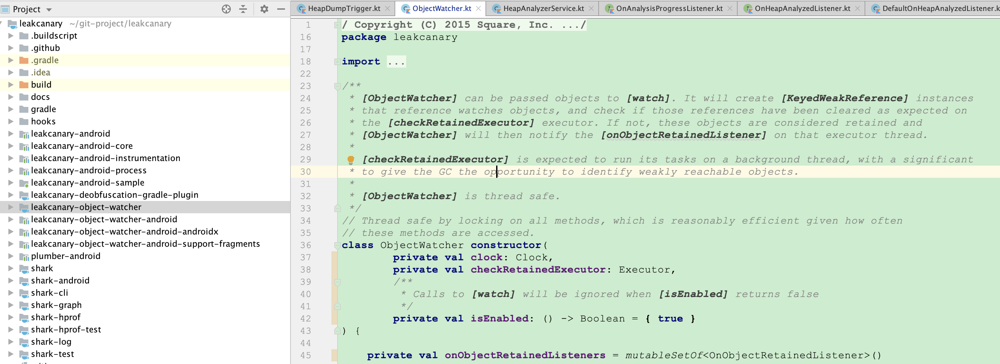

***
github项目地址：https://github.com/square/leakcanary
***
2.X版本相对于之前的版本在接入方式上进行了优化，使用ContentProvider使接入可以免初始化，同时使用Shark代替HaHa用来分析、裁剪内存，在检测分析上速度提高了6倍，同时使用内存降低了10倍。从github clone一份leakcanary2的源码并着手开始分析，看下整个项目的结构module分的还是比较细的



当Demo跑起来之后会发现桌面多了一个Leaks的桌面图标，这是展示具体引发内存泄漏的Activity入口，其实是通过<activity-alias>做到的，关于这个标签的作用可以去看我的另一篇笔记：<activity-alias>的应用，这个标签被写在leakcanary-android-core的manifest中
```
<activity-alias
    android:name="leakcanary.internal.activity.LeakLauncherActivity"
    android:enabled="@bool/leak_canary_add_launcher_icon"
    android:icon="@mipmap/leak_canary_icon"
    android:banner="@drawable/leak_canary_tv_icon"
    android:label="@string/leak_canary_display_activity_label"
    android:targetActivity="leakcanary.internal.activity.LeakActivity"
    android:taskAffinity="com.squareup.leakcanary.${applicationId}"
    android:theme="@style/leak_canary_LeakCanary.Base"
    >
  <intent-filter>
    <action android:name="android.intent.action.MAIN"/>
    <category android:name="android.intent.category.LAUNCHER"/>
    <!-- Android TV launcher intent -->
    <category android:name="android.intent.category.LEANBACK_LAUNCHER"/>
  </intent-filter>
</activity-alias>
```
2.X版本是免初始化的，其实初始化操作是通过ContentProvider实现的，ContentProvider在ActivityThread中被启动，这个Provider在leakcanary-object-watcher-android模块下的manifest中被注册
```
<provider
    android:name="leakcanary.internal.AppWatcherInstaller$MainProcess"
    android:authorities="${applicationId}.leakcanary-installer"
    android:enabled="@bool/leak_canary_watcher_auto_install"
    android:exported="false"/>
```
在MainProcess中oncreate方法被重写，并在其中进行了初始化操作
```
override fun onCreate(): Boolean {
  val application = context!!.applicationContext as Application
  AppWatcher.manualInstall(application)
  return true
}
```
最终调用到InternalAppWatcher中的install，关注其中4行代码
1.  checkMainThread：检测是否主线程
2.  configProvider ：配置相关
3.  ActivityDestoryWatcher：activity监听
4.  FragmentDestoryWatcher：fragment监听
```
fun install(application: Application) {
  //检测是否主线程
  checkMainThread()
  if (this::application.isInitialized) {
    return
  }
  SharkLog.logger = DefaultCanaryLog()
  InternalAppWatcher.application = application
  //相关配置
  val configProvider = { AppWatcher.config }
  //activity监听
  ActivityDestroyWatcher.install(application, objectWatcher, configProvider)
  //fragment监听
  FragmentDestroyWatcher.install(application, objectWatcher, configProvider)
  onAppWatcherInstalled(application)
}
```

进入configProvider看下相关配置，各字段的含义在代码中已经给出标记
```
object AppWatcher {
 ...
  data class Config(
    val watchActivities: Boolean = true,  //是否监听activity
    val watchFragments: Boolean = true,    //是否监听fragment
    val watchFragmentViews: Boolean = true, //是否监听fragment相关view
    val watchViewModels: Boolean = true,   //是否监听viewmodels
    val watchDurationMillis: Long = TimeUnit.SECONDS.toMillis(5), //扫描的间隔时间，5s一次
  )
  ...
  }
```
ActivityDestoryWatcher、FragmentDestoryWatcher思路都类似，拿ActivityDestoryWatcher来说，进入到install方法，里面只做了一件事情：给activity注册了一个生命周期监听。

```
private val lifecycleCallbacks =
    object : Application.ActivityLifecycleCallbacks by noOpDelegate() {
      override fun onActivityDestroyed(activity: Activity) {
      //当activity被destory时，回调到这里
        if (configProvider().watchActivities) {
          //启动watch
          objectWatcher.watch(
              activity, "${activity::class.java.name} received Activity#onDestroy() callback"
          )
        }
      }
    }
    
companion object {
  fun install(
    application: Application,
    objectWatcher: ObjectWatcher,
    configProvider: () -> Config
  ) {
    val activityDestroyWatcher =
      ActivityDestroyWatcher(objectWatcher, configProvider)
      //注册actiivty生命周期监听
    application.registerActivityLifecycleCallbacks(activityDestroyWatcher.lifecycleCallbacks)
  }
}
```
这里要特别说一下install的第二个参数ObjectWatcher，这个参数是在外部注入的，也就是在调用install时注入的，被定义在InternalAppWatcher.kt中，当前文件同时被定义的还有内部使用的checkRetainedExecutor以及mainHandler，总体的意思是如果执行checkRetainedExecutor.excute，那这个任务将被延迟config.watchDurationMillis也就是5s被放到mainthread中执行。
```
private val mainHandler by lazy {
    Handler(Looper.getMainLooper())
  }
  
private val checkRetainedExecutor = Executor {
    mainHandler.postDelayed(it, AppWatcher.config.watchDurationMillis)
  }
  
val objectWatcher = ObjectWatcher(
    clock = clock,
    checkRetainedExecutor = checkRetainedExecutor,
    isEnabled = { true }
)
```
再进入到ObjectWatcher类中，这个类主要是用来监听对象是否被回收，其中涉及到WeakRefrence和ReferenceQueue，当gc时weakrefrence引用的对象会被回收，回收的对象会被加入到referencequeue中，更详细的可参考：Reference、ReferenceQueue详解，下面代码中会标记一些该类中的重要属性和方法
```
class ObjectWatcher constructor(
        private val clock: Clock,
        private val checkRetainedExecutor: Executor,
        private val isEnabled: () -> Boolean = { true }
) {
    //外部的回调监听
    private val onObjectRetainedListeners = mutableSetOf<OnObjectRetainedListener>()

    //被监听的对象列表，通过WeakReference引用，保证gc是被回收
    private val watchedObjects = mutableMapOf<String, KeyedWeakReference>()
    //回收监听队列，当对象被回收时会加入到该队列
    private val queue = ReferenceQueue<Any>()
    
    //是否持有泄漏对象
    val hasRetainedObjects: Boolean
        @Synchronized get() {
            //判断是否监听对象可移除
            removeWeaklyReachableObjects()
            //匹配泄漏对象
            return watchedObjects.any { it.value.retainedUptimeMillis != -1L }
        }
    private fun removeWeaklyReachableObjects() {
        // WeakReferences are enqueued as soon as the object to which they point to becomes weakly
        // reachable. This is before finalization or garbage collection has actually happened.
        var ref: KeyedWeakReference?
        do {
            //从队列中获取所有加入回收的对象
            ref = queue.poll() as KeyedWeakReference?
            if (ref != null) {
                //存在可回收的对象，从监听列表中移除
                watchedObjects.remove(ref.key)
            }
        } while (ref != null)
    }
    //当对象被destory时，将对象加入监听队列
    @Synchronized
    fun watch(
            watchedObject: Any,
            description: String
    ) {
        if (!isEnabled()) {
            return
        }
        removeWeaklyReachableObjects()
        val key = UUID.randomUUID()
                .toString()
        val watchUptimeMillis = clock.uptimeMillis()
      //生成监听对象的key
        val reference =
                KeyedWeakReference(watchedObject, key, description, watchUptimeMillis, queue)
        SharkLog.d {
            "Watching " +
                    (if (watchedObject is Class<*>) watchedObject.toString() else "instance of ${watchedObject.javaClass.name}") +
                    (if (description.isNotEmpty()) " ($description)" else "") +
                    " with key $key"
        }
        //调用excute执行任务
        watchedObjects[key] = reference
        checkRetainedExecutor.execute {
        //5s之后主线程执行
            moveToRetained(key)
        }
    }
    
    @Synchronized
    private fun moveToRetained(key: String) {
        removeWeaklyReachableObjects()
        val retainedRef = watchedObjects[key]
        if (retainedRef != null) {
            retainedRef.retainedUptimeMillis = clock.uptimeMillis()
            onObjectRetainedListeners.forEach { it.onObjectRetained() }
        }
    }    
 }
 ```
 上面的code应该标明的比较清楚了，当执行到excute时，前面说会被post到主线程执行内部方法，也就是说moveToRetained(key)会在5s之后在主线程上执行，it.onObjectRetained回调回InternalLeakCanary.kt中，这个类我们之前分析过
 ```
 override fun onObjectRetained() {
  if (this::heapDumpTrigger.isInitialized) {
    heapDumpTrigger.onObjectRetained()
  }
}
```
这里leakcanary已经“怀疑”这个对象存在内存泄漏了。为什么这里我说“怀疑” ？ 因为当一个activity生命周期结束时，并不代表者内存马上就会被回收，即使手动调用System.gc()也只是建议gc去做一下回收，但是gc听不听你的谁知道呢？所以调用headDumpTrigger做进一步分析，这时候走到了HeapDumpTrigger.kt中
```
private fun scheduleRetainedObjectCheck(
  reason: String,
  rescheduling: Boolean,
  delayMillis: Long = 0L
) {
 ...
  //由于分析过程相对耗时，切换到后台执行
  backgroundHandler.postDelayed({
    checkScheduledAt = 0
    checkRetainedObjects(reason)
  }, delayMillis)
}

private fun checkRetainedObjects(reason: String) {
    ...
    //获取watcher中被怀疑的泄漏对象
    var retainedReferenceCount = objectWatcher.retainedObjectCount

    if (retainedReferenceCount > 0) {
      //确保gc被执行
      gcTrigger.runGc()
      retainedReferenceCount = objectWatcher.retainedObjectCount
    }

    if (checkRetainedCount(retainedReferenceCount, config.retainedVisibleThreshold)) return
    ...
  }
  //检测当前的泄漏数量
  private fun checkRetainedCount(
    retainedKeysCount: Int,
    retainedVisibleThreshold: Int
  ): Boolean {
    
    val countChanged = lastDisplayedRetainedObjectCount != retainedKeysCount
    lastDisplayedRetainedObjectCount = retainedKeysCount
    if (retainedKeysCount == 0) {
      SharkLog.d { "Check for retained object found no objects remaining" }
      if (countChanged) {
        onRetainInstanceListener.onEvent(NoMoreObjects)
        showNoMoreRetainedObjectNotification()
      }
      //在正确执行gc之后，不存在变量泄漏时
      return true
    }
    
    if (retainedKeysCount < retainedVisibleThreshold) {
      if (applicationVisible || applicationInvisibleLessThanWatchPeriod) {
        if (countChanged) {
          onRetainInstanceListener.onEvent(BelowThreshold(retainedKeysCount))
        }
        //状态栏提示用户存在内存泄漏
        showRetainedCountNotification(
            objectCount = retainedKeysCount,
            contentText = application.getString(
                R.string.leak_canary_notification_retained_visible, retainedVisibleThreshold
            )
        )
        scheduleRetainedObjectCheck(
            reason = "found only $retainedKeysCount retained objects (< $retainedVisibleThreshold while app visible)",
            rescheduling = true,
            delayMillis = WAIT_FOR_OBJECT_THRESHOLD_MILLIS
        )
        return true
      }
    }
    return false
  }
```
函数注释的大概意思是：这段代码是从注释中的连接获取的，system.gc不是每次都会进行垃圾回收，Runtime.gc使得gc更可能的被执行。这样的话如果能确保gc被执行那就能确保weakreference的对象被回收，当执行完该操作之后再次检测objectWacther中的对象，如果还存在对象没被移除说明该对象确实存在泄漏showRetainedCountNotification通知用户出现了内存泄漏，也就是我们在通知栏上看到的提示。
```
private fun showRetainedCountNotification(
  objectCount: Int,
  contentText: String
) {
  ...
  @Suppress("DEPRECATION")
  val builder = Notification.Builder(application)
      .setContentTitle(
          application.getString(R.string.leak_canary_notification_retained_title, objectCount)
      )
      .setContentText(contentText)
      .setAutoCancel(true)
      .setContentIntent(NotificationReceiver.pendingIntent(application, DUMP_HEAP))
  ...
  }
```
这个时候还没有真正的去dump和分析内存，只是创建了一个通知告知用户，使用了NotificationReceiver，当用户点击通知时回调到OnReceiver中

```
internal class NotificationReceiver : BroadcastReceiver() {

  ...
  //通知点击回调
  override fun onReceive(
    context: Context,
    intent: Intent
  ) {
    when (intent.action) {
      DUMP_HEAP.name -> {
        //回调方法去分析内存
        InternalLeakCanary.onDumpHeapReceived(forceDump = false)
      }
      CANCEL_NOTIFICATION.name -> {
        // Do nothing, the notification has auto cancel true.
      }
      else -> {
        SharkLog.d { "NotificationReceiver received unknown intent action for $intent" }
      }
    }
  }
```
经过多重回调又回到HeapDumpTrigger.kt中如下方法
```
fun onDumpHeapReceived(forceDump: Boolean) {
    //后台运行
  backgroundHandler.post {
    ...
    //开始dump内存
    dumpHeap(retainedReferenceCount, retry = false)
  }
}

private fun dumpHeap(
    retainedReferenceCount: Int,
    retry: Boolean
  ) {
  //将资源id
    saveResourceIdNamesToMemory()
    //使用shark dump内存
    val heapDumpFile = heapDumper.dumpHeap()
    //清除当前时间点之前的所有泄漏变量，防止重复监听
    objectWatcher.clearObjectsWatchedBefore(heapDumpUptimeMillis)
    //启动分析service
    HeapAnalyzerService.runAnalysis(application, heapDumpFile)
  }
```
当用户真正点击时才去dump并分析内存，考虑性能？这也是为什么当我们点击开的时候在有的手机上需要等特别久才能看到泄漏报告的原因。dump的代码在AndroidHeapDumper中，dump结束后生成hprof文件启动HeapAnalyzerService去做内存分析
```
#HeapAnalyzerService.kt

override fun onHandleIntentInForeground(intent: Intent?) {
    ...
    //设置线程优先级
    Process.setThreadPriority(Process.THREAD_PRIORITY_BACKGROUND)
    val heapDumpFile = intent.getSerializableExtra(HEAPDUMP_FILE_EXTRA) as File
    val config = LeakCanary.config
    val heapAnalysis = if (heapDumpFile.exists()) {
    //分析转存堆
      analyzeHeap(heapDumpFile, config)
    } else {
      missingFileFailure(heapDumpFile)
    }
    onAnalysisProgress(REPORTING_HEAP_ANALYSIS)
    //通知分析结果
    config.onHeapAnalyzedListener.onHeapAnalyzed(heapAnalysis)
  }

private fun analyzeHeap(
  heapDumpFile: File,
  config: Config
): HeapAnalysis {
  ...
  return heapAnalyzer.analyze(
      heapDumpFile = heapDumpFile,
      leakingObjectFinder = config.leakingObjectFinder,
      referenceMatchers = config.referenceMatchers,
      computeRetainedHeapSize = config.computeRetainedHeapSize,
      objectInspectors = config.objectInspectors,
      metadataExtractor = config.metadataExtractor,
      proguardMapping = proguardMappingReader?.readProguardMapping()
  )
}
#HeapAnalyzer.kt

fun analyze(
    heapDumpFile: File,
    leakingObjectFinder: LeakingObjectFinder,
    referenceMatchers: List<ReferenceMatcher> = emptyList(),
    computeRetainedHeapSize: Boolean = false,
    objectInspectors: List<ObjectInspector> = emptyList(),
    metadataExtractor: MetadataExtractor = MetadataExtractor.NO_OP,
    proguardMapping: ProguardMapping? = null
  ): HeapAnalysis {
    ...
    return try {
      listener.onAnalysisProgress(PARSING_HEAP_DUMP)
      Hprof.open(heapDumpFile)
          .use { hprof ->
          //获取堆对象图
            val graph = HprofHeapGraph.indexHprof(hprof, proguardMapping)
            val helpers =
              FindLeakInput(graph, referenceMatchers, computeRetainedHeapSize, objectInspectors)
            //分析堆对象图
            helpers.analyzeGraph(
                metadataExtractor, leakingObjectFinder, heapDumpFile, analysisStartNanoTime
            )
          }
    } catch (exception: Throwable) {
      HeapAnalysisFailure(
          heapDumpFile, System.currentTimeMillis(), since(analysisStartNanoTime),
          HeapAnalysisException(exception)
      )
    }
  }
```
具体shark如何去dump、analyze内存的这里不做详细分析，可以关注后续笔记，分析后的结果会在DefaultOnHeapAnalyzedListener被存到db，同时通知LeakActivity获取分析结果
```
override fun onHeapAnalyzed(heapAnalysis: HeapAnalysis) {
  ...
  val id = LeaksDbHelper(application).writableDatabase.use { db ->
    HeapAnalysisTable.insert(db, heapAnalysis)
  }
  if (InternalLeakCanary.formFactor == TV) {
      showToast(heapAnalysis)
      printIntentInfo()
    } else {
      //分析完毕，展示一条分析完的泄漏通知
      showNotification(screenToShow, contentTitle)
    }
...
}

private fun showNotification(
    screenToShow: Screen,
    contentTitle: String
  ) {
    //当用户点击通知时拉起LeakActivity并从db获取数据
    val pendingIntent = LeakActivity.createPendingIntent(
        application, arrayListOf(HeapDumpsScreen(), screenToShow)
    )
    val contentText = application.getString(R.string.leak_canary_notification_message)
    Notifications.showNotification(
        application, contentTitle, contentText, pendingIntent,
        R.id.leak_canary_notification_analysis_result,
        LEAKCANARY_MAX
    )
  }
 ```
整条链路大概清晰分析完了，从安装入口->免启动->启动分析->监听泄漏对象->确保gc回收->再次判断对象->dump->analy->通知用户->展示结果。


