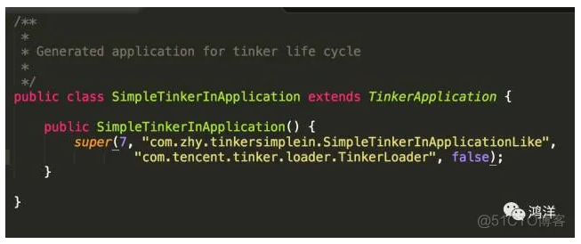

### 概述

热修复这项技术，基本上已经成为项目比较重要的模块了。主要因为项目在上线之后，都难免会有各种问题，而依靠发版去修复问题，成本太高了。

现在热修复的技术基本上有阿里的AndFix、QZone的方案、美团提出的思想方案以及腾讯的Tinker等。

其中AndFix可能接入是最简单的一个（和Tinker命令行接入方式差不多），不过兼容性还是是有一定的问题的；QZone方案对性能会有一定的影响，且在Art模式下出现内存错乱的问题(其实这个问题我之前并不清楚，主要是tinker在MDCC上指出的);美团提出的思想方案主要是基于Instant Run的原理，目前尚未开源，不过这个方案我还是蛮喜欢的，主要是兼容性好。

这么看来，如果选择开源方案，tinker目前是最佳的选择，tinker的介绍有这么一句：

Tinker已运行在微信的数亿Android设备上，那么为什么你不使用Tinker呢？

好了，说了这么多，下面来看看tinker如何接入，以及tinker的大致的原理分析。希望通过本文可以实现帮助大家更好的接入tinker，以及去了解tinker的一个大致的原理。

### 接入Tinker

接入tinker目前给了两种方式，一种是基于命令行的方式，类似于AndFix的接入方式；一种就是gradle的方式。
考虑早期使用Andfix的app应该挺多的，以及很多人对gradle的相关配置还是觉得比较繁琐的，下面对两种方式都介绍下。

####    （1）命令行接入

接入之前我们先考虑下，接入的话，正常需要的前提（开启混淆的状态）。

*   对于API一般来说，我们接入热修库，会在Application#onCreate中进行一下初始化操作。然后在某个地方去调用类似loadPatch这样的API去加载patch文件。

*   对于patch的生成简单的方式就是通过两个apk做对比然后生成；需要注意的是：两个apk做对比，需要的前提条件，第二次打包混淆所使用的mapping文件应该和线上apk是一致的。

最后就是看看这个项目有没有需要配置混淆；

有了大致的概念，我们就基本了解命令行接入tinker，大致需要哪些步骤了。

**依赖引入**
```
dependencies {
    // ...
    //可选，用于生成application类
    provided('com.tencent.tinker:tinker-android-anno:1.7.7')
    //tinker的核心库
    compile('com.tencent.tinker:tinker-android-lib:1.7.7')
}
```

顺便加一下签名的配置：


文末会有demo的下载地址，可以直接参考build.gradle文件，不用担心这些签名文件去哪找。

**API引入**

API主要就是初始化和loadPacth。

正常情况下，我们会考虑在Application的onCreate中去初始化，不过tinker推荐下面的写法：


ApplicationLike通过名字你可能会猜，并非是Application的子类，而是一个类似Application的类。

tinker建议编写一个ApplicationLike的子类，你可以当成Application去使用，注意顶部的注解：@DefaultLifeCycle，其application属性，会在编译期生成一个SimpleTinkerInApplication类。

所以，虽然我们这么写了，但是实际上Application会在编译期生成，所以AndroidManifest.xml中是这样的：
```
 <application
        android:name=".SimpleTinkerInApplication"
        .../>
```

编写如果报红，可以build下。

这样其实也能猜出来，这个注解背后有个Annotation Processor在做处理，如果你没了解过，可以看下：

Android 如何编写基于编译时注解的项目（ http://blog.csdn.net/lmj623565791/article/details/51931859）
通过该文会对一个编译时注解的运行流程和基本API有一定的掌握，文中也会对tinker该部分的源码做解析。

上述，就完成了tinker的初始化，那么调用loadPatch的时机，我们直接在Activity中添加一个Button设置：


我们会将patch文件直接push到sdcard根目录；

所以一定要注意：添加SDCard权限，如果你是6.x以上的系统，自己添加上授权代码，或者手动在设置页面打开SDCard读写权限。

```
<uses-permission android:name="android.permission.WRITE_EXTERNAL_STORAGE" />
```

除以以外，有个特殊的地方就是tinker需要在AndroidManifest.xml中指定TINKER_ID。

```
<application>
  <meta-data
            android:name="TINKER_ID"
            android:value="tinker_id_6235657" />
    //...
</application>
```

到此API相关的就结束了，剩下的就是考虑patch如何生成。

**patch生成**

tinker提供了patch生成的工具，源码见：tinker-patch-cli，打成一个jar就可以使用，并且提供了命令行相关的参数以及文件。

命令行如下：

```
java -jar tinker-patch-cli-1.7.7.jar 
    -old old.apk 
    -new new.apk 
    -config tinker_config.xml 
    -out output
```

需要注意的就是tinker_config.xml，里面包含tinker的配置，例如签名文件等。

这里我们直接使用tinker提供的签名文件，所以不需要做修改，不过里面有个Application的item修改为与本例一致：

```
<loader value="com.zhy.tinkersimplein.SimpleTinkerInApplication"/>
```

大致的文件结构如下：


可以在tinker-patch-cli（ https://github.com/Tencent/tinker/tree/master/tinker-build/tinker-patch-cli）中提取，或者直接下载文末的例子。

上述介绍了patch生成的命令，最后需要注意的就是，在第一次打出apk的时候，保留下生成的mapping文件，在/build/outputs/mapping/release/mapping.txt。

可以copy到与proguard-rules.pro同目录，同时在第二次打修复包的时候，在proguard-rules.pro中添加上：

```
-applymapping mapping.txt
```

保证后续的打包与线上包使用的是同一个mapping文件。

tinker本身的混淆相关配置，可以参考：
tinker_proguard.pro（ https://github.com/Tencent/tinker/blob/master/tinker-build/tinker-patch-cli/tool_output/tinker_proguard.pro）

如果，你对该部分描述不了解，可以直接查看源码即可。

**测试**

首先随便生成一个apk（API、混淆相关已经按照上述引入），安装到手机或者模拟器上。

然后，copy出mapping.txt文件，设置applymapping，修改代码，再次打包，生成new.apk。

两次的apk，可以通过命令行指令去生成patch文件。

如果你下载本例，命令需要在[该目录]下执行。

最终会在output文件夹中生成产物：


我们直接将patch_signed.apk push到sdcard，点击loadpatch，一定要观察命令行是否成功。


本例修改了title。

点击loadPatch，观察log，如果成功，应用默认为重启，然后再次启动即可达到修复效果。

到这里命令行的方式就介绍完了，和Andfix的接入的方式基本上是一样的。

值得注意的是:该例仅展示了基本的接入，对于tinker的各种配置信息，还是需要去读tinker的文档（如果你确定要使用）tinker-wiki（ https://github.com/Tencent/tinker/wiki）。

####    （2）gradle接入

gradle接入的方式应该算是主流的方式，所以tinker也直接给出了例子，单独将该tinker-sample-android（ https://github.com/Tencent/tinker/tree/master/tinker-sample-android）以project方式引入即可。

引入之后，可以查看其接入API的方式，以及相关配置。

在你每次build时，会在build/bakApk下生成本地打包的apk，R文件，以及mapping文件。

如果你需要生成patch文件，可以通过：

```
./gradlew tinkerPatchRelease  // 或者 ./gradlew tinkerPatchDebug
```
生成。

生成目录为:build/outputs/tinkerPatch


需要注意的是，需要在app/build.gradle中设置相比较的apk（即old.apk，本次为new.apk），

```
ext {
    tinkerEnabled = true
    //old apk file to build patch apk
    tinkerOldApkPath = "${bakPath}/old.apk"
    //proguard mapping file to build patch apk
    tinkerApplyMappingPath = "${bakPath}/old-mapping.txt"
}
```

提供的例子，基本上展示了tinker的自定义扩展的方式，具体还可以参考：

Tinker-自定义扩展（ https://github.com/Tencent/tinker/wiki/Tinker-自定义扩展）

所以，如果你使用命令行方式接入，也不要忘了学习下其支持哪些扩展。

### Application是如何编译时生成的

从注释和命名上看：

```
//可选，用于生成application类
provided('com.tencent.tinker:tinker-android-anno:1.7.7')
```

明显是该库，其结构如下：


典型的编译时注解的项目，源码见tinker-android-anno（ https://github.com/Tencent/tinker/tree/master/tinker-android/tinker-android-anno）。

入口为com.tencent.tinker.anno.AnnotationProcessor，可以在该services/javax.annotation.processing.Processor文件中找到处理类全路径。

再次建议，如果你不了解，简单阅读下Android 如何编写基于编译时注解的项目（ http://blog.csdn.net/lmj623565791/article/details/51931859）该文。

直接看AnnotationProcessor的process方法：
```
@Override
public boolean process(Set<? extends TypeElement> annotations, RoundEnvironment roundEnv) {
    processDefaultLifeCycle(roundEnv.getElementsAnnotatedWith(DefaultLifeCycle.class));
    return true;
}
```

直接调用了processDefaultLifeCycle：


代码比较简单，可以分三部分理解：

*   步骤1：首先找到被DefaultLifeCycle标识的Element(为类对象TypeElement)，得到该对象的包名，类名等信息，然后通过该对象，拿到@DefaultLifeCycle对象，获取该注解中声明属性的值。

*   步骤2：读取一个模板文件，读取为字符串，将各个占位符通过步骤1中的值替代。

*   步骤3：通过JavaFileObject将替换完成的字符串写文件，其实就是本例中的Application对象。

我们看一眼模板文件：


对应我们的SimpleTinkerInApplicationLike，


主要就几个占位符：

*   包名，如果application属性值以点开始，则同包；否则则截取

*   类名，application属性值中的类名

*   %TINKER_FLAGS%对应flags

*   %APPLICATION_LIFE_CYCLE%，编写的ApplicationLike的全路径

*   *   “%TINKER_LOADER_CLASS%”，这个值我们没有设置，实际上对应@DefaultLifeCycle的loaderClass属性，默认值为com.tencent.tinker.loader.TinkerLoader

%TINKER_LOAD_VERIFY_FLAG%对应loadVerifyFlag

于是最终生成的代码为：




tinker这么做的目的，文档上是这么说的：

为了减少错误的出现，推荐使用Annotation生成Application类。

这样大致了解了Application是如何生成的。

接下来我们大致看一下tinker的原理。

### 原理


tinker贴了一张大致的原理图。

tinker将old.apk和new.apk做了diff，拿到patch.dex，然后将patch.dex与本机中apk的classes.dex做了合并，生成新的classes.dex，运行时通过反射将合并后的dex文件放置在加载的dexElements数组的前面。

运行时替代的原理，其实和Qzone的方案差不多，都是去反射修改dexElements。

两者的差异是：Qzone是直接将patch.dex插到数组的前面；而tinker是将patch.dex与app中的classes.dex合并后的全量dex插在数组的前面。

tinker这么做的目的还是因为Qzone方案中提到的CLASS_ISPREVERIFIED的解决方案存在问题；而tinker相当于换个思路解决了该问题。

接下来我们就从代码中去验证该原理。

本片文章源码分析的两条线：

应用启动时，从默认目录加载合并后的classes.dex

patch下发后，合成classes.dex至目标目录

### 源码分析

####    （1）加载patch

加载的代码实际上在生成的Application中调用的，其父类为TinkerApplication，在其attachBaseContext中辗转会调用到loadTinker()方法，在该方法内部，反射调用了TinkerLoader的tryLoad方法。


tryLoadPatchFilesInternal中会调用到loadTinkerJars方法：


TinkerDexLoader.checkComplete主要是用于检查下发的meta文件中记录的dex信息（meta文件，可以查看生成patch的产物，在assets/dex-meta.txt），检查meta文件中记录的dex文件信息对应的dex文件是否存在，并把值存在TinkerDexLoader的静态变量dexList中。

TinkerDexLoader.loadTinkerJars传入四个参数，分别为application，tinkerLoadVerifyFlag（注解上声明的值，传入为false），patchVersionDirectory当前version的patch文件夹，intent，当前patch是否仅适用于art。


找出仅支持art的dex，且当前patch是否仅适用于art时，并行去loadDex。

关键是最后的installDexes：


这里实际上就是根据不同的系统版本，去反射处理dexElements。

我们看一下V19的实现（主要我看了下本机只有个22的源码~）：


1.  找到PathClassLoader（BaseDexClassLoader）对象中的pathList对象

2.  根据pathList对象找到其中的makeDexElements方法，传入patch相关的对应的实参，返回Element[]对象

3.  拿到pathList对象中原本的dexElements方法

4.  步骤2与步骤3中的Element[]数组进行合并，将patch相关的dex放在数组的前面

5.  最后将合并后的数组，设置给pathList

这里其实和Qzone的提出的方案基本是一致的。如果你以前未了解过Qzone的方案，可以参考此文：

*   Android 热补丁动态修复框架小结（ http://blog.csdn.net/lmj623565791/article/details/49883661）

####    （2）合成patch

这里的入口为：

```
TinkerInstaller.onReceiveUpgradePatch(getApplicationContext(),
                Environment.getExternalStorageDirectory().getAbsolutePath() + "/patch_signed.apk");

上述代码会调用DefaultPatchListener中的onPatchReceived方法:


首先对tinker的相关配置（isEnable）以及patch的合法性进行检测，如果合法，则调用TinkerPatchService.runPatchService(context, path);


TinkerPatchService是IntentService的子类，这里通过intent设置了两个参数，一个是patch的路径，一个是resultServiceClass，该值是调用Tinker.install的时候设置的，默认为DefaultTinkerResultService.class。由于是IntentService，直接看onHandleIntent即可，如果你对IntentService陌生，可以查看此文：Android IntentService完全解析 当Service遇到Handler （ http://blog.csdn.net/lmj623565791/article/details/47143563）。


比较清晰，主要关注upgradePatchProcessor.tryPatch方法，调用的是UpgradePatch.tryPatch。ps:这里有个有意思的地方increasingPriority()，其内部实现为：


如果你对“保活”这个话题比较关注，那么对这段代码一定不陌生，主要是利用系统的一个漏洞来启动一个前台Service。如果有兴趣，可以参考此文：关于 Android 进程保活，你所需要知道的一切（ http://www.jianshu.com/p/63aafe3c12af）。

下面继续回到tryPatch方法：


拷贝patch文件拷贝至私有目录，然后调用DexDiffPatchInternal.tryRecoverDexFiles：


直接看patchDexExtractViaDexDiff


核心代码主要在extractDexDiffInternals中：


这里的代码比较关键了，可以看出首先解析了meta里面的信息，meta中包含了patch中每个dex的相关数据。然后通过Application拿到sourceDir，其实就是本机apk的路径以及patch文件；根据mate中的信息开始遍历，其实就是取出对应的dex文件，最后通过patchDexFile对两个dex文件做合并。


通过ZipFile拿到其内部文件的InputStream，其实就是读取本地apk对应的dex文件，以及patch中对应dex文件，对二者的通过executeAndSaveTo方法进行合并至patchedDexFile，即patch的目标私有目录。

至于合并算法，这里其实才是tinker比较核心的地方，这个算法跟dex文件格式紧密关联，如果有机会，然后我又能看懂的话，后面会单独写篇博客介绍。此外dodola已经有篇博客进行了介绍：

*   Tinker Dexdiff算法解析（ https://www.zybuluo.com/dodola/note/554061）

感兴趣的可以阅读下。

好了，到此我们就大致了解了tinker热修复的原理~~

当然这里只分析了代码了热修复，后续考虑分析资源以及So的热修、核心的diff算法、以及gradle插件等相关知识~

测试demo地址：

 https://github.com/WanAndroid/tinkerTest

***
https://blog.51cto.com/u_15064646/2573140
***