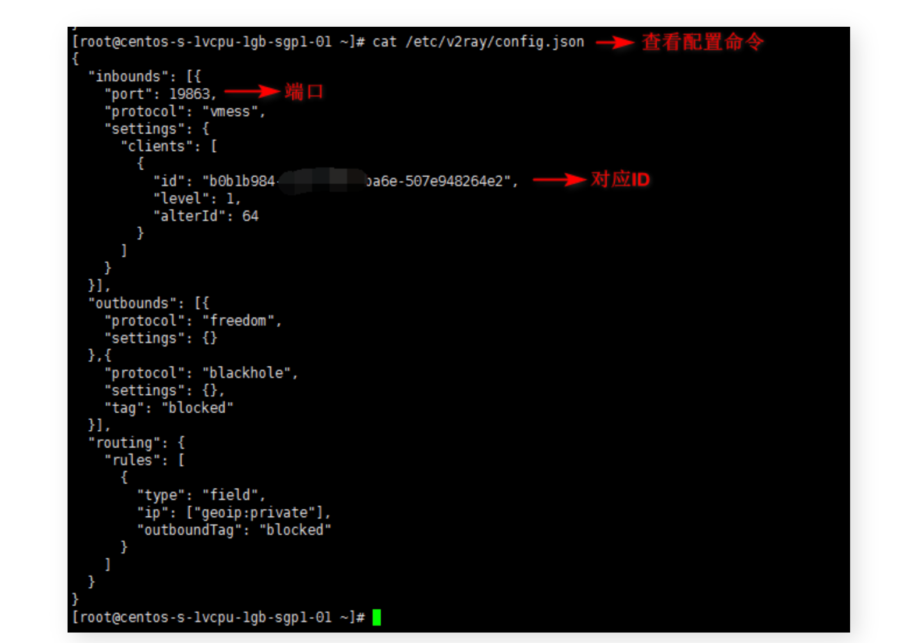
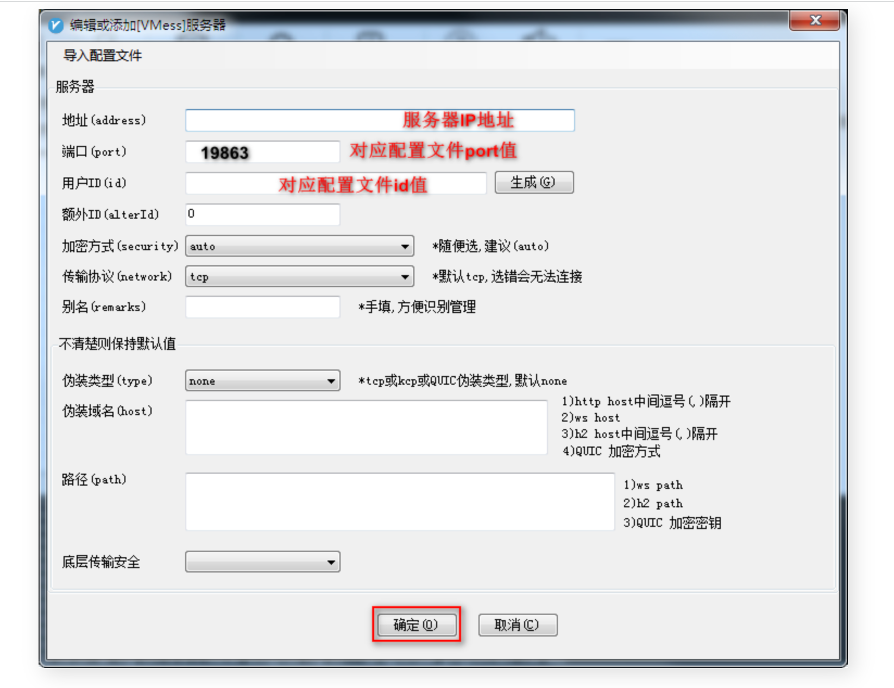

### V2Ray 搭建教程

***
* vultr centeros 8 x64
* vultr ip&port检测工具：https://www.toolsdaquan.com/ipcheck/
如果不通，删除vultr实例并重建
* mac通过 `ssh root@${vultr示例ip地址}` 连接

***

此教程 2023/02/22 日更新并测试通过!!!

一键搭建 V2Ray，小白福利一条命令搞定 V2Ray 搭建，最详细的 V2Ray 图文教程！

### 第一部分：环境信息

*   服务器系统：Centos7 ×64+、Ubuntu、Debian 等系统兼容本教程
*   VPS：我使用的是 Vultr
*   手机和电脑都支持搭建

### 第二部分：创建服务器

已有服务器的同学可以跳过这部分，没有服务器的同学可以先创建服务器，我使用的是 Vultr。

Vultr VPS 推出了 2023 年最新的限时促销活动，「新用户」注册并充值 10 美元以上，即可获得 100 美元的免费赠送金额！力度相当巨大！！ (去年仅送 $50) 用于建站、学习、自建网盘或各种网络服务等等都很实用，优势是价格低，按时计费，随时更换 IP。有购买海外 VPS 需求的同学就得抓紧机会了。

Vultr 活动地址：https://www.itblogcn.com/vultr/t

Vultr 注册教程：注册 Vultr 教程和创建 VPS 服务器教程

预算充足的朋友也可以选择搬瓦工的 VPS 服务器，其 CN2 GIA-E 专线网速极快。

搬瓦工注册教程(内附优惠券)：https://www.itblogcn.com/article/bwg-register.html

搬瓦工 VPS 在售列表一览：https://www.itblogcn.com/bwg/index.html

Tips：以上 2 家都支持支付宝支付。

### 第三部分：JuiceSSH 或 Xshell 连接服务器

准备好你的服务器，确认账号（一般是 root）和密码，系统建议 Centos7 ×64+、Ubuntu、Debian

手机 JuiceSSH 连接服务器教程
官网：https://juicessh.com/

下载地址：https://juicessh-builds.s3.amazonaws.com/juicessh-v3.2.2_200.apk

安装好后，连接 VPS 服务器步骤如下：

```
(1）进入JuiceSSH
(2）点上侧连接
(3）点右下角+
(4）昵称随意，类型SSH，地址你的服务器ip（外网IP），端口默认22不变（映射端口和自设端口除外）
(5）认证选新建
(6）昵称随意，用户名一般为root，密码填你的服务器密码
(7）点右上角√
(8）再点右上角√
(9）点你设置的配置，如无昵称就是以服务器ip命名
(10）如无意外，这时就自动登陆服务器了，如果提示你输入密码，再输一遍就行了，输入后记得点保存
(11）进入服务器后，就可以运行代码了，本机键盘手打或者复制粘帖均可
```

####    电脑端 XShell 连接服务器教程

官网下载地址：https://www.xshell.com/zh/free-for-home-school/

网盘下载地址：https://cloud.degoo.com/share/1Q6Ez89GJxu5Ic5tI16p8A

电脑用 XShell 连接 VPS 服务器，步骤如下：

```
(1）进入XShell
(2）点左上角文件
(3）点新建
(4）名称随意，协议SSH，主机你的服务器IP（外网IP），端口默认22不变（映射端口和自设端口除外）
(5）确定
(6）在左侧会话管理器，选中设置的配置双击打开
(7）提示输入账号和密码，输入后记得点保存(没有提示可能IP被墙)
(8）进入服务器后，就可以运行代码了，本机键盘手打或者复制粘帖均可COPY
```

注意：假如连不上服务器，可能是 IP 被墙，或者是 TCP 阻断了，建议重新创建服务器，并且删除原有的。


***
建议使用v2ray qr生成二维码，然后通过v2ray client扫描二维码直接接入，不然很容易出错
***

### 第四部分：V2Ray 搭建

新的一键 V2Ray 脚本，经过笔者的测试，安装简单方便，自动关闭防火墙，自动安装 BBR 加速，因此推荐大家使用！

安装命令：

输入以下命令一键安装，回车执行（shift+insert可粘贴）
```
bash <(curl -s -L https://git.io/v2ray-setup.sh)COPY
```

老鸟可以用这个自定义安装：

```
bash <(curl -s -L https://git.io/v2rayinstall.sh)COPY
```
显示一下信息代表安装成功（可直接用以下配置进行连接）(以下配置在链接时使用)：

```

---------- V2Ray 配置信息 -------------

 地址 (Address) = 207.148.27.37

 端口 (Port) = 8080

 用户ID (User ID / UUID) = 20be1f8e-2169-4aa1-843e-5ead4250a9f7

 额外ID (Alter Id) = 0

 传输协议 (Network) = kcp

 伪装类型 (header type) = dtls

---------- END -------------

V2Ray 客户端使用教程: https://git.io/v2ray-client

提示: 输入 v2ray url 可生成 vmess URL 链接 / 输入 v2ray qr 可生成二维码链接

---------- V2Ray vmess URL / V2RayNG v0.4.1+ / V2RayN v2.1+ / 仅适合部分客户端 -------------

vmess://ewoidiI6I*****g==
```

配置文件要注意(建议直接复制安装结果中 vmess://**** 地址，直接导入，避免自己填配置出错)：

Network(传输协议)： kcp
type(伪装类型)：dtls
不对的话连不上！！！

好了到这里我们就搭建成功了(^▽^)

### 相关命令：
```
v2ray info 查看 V2Ray 配置信息
v2ray config 修改 V2Ray 配置
v2ray link 生成 V2Ray 配置文件链接
v2ray infolink 生成 V2Ray 配置信息链接
v2ray qr 生成 V2Ray 配置二维码链接
v2ray ss 修改 Shadowsocks 配置
v2ray ssinfo 查看 Shadowsocks 配置信息
v2ray ssqr 生成 Shadowsocks 配置二维码链接
v2ray status 查看 V2Ray 运行状态
v2ray start 启动 V2Ray
v2ray stop 停止 V2Ray
v2ray restart 重启 V2Ray
v2ray log 查看 V2Ray 运行日志
v2ray update 更新 V2Ray
v2ray update.sh 更新 V2Ray 管理脚本
v2ray uninstall 卸载 V2Ray
```

####    vmess 协议配置

查看配置文件(该配置在后面链接时使用)：

```
cat /etc/v2ray/config.json
```



***
建议使用v2ray qr生成二维码，然后通过v2ray client扫描二维码直接接入，不然很容易出错
***

### 第五部分：客户端链接 V2Ray

最近 GitHub 被 部分 运营商 DNS 污 x 染，cmd ping github.com 看是不是解析到本机地址 127.0.0.1

####    解决方案：

网络设置里面设置 DNS 为 114.114.114.114 或者 8.8.8.8，不会的搜一下。
cmd 执行命令 ipconfig /flushdns 清除本地 DNS 缓存

### Windows v2ray 客户端（v2rayN）：

####    下载方式一：网盘

【完整版 v2rayN 带核心，网盘下载地址】：https://cloud.degoo.com/share/o5JfAH-dE8UepSF3tR4QVg

解压后【点击 v2rayN.exe 启动】

####    下载方式二：GitHub 官方

【完整版 v2rayN 带核心 Github 下载地址】： https://github.com/2dust/v2rayN/releases/download/5.39/v2rayN-Core.zip

解压后【点击 v2rayN.exe 启动】

其他版本发布列表：v2rayN.exe Github Releases

注意电脑右下角 V 图标，双击图标，点右上角 服务器 ，添加 [VMess] 服务器。

####    进行配置:

客户端的配置需要根据你的服务端进行相应的配置，因为你的服务端协议可能是 vmess 等。

如果你的服务端配置是协议 vmess ，则配置如下：

####    注意本教程：

Network(传输协议)： kcp

type(伪装类型)：dtls

不对的话连不上！！！

15.png

保存后，右键电脑右下角 V 图标：

*   系统代理 ==> 自动配置系统代理
*   路由 ==> 绕开大陆
*   服务器 ==> 选择你添加的节点

####    Android v2ray 客户端（v2rayNG）：

**下载方式一：网盘 （APK 直接安装）**

【APK 网盘下载地址】：https://cloud.degoo.com/share/yDOFoOBbgLmp8sNa6oEX9g

**下载方式二：GitHub 官方 APK 直接安装**

一般手机是 arm 架构，我就直接给出对应客户端了，其他架构需要你去网上找设备相应的 CPU 架构并进行选择下载：

【安卓版 v2rayNG 带核心 Github 下载地址】[https://github.com/2dust/v2rayNG/releases/download/1.7.38/v2rayNG_1.7.38_arm64-v8a.apk

其他版本发布列表：v2rayNG Github Releases

使用方法:
```
(1）打开 v2rayNG APP
(2）点击右上角 + 号
(3）选择 手动输入[Vmess]
(4）别名随意，地址(填服务器外网IP地址)，端口(你设置的V2Ray端口)，用户ID，额外ID:0，加密方式:auto，其他设置默认
(5）右上角 √ 保存
(6）右下角 V图标 点击启动.
(7）打开浏览器试试吧COPY
```

**MacOS v2ray 客户端:**

https://github.com/Cenmrev/V2RayX/releases

**Linux 内核 v2ray 客户端：**

Debian、Ubantu、CentOS 等电脑桌面发行版（不能完全通用，可以尝试一下）
https://github.com/jiangxufeng/v2rayL/releases

**IOS v2ray 客户端：**
需要国外账号，推荐 shadow（小火箭）rocket，quantumult（圈），kitsunebi


v2ray 搭建教程到此结束，祝大家春风得意！

### 第六部分：v2ray 提速之 BBR
本文脚本对支持 BBR 加速的系统，自动安装 BBR 加速！

CentOS 查看 BBR 是否运行，输入以下命令，回车执行（shift+insert可粘贴）：

```
lsmod | grep bbrCOPY
```

有返回则成功！

####    不想折腾怎么办？

嫌麻烦也可以直接用机场，搬瓦工官方梯子 CN2 GIA 专线，高速稳定不怕墙，海外老牌服务器厂商：
https://www.itblogcn.com/article/1012.html

####    继续折腾搭建进阶模式

VLESS+WebSocket+TLS 一键搭建
https://www.itblogcn.com/article/2026.html

###    其他推荐

**ChatGPT 注册教程，解决手机号问题**

https://www.itblogcn.com/article/2020.html

**新版必应 New Bing 申请体验教程以及问题解答**

https://www.itblogcn.com/article/2043.html


***
https://www.itblogcn.com/article/406.html
***